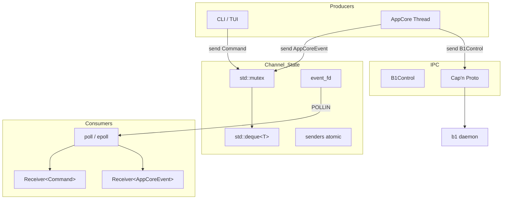

# MPSC Spec

## 1. Overview

Header-only multi-producer single-consumer channel with eventfd wakeup. `Channel<T>::create()` returns a `Sender<T>`/`Receiver<T>` pair. Senders are cloneable and thread-safe; the Receiver is move-only with a `poll_fd()` for poll/epoll integration.

Defines `Command`, `AppCoreEvent`, and `B1Control` variant types used for communication between CLI, AppCore, and b1/c2 daemons.

**Source file:** `src/shared/mpsc.h`

**Dependencies:** POSIX (`eventfd`, `write`, `read`), `shared/resource_provider.h` (for `ResourceType`)

## 2. Component Specifications

```cpp
namespace a0::mpsc {

// ── Command types (UI/CLI → AppCore) ──

struct SubmitGoal { std::string goal; };
struct Cancel {};
struct Shutdown {};
struct SetSession { int64_t sessionDbId; std::string sessionUuid; };
struct ListSessions { int limit = 20; };
struct ResumeSession { std::string uuid; };
struct LoadResource { ResourceType type; int64_t id; int64_t offset; int64_t limit; };

using Command = std::variant<SubmitGoal, Cancel, Shutdown, SetSession,
                             ListSessions, ResumeSession, LoadResource>;

// ── Event types (AppCore → UI/CLI) ──

struct LlmStart   { int64_t streamId; int roundSeq; };
struct LlmChunk   { int64_t streamId; int seq; std::string text; bool isFinal = false; };
struct LlmComplete { int64_t streamId; std::string finishReason; };
struct ToolStart  { int64_t invocationId; std::string toolCallId; std::string toolName; std::string arguments; };
struct ToolChunk  { int64_t invocationId; int seq; std::string text; std::string streamType; };
struct ToolEnd    { int64_t invocationId; int exitCode = 0; int64_t totalBytes = 0; std::string outputPreview; };
struct Complete   { int64_t sessionId; std::string summary; };
struct Error      { std::string source; int64_t contextId = 0; std::string message; };
struct SessionMessage { std::string role; std::string content; std::string toolCallId; std::string name; std::string resultJson; int64_t createdAt = 0; };
struct SessionReady { int64_t dbId; std::string uuid; };
struct SessionList {
    struct Entry { std::string uuid; int64_t dbId = 0; std::string startedAt; int messageCount = 0; };
    std::vector<Entry> entries;
};
struct SessionHistory { int64_t dbId = 0; std::string uuid; bool found = false; std::vector<SessionMessage> messages; };
struct LoadResourceResult { int64_t id; std::string data; };

using AppCoreEvent = std::variant<LlmStart, LlmChunk, LlmComplete,
                                  ToolStart, ToolChunk, ToolEnd,
                                  Complete, Error,
                                  SessionReady, SessionList, SessionHistory,
                                  LoadResourceResult>;

// ── B1Control (c2 → b1 via Cap'n Proto IPC) ──

struct FollowAgent   { std::string sessionUuid; };
struct UnfollowAgent { std::string sessionUuid; };
using B1Control = std::variant<FollowAgent, UnfollowAgent>;

// ── Channel ──

template<typename T>
class Sender {
public:
    Sender() = default;
    Sender(const Sender&);            // clone (refcounted)
    Sender(Sender&&) noexcept;
    Sender& operator=(const Sender&);
    Sender& operator=(Sender&&) noexcept;
    ~Sender();
    void send(T value);
    Sender clone() const;
    bool valid() const;
};

template<typename T>
class Receiver {
public:
    Receiver() = default;
    Receiver(const Receiver&) = delete;
    Receiver(Receiver&&) noexcept;
    Receiver& operator=(Receiver&&) noexcept;
    int poll_fd() const;
    std::vector<T> drain();
    bool connected() const;
};

template<typename T>
struct Channel {
    static std::pair<Sender<T>, Receiver<T>> create();
};

} // namespace a0::mpsc
```

## 3. Architecture Diagram



## 4. Data Flow

```mermaid
sequenceDiagram
    participant S as Sender&lt;T&gt;
    participant CS as ChannelState
    participant R as Receiver&lt;T&gt;
    participant EL as Event Loop

    S->>CS: lock(mutex)
    S->>CS: queue.push_back(value)
    S->>CS: unlock(mutex)
    S->>CS: write(eventfd, 1)
    CS->>EL: eventfd readable
    EL->>R: poll() returns
    R->>CS: read(eventfd) drain
    R->>CS: lock(mutex)
    R->>CS: drain all dequeued items
    R->>CS: unlock(mutex)
    R-->>EL: vector&lt;T&gt; of events
```

## 5. Testing Requirements

| Test | Verification |
|------|-------------|
| Single sender, single receiver | Message delivered via drain() |
| Multiple senders (threaded) | All messages received, no data race |
| Sender cloning | Both clones write to same channel |
| Receiver move | Moved-to receiver drains correctly |
| poll_fd readability | eventfd readable after send |
| drain() empty | Returns empty vector |
| connected() after all senders die | Returns false |
| Command variant dispatch | All variant types construct correctly |
| AppCoreEvent variant dispatch | All variant types construct correctly |
| LoadResource command | type/id/offset/limit fields round-trip |
| SessionMessage fields | All fields populated correctly |
