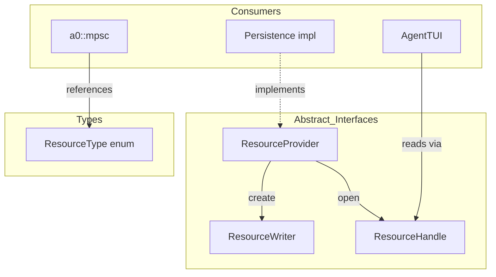
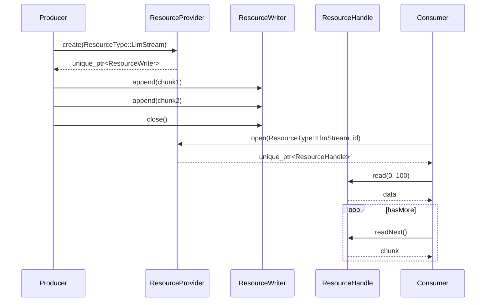

# ResourceProvider Spec

## 1. Overview

Abstract interfaces for resource streaming and persistence. Provides `ResourceHandle` (read-only access to a stream or stored resource), `ResourceWriter` (append-only write interface), and `ResourceProvider` (factory for creating/opening resources by type).

**Source file:** `src/shared/resource_provider.h`

**Dependencies:** Standard library only

## 2. Component Specifications

```cpp
namespace a0 {

using StreamId = int64_t;
using InvocationId = int64_t;

enum class ResourceType { LlmStream, ToolOutput, TerminalStream, ToolInvocation };

class ResourceHandle {
public:
    virtual ~ResourceHandle() = default;
    virtual int64_t id() const = 0;
    virtual bool hasMore() const = 0;
    virtual std::string readNext() = 0;
    virtual std::string read(int64_t offset, int64_t limit) = 0;
    virtual int64_t size() const = 0;
};

class ResourceWriter {
public:
    virtual ~ResourceWriter() = default;
    virtual int64_t id() const = 0;
    virtual void append(const std::string& data) = 0;
    virtual void close() = 0;
    virtual bool closed() const = 0;
};

class ResourceProvider {
public:
    virtual ~ResourceProvider() = default;
    virtual std::unique_ptr<ResourceWriter> create(ResourceType type) = 0;
    virtual std::unique_ptr<ResourceHandle> open(ResourceType type, int64_t id) = 0;
};

} // namespace a0
```

## 3. Architecture Diagram



## 4. Data Flow



## 5. Testing Requirements

| Method | Test Case | Expected Outcome |
|--------|-----------|-----------------|
| `ResourceProvider::create` | Each ResourceType | Returns non-null ResourceWriter |
| `ResourceWriter::append` | Single chunk | Data stored, id returned |
| `ResourceWriter::append` | Multiple chunks | All chunks readable in order |
| `ResourceWriter::close` | After append | closed() returns true |
| `ResourceHandle::read` | Offset within bounds | Correct slice returned |
| `ResourceHandle::read` | Offset beyond size | Empty string |
| `ResourceHandle::hasMore` | All data read | Returns false |
| `ResourceHandle::readNext` | Sequential reads | Returns consecutive chunks |
