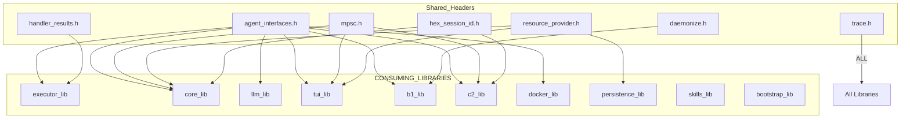
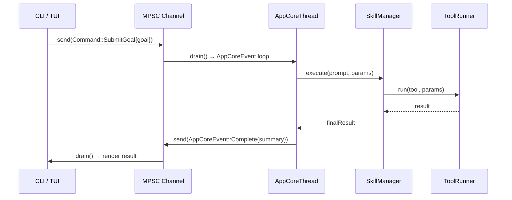

# Technical Specification: Shared Sub-Module

## For a0 Agent — Version 1.0

---

## 1. Overview

The Shared sub-module collects all **header-only** files consumed by every other sub-module. It produces no linkable artifact — it is a CMake INTERFACE target that propagates include directories and usage requirements.

**Source files:** (all header-only)
- `agent_interfaces.h` — core abstract interfaces (SkillRegistry, ToolRunner, AgentCore, etc.) and data structures (Tool, Prompt, Message, ToolCall, etc.)
- `mpsc.h` — MPSC channel types (Command, AppCoreEvent, B1Control) and channel template classes
- `trace.h` — TRACE_LOG macro for debug logging
- `hex_session_id.h` — UUID generation utility using `/dev/urandom`
- `daemonize.h` — daemonization helpers (xCloseAllFds, xDaemonizeChild)
- `handler_results.h` — HandlerResult struct for system tool dispatch
- `resource_provider.h` — abstract ResourceProvider/ResourceHandle/ResourceWriter interfaces

**Dependencies:** Standard library only + `nlohmann/json` for `agent_interfaces.h` + POSIX for `mpsc.h` and `daemonize.h`

**Namespace:** `a0` (shared namespace)

---

## 2. Component Specifications

### 2.1 agent_interfaces.h

Core data structures and abstract interfaces for the agent framework:

```cpp
using json = nlohmann::json;

enum class TrustLevel { HIGH, MEDIUM, LOW };

struct Tool {
    std::string name, description, command;
    std::string inputMode = "stdin";
    std::string dockerImage;
    TrustLevel trustLevel = TrustLevel::MEDIUM;
    std::vector<std::string> aptDependencies;
    int timeoutSecs = 30;
};

struct Prompt {
    std::string name, description, prompt;
    std::vector<std::string> dependencies;
    std::vector<ValidatorBinding> validators;
    std::vector<std::string> chain;
    std::string composeFile;
    std::vector<std::string> aptDependencies;
    std::string ns, component;
    bool parallelValidators = false;
};

class SkillRegistry {
public:
    virtual ~SkillRegistry() = default;
    virtual bool loadFromDirectory(const std::string& path) = 0;
    virtual std::optional<Tool> getTool(const std::string& name) const = 0;
    virtual std::optional<Prompt> getPrompt(const std::string& name) const = 0;
    virtual std::vector<std::string> listTools() const = 0;
    virtual std::vector<std::string> listPrompts() const = 0;
    virtual bool addTool(const Tool& tool) = 0;
    virtual bool addPrompt(const Prompt& prompt) = 0;
};

class ToolRunner {
public:
    virtual ~ToolRunner() = default;
    virtual json run(const Tool& tool, const json& params) = 0;
    virtual a0::StreamHandle runStreaming(const Tool&, const json&, a0::StreamCallback) = 0;
};

class SkillRunner {
public:
    virtual ~SkillRunner() = default;
    virtual std::string expandPrompt(const Prompt&, const json&) = 0;
    virtual json runValidators(const Prompt&, const json&) = 0;
    virtual json execute(const Prompt&, const json&) = 0;
    virtual void setGlobalVar(const std::string&, const std::string&) = 0;
    virtual void setGlobalVars(const std::unordered_map<std::string, std::string>&) = 0;
    virtual a0::StreamHandle executeStreaming(const Prompt&, const json&, a0::StreamCallback) = 0;
};

class AgentCore {
public:
    virtual ~AgentCore() = default;
    virtual bool init(const std::string&) = 0;
    virtual json processGoal(const std::string&) = 0;
    virtual bool resumeSession(const std::string&) = 0;
    virtual std::string currentSessionId() const = 0;
    virtual void run() = 0;
    virtual bool ensureSession() = 0;
    virtual int64_t sessionDbId() const = 0;
    virtual a0::StreamHandle processGoalStreaming(const std::string&, a0::StreamCallback) = 0;
};

class ContainerManager {
public:
    virtual ~ContainerManager() = default;
    virtual std::string acquireContainer(const Tool&) = 0;
    virtual std::string execInContainer(const std::string&, const std::string&, const std::string& = "", int = 30) = 0;
    virtual void pruneIdleContainers() = 0;
};

class ComposeManager {
public:
    virtual ~ComposeManager() = default;
    virtual std::string startEnvironment(const Prompt&, const std::string&) = 0;
    virtual void stopEnvironment(const Prompt&) = 0;
    virtual void markUsed(const Prompt&) = 0;
    virtual void setCurrentPrompt(const Prompt&) = 0;
    virtual std::string getCurrentNetwork() const = 0;
    virtual void clearCurrentPrompt() = 0;
    virtual std::string startPersistent(const std::string&, const std::string&, const std::string&) = 0;
    virtual void stopPersistent(const std::string&) = 0;
    virtual bool isPersistent(const std::string&) const = 0;
};
```

### 2.2 mpsc.h

MPSC channel types and templates. See `src/mpsc.spec.md` for full variant listings.

Key types: `Command` (7 variants), `AppCoreEvent` (12 variants), `B1Control` (2 variants), `Sender<T>`, `Receiver<T>`, `Channel<T>`.

### 2.3 trace.h

```cpp
#ifdef TRACE
#define TRACE_LOG(msg) std::cerr << "[TRACE] " << __FILE__ << ":" << __LINE__ << " " << msg << std::endl
#else
#define TRACE_LOG(msg)
#endif
```

### 2.4 hex_session_id.h

```cpp
inline std::string generateHexSessionId() {
    std::array<uint32_t, 4> buf{};
    std::ifstream urandom("/dev/urandom", std::ios::binary);
    if (urandom) urandom.read(reinterpret_cast<char*>(buf.data()), buf.size() * sizeof(uint32_t));
    std::ostringstream ss;
    ss << std::hex << std::setfill('0');
    for (uint32_t val : buf) ss << std::setw(8) << val;
    return ss.str();
}
```

### 2.5 daemonize.h

```cpp
namespace a0 {
inline void xCloseAllFds();
inline void xDaemonizeChild(const std::string& logPath);
}
```

### 2.6 handler_results.h

```cpp
struct HandlerResult {
    std::string output;
    std::vector<std::string> recommendedTools;
};
```

### 2.7 resource_provider.h

```cpp
enum class ResourceType { LlmStream, ToolOutput, TerminalStream, ToolInvocation };

class ResourceHandle {
public:
    virtual ~ResourceHandle() = default;
    virtual int64_t id() const = 0;
    virtual bool hasMore() const = 0;
    virtual std::string readNext() = 0;
    virtual std::string read(int64_t offset, int64_t limit) = 0;
    virtual int64_t size() const = 0;
};

class ResourceWriter {
public:
    virtual ~ResourceWriter() = default;
    virtual int64_t id() const = 0;
    virtual void append(const std::string& data) = 0;
    virtual void close() = 0;
    virtual bool closed() const = 0;
};

class ResourceProvider {
public:
    virtual ~ResourceProvider() = default;
    virtual std::unique_ptr<ResourceWriter> create(ResourceType type) = 0;
    virtual std::unique_ptr<ResourceHandle> open(ResourceType type, int64_t id) = 0;
};
```

---

## 3. System Architecture



---

## 4. Detailed Data Flow



---

## 5. Visualization

D3 animation not required for sub-module specification — covered by root `technical-specification.md`.

---

## 6. Testing Requirements

Unit testing for shared headers is performed by test files in each consuming sub-module. Key coverage areas:

| Header | Test Coverage |
|--------|--------------|
| `agent_interfaces.h` | Interface contracts verified in test_tool_runner, test_dependency_graph, test_skill_manager, test_session_context, etc. |
| `mpsc.h` | test_buffered_socket tests channel send/drain/connect lifecycle |
| `trace.h` | Compile-time verification across all targets |
| `hex_session_id.h` | test_session_context validates session ID format |
| `handler_results.h` | test_system_tools validates HandlerResult construction |
| `resource_provider.h` | test_resource_provider validates create/open/read/write lifecycle |
| `daemonize.h` | No dedicated unit test (I/O heavy); tested via b1 integration tests |

---

## 7. CLI Entry Point

This sub-module has no CLI entry point — it is header-only and consumed by all other sub-modules at link time.

```cmake
add_library(shared_lib INTERFACE)
target_include_directories(shared_lib INTERFACE ${CMAKE_CURRENT_SOURCE_DIR})
target_link_libraries(shared_lib INTERFACE nlohmann_json::nlohmann_json)
```
