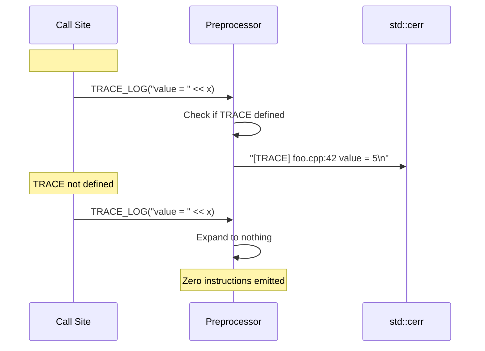

# Trace Spec

## 1. Overview

Compile-time diagnostic logging macro. When `TRACE` is defined, `TRACE_LOG(msg)` writes `[TRACE] file:line msg` to `std::cerr`. When `TRACE` is undefined, the macro expands to nothing — zero runtime overhead. The `-DENABLE_TRACE=ON` CMake option controls this across all build targets.

**Source file:** `src/shared/trace.h`

**Dependencies:** `<iostream>`

## 2. Component Specifications

```cpp
#pragma once
#include <iostream>

#ifdef TRACE
#define TRACE_LOG(msg) \
    std::cerr << "[TRACE] " << __FILE__ << ":" << __LINE__ << " " << msg << std::endl
#else
#define TRACE_LOG(msg)
#endif
```

## 3. Architecture Diagram

```mermaid
graph TB
    subgraph Translation_Unit
        TU[Source File]
        MACRO[TRACE_LOG(msg) invocation]
    end

    subgraph Preprocessor
        DEF{TRACE defined?}
        EXPAND[Expand to cerr << ...]
        REMOVE[Expand to nothing]
    end

    subgraph Output
        STDERR[std::cerr]
    end

    TU --> MACRO
    MACRO --> DEF
    DEF -->|Yes| EXPAND
    DEF -->|No| REMOVE
    EXPAND --> STDERR
```

## 4. Data Flow



## 5. Testing Requirements

| Scenario | Test |
|----------|------|
| TRACE defined, simple string | Verify output to stderr contains [TRACE], file, line, and message |
| TRACE defined, multiple args | Verify streaming works with operator<< |
| TRACE undefined | Verify no output and no codegen (compile-time check) |
| Side effects in msg | Verify side effects absent when TRACE not defined |
| Large msg | Verify no truncation |
