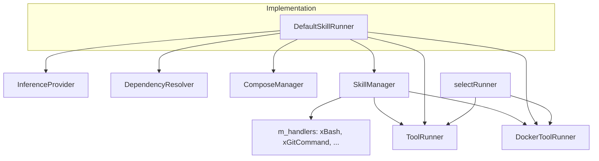
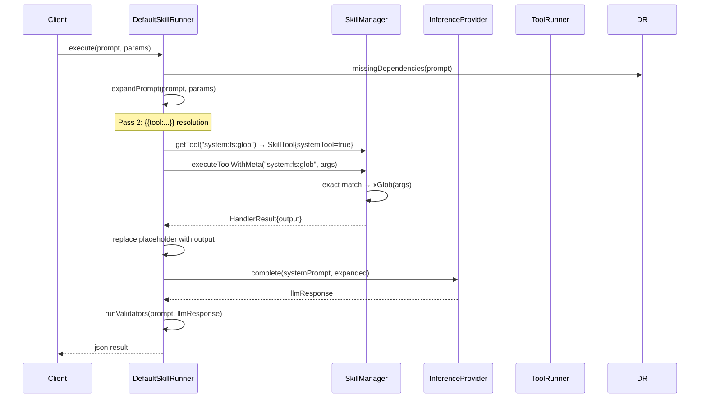

# DefaultSkillRunner Spec

## 1. Overview

DefaultSkillRunner implements SkillRunner. It orchestrates the end-to-end execution of a Skill: dependency validation, optional Docker Compose environment startup, prompt expansion (substituting `{{key}}` params and executing `{{tool:name args}}` placeholders), LLM inference via InferenceProvider, and post-LLM validator chaining.

System tools are dispatched through `SkillManager::executeToolWithMeta()` (via the unified handler registry). `runTool()` and `runToolStreaming()` operate on `SkillTool` directly instead of converting to legacy `Tool` struct.

**Dependencies:**
- `ToolRunner*` — host-level tool execution (required)
- `DockerToolRunner*` — containerized tool execution (nullable)
- `ComposeManager*` — Docker Compose lifecycle (nullable)
- `InferenceProvider*` — LLM completion (required)
- `SkillManager*` — tool/skill lookup + handler dispatch (required)
- `DependencyResolver*` — dependency checking (nullable)

## 2. Component Specifications

```cpp
class DefaultSkillRunner : public SkillRunner {
public:
    DefaultSkillRunner(ToolRunner* toolRunner,
                       InferenceProvider* provider,
                       a0::skills::SkillManager* skillMgr,
                       DependencyResolver* depResolver = nullptr,
                       DockerToolRunner* dockerRunner = nullptr,
                       ComposeManager* composeMgr = nullptr);

    std::string expandPrompt(const Prompt& prompt, const json& params) override;
    json runValidators(const Prompt& prompt, const json& input) override;
    json execute(const Prompt& prompt, const json& params) override;
    a0::StreamHandle executeStreaming(const Prompt& prompt,
                                       const json& params,
                                       a0::StreamCallback onChunk) override;

    void setSkillsDir(const std::string& path);
    void setGlobalVar(const std::string& key, const std::string& value);
    void setGlobalVars(const std::unordered_map<std::string, std::string>& vars);

private:
    ToolRunner* m_toolRunner;
    DockerToolRunner* m_dockerRunner;
    ComposeManager* m_composeMgr;
    InferenceProvider* m_provider;
    a0::skills::SkillManager* m_skillMgr;
    DependencyResolver* m_depResolver;
    std::string m_skillsDir;
    std::string m_basePrompt;
    std::unordered_map<std::string, std::string> m_globalVars;
};
```

**Internal helper (file-static):**
```cpp
/// Select runner based on dockerImage field.
static ToolRunner* selectRunner(const Tool& tool, ToolRunner* host, DockerToolRunner* docker);
```

**Internal helper (file-static):**
```cpp
/// Execute a tool by SkillTool definition.
static json runTool(const SkillTool& skillTool, const json& params,
                    ToolRunner* hostRunner, DockerToolRunner* dockerRunner);
```

## 3. expandPrompt()

The expand function has three passes:

1. **Pass 1a — `{{key}}` substitution:** Replaces `{{paramName}}` with values from `params` object
2. **Pass 1b — `{{GLOBAL_KEY}}` substitution:** Replaces `{{SESSION_ID}}`, `{{PROJECT_DIR}}`, etc. from `m_globalVars`
3. **Pass 2 — `{{tool:name key="val"}}` eager execution:** For each match:
   - Resolve tool via `SkillManager::getTool(name)`
   - If `systemTool==true`: dispatch through `SkillManager::executeToolWithMeta()`
   - If command tool: dispatch through `runTool()` → `ToolRunner`/`DockerToolRunner`
   - Replace placeholder with tool output
4. **Pass 3 — `{{tool_call:name}}` short name:** Replaces with the last segment of the qualified name

## 4. Architecture Diagram



## 5. Data Flow



## 6. Error Handling

| Scenario | Behaviour |
|----------|-----------|
| Missing dependencies (with resolver) | Returns `"Missing dependencies: dep1, dep2"` without calling LLM |
| Unknown `{{key}}` placeholder | Left as-is in expanded prompt |
| Unknown tool in `{{tool:name}}` | Replaced with `"ERROR: tool not found: <name>"` |
| System tool with no handler | Returns error from SkillManager::executeToolWithMeta |
| Validator returns `"ERROR:..."` | Short-circuit: `"VALIDATOR_ERROR: ERROR:..."` returned |
| InferenceProvider throws | Exception propagates to caller |

## 7. Testing Requirements

| Method | Test Case | Input | Expected Output |
|--------|-----------|-------|----------------|
| `expandPrompt` | `{{key}}` substitution | Prompt with `"Hello {{name}}"`, params `{"name":"World"}` | `"Hello World"` |
| `expandPrompt` | `{{tool:system:fs:glob}}` | Tool placeholder with valid handler | Tool output injected |
| `expandPrompt` | `{{tool:system:bash}}` | 2-part alias resolution | Bash tool output injected |
| `expandPrompt` | Unknown tool | `{{tool:nonexistent x=y}}` | `"ERROR: tool not found: nonexistent"` |
| `runValidators` | Empty chain | `validators == []` | Returns input unchanged |
| `runValidators` | Validator returns error | Validator returns `"ERROR: fail"` | `"VALIDATOR_ERROR: ERROR: fail"` |
| `execute` | Missing deps | Skill with dep missing | `"Missing dependencies: dep1"` |
| `execute` | No compose, no validators | Basic skill | LLM response returned |
| `runTool` | Command tool | SkillTool with command field | ToolRunner executed, output captured |
