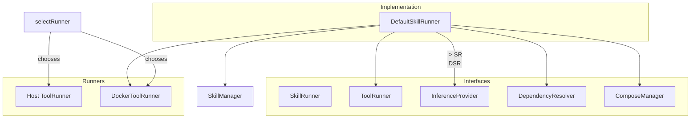
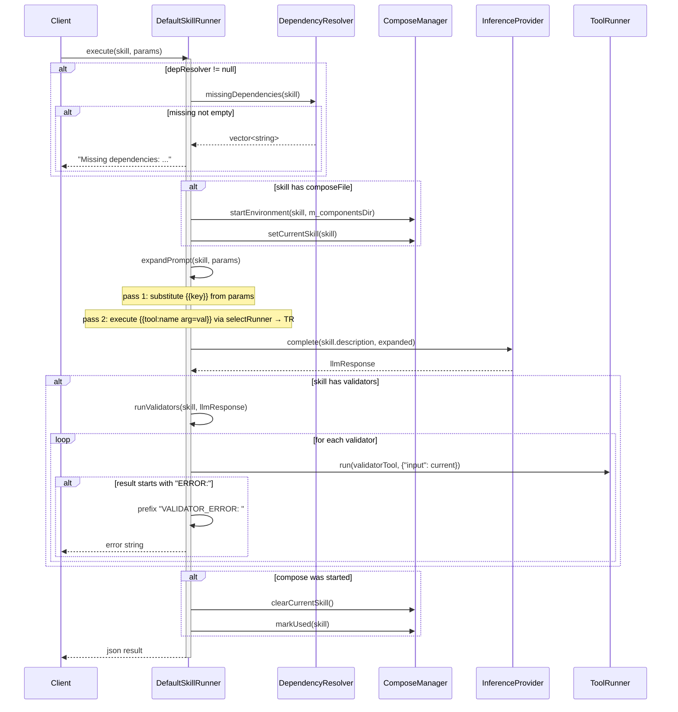

# DefaultSkillRunner Spec

## 1. Overview

DefaultSkillRunner implements SkillRunner. It orchestrates the end-to-end execution of a Skill: dependency validation, optional Docker Compose environment startup, prompt expansion (substituting `{{key}}` params and executing `{{tool:name args}}` placeholders), LLM inference via InferenceProvider, and post-LLM validator chaining.

**Dependencies:**
- `ToolRunner*` — host-level tool execution (required)
- `DockerToolRunner*` — containerized tool execution (nullable)
- `ComposeManager*` — Docker Compose lifecycle (nullable)
- `InferenceProvider*` — LLM completion (required)
- `SkillManager*` — tool/skill lookup (required)
- `DependencyResolver*` — dependency checking (nullable)

**Lifecycle:** One instance per application. `setSkillsDir` must be called before `execute` if Compose is used.

## 2. Component Specifications

```cpp
class DefaultSkillRunner : public SkillRunner {
public:
    /// \param toolRunner      Host-level tool runner (non-owning, required).
    /// \param provider        LLM inference provider (non-owning, required).
    /// \param skillManager    Skill manager for tool/skill lookup.
    /// \param depResolver     Optional dependency checker.
    /// \param dockerRunner    Optional containerized tool runner.
    /// \param composeMgr      Optional Docker Compose lifecycle manager.
    DefaultSkillRunner(ToolRunner* toolRunner,
                       InferenceProvider* provider,
                       SkillManager* skillManager,
                       DependencyResolver* depResolver = nullptr,
                       DockerToolRunner* dockerRunner = nullptr,
                       ComposeManager* composeMgr = nullptr);

    /// \param skill  Skill whose prompt template to expand.
    /// \param params Parameter map for {{key}} substitution.
    /// \returns Prompt string with all placeholders resolved.
    std::string expandPrompt(const Skill& skill, const json& params) override;

    /// \param skill  Skill whose validator chain to run.
    /// \param input  JSON value (typically LLM output) to pipe through validators.
    /// \returns Final validator output, or "VALIDATOR_ERROR: ..." on failure.
    json runValidators(const Skill& skill, const json& input) override;

    /// \param skill  Skill to execute.
    /// \param params Parameters passed to expandPrompt.
    /// \returns LLM response (possibly validator-processed).
    json execute(const Skill& skill, const json& params) override;

    /// \param path  Filesystem path to the skills directory (used for compose file resolution).
    void setSkillsDir(const std::string& path);

private:
    ToolRunner* m_toolRunner;
    DockerToolRunner* m_dockerRunner;
    ComposeManager* m_composeMgr;
    InferenceProvider* m_provider;
    SkillManager* m_skillManager;
    DependencyResolver* m_depResolver;
    std::string m_skillsDir;
};
```

**Internal helper (file-static):**
```cpp
/// Select runner based on dockerImage field.
/// \returns docker if tool.dockerImage is set and docker runner exists, else host runner.
static ToolRunner* selectRunner(const Tool& tool, ToolRunner* host, DockerToolRunner* docker);
```

**Internal helper (file-static):**
```cpp
/// Parse tool placeholder arguments from the "key='value'" pattern inside {{tool:name ...}}.
static json parsePlaceholderArgs(const std::string& argsStr);
```

## 3. Architecture Diagram



## 4. Data Flow



## 5. Error Handling

| Scenario | Behaviour |
|----------|-----------|
| Missing dependencies (with resolver) | Returns `"Missing dependencies: dep1, dep2"` without calling LLM |
| Unknown `{{key}}` placeholder | Left as-is in expanded prompt (e.g. `{{unknown}}`) |
| Unknown tool in `{{tool:name}}` placeholder | Placeholder left as-is in expanded prompt |
| Validator returns `"ERROR:..."` | Short-circuit: `"VALIDATOR_ERROR: ERROR:..."` returned, remaining validators skipped |
| InferenceProvider throws | Exception propagates to caller |
| ComposeManager file not found | Behaviour depends on ComposeManager implementation |
| Validator tool not in registry | Validator silently skipped (`continue`) |

## 6. Edge Cases

| Case | Expected Result |
|------|----------------|
| No `{{tool:...}}` in prompt | No tool execution; prompt forwarded as-is to LLM |
| No `{{key}}` in prompt | Param substitution is a no-op |
| Nested placeholders (`{{tool:foo {{key}}}}`) | Inner `{{` not recursively resolved; treated as literal |
| Empty validator chain | LLM output returned unmodified |
| `selectRunner` with null dockerRunner | Falls back to host runner even if `dockerImage` is set |
| Params value is non-string (object, number) | Serialized with `json::dump()` |
| Validator input is non-string | Serialized with `json::dump()` before passing as `"input"` param |

## 7. Testing Requirements

| Method | Test Case | Input | Expected Output |
|--------|-----------|-------|----------------|
| `expandPrompt` | `{{key}}` substitution | Skill with `"Hello {{name}}"`, params `{"name":"World"}` | `"Hello World"` |
| `expandPrompt` | Unknown `{{key}}` | Skill with `"{{unknown}}"` | `"{{unknown}}"` |
| `expandPrompt` | `{{tool:name}}` execution | Skill with tool placeholder, registered tool | Tool output injected |
| `expandPrompt` | Unknown tool | Skill with `{{tool:missing x=y}}` | `"{{tool:missing x=y}}"` |
| `expandPrompt` | Mixed placeholders | Both `{{key}}` and `{{tool:...}}` | Both resolved correctly |
| `runValidators` | Empty chain | `skill.validators == []` | Returns input unchanged |
| `runValidators` | Validator returns success | Validator returns `"ok"` | `"ok"` |
| `runValidators` | Validator returns error | Validator returns `"ERROR: fail"` | `"VALIDATOR_ERROR: ERROR: fail"` |
| `runValidators` | Multiple validators | Chain of 2 validators | Both executed in sequence |
| `execute` | Missing deps | Skill with dep missing from registry | `"Missing dependencies: dep1"` |
| `execute` | No compose, no validators | Basic skill | LLM response returned |
| `execute` | With compose | Skill with composeFile | Compose started then stopped |
| `selectRunner` | dockerImage set + dockerRunner exists | Tool with `dockerImage="ubuntu"` | Returns dockerRunner |
| `selectRunner` | dockerImage empty | Tool with empty dockerImage | Returns host runner |
