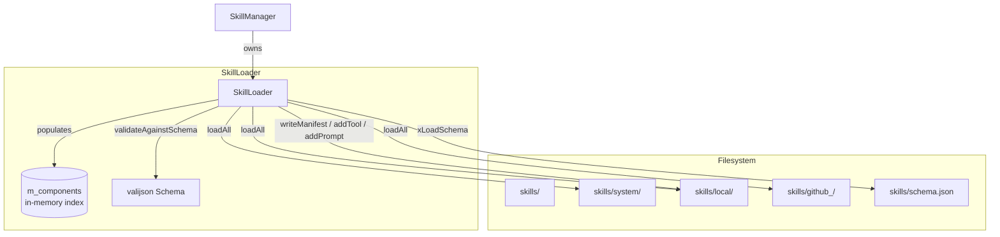
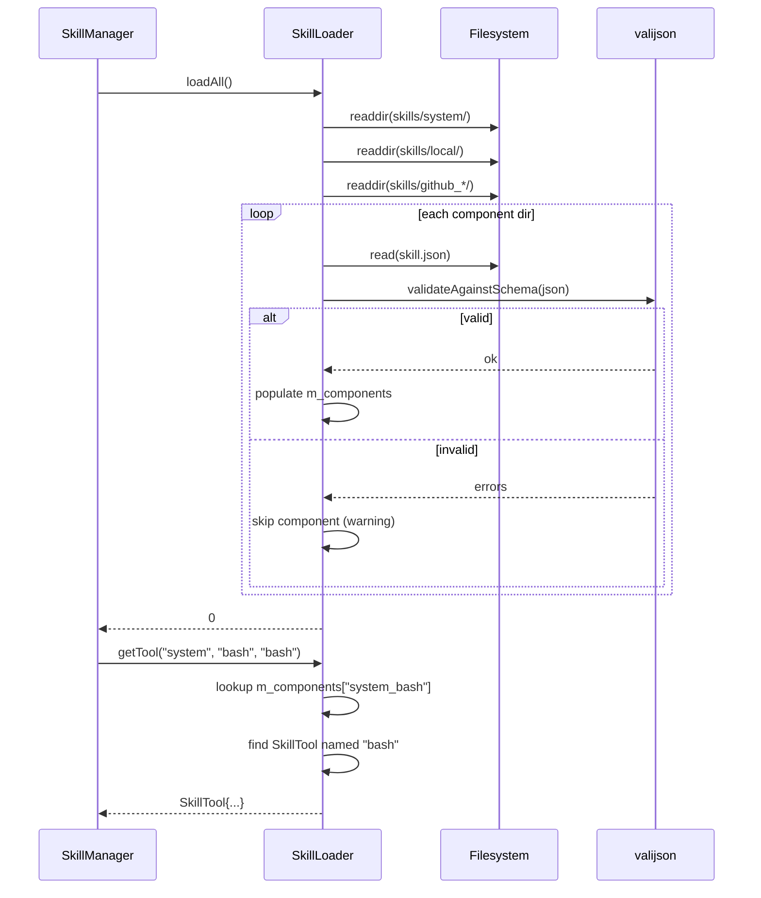

# SkillLoader Spec

## §1 Overview

Directory scanner and manifest parser for the Skills sub-module. Walks the three-tier namespace directories (`system/`, `local/`, `github_<user>/`), parses `skill.json` manifests, validates them against a Draft-07 JSON Schema, and maintains an in-memory index of components, tools, and prompts. Sub-modules declared in `manifest.subModules` are loaded recursively.

**Source files:** `src/skills/skill_loader.h`, `src/skills/skill_loader.cpp`

**Dependencies:** valijson (schema validation), nlohmann/json, `src/shared/agent_interfaces.h` (Prompt, ValidatorBinding)

**Lifecycle:** Construct → `loadAll()` (scan dirs → parse manifests → validate schemas → index) → serve lookups (`getTool`, `getPrompt`, `listComponents`, `getManifest`) → mutate local namespace (`addTool`, `addPrompt`, `updateTool`, `writeManifest`, `removeComponent`)

## §2 Component Specifications

```cpp
namespace a0::skills {

class SkillLoader {
public:
    /// \param root  Path to the skills/ root directory.
    explicit SkillLoader(const std::string& root);

    /// Scan all namespace directories and load manifests.
    /// Loads system/ (read-only), then local/, then github_<user>/.
    /// Sub-modules declared in manifest.subModules are loaded recursively
    /// under a composite key "<parentKey>-<subModuleName>".
    /// \retval 0  All manifests loaded successfully.
    /// \retval -1 Root directory does not exist.
    int loadAll();

    /// Validate a JSON object against the skill.json schema (Draft-07).
    /// When m_schemaLoaded is false (schema file missing/unparseable),
    /// all input passes through without validation.
    /// \param json     The parsed JSON object to validate.
    /// \param errors   Output: human-readable validation errors.
    /// \retval 0   Valid.
    /// \retval -1  Invalid (errors populated).
    int validateAgainstSchema(const nlohmann::json& json, std::string& errors) const;

    /// Lookup a tool by namespace, component, and tool name.
    /// \param ns         Namespace string (e.g. "system", "local", "github_alice").
    /// \param component  Component name.
    /// \param toolName   Tool name within the component.
    /// \param[out] tool  Populated on success.
    /// \retval 0  Found.
    /// \retval -1 Component not found.
    /// \retval -2 Tool not found.
    int getTool(const std::string& ns, const std::string& component,
                const std::string& toolName, SkillTool& tool) const;

    /// Lookup a prompt by namespace, component, and prompt name.
    /// \param ns           Namespace string.
    /// \param component    Component name.
    /// \param promptName   Prompt name within the component.
    /// \param[out] prompt  Populated on success.
    /// \retval 0  Found.
    /// \retval -1 Component not found.
    /// \retval -2 Prompt not found.
    int getPrompt(const std::string& ns, const std::string& component,
                  const std::string& promptName, Prompt& prompt) const;

    /// List components in a namespace.
    /// \param ns  Namespace filter.
    /// \returns   Component names.
    std::vector<std::string> listComponents(SkillNamespace ns) const;

    /// Write a manifest back to disk (local namespace only).
    /// Serializes tools, prompts, subModules to skill.json.
    /// \param component  Component directory name.
    /// \param manifest   Manifest to serialize.
    /// \retval 0  Written successfully.
    /// \retval -1 Namespace is read-only or file write failed.
    int writeManifest(const std::string& component, const SkillManifest& manifest);

    /// Add a tool to the local namespace. Creates the component if absent.
    /// \param component  Target component name.
    /// \param tool       Tool definition to add.
    /// \retval 0  Added.
    int addTool(const std::string& component, const SkillTool& tool);

    /// Add a prompt to the local namespace. Creates the component if absent.
    /// \param component  Target component name.
    /// \param prompt     Prompt definition to add.
    /// \retval 0  Added.
    int addPrompt(const std::string& component, const Prompt& prompt);

    /// Update an existing tool in-place in the local namespace.
    /// \param component  Component containing the tool.
    /// \param name       Name of the tool to update.
    /// \param tool       Updated tool definition.
    /// \retval 0  Updated.
    /// \retval -1 Component or tool not found.
    int updateTool(const std::string& component, const std::string& name,
                   const SkillTool& tool);

    /// Remove a component from disk and the in-memory index.
    /// \param component  Component directory name.
    /// \retval 0  Removed.
    /// \retval -1 Component not found or read-only.
    int removeComponent(const std::string& component);

    /// Get a manifest by namespace and component name.
    /// \param ns           Namespace filter.
    /// \param component    Component name.
    /// \param[out] manifest  Populated on success.
    /// \retval 0  Found.
    /// \retval -1 Component not found.
    int getManifest(SkillNamespace ns, const std::string& component,
                    SkillManifest& manifest) const;

private:
    std::string m_root;                                              // skills/ root path
    std::unordered_map<std::string, SkillManifest> m_components;     // key: "<ns>_<component>"
    std::unordered_map<std::string, SkillNamespace> m_nsMap;         // dir path → namespace enum
    valijson::Schema m_schema;                                       // compiled Draft-07 schema
    mutable valijson::Validator m_validator;                         // reusable validator instance
    bool m_schemaLoaded = false;                                     // true when schema loaded

    int xLoadNamespace(const std::string& dirPath, SkillNamespace ns);
    int xParseManifestFile(const std::string& path, SkillManifest& manifest) const;
    int xLoadSchema(const std::string& schemaPath);
    std::string xDirForNamespace(SkillNamespace ns) const;
    SkillNamespace xNsForDir(const std::string& dir) const;
    std::string xIndexKey(SkillNamespace ns, const std::string& component) const;
    bool xIsReadOnly(SkillNamespace ns) const;
};

} // namespace a0::skills
```

## §3 Architecture Diagram



## §4 Data Flow



## §5 Testing Requirements

| Method | Test Case | Expected |
|--------|-----------|----------|
| `loadAll` | Valid tree with all three namespaces | 0, all components indexed |
| `loadAll` | Missing skills root | -1 |
| `loadAll` | Malformed skill.json in a component | Component skipped with warning |
| `loadAll` | Sub-modules declared in manifest | Sub-modules loaded under composite key |
| `validateAgainstSchema` | Valid JSON object | 0 |
| `validateAgainstSchema` | Missing required fields | -1 with error descriptions |
| `validateAgainstSchema` | Schema file missing (m_schemaLoaded=false) | 0 (pass-through) |
| `getTool` | Existing tool in component | 0, tool populated |
| `getTool` | Nonexistent component | -1 |
| `getTool` | Nonexistent tool in component | -2 |
| `getPrompt` | Existing prompt | 0, prompt populated |
| `getPrompt` | Nonexistent component | -1 |
| `listComponents` | Filter by namespace | Only components matching ns |
| `listComponents` | Empty namespace | Empty vector |
| `writeManifest` | Local namespace, valid manifest | File written, 0 |
| `writeManifest` | System namespace (read-only) | -1 |
| `writeManifest` | Disk write failure | -1 |
| `addTool` | New component in local | Component dir + skill.json created |
| `addTool` | Existing component | Tool appended to tool array |
| `addPrompt` | New component | Component created with prompt |
| `addPrompt` | Existing component | Prompt appended |
| `updateTool` | Existing tool | Tool replaced, manifest rewritten |
| `updateTool` | Nonexistent component | -1 |
| `updateTool` | Nonexistent tool name | -1 |
| `removeComponent` | Local component | Dir removed from disk, index cleared |
| `removeComponent` | System component | -1 (read-only) |
| `removeComponent` | Nonexistent component | -1 |
| `getManifest` | Existing component | Manifest populated |
| `getManifest` | Nonexistent component | -1 |

## §6 (skipped)

## §7 CLI Entry Point

SkillLoader is an internal component owned by `SkillManager`. It is not exposed directly via CLI. All `a0 skill` commands delegate through `SkillManager` which calls into `SkillLoader`:

| CLI command | SkillLoader method |
|-------------|-------------------|
| `a0 skill list` | `SkillLoader::listComponents()` (via `SkillManager::listSkills()`) |
| `a0 skill install` | `SkillLoader::writeManifest()` (via `SkillManager::install()`) |
| `a0 skill remove` | `SkillLoader::removeComponent()` (via `SkillManager::remove()`) |
| `a0 skill validate` | `SkillLoader::getManifest()` (via `SkillManager::validate()`) |

Wired in `main.cpp`:
```
SkillManager sm(skillsRoot, storeRoot, persistenceStore);
sm.loadAll();   // internally calls SkillLoader::loadAll()
```
