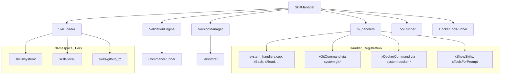

# SkillManager Spec

## 1. Overview

Public facade for the Skills sub-module. Manages the three-tier namespace (system/local/github), loads skill manifests from disk, resolves qualified names for tools and prompts, and provides lifecycle operations (install, remove, gc, validate).

SkillManager is the unified tool dispatch layer. It holds a registry of C++ handler functions (`m_handlers`) and handles both system tool dispatch (C++ calls) and command tool execution (subprocess via ToolRunner/DockerToolRunner).

**Source files:** `src/skills/skill_manager.cpp`

**Dependencies:** `SkillLoader`, `VersionManager`, `ValidationEngine`, `CommandRunner`, `ToolRunner`, `DockerToolRunner`

## 2. Component Specifications

```cpp
class SkillManager {
public:
    SkillManager(const std::string& skillsRoot,
                 const std::string& storeRoot,
                 a0::persistence::PersistenceStore* persistence = nullptr);
    ~SkillManager();

    // --- Existing lifecycle ---
    int loadAll();
    int getTool(const std::string& qualifiedName, SkillTool& tool) const;
    int getPrompt(const std::string& qualifiedName, Prompt& prompt) const;
    int getManifest(SkillNamespace ns, const std::string& component, SkillManifest& manifest) const;
    int getPromptResolved(const std::string& qualifiedName, Prompt& out) const;
    int resolveName(const std::string& componentNs,
                    const std::string& componentName,
                    const std::string& shortName,
                    std::string& qualifiedOut) const;
    std::unordered_map<std::string, std::string> buildDispatchTable() const;
    std::vector<std::string> listSkills(std::optional<SkillNamespace> ns) const;
    int addTool(const std::string& component, const SkillTool& tool);
    int addPrompt(const std::string& component, const Prompt& prompt);
    int updateTool(const std::string& component, const std::string& name, const SkillTool& tool);
    int install(const std::string& sourceUrl, bool force = false);
    int install(const std::string& sourceUrl, const std::string& commit, bool force = false);
    int remove(const std::string& qualifiedName);
    int gc(bool dryRun = false);
    int validate(const std::string& qualifiedName,
                 const std::string& commit,
                 std::string& report);

    // --- Handler registry (unified tool dispatch) ---
    void registerHandler(const std::string& qualifiedName, ToolHandler handler);
    json executeTool(const std::string& qualifiedName, const json& params);
    HandlerResult executeToolWithMeta(const std::string& qualifiedName, const json& params);
    std::vector<ToolSchema> schemas(bool defaultOnly = true) const;
    std::vector<std::string> missingHandlers() const;

    /// Execute a tool with streaming output.
    /// For command tools with streaming=true, delegates to ToolRunner::runStreaming.
    /// For system tools, falls through to synchronous executeToolWithMeta path.
    a0::StreamHandle executeToolStreaming(const std::string& qualifiedName,
        const json& params, a0::StreamCallback onChunk,
        int* seq = nullptr, const std::string& toolCallId = "",
        int64_t subSessionId = 0);

    /// Enable auto-recording of tool results to persistence.
    void setRecordingSession(int64_t sessionDbId);

    // --- Runner wiring ---
    void setToolRunner(ToolRunner* runner);
    void setDockerRunner(DockerToolRunner* runner);
    void setDockerSecurityFilter(DockerSecurityFilter* filter);

    /// Access the per-session ToolState bag.
    ToolState& toolState() { return m_toolState; }
};
```

## 3. Handler Dispatch

```cpp
HandlerResult SkillManager::executeToolWithMeta(const std::string& qn, const json& params) {
    // 1. Exact match in m_handlers (with HandlerContext containing ToolState*)
    auto it = m_handlers.find(qn);
    if (it != m_handlers.end())
        return it->second(params, HandlerContext{"", &m_toolState});
    // ...
}
```

### Streaming Dispatch

```cpp
a0::StreamHandle SkillManager::executeToolStreaming(const std::string& qn,
    const json& params, a0::StreamCallback onChunk, ...) {
    // 1. System tool handler (exact match) — synchronous, call once then complete
    // 2. Wildcard match — same as exact, call once then complete
    // 3. Look up tool definition
    // 4. If systemTool — error (no streaming support)
    // 5. Command tool — delegate to ToolRunner/DockerToolRunner::runStreaming()
    // 6. Auto-record to persistence if setRecordingSession active
}
```

### Streaming Resolution Order

| Step | Lookup | Behaviour |
|------|--------|-----------|
| 1 | Exact handler match | Run handler synchronously, call onChunk once, return completed handle |
| 2 | Wildcard match | Same as exact |
| 3 | Tool definition lookup | Requires SkillTool with `streaming=true` for command tools |
| 4 | System tool (no streaming) | Error: "system tools do not support streaming" |
| 5 | Command tool via ToolRunner | `DockerToolRunner::runStreaming()` or `ToolRunner::runStreaming()` |
```

### Resolution Order

| Step | Lookup | Example | When |
|------|--------|---------|------|
| 1 | Exact match | `system:fs:read` | Handler registered with 3-part key |
| 2 | 2-part alias | `system:bash` → `system:bash:bash` | Tool name equals component name |
| 3 | Wildcard | `system:git:commit` → `system:git:*` | Handler registered with wildcard key |
| 4 | Subprocess | Tool with `command` field | `systemTool==false` + runners available |
| 5 | Error | — | System tool with no handler |

## 4. Schema Generation

```cpp
std::vector<ToolSchema> SkillManager::schemas(bool defaultOnly = true) const {
    // Iterates all loaded manifests (system/local/github)
    // For each tool:
    //   - If defaultOnly && !tool.default_ → skip
    //   - If parameters is null/empty → skip
    //   - Builds ToolSchema{name, description, parameters}
}
```

The default tools set (bash, read, edit, write, glob, grep, show_skills, show_skill_tools, tools_for_prompt) is defined by `"default": true` in their respective `skill.json` files, not hardcoded in C++.

## 5. Startup Validation

```cpp
std::vector<std::string> SkillManager::missingHandlers() const {
    // Iterates all loaded manifests
    // For each tool with systemTool==true:
    //   - Check exact match in m_handlers
    //   - Check wildcard (ns:comp:*)
    //   - Check 2-part alias (if name == comp)
    //   - If none match → add to missing list
}
```

Called in `AgentCore::init()` after `loadAll()`. If any system tool is missing a handler, the agent exits with a fatal error listing every missing tool.

## 6. Architecture



## 6a. ToolState

`SkillManager` owns a `ToolState` instance (`m_toolState`) that is cleared at the start of each `processGoal()`. Handlers access it through the `HandlerContext::toolState` pointer. System tool registrations (in `xRegisterSystemHandlers`) receive the `ToolState*` via `HandlerContext` and can `set`/`get` state across invocations.

## 7. Testing Requirements

| Method | Test Case | Expected |
|--------|-----------|----------|
| `registerHandler` | New handler | Stored in m_handlers, executable |
| `executeTool` | Exact match | Handler output returned |
| `executeTool` | 2-part alias | `system:bash` returns bash handler output |
| `executeTool` | Wildcard | `system:git:status` runs xGitCommand("status") |
| `executeTool` | Unknown system tool | Error string with tool name |
| `executeTool` | Command tool with runners | Runs via ToolRunner, returns output |
| `executeTool` | Command tool without runners | Error "no ToolRunner available" |
| `executeToolWithMeta` | tools_for_prompt | HandlerResult with recommendedTools |
| `schemas` | defaultOnly=true | Only tools with `default_=true` and parameters |
| `schemas` | defaultOnly=false | All tools with parameters |
| `missingHandlers` | All registered | Empty vector |
| `missingHandlers` | One missing | Vector with that tool's qualified name |
| `missingHandlers` | After wildcard registration | Empty (git wildcard covers all git_* tools) |
