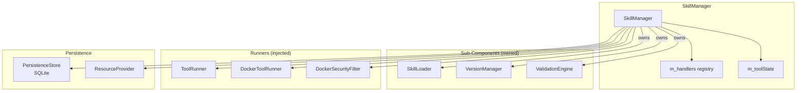
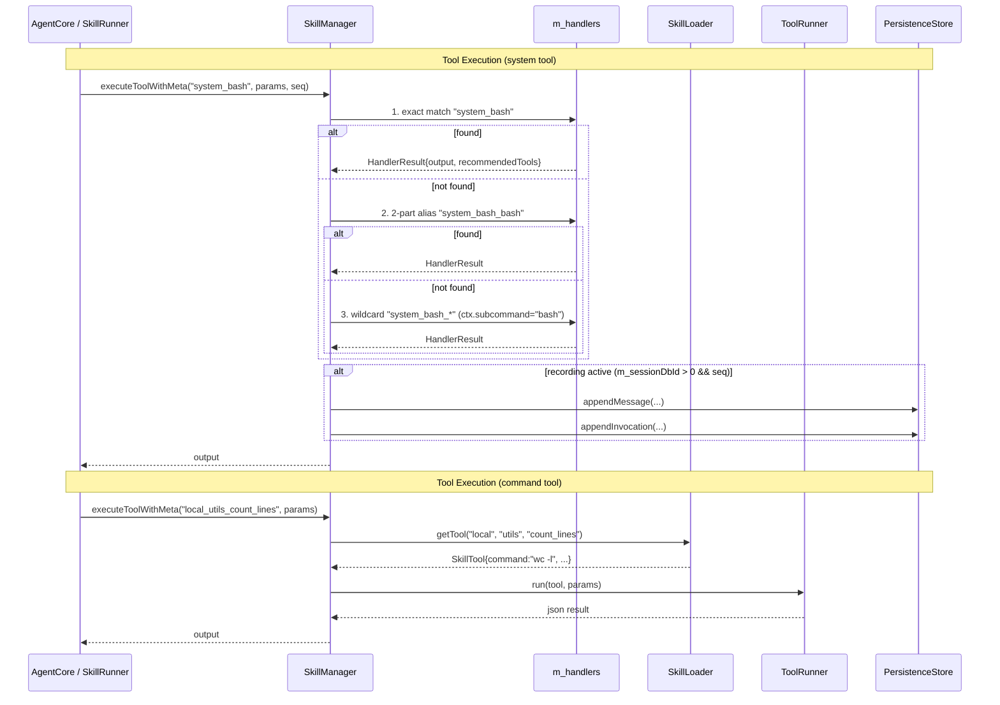

# SkillManager Spec

## §1 Overview

Public facade for the Skills sub-module. Manages the three-tier namespace (system/local/github), loads skill manifests from disk, resolves qualified names for tools and prompts, and provides lifecycle operations (install, remove, gc, validate). Holds the `m_handlers` registry for C++ system tool dispatch and the `m_toolState` per-session state bag. Coordinates `SkillLoader`, `VersionManager`, and `ValidationEngine` internally.

**Source files:** `src/skills/skill_manager.cpp`, `src/skills/skills.h`

**Dependencies:** `SkillLoader`, `VersionManager`, `ValidationEngine`, `ToolRunner`, `DockerToolRunner`, `DockerSecurityFilter`, `PersistenceStore` (SQLite), `ToolState`, `ResourceProvider`

**Lifecycle:** Construct (allocates sub-components) → `loadAll()` → serve tool/prompt lookups → `registerHandler()` per system tool → `executeTool()` / `executeToolWithMeta()` / `executeToolStreaming()` dispatch → `install()`/`remove()`/`gc()` lifecycle ops → `validate()` for upgrade safety

## §2 Component Specifications

```cpp
namespace a0::skills {

class SkillManager {
public:
    /// \param skillsRoot   Path to skills/ directory (default: "./skills").
    /// \param storeRoot    Path to .a0/store/ directory (default: "./.a0/store").
    /// \param persistence  Persistence store for invocation history (SQLite);
    ///                     used by ValidationEngine and tool execution recording.
    SkillManager(const std::string& skillsRoot,
                 const std::string& storeRoot,
                 ::a0::persistence::PersistenceStore* persistence = nullptr);
    virtual ~SkillManager();

    /// Load all namespaces: system/ (locked), local/, github_*/.
    /// Must be called before any lookup or operation.
    /// \retval 0  All manifests loaded successfully.
    /// \retval -1 Skills root does not exist.
    int loadAll();

    /// Resolve a qualified name to a tool.
    /// Format: `<ns>_<component>_<tool>`
    ///   system_bash                 → system namespace, "bash" tool
    ///   local_file_utils_list_files → local namespace, "file_utils" component
    ///   github_alice_utils_format   → github_alice namespace
    /// \param qualifiedName  Fully qualified tool reference.
    /// \param[out] tool      Populated on success.
    /// \retval 0  Found.
    /// \retval -1 Component not found.
    /// \retval -2 Tool not found within component.
    int getTool(const std::string& qualifiedName, SkillTool& tool) const;

    /// Resolve a qualified name to a skill prompt.
    /// \param qualifiedName  Fully qualified prompt reference.
    /// \param[out] prompt    Populated on success.
    /// \retval 0  Found.
    /// \retval -1 Component or prompt not found.
    int getPrompt(const std::string& qualifiedName, Prompt& prompt) const;

    /// Get a manifest by namespace and component name.
    /// \param ns           Namespace filter.
    /// \param component    Component name.
    /// \param[out] manifest  Populated on success.
    /// \retval 0  Found.
    /// \retval -1 Component not found.
    int getManifest(SkillNamespace ns, const std::string& component,
                    SkillManifest& manifest) const;

    /// Resolve a prompt chain into a single concatenated prompt string.
    /// Flattens chain entries recursively: chain[n].chain is resolved first,
    /// then the chain entry's prompt text, then the target prompt's text.
    /// out.prompt = chain[0].prompt + "\n\n" + chain[1].prompt + "\n\n" + target.prompt
    int getPromptResolved(const std::string& qualifiedName, Prompt& out) const;

    /// Resolve a short name within a component:
    ///   If shortName is fully qualified (starts with system_/local_/github_),
    ///   use directly. Otherwise try within the same component first.
    int resolveName(const std::string& componentNs,
                    const std::string& componentName,
                    const std::string& shortName,
                    std::string& qualifiedOut) const;

    /// Build dispatch table mapping short → qualified names.
    /// Collision resolution: when two entries share the same last segment,
    /// prepend component name, then ns:component, then full qualified name.
    std::unordered_map<std::string, std::string> buildDispatchTable() const;

    /// List all loaded components, optionally filtered.
    /// \param ns  Filter (std::nullopt = all).
    /// \returns   Qualified names of all matching components.
    std::vector<std::string> listSkills(std::optional<SkillNamespace> ns) const;

    /// Add a new tool to the local namespace.
    /// Creates or appends to skills/local/<component>/skill.json.
    /// \param component  Target component name (created if absent).
    /// \param tool       Tool definition to add.
    /// \retval 0  Added.
    /// \retval -1 System namespace is read-only.
    int addTool(const std::string& component, const SkillTool& tool);

    /// Add a new prompt to the local namespace.
    /// \param component  Target component name.
    /// \param prompt     Prompt definition to add.
    /// \retval 0  Added.
    int addPrompt(const std::string& component, const Prompt& prompt);

    /// Update an existing tool in-place.
    /// \param component  Component containing the tool.
    /// \param name       Name of the tool to update.
    /// \param tool       Updated tool definition.
    /// \retval 0  Updated.
    /// \retval -1 Tool not found.
    int updateTool(const std::string& component, const std::string& name,
                   const SkillTool& tool);

    /// --- Version management ---

    /// Install the latest commit of a GitHub source.
    /// \param sourceUrl  GitHub URL (e.g. "https://github.com/alice/utils").
    /// \param force      If true, skip validation.
    /// \retval 0  Installed and validated successfully.
    /// \retval 1  Installed with compatibility bridge applied.
    /// \retval -1 Validation failed; not installed.
    int install(const std::string& sourceUrl, bool force = false);

    /// Install a specific commit.
    /// \param sourceUrl  GitHub URL.
    /// \param commit     Full commit hash.
    /// \param force      Skip validation.
    /// \retval 0  Installed.
    /// \retval -1 Validation failed.
    int install(const std::string& sourceUrl, const std::string& commit,
                bool force = false);

    /// Remove a component and GC its stored version if refcount reaches 0.
    /// \param qualifiedName  Fully qualified component name.
    /// \retval 0  Removed.
    /// \retval -1 System namespace is read-only.
    int remove(const std::string& qualifiedName);

    /// Run garbage collection on .a0/store/ — remove versions with refcount 0.
    /// \param dryRun  If true, only report what would be removed.
    /// \returns       Number of versions removed.
    int gc(bool dryRun = false);

    /// Validate a component against historical logs.
    /// \param qualifiedName  Component to validate.
    /// \param commit         Commit hash to validate against.
    /// \param[out] report    Validation report (failures, bridges applied).
    /// \retval 0  All historical invocations match.
    /// \retval 1  All pass after compat bridge applied.
    /// \retval -1 One or more invocations fail validation.
    int validate(const std::string& qualifiedName,
                 const std::string& commit,
                 std::string& report);

    // --- Handler registry (unified dispatch) ---

    /// Register a C++ handler function for a system tool.
    /// Supports wildcard keys (e.g. "system_git_*") — ctx.subcommand
    /// receives the tool name after the last underscore. Also supports
    /// 2-part aliases (e.g. "system_bash" with tool.name == component).
    void registerHandler(const std::string& qualifiedName, ToolHandler handler);

    /// Execute any tool by qualified name. Returns just the output string.
    /// Resolution order:
    ///   1. Exact handler match
    ///   2. 2-part alias (ns_comp → ns_comp_comp when name==component)
    ///   3. Wildcard (ns_comp_*) with ctx.subcommand set
    ///   4. System tool with no handler → error
    ///   5. Command tool → ToolRunner/DockerToolRunner
    ///   6. Error if tool not found
    nlohmann::json executeTool(const std::string& qualifiedName,
                                const nlohmann::json& params);

    /// Full result with recommendedTools (used by tools_for_prompt).
    /// When recording is active and seq is non-null, auto-records tool
    /// result to persistence store (appendMessage + appendInvocation).
    /// \param seq         Sequence counter (incremented on record).
    ///                    Pass nullptr to skip recording.
    /// \param toolCallId  LLM tool call id (empty for non-LLM calls).
    /// \param subSessionId Fork sub-session id (0 for main session).
    ::a0::HandlerResult executeToolWithMeta(const std::string& qualifiedName,
        const nlohmann::json& params,
        int* seq = nullptr, const std::string& toolCallId = "",
        int64_t subSessionId = 0);

    /// Execute a tool with streaming output.
    /// For command tools with streaming=true, delegates to
    /// ToolRunner::runStreaming() / DockerToolRunner::runStreaming().
    /// For system tool handlers, runs synchronously and calls onChunk once.
    a0::StreamHandle executeToolStreaming(const std::string& qualifiedName,
        const nlohmann::json& params, a0::StreamCallback onChunk,
        int* seq = nullptr, const std::string& toolCallId = "",
        int64_t subSessionId = 0);

    /// Enable auto-recording of tool execution results to persistence.
    /// When active, every executeToolWithMeta call records
    /// appendMessage + appendInvocation.
    void setRecordingSession(int64_t sessionDbId);

    /// Build LLM tool schemas from loaded manifests.
    /// defaultOnly=true → only tools with default_=true and parameters.
    /// \returns vector of ::ToolSchema (name, description, inputSchema).
    std::vector<::ToolSchema> schemas(bool defaultOnly = true) const;

    /// Validate all systemTool entries have registered C++ handlers.
    /// Checks: exact match, wildcard match, and 2-part alias match.
    /// \returns Empty vector if all good; vector of missing qualified names.
    std::vector<std::string> missingHandlers() const;

    /// Wire runners for command-based non-system tools.
    void setToolRunner(::ToolRunner* runner);
    void setDockerRunner(::DockerToolRunner* runner);
    void setDockerSecurityFilter(::a0::DockerSecurityFilter* filter);

    /// Set or update the ResourceProvider for tool execution recording.
    void setResourceProvider(ResourceProvider* provider) { m_resourceProvider = provider; }

    /// Get the current ResourceProvider (may be null).
    ResourceProvider* resourceProvider() const { return m_resourceProvider; }

    /// Access the per-session ToolState bag (thread-safe).
    ToolState& toolState() { return m_toolState; }

private:
    std::string m_skillsRoot;
    std::string m_storeRoot;
    SkillLoader* m_loader;
    VersionManager* m_versionMgr;
    ValidationEngine* m_validator;
    std::unordered_map<std::string, ToolHandler> m_handlers;
    ::ToolRunner* m_toolRunner = nullptr;
    ::DockerToolRunner* m_dockerRunner = nullptr;
    ::a0::DockerSecurityFilter* m_dockerSecurityFilter = nullptr;
    ::a0::persistence::PersistenceStore* m_persistence = nullptr;
    ::a0::ResourceProvider* m_resourceProvider = nullptr;
    int64_t m_sessionDbId = 0;
    ToolState m_toolState;

    SkillManager(const SkillManager&) = delete;
    SkillManager& operator=(const SkillManager&) = delete;

    int xEnsureNs(const std::string& ns, SkillNamespace& outNs) const;
    int xInstallFromGit(const std::string& url, const std::string& commit,
                         bool force, SkillNamespace ns, SkillManifest& manifest);
};

} // namespace a0::skills
```

## §3 Architecture Diagram



## §4 Data Flow



## §5 Testing Requirements

| Method | Test Case | Expected |
|--------|-----------|----------|
| `loadAll` | Valid tree with all three namespaces | 0, manifests loaded |
| `loadAll` | Missing skills root | -1 |
| `getTool` | Existing qualified name | 0, tool populated |
| `getTool` | Nonexistent component | -1 |
| `getTool` | Nonexistent tool in component | -2 |
| `getPrompt` | Existing qualified name | 0, prompt populated |
| `getPromptResolved` | Prompt with chain | Concatenated output |
| `resolveName` | Short name within same component | Qualified name |
| `resolveName` | Fully qualified input | Pass-through |
| `buildDispatchTable` | No collisions | Short → qualified mapping |
| `buildDispatchTable` | Collisions | Disambiguated with longer prefixes |
| `listSkills` | No filter | All components across all ns |
| `listSkills` | ns=SYSTEM | Only system components |
| `addTool` | New component in local | 0, skill.json created |
| `addTool` | System namespace | -1 |
| `addPrompt` | New prompt | 0 |
| `updateTool` | Existing tool | 0, tool replaced |
| `updateTool` | Nonexistent | -1 |
| `install` | Valid repo, validation passes | 0 |
| `install` | Validation fails, no force | -1 |
| `install` | Validation fails, force flag | 0 |
| `install` | Specific commit | 0, that commit |
| `remove` | Existing local component | 0, refcount decremented |
| `remove` | System component | -1 |
| `gc` | Orphaned version | Removed |
| `gc` | dryRun=true | Count reported, no removal |
| `registerHandler` | New handler | Stored in m_handlers |
| `registerHandler` | Wildcard key | Matched via wildcard lookup |
| `executeTool` | Exact handler match | Handler output |
| `executeTool` | 2-part alias (system_bash) | Resolves to system_bash_bash |
| `executeTool` | Wildcard (system_git_status) | ctx.subcommand="status" |
| `executeTool` | System tool with no handler | Error string |
| `executeTool` | Command tool with runners | Subprocess output |
| `executeTool` | Command tool without runners | Error "no ToolRunner available" |
| `executeTool` | Tool not found | Error "tool not found" |
| `executeToolStreaming` | System handler | Sync fallback, single onChunk |
| `executeToolStreaming` | Command tool | Delegates to runner->runStreaming |
| `executeToolStreaming` | System tool, no streaming | Error message |
| `executeToolWithMeta` | Recording active | appendMessage + appendInvocation called |
| `executeToolWithMeta` | seq=nullptr | No recording |
| `schemas` | defaultOnly=true | Only default_=true with parameters |
| `schemas` | defaultOnly=false | All tools with parameters |
| `missingHandlers` | All registered | Empty vector |
| `missingHandlers` | Unregistered systemTool | Vector with qualified name |
| `missingHandlers` | Wildcard covers all | Empty |
| `setRecordingSession` | Active | Tool results auto-recorded |
| `toolState` | Reference | m_toolState accessible |
| `setResourceProvider` / `resourceProvider` | Set and get | Pointer stored and returned |
| `setToolRunner` / `setDockerRunner` / `setDockerSecurityFilter` | Set pointers | Runners used in execute dispatch |

## §6 (skipped)

## §7 CLI Entry Point

All skills sub-module commands are exposed under `a0 skill` and map directly to `SkillManager` methods:

```
a0 skill list [--ns system|local|github]
    → SkillManager::listSkills()

a0 skill install <url> [--commit <hash>] [--force]
    → SkillManager::install()

a0 skill remove <qualified-name>
    → SkillManager::remove()

a0 skill gc [--dry-run]
    → SkillManager::gc()

a0 skill validate <qualified-name> <commit>
    → SkillManager::validate()
```

Wired in `main.cpp`:

1. `SkillManager` is constructed at startup with paths `./skills`, `./.a0/store`, and `PersistenceStore*`
2. `ToolRunner`/`DockerToolRunner`/`DockerSecurityFilter` pointers are injected via `setToolRunner()`, `setDockerRunner()`, `setDockerSecurityFilter()`
3. All C++ system tool handlers are registered via `xRegisterSystemHandlers()` which calls `SkillManager::registerHandler()` for each handler (core FS tools, git/docker wildcards, meta tools)
4. `SkillManager::loadAll()` called during `AgentCore::init()` — loads skill.json manifests from disk
5. `SkillManager::missingHandlers()` validates every `systemTool=true` entry has a registered C++ handler; any missing triggers a fatal error
6. `AgentCore` receives a `SkillManager*` for all tool dispatch — no separate `SystemToolRegistry`
7. `SkillRunner` resolves tool/prompt lookups through `SkillManager`
8. `DependencyResolver` uses `SkillManager` for dependency checking
9. `ResourceProvider*` is set via `setResourceProvider()` for tool execution recording context
