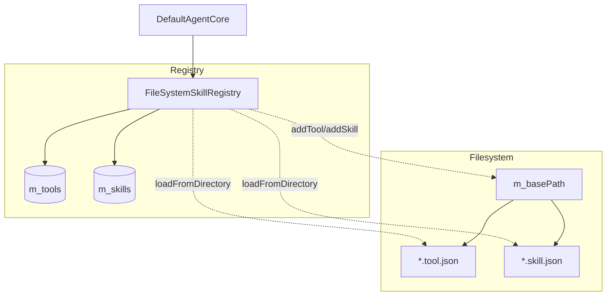
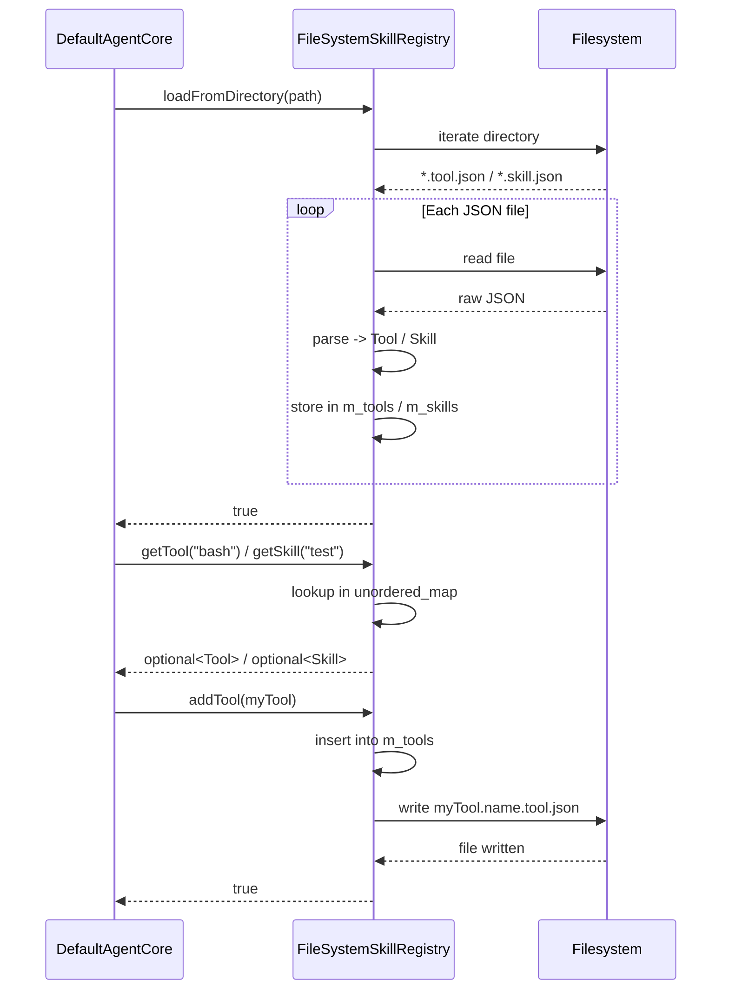

# FileSystemSkillRegistry Spec

## 1. Overview

FileSystemSkillRegistry implements `SkillRegistry` by scanning a directory for JSON definition files (`*.tool.json` and `*.skill.json`). It maintains in-memory `unordered_map` caches for fast lookup. On `addTool`/`addSkill`, it persists to disk.

## 2. Component Specifications

```cpp
class FileSystemSkillRegistry : public SkillRegistry {
public:
    /// \param path  Directory to scan for *.tool.json / *.skill.json
    /// \retval true  Directory found, skills loaded (possibly zero)
    /// \retval false Path does not exist or is not a directory
    bool loadFromDirectory(const std::string& path) override;

    /// \param name  Tool name (case-sensitive)
    /// \retval Tool if found
    /// \retval std::nullopt if not loaded
    std::optional<Tool> getTool(const std::string& name) const override;

    /// \param name  Skill name (case-sensitive)
    /// \retval Skill if found
    /// \retval std::nullopt if not loaded
    std::optional<Skill> getSkill(const std::string& name) const override;

    /// \retval Names of all loaded tools (order unspecified)
    std::vector<std::string> listTools() const override;

    /// \retval Names of all loaded skills (order unspecified)
    std::vector<std::string> listSkills() const override;

    /// \param tool  Tool to register
    /// \retval true  Always (persists to disk if base path is set)
    bool addTool(const Tool& tool) override;

    /// \param skill  Skill to register
    /// \retval true  Always (persists to disk if base path is set)
    bool addSkill(const Skill& skill) override;

private:
    std::unordered_map<std::string, Tool> m_tools;
    std::unordered_map<std::string, Skill> m_skills;
    std::string m_basePath;
};
```

## 3. Architecture Diagram



## 4. Data Flow



## 5. Error Handling

| Condition | Behaviour |
|-----------|-----------|
| `loadFromDirectory()` called on non-existent path | Returns `false`, maps remain empty |
| `loadFromDirectory()` called on a regular file (not directory) | Returns `false` |
| Malformed JSON in a `.tool.json` / `.skill.json` file | Skips the file, prints `Warning: skipping <file>: <what>` to stderr, continues |
| Non-JSON files (e.g. `.txt`, `.md`) in the scanned directory | Silently skipped (only `*.tool.json` and `*.skill.json` are parsed) |
| `addTool()` / `addSkill()` when `m_basePath` is empty | Registers in memory only, no file written |
| File write fails in `addTool()` / `addSkill()` | Returns `true` (in-memory registration succeeded; write failure is silent) |

## 6. Edge Cases

| Case | Behaviour |
|------|-----------|
| Empty directory | Returns `true`, zero skills loaded |
| File matches both `.tool.json` and `.skill.json` patterns | Impossible by extension; `.tool.json` is checked first |
| Unicode characters in skill names | Passed through as-is to both map keys and filenames |
| Duplicate skill name (same name loaded twice) | Last definition wins (unordered_map assignment) |
| File with no `.tool.json` / `.skill.json` suffix (e.g. `.json`) | Silently skipped |
| `stripExt` for `.tool.json` filename `foo.tool.json` | Returns `"foo"` |
| `stripExt` for `.skill.json` filename `bar.skill.json` | Returns `"bar"` |
| `stripExt` for filename with no dot | Returns the whole filename |
| JSON file missing `"name"` field | Falls back to stripped filename as name |

## 7. Testing Requirements

| Method | Test | Input | Expected |
|--------|------|-------|----------|
| `loadFromDirectory` | Valid directory with mixed tool/skill files | Path with 2 tools, 1 skill | `true`, listTools size=2, listSkills size=1 |
| `loadFromDirectory` | Non-existent path | `/no/such/dir` | `false` |
| `loadFromDirectory` | Path is a regular file | `/tmp/somefile` | `false` |
| `loadFromDirectory` | Directory contains malformed JSON | File with `{bad json}` | `true`, malformed file skipped |
| `loadFromDirectory` | Empty directory | Temp empty dir | `true`, listTools empty, listSkills empty |
| `loadFromDirectory` | File missing required fields | `{"name":"x"}` for tool (no `command`) | `true`, tool loaded with empty command |
| `getTool` | Existing tool | `"bash"` | Returns Tool with matching name |
| `getTool` | Non-existing tool | `"nosuch"` | Returns `std::nullopt` |
| `getSkill` | Existing skill | `"test"` | Returns Skill with matching name |
| `getSkill` | Non-existing skill | `"nosuch"` | Returns `std::nullopt` |
| `listTools` | Multiple tools loaded | – | Returns vector containing all tool names |
| `listSkills` | Multiple skills loaded | – | Returns vector containing all skill names |
| `addTool` | New tool, base path set | Tool with name `"newtool"` | In-memory map updated, file `newtool.tool.json` created |
| `addTool` | New tool, no base path | Tool with name `"newtool"` | In-memory map updated, no file written |
| `addTool` | Overwrite existing tool | Tool with same name | Map entry replaced |
| `addSkill` | New skill, base path set | Skill with name `"newskill"` | In-memory map updated, file `newskill.skill.json` created |
| `addSkill` | Overwrite existing skill | Skill with same name | Map entry replaced |
