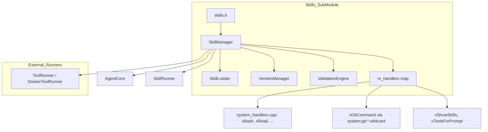

# Skills Header Spec

## 1. Overview

Central header for the Skills sub-module. Defines data structures (SkillTool, SkillManifest, StoredVersion, InvocationRecord), qualified name helpers, the `HandlerResult` return type for C++ system tool handlers, the `ToolHandler` typedef, and the `SkillManager` facade class. All skills source files include this header.

`SkillManager` is the unified dispatch layer for all tools — both C++ system tool handlers and command-based tools executed via `ToolRunner`/`DockerToolRunner`.

**Source files:** `src/skills/skills.h`, `src/skills/skill_manager.cpp`, `src/skills/CMakeLists.txt`

**Dependencies:** `agent_interfaces.h`, `handler_results.h`, nlohmann/json

## 2. Data Structures

```cpp
#include "../tool_state.h"

namespace a0 { class DockerSecurityFilter; }
namespace a0::persistence { class PersistenceStore; }

namespace a0::skills {

enum class SkillNamespace { SYSTEM, LOCAL, GITHUB };

struct ToolSchema { nlohmann::json input; nlohmann::json output; };

struct HandlerContext {
    std::string subcommand;   // wildcard suffix or tool name
    ToolState* toolState = nullptr;   // per-session shared state (nullable)
};

struct SkillTool {
    std::string name, description, command, inputMode = "stdin";
    ToolSchema schema;
    std::string dockerImage;
    TrustLevel trustLevel = TrustLevel::MEDIUM;
    std::vector<std::string> aptDependencies;
    bool systemTool = false;
    bool default_ = false;          // appears in anchor schema set
    int timeoutSecs = 30;
    nlohmann::json parameters;      // JSON Schema for LLM function calling
    std::string subCommand;         // override CLI subcommand (e.g. "rev-parse")
    bool streaming = false;         // tool supports streaming output
};

// Tool handler — C++ function that implements a system tool
using ToolHandler = std::function<::a0::HandlerResult(const nlohmann::json& params,
                                                       HandlerContext ctx)>;

struct CompatBridge { /* version migration tooling */ };

struct SkillManifest {
    std::string name, version, description;
    SkillNamespace ns;
    std::string sourceUrl, commitHash;
    std::vector<SkillTool> tools;
    std::vector<Prompt> prompts;
    std::vector<CompatBridge> compat;
    std::unordered_map<std::string, std::string> dependencies;
};

struct StoredVersion { /* archive entry */ };

struct InvocationRecord { /* historical tool call */ };

// Qualified name helpers
bool parseQualifiedName(...);
std::string buildQualifiedName(...);

class SkillLoader;
class VersionManager;
class ValidationEngine;

class SkillManager {
public:
    SkillManager(const std::string& skillsRoot,
                 const std::string& storeRoot,
                 ::a0::persistence::PersistenceStore* persistence = nullptr);
    virtual ~SkillManager();

    // --- Existing lifecycle methods ---
    int loadAll();
    int getTool(const std::string& qualifiedName, SkillTool& tool) const;
    int getPrompt(const std::string& qualifiedName, Prompt& prompt) const;
    int getManifest(SkillNamespace ns, const std::string& component, SkillManifest& manifest) const;
    int getPromptResolved(const std::string& qualifiedName, Prompt& out) const;
    int resolveName(const std::string& componentNs, const std::string& componentName,
                    const std::string& shortName, std::string& qualifiedOut) const;
    std::unordered_map<std::string, std::string> buildDispatchTable() const;
    std::vector<std::string> listSkills(std::optional<SkillNamespace> ns) const;
    int addTool(const std::string& component, const SkillTool& tool);
    int addPrompt(const std::string& component, const Prompt& prompt);
    int updateTool(const std::string& component, const std::string& name, const SkillTool& tool);
    int install(const std::string& sourceUrl, bool force = false);
    int install(const std::string& sourceUrl, const std::string& commit, bool force = false);
    int remove(const std::string& qualifiedName);
    int gc(bool dryRun = false);
    int validate(const std::string& qualifiedName, const std::string& commit, std::string& report);

    // --- Handler registry (unified tool dispatch) ---
    void registerHandler(const std::string& qualifiedName, ToolHandler handler);
    json executeTool(const std::string& qualifiedName, const json& params);
    ::a0::HandlerResult executeToolWithMeta(const std::string& qualifiedName, const json& params);
    std::vector<::ToolSchema> schemas(bool defaultOnly = true) const;
    std::vector<std::string> missingHandlers() const;

    /// Execute a tool with streaming output.
    /// For command tools with streaming=true, delegates to ToolRunner::runStreaming.
    /// For system tools, falls through to synchronous executeToolWithMeta path.
    a0::StreamHandle executeToolStreaming(const std::string& qualifiedName,
        const json& params, a0::StreamCallback onChunk,
        int* seq = nullptr, const std::string& toolCallId = "",
        int64_t subSessionId = 0);

    /// Enable auto-recording of tool execution results to persistence.
    void setRecordingSession(int64_t sessionDbId);

    // --- Tool runner wiring for command-based tools ---
    void setToolRunner(::ToolRunner* runner);
    void setDockerRunner(::DockerToolRunner* runner);
    void setDockerSecurityFilter(::a0::DockerSecurityFilter* filter);

    /// Access the per-session ToolState bag (thread-safe).
    ToolState& toolState() { return m_toolState; }

private:
    SkillLoader* m_loader;
    VersionManager* m_versionMgr;
    ValidationEngine* m_validator;
    std::unordered_map<std::string, ToolHandler> m_handlers;
    ::ToolRunner* m_toolRunner = nullptr;
    ::DockerToolRunner* m_dockerRunner = nullptr;
    ::a0::DockerSecurityFilter* m_dockerSecurityFilter = nullptr;
    ::a0::persistence::PersistenceStore* m_persistence = nullptr;
    int64_t m_sessionDbId = 0;
    ToolState m_toolState;
};

} // namespace a0::skills
```

## 2a. Handler Dispatch Update

All `SkillManager::executeTool` and `executeToolWithMeta` calls now construct a `HandlerContext` with a `ToolState*` pointing to `m_toolState`. The `HandlerContext` is passed to every registered handler:

```cpp
auto hr = it->second(params, HandlerContext{"", &m_toolState});
```

For wildcard dispatch:
```cpp
auto hr = wit->second(params, HandlerContext{sub, &m_toolState});
```

## 3. Architecture



## 4. Resolution Order

`executeToolWithMeta(qn, params)` follows this resolution:

1. **Exact match** — `m_handlers.find(qn)` — direct handler lookup
2. **2-part alias** — For `ns:comp`, try `ns:comp:comp` — covers tools where tool name == component name (e.g. `system:bash` → `system:bash:bash`)
3. **Wildcard** — `ns:comp:*` — covers git/docker command families. The handler receives `params["_subcommand"]` set to the tool name after the last colon.
4. **Command tool** — If the tool has a command field and `systemTool==false`, execute via `ToolRunner`/`DockerToolRunner`
5. **Error** — Returns error string

## 5. Testing Requirements

| Test | Verification |
|------|-------------|
| SkillTool has `default_` field | Parsed from `"default": true` in skill.json |
| SkillTool has `parameters` field | Parsed from `"parameters"` JSON Schema in skill.json |
| ToolHandler typedef compiles | `std::function<HandlerResult(const json&)>` accepted by registerHandler |
| registerHandler + exact match | executeToolWithMeta returns handler output |
| registerHandler + wildcard | `system:git:*` called with `system:git:commit` sets `_subcommand="commit"` |
| 2-part alias resolution | `system:bash` resolves to handler at `system:bash:bash` |
| Command tool dispatch | Tool with command field runs via ToolRunner when runners are set |
| missingHandlers empty | All systemTool entries have registered handlers |
| missingHandlers non-empty | Unregistered systemTool entry reported |
| schemas(defaultOnly) | Only includes tools with `default_=true` and valid parameters |
| schemas(all) | Includes all tools with valid parameters |
