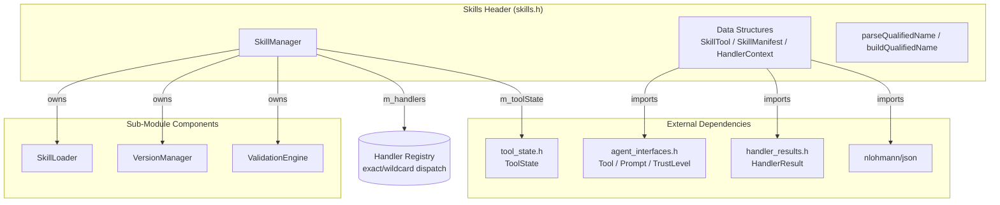
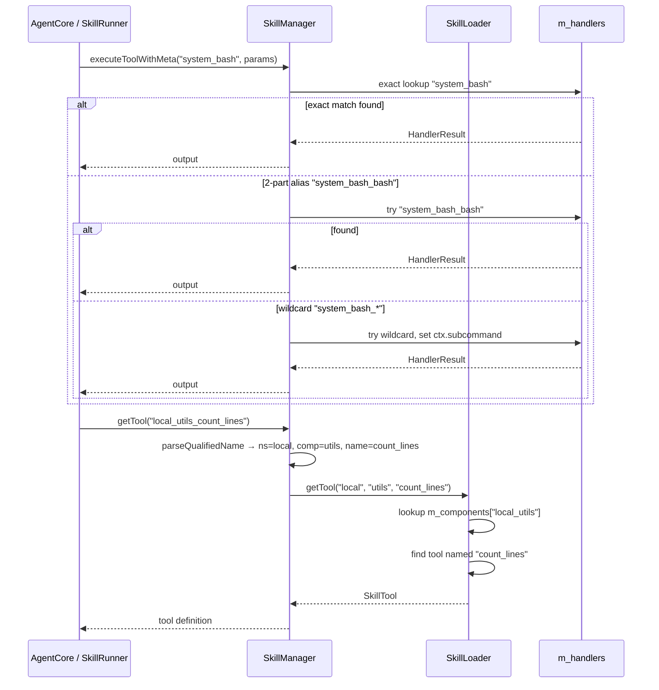

# Skills Header Spec

## §1 Overview

Central header for the Skills sub-module. Defines all core data structures (`SkillTool`, `SkillManifest`, `HandlerContext`, `StoredVersion`, `InvocationRecord`), the `ToolHandler` function signature, `SkillNamespace` enum, qualified name helpers (`parseQualifiedName`, `buildQualifiedName`), and the `SkillManager` facade class. `SkillManager` is the unified dispatch layer for all tools — both C++ system tool handlers and command-based tools executed via `ToolRunner`/`DockerToolRunner`.

**Source files:** `src/skills/skills.h`, `src/skills/skill_manager.cpp`, `src/skills/CMakeLists.txt`

**Dependencies:** `src/shared/agent_interfaces.h` (Tool, Prompt, ValidatorBinding, TrustLevel, ToolRunner, DockerToolRunner), `src/shared/handler_results.h` (HandlerResult), `src/executor/tool_state.h` (ToolState), nlohmann/json

**Lifecycle:**
1. Data structures are consumed by all other files in the sub-module
2. `SkillManager` wraps `SkillLoader`, `VersionManager`, `ValidationEngine` and exposes the public API
3. Qualified name helpers are free functions used by all sub-module components

## §2 Component Specifications

```cpp
#include <string>
#include <vector>
#include <unordered_map>
#include <optional>
#include <functional>
#include <ctime>
#include "nlohmann/json.hpp"
#include "shared/agent_interfaces.h"
#include "shared/handler_results.h"
#include "executor/tool_state.h"

class ToolState;

namespace a0 { class DockerSecurityFilter; class ResourceProvider; }
namespace a0::persistence { class PersistenceStore; }

class ToolRunner;
class DockerToolRunner;

namespace a0::skills {

// ---------------------------------------------------------------------------
// HandlerContext — contextual info passed to every system tool handler
// ---------------------------------------------------------------------------

struct HandlerContext {
    std::string subcommand;      // wildcard suffix or tool name
    ToolState* toolState = nullptr;  // per-session shared state (nullable)
};

// ---------------------------------------------------------------------------
// Tool handler — C++ function that implements a system tool
// ---------------------------------------------------------------------------

using ToolHandler = std::function<::a0::HandlerResult(
    const nlohmann::json& params,
    const HandlerContext& ctx)>;

// ---------------------------------------------------------------------------
// SkillNamespace — three-tier namespace for skill sources
// ---------------------------------------------------------------------------

enum class SkillNamespace {
    SYSTEM,   // skills/system/ — shipped with agent, read-only, not overridable
    LOCAL,    // skills/local/  — agent-created, writable
    GITHUB    // skills/github_<user>/ — installed from GitHub, read-only
};

// ---------------------------------------------------------------------------
// Data structures
// ---------------------------------------------------------------------------

struct ToolSchema {
    nlohmann::json input;    // JSON Schema for params
    nlohmann::json output;   // JSON Schema for return value
};

struct SkillTool {
    std::string name;
    std::string description;
    std::string command;
    std::string inputMode = "stdin";
    ToolSchema schema;
    std::string dockerImage;
    TrustLevel trustLevel = TrustLevel::MEDIUM;
    std::vector<std::string> aptDependencies;
    bool systemTool = false;          // implemented as C++ handler
    bool default_ = false;            // included in LLM anchor schema
    int timeoutSecs = 30;
    nlohmann::json parameters;        // JSON Schema for LLM function calling
    std::string subCommand;           // override CLI subcommand (e.g. "rev-parse")
    bool streaming = false;           // tool supports streaming output
};

struct CompatBridge {
    std::string toolName;
    std::string since;
    std::string bridgeCommand;
    std::string description;
};

struct SkillManifest {
    std::string name;
    std::string version;
    std::string description;
    SkillNamespace ns;
    std::string sourceUrl;
    std::string commitHash;
    std::vector<SkillTool> tools;
    std::vector<Prompt> prompts;
    std::vector<CompatBridge> compat;
    std::unordered_map<std::string, std::string> dependencies;
    std::vector<std::string> subModules;   // sub-component directories to auto-load
};

struct StoredVersion {
    std::string commitHash;
    std::string version;
    int refcount = 0;
    time_t installedAt = 0;
};

struct InvocationRecord {
    std::string toolName;
    nlohmann::json params;
    nlohmann::json output;
    int64_t timestamp = 0;
};

// ---------------------------------------------------------------------------
// Qualified name helpers
// ---------------------------------------------------------------------------

/// Parse "system_task_manager_add_task" → ns="system", component="task_manager", name="add_task"
/// Parse "system_bash" → ns="system", component="bash", name="bash"
/// First segment is ns, last segment is name, everything between is component.
/// For 2 segments (ns_name), component = name.
bool parseQualifiedName(const std::string& qualified,
                        std::string& ns,
                        std::string& component,
                        std::string& name);

/// Build "system_task_manager_add_task" from parts.
std::string buildQualifiedName(const std::string& ns,
                                const std::string& component,
                                const std::string& name);

// ---------------------------------------------------------------------------
// Forward declarations
// ---------------------------------------------------------------------------

class SkillLoader;
class VersionManager;
class ValidationEngine;
class DockerSecurityFilter;

// ---------------------------------------------------------------------------
// SkillManager — public facade
// ---------------------------------------------------------------------------

class SkillManager {
public:
    SkillManager(const std::string& skillsRoot,
                 const std::string& storeRoot,
                 ::a0::persistence::PersistenceStore* persistence = nullptr);
    virtual ~SkillManager();

    int loadAll();

    int getTool(const std::string& qualifiedName, SkillTool& tool) const;
    int getPrompt(const std::string& qualifiedName, Prompt& prompt) const;
    int getManifest(SkillNamespace ns, const std::string& component,
                    SkillManifest& manifest) const;

    /// Resolve a prompt, flattening its chain into a single concatenated prompt.
    /// out.prompt = chain[0].prompt + "\n\n" + chain[1].prompt + "\n\n" + target.prompt
    int getPromptResolved(const std::string& qualifiedName, Prompt& out) const;

    /// Resolve a short name within a component:
    ///   If shortName contains '-', do qualified lookup directly
    ///   Otherwise, try <componentNs-componentName-shortName>
    int resolveName(const std::string& componentNs,
                    const std::string& componentName,
                    const std::string& shortName,
                    std::string& qualifiedOut) const;

    /// Build dispatch table: LLM-facing short name → qualified internal name.
    /// Collision resolution: if two entries share the same last segment, prepend
    /// component name, then namespace:component, then full underscores.
    std::unordered_map<std::string, std::string> buildDispatchTable() const;

    std::vector<std::string> listSkills(std::optional<SkillNamespace> ns) const;

    int addTool(const std::string& component, const SkillTool& tool);
    int addPrompt(const std::string& component, const Prompt& prompt);
    int updateTool(const std::string& component, const std::string& name,
                   const SkillTool& tool);

    int install(const std::string& sourceUrl, bool force = false);
    int install(const std::string& sourceUrl, const std::string& commit,
                bool force = false);
    int remove(const std::string& qualifiedName);
    int gc(bool dryRun = false);
    int validate(const std::string& qualifiedName,
                 const std::string& commit,
                 std::string& report);

    // --- Handler registry (C++ system tool dispatch) ---

    /// Register a C++ handler function for a system tool.
    /// For wildcard handlers (e.g. "system-git-*"), the function receives
    /// ctx.subcommand set to the tool name after the last dash.
    void registerHandler(const std::string& qualifiedName, ToolHandler handler);

    /// Execute a tool by qualified name.
    nlohmann::json executeTool(const std::string& qualifiedName,
                                const nlohmann::json& params);

    /// Execute a tool with streaming output.
    a0::StreamHandle executeToolStreaming(const std::string& qualifiedName,
        const nlohmann::json& params, a0::StreamCallback onChunk,
        int* seq = nullptr, const std::string& toolCallId = "",
        int64_t subSessionId = 0);

    /// Enable auto-recording of tool execution results to persistence.
    void setRecordingSession(int64_t sessionDbId);

    /// Full result with recommendedTools (for tools_for_prompt).
    /// When recording is active and seq is non-null, auto-records tool result.
    ::a0::HandlerResult executeToolWithMeta(const std::string& qualifiedName,
        const nlohmann::json& params,
        int* seq = nullptr, const std::string& toolCallId = "",
        int64_t subSessionId = 0);

    /// Build LLM tool schemas from loaded manifests.
    std::vector<::ToolSchema> schemas(bool defaultOnly = true) const;

    /// Returns all systemTool qualified names with no registered handler.
    std::vector<std::string> missingHandlers() const;

    /// Set runners for non-system tool execution (command-based tools).
    void setToolRunner(::ToolRunner* runner);
    void setDockerRunner(::DockerToolRunner* runner);
    void setDockerSecurityFilter(::a0::DockerSecurityFilter* filter);

    /// Set or update the ResourceProvider for tool execution recording.
    void setResourceProvider(ResourceProvider* provider) { m_resourceProvider = provider; }

    /// Get the current ResourceProvider (may be null).
    ResourceProvider* resourceProvider() const { return m_resourceProvider; }

    ToolState& toolState() { return m_toolState; }

private:
    std::string m_skillsRoot;
    std::string m_storeRoot;
    SkillLoader* m_loader;
    VersionManager* m_versionMgr;
    ValidationEngine* m_validator;
    std::unordered_map<std::string, ToolHandler> m_handlers;
    ::ToolRunner* m_toolRunner = nullptr;
    ::DockerToolRunner* m_dockerRunner = nullptr;
    ::a0::DockerSecurityFilter* m_dockerSecurityFilter = nullptr;
    ::a0::persistence::PersistenceStore* m_persistence = nullptr;
    ::a0::ResourceProvider* m_resourceProvider = nullptr;
    int64_t m_sessionDbId = 0;
    ToolState m_toolState;

    SkillManager(const SkillManager&) = delete;
    SkillManager& operator=(const SkillManager&) = delete;

    int xEnsureNs(const std::string& ns, SkillNamespace& outNs) const;
    int xInstallFromGit(const std::string& url,
                         const std::string& commit,
                         bool force,
                         SkillNamespace ns,
                         SkillManifest& manifest);
};

} // namespace a0::skills
```

## §3 Architecture Diagram



## §4 Data Flow



## §5 Testing Requirements

### Data Structures

| Struct | Field | Test Case |
|--------|-------|-----------|
| `SkillTool` | streaming | Parsed from JSON, default false |
| `SkillTool` | subCommand | Parsed from JSON, empty by default |
| `SkillTool` | parameters | JSON Schema preserved round-trip |
| `SkillManifest` | subModules | Loaded recursively during scan |
| `SkillManifest` | compat | Bridges indexed on load |
| `InvocationRecord` | timestamp | Set during persistence recording |
| `StoredVersion` | refcount | Incremented on archive, decremented on release |

### Qualified Name Helpers

| Function | Test Case | Expected |
|----------|-----------|----------|
| `parseQualifiedName` | `system_bash` | ns=system, comp=bash, name=bash |
| `parseQualifiedName` | `system_task_manager_add_task` | ns=system, comp=task_manager, name=add_task |
| `parseQualifiedName` | `github_alice_utils_format` | ns=github_alice, comp=utils, name=format |
| `parseQualifiedName` | Malformed (no underscore) | false |
| `buildQualifiedName` | ns=system, comp=bash, name=bash | system_bash |
| `buildQualifiedName` | ns=local, comp=utils, name=count_lines | local_utils_count_lines |

## §6 (skipped)

## §7 CLI Entry Point

The `skills.h` header defines the types used by the CLI parser. The `SkillManager` class is the backend for all `a0 skill` CLI commands:

```
a0 skill list [--ns system|local|github]
    → SkillManager::listSkills()

a0 skill install <url> [--commit <hash>] [--force]
    → SkillManager::install()

a0 skill remove <qualified-name>
    → SkillManager::remove()

a0 skill gc [--dry-run]
    → SkillManager::gc()

a0 skill validate <qualified-name> <commit>
    → SkillManager::validate()
```

The `parseQualifiedName` and `buildQualifiedName` helpers are used throughout the CLI and dispatch layer to convert between string representations and structured namespace/component/name triples.
