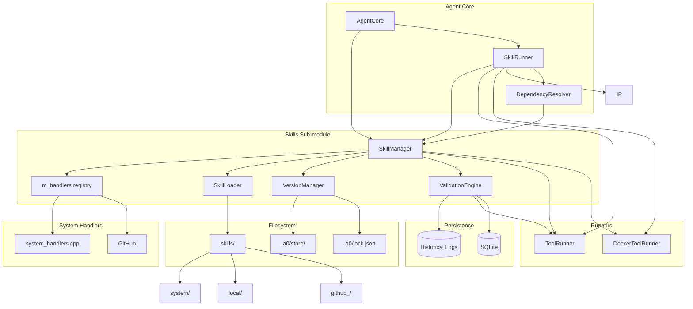
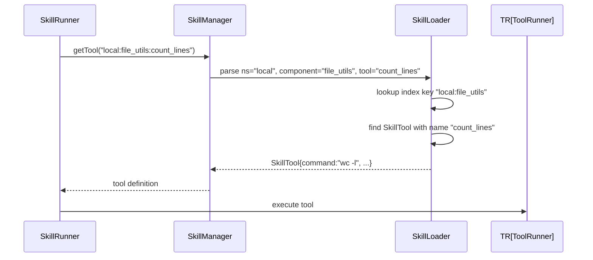

# Technical Specification: Skills Sub-Module

## For a0 Agent — Version 1.0

---

## 1. Overview

The Skills sub-module manages the lifecycle of agent skills — bundles of tools and prompts distributed as `skill.json` packages organized in a three-tier namespace (system/local/github_<user>). It replaces the flat components directory model with a structured, versioned ecosystem designed for constructive evolution.

**Goals:**

- Enable the agent to create, refine, and share skills autonomously
- Provide a deterministic upgrade path based on empirical validation, not version pinning
- Keep the LLM-visible tool namespace clean — no alias explosion from version conflicts
- Support GitHub-based distribution via `a0 skill install github:user/repo#commit`
- Ensure ecosystem health through automated backward-compatibility testing

**Dependencies on other sub-modules:**

- `agent_interfaces.h` — core data structures (`Tool`, `SkillPrompt`)
- `ToolRunner` / `DockerToolRunner` — executes tools at runtime
- `LlmProvider` (via `DrivenProvider`) — executes LLM inference at runtime
- `PersistenceStore` (SQLite) — provides historical invocation records for upgrade validation

- `DependencyResolver` — validates transitive skill/tool dependencies

**Lifecycle stages:**

1. Construct → load (scan directories, parse manifests)
2. Serve (resolve tools/skills by qualified name)
3. Create (agent infers new tools/prompts, adds to `local/`)
4. Validate (replay historical logs on upgrade)
5. Archive (version snapshots in `.a0/store/`, GC old refs)

---

## 2. Component Specifications (C++ Interfaces)

All classes are defined in the `a0::skills` namespace, declared in `src/skills/`.

### 2.1 Core Data Structures

```cpp
#pragma once

#include <string>
#include <vector>
#include <unordered_map>
#include <optional>
#include "nlohmann/json.hpp"
#include "../tool_state.h"

namespace a0::skills {

/// Namespace identifier for a skill source.
enum class SkillNamespace {
    SYSTEM,   // skills/system/ — shipped with agent, read-only, not overridable
    LOCAL,    // skills/local/  — agent-created, writable
    GITHUB    // skills/github_<user>/ — installed from GitHub, read-only
};

/// I/O schema for a tool — governs upgrade validation.
struct ToolSchema {
    nlohmann::json input;   // JSON Schema for params
    nlohmann::json output;  // JSON Schema for return value
};

/// Context passed to every C++ system tool handler.
struct HandlerContext {
    std::string subcommand;       // wildcard suffix or tool name
    ToolState* toolState = nullptr; // per-session shared state (nullable)
};

/// Extended tool definition with versioned schema.
struct SkillTool {
    std::string name;
    std::string description;
    std::string command;
    std::string inputMode = "stdin";
    ToolSchema schema;
    std::string dockerImage;
    TrustLevel trustLevel = TrustLevel::MEDIUM;
    std::vector<std::string> aptDependencies;
    bool systemTool = false;       // implemented as C++ handler, not subprocess
    bool default_ = false;         // included in LLM anchor schema
    int timeoutSecs = 30;
    nlohmann::json parameters;     // JSON Schema for LLM function calling
    std::string subCommand;        // override CLI subcommand (e.g. "rev-parse")
    bool streaming = false;        // tool supports streaming output
};

/// Return type for C++ system tool handler functions.
/// Carries output text and optional tool recommendations for dynamic accumulation.
struct HandlerResult {
    std::string output;
    std::vector<std::string> recommendedTools;
};

/// Function signature for system tool C++ handlers.
/// Previously `SystemToolRegistry` static methods, now free functions
/// registered onto SkillManager via registerHandler().
using ToolHandler = std::function<::a0::HandlerResult(const nlohmann::json& params,
                                                       HandlerContext ctx)>;

/// A prompt-based capability within a skill package.
struct SkillPrompt {
    std::string name;
    std::string description;
    std::string prompt;
    std::vector<std::string> dependencies;      // bare tool/prompt names within this skill
    std::vector<ValidatorBinding> validators;
};

/// Compatibility bridge — deterministic program that translates output formats.
struct CompatBridge {
    std::string toolName;          // tool this bridge applies to
    std::string since;             // semver this bridge supports
    std::string bridgeCommand;     // script to transform output format
    std::string description;
};

/// Full manifest parsed from skill.json.
struct SkillManifest {
    std::string name;
    std::string version;                            // semver
    std::string description;
    SkillNamespace ns;
    std::string sourceUrl;                          // GitHub URL, if applicable
    std::string commitHash;                         // installed commit
    std::vector<SkillTool> tools;
    std::vector<SkillPrompt> prompts;
    std::vector<CompatBridge> compat;
    std::unordered_map<std::string, std::string> dependencies;  // ns:component → bare name alias
};

/// Entry in .a0/store/ — versioned snapshot.
struct StoredVersion {
    std::string commitHash;
    std::string version;
    int refcount;
    time_t installedAt;
};

/// Historical invocation record for upgrade validation.
struct InvocationRecord {
    std::string toolName;
    nlohmann::json params;
    nlohmann::json output;
    int64_t timestamp;
};

} // namespace a0::skills
```

### 2.2 SkillManager Facade

```cpp
namespace a0::skills {

/// Central facade for the skills sub-module.
/// All skill lifecycle operations go through this class.
class SkillManager {
public:
    /// \param skillsRoot   Path to skills/ directory (default: "./skills")
    /// \param storeRoot    Path to .a0/store/ directory (default: "./.a0/store")
    /// \param persistence  Persistence store for invocation history (SQLite); used by ValidationEngine
    SkillManager(const std::string& skillsRoot,
                 const std::string& storeRoot,
                 a0::persistence::PersistenceStore* persistence = nullptr);
 
     virtual ~SkillManager();

    /// Load all namespaces: system/ (locked), local/, github_*/.
    /// Must be called before any lookup or operation.
    /// \retval 0  All manifests loaded successfully.
    /// \retval -1 Skills root does not exist.
    int loadAll();

    /// Resolve a qualified name to a tool.
    /// Format: `<ns>:<component>[:<tool>]`
    ///   system:bash                 → system namespace, "bash" tool
    ///   local:file_utils:list_files → local namespace, "file_utils" component, "list_files" tool
    ///   github_alice:utils:format   → github_alice namespace
    /// \param qualifiedName  Fully qualified tool reference.
    /// \param[out] tool      Populated on success.
    /// \retval 0  Found.
    /// \retval -1 Component not found.
    /// \retval -2 Tool not found within component.
    int getTool(const std::string& qualifiedName, SkillTool& tool) const;

    /// Resolve a qualified name to a skill prompt.
    /// \param qualifiedName  Fully qualified prompt reference.
    /// \param[out] prompt    Populated on success.
    /// \retval 0  Found.
    /// \retval -1 Component or prompt not found.
    int getPrompt(const std::string& qualifiedName, SkillPrompt& prompt) const;

    /// List all loaded components, optionally filtered by namespace.
    /// \param ns  Filter (std::nullopt = all).
    /// \returns   Qualified names of all matching components.
    std::vector<std::string> listSkills(std::optional<SkillNamespace> ns) const;

    /// Add a new tool to the local namespace.
    /// Creates or appends to skills/local/<component-name>/skill.json.
    /// \param component  Target component name (created if absent).
    /// \param tool       Tool definition to add.
    /// \retval 0  Added.
    /// \retval -1 System namespace is read-only.
    int addTool(const std::string& component, const SkillTool& tool);

    /// Add a new prompt to the local namespace.
    /// \param component  Target component name.
    /// \param prompt     Prompt definition to add.
    /// \retval 0  Added.
    /// \retval -1 System namespace is read-only.
    int addPrompt(const std::string& component, const SkillPrompt& prompt);

    /// Update an existing tool in-place.
    /// \param component  Component containing the tool.
    /// \param name       Name of the tool to update.
    /// \param tool       Updated tool definition.
    /// \retval 0  Updated.
    /// \retval -1 Tool not found.
    int updateTool(const std::string& component, const std::string& name, const SkillTool& tool);

    /// --- Version management ---

    /// Install the latest commit of a GitHub source.
    /// \param sourceUrl  GitHub URL (e.g., "https://github.com/alice/utils").
    /// \param force      If true, skip validation.
    /// \retval 0  Installed and validated successfully.
    /// \retval 1  Installed with compatibility bridge applied.
    /// \retval -1 Validation failed; not installed.
    int install(const std::string& sourceUrl, bool force = false);

    /// Install a specific commit.
    /// \param sourceUrl  GitHub URL.
    /// \param commit     Full commit hash.
    /// \param force      Skip validation.
    /// \retval 0  Installed.
    /// \retval -1 Validation failed.
    int install(const std::string& sourceUrl, const std::string& commit, bool force = false);

    /// Remove a component and GC its stored version if refcount reaches 0.
    /// \param qualifiedName  Fully qualified component name.
    /// \retval 0  Removed.
    /// \retval -1 System namespace is read-only.
    int remove(const std::string& qualifiedName);

    /// Run garbage collection on .a0/store/ — remove versions with refcount 0.
    /// \param dryRun  If true, only report what would be removed.
    /// \returns       Number of versions removed.
    int gc(bool dryRun = false);

    /// Validate a component against historical logs.
    /// \param qualifiedName  Component to validate.
    /// \param commit         Commit hash to validate against.
    /// \param[out] report    Validation report (failures, bridges applied).
    /// \retval 0  All historical invocations match.
    /// \retval 1  All pass after compat bridge applied.
    /// \retval -1 One or more invocations fail validation.
    int validate(const std::string& qualifiedName,
                 const std::string& commit,
                 std::string& report);

    // --- Handler registry (unified dispatch) ---

    /// Register a C++ handler function for a system tool.
    /// Supports wildcard keys (e.g. "system:git:*") — params["_subcommand"]
    /// receives the tool name after the last colon.
    void registerHandler(const std::string& qualifiedName, ToolHandler handler);

    /// Execute any tool by qualified name. Resolution:
    ///   1. Exact handler match → C++ handler
    ///   2. 2-part alias (ns:comp → ns:comp:comp when name==component)
    ///   3. Wildcard (ns:comp:* → params["_subcommand"] set)
    ///   4. Command tool (systemTool=false) → ToolRunner/DockerToolRunner
    ///   5. Error if not found
    nlohmann::json executeTool(const std::string& qualifiedName, const nlohmann::json& params);

    /// Full result with recommendedTools (used by tools_for_prompt).
    ::a0::HandlerResult executeToolWithMeta(const std::string& qualifiedName, const nlohmann::json& params);

    /// Build LLM tool schemas from loaded manifests.
    /// defaultOnly=true → only tools with default_=true.
    std::vector<::ToolSchema> schemas(bool defaultOnly = true) const;

    /// Validate all systemTool entries have registered C++ handlers.
    /// Empty = all good. Non-empty = fatal configuration error.
    std::vector<std::string> missingHandlers() const;

    /// Wire runners for command-based non-system tools.
    void setToolRunner(::ToolRunner* runner);
    void setDockerRunner(::DockerToolRunner* runner);
    void setDockerSecurityFilter(::a0::DockerSecurityFilter* filter);

    /// Execute a tool with streaming output.
    /// For command tools with streaming=true, delegates to ToolRunner::runStreaming.
    /// For system tools, falls through to synchronous executeToolWithMeta path.
    a0::StreamHandle executeToolStreaming(const std::string& qualifiedName,
        const nlohmann::json& params, a0::StreamCallback onChunk,
        int* seq = nullptr, const std::string& toolCallId = "",
        int64_t subSessionId = 0);

    /// Enable auto-recording of tool execution results to persistence.
    /// When active, every executeToolWithMeta call records appendMessage + appendInvocation.
    void setRecordingSession(int64_t sessionDbId);

    /// Access the per-session ToolState bag (thread-safe).
    ToolState& toolState() { return m_toolState; }

private:
    std::string m_skillsRoot;
    std::string m_storeRoot;
    SkillLoader* m_loader;
    VersionManager* m_versionMgr;
    ValidationEngine* m_validator;
    std::unordered_map<std::string, ToolHandler> m_handlers;
    ::ToolRunner* m_toolRunner = nullptr;
    ::DockerToolRunner* m_dockerRunner = nullptr;
    ::a0::DockerSecurityFilter* m_dockerSecurityFilter = nullptr;
    ::a0::persistence::PersistenceStore* m_persistence = nullptr;
    int64_t m_sessionDbId = 0;
    ToolState m_toolState;

    SkillManager(const SkillManager&) = delete;
    SkillManager& operator=(const SkillManager&) = delete;
};

} // namespace a0::skills
```

### 2.3 SkillLoader

```cpp
#include <valijson/validator.hpp>
#include <valijson/schema.hpp>
#include <valijson/schema_parser.hpp>
#include <valijson/adapters/nlohmann_json_adapter.hpp>

namespace a0::skills {

/// Walks the skills/ directory tree, parses skill.json manifests.
/// Maintains an in-memory index of all loaded components.
/// Validates manifests against skills/schema.json (Draft-07) on load.
class SkillLoader {
public:
    explicit SkillLoader(const std::string& root);

    /// Scan all namespace directories and load manifests.
    /// System namespace is loaded first and marked read-only.
    /// \retval 0  All manifests loaded.
    /// \retval -1 Root directory missing.
    int loadAll();

    /// Validate a JSON object against the skill.json schema.
    /// \param json     The parsed JSON object to validate.
    /// \param errors   Output: human-readable validation errors.
    /// \retval 0   Valid.
    /// \retval -1  Invalid (errors populated).
    int validateAgainstSchema(const nlohmann::json& json, std::string& errors) const;

    /// Lookup a tool by qualified name components.
    int getTool(const std::string& ns, const std::string& component,
                const std::string& toolName, SkillTool& tool) const;

    /// Lookup a prompt by qualified name components.
    int getPrompt(const std::string& ns, const std::string& component,
                  const std::string& promptName, Prompt& prompt) const;

    /// List components in a namespace.
    std::vector<std::string> listComponents(SkillNamespace ns) const;

    /// Write a manifest back to disk (local namespace only).
    int writeManifest(const std::string& component, const SkillManifest& manifest);

private:
    std::string m_root;
    std::unordered_map<std::string, SkillManifest> m_components;  // key: "ns:component"
    std::unordered_map<std::string, SkillNamespace> m_nsMap;     // dir → enum
    valijson::Schema m_schema;                    // compiled schema for validation
    mutable valijson::Validator m_validator;      // reusable validator instance
    bool m_schemaLoaded = false;                  // true when schema successfully loaded

    int xLoadNamespace(const std::string& dirPath, SkillNamespace ns);
    int xParseManifestFile(const std::string& path, SkillManifest& manifest) const;
    int xLoadSchema(const std::string& schemaPath);
    std::string xDirForNamespace(SkillNamespace ns) const;
    SkillNamespace xNsForDir(const std::string& dir) const;
};
```

} // namespace a0::skills

**Schema Validation Details:**

- On construction, `SkillLoader` calls `xLoadSchema(skillsRoot + "/schema.json")` to load the Draft-07 schema from `skills/schema.json`.
- If the schema file is missing or unparseable, a warning is printed and `m_schemaLoaded = false` — all validation passes through.
- Every `xParseManifestFile` call:
  1. Reads and parses JSON from the file path
  2. Calls `validateAgainstSchema(j, errors)` — if invalid, the component is **skipped** with a warning
  3. Populates the manifest struct from JSON
- The `readManifest` public method has been **removed** — all parsing is now inline in `xParseManifestFile`, which also handles `parallelValidators`, `streaming`, and `subCommand` fields.
```

### 2.4 VersionManager

```cpp
namespace a0::skills {

/// Manages .a0/store/ version archive.
/// Each installed commit is stored under .a0/store/<ns>/<commit>/<component>/.
/// Tracks refcounts for GC via .a0/lock.json.
class VersionManager {
public:
    VersionManager(const std::string& storeRoot,
                   const std::string& skillsRoot);

    /// Archive the current active version to the store.
    /// If already present, refcount is bumped.
    /// \param ns         Namespace.
    /// \param component  Component name.
    /// \param commit     Commit hash.
    /// \param version    Semver string.
    /// \retval 0  Archived.
    int archive(SkillNamespace ns,
                const std::string& component,
                const std::string& commit,
                const std::string& version);

    /// Restore a version from store to active directory.
    /// \param ns         Namespace.
    /// \param component  Component name.
    /// \param commit     Commit hash to restore.
    /// \retval 0  Restored.
    /// \retval -1 Version not in store.
    int restore(SkillNamespace ns,
                const std::string& component,
                const std::string& commit);

    /// Decrement refcount. If refcount reaches 0, version is eligible for GC.
    /// \param ns         Namespace.
    /// \param component  Component name.
    /// \param commit     Commit hash.
    /// \retval 0  Refcount decremented.
    /// \retval -1 Version not in store.
    int release(SkillNamespace ns,
                const std::string& component,
                const std::string& commit);

    /// Remove all versions with refcount == 0.
    /// \param dryRun  Only report, don't remove.
    /// \returns       Number of versions removed.
    int gc(bool dryRun = false);

private:
    std::string m_storeRoot;
    std::string m_skillsRoot;
    std::string m_lockPath;

    std::unordered_map<std::string, StoredVersion> m_versions;  // key: "<ns>:<component>:<commit>"

    int xLoadLock();
    int xSaveLock();
    std::string xStorePath(SkillNamespace ns,
                           const std::string& commit,
                           const std::string& component) const;
    std::string xVersionKey(SkillNamespace ns,
                            const std::string& component,
                            const std::string& commit) const;
    std::string xActivePath(SkillNamespace ns,
                            const std::string& component) const;
    int xCopyDir(const std::string& src, const std::string& dst);
};

} // namespace a0::skills
```

### 2.5 ValidationEngine

Historical invocation records are stored in the SQLite `invocation` table (via `PersistenceStore`) rather than filesystem JSONL files. The `xLoadLogs` method queries `m_store->loadInvocations(type, component)` to retrieve records.

Supports **compatibility bridges**: when a direct output comparison fails, each `CompatBridge` (from the candidate manifest) is tried to transform the historical output before re-comparing. If a bridge produces a match, validation passes with status `1` (bridge applied).

```cpp
namespace a0::persistence { class PersistenceStore; }

namespace a0::skills {

/// Replays historical tool invocations against a candidate version.
/// Uses CommandRunner for all subprocess execution.
/// Invocation records are read from the persistence store (SQLite).
/// Used by SkillManager::install() to validate upgrades.
class ValidationEngine {
public:
    /// \param store  Persistence store (SQLite) for invocation history.
    explicit ValidationEngine(::a0::persistence::PersistenceStore* store);

    /// Validate a candidate version against historical logs.
    /// \param ns         Namespace of the component.
    /// \param component  Component name.
    /// \param manifest   Candidate manifest to validate.
    /// \param commit     Candidate commit hash.
    /// \param[out] report  Human-readable validation report.
    /// \retval 0  All invocations match, no bridges used.
    /// \retval 1  All pass after applying compatibility bridges.
    /// \retval -1 One or more invocations fail (details in report).
    int validate(SkillNamespace ns,
                 const std::string& component,
                 const SkillManifest& manifest,
                 const std::string& commit,
                 std::string& report);

private:
    ::a0::persistence::PersistenceStore* m_store;

    int xReplay(const InvocationRecord& record,
                const SkillManifest& manifest,
                const std::string& toolName,
                nlohmann::json& actualOutput);
    int xCompare(const nlohmann::json& expected,
                 const nlohmann::json& actual,
                 const ToolSchema& schema);
    int xApplyBridge(const CompatBridge& bridge,
                     const nlohmann::json& input,
                     nlohmann::json& output);
    std::vector<InvocationRecord> xLoadLogs(const std::string& ns,
                                             const std::string& component) const;
};

} // namespace a0::skills
```

---

## 3. System Architecture



## 4. Detailed Data Flow

### 4.1 Install with Validation


### 4.3 Lookup and Resolution



---

## 5. Visualization

Covered by the parent module's D3 animation. The sub-module's state machine (install → validate → archive → GC) is file-based and deterministic; a Mermaid sequence diagram (above) is sufficient. The top-level `technical-specification.md` will include a system-wide animation showing skill propagation lifecycle across namespaces.

---

## 6. Testing Requirements

### 6.1 SkillManager

| Method | Test Case | Expected Outcome |
|--------|-----------|-----------------|
| `loadAll` | Valid tree with all three namespaces | 0, manifests loaded, system locked |
| `loadAll` | Missing skills root | -1 |
| `loadAll` | Malformed skill.json in local | Error logged, component skipped |
| `getTool` | Existing qualified name | 0, tool populated |
| `getTool` | Nonexistent component | -1 |
| `getTool` | Nonexistent tool in component | -2 |
| `addTool` | New component in local | 0, skill.json created |
| `addTool` | Existing component in local | 0, skill.json appended |
| `addTool` | System namespace | -1 |
| `install` | Valid repo, validation passes | 0 |
| `install` | Validation fails, no force | -1, no files changed |
| `install` | Validation fails, force flag | 0, installed |
| `install` | Specific commit hash | 0, that commit installed |
| `remove` | Existing local component | 0, dir removed, refcount dec |
| `remove` | System component | -1 |
| `gc` | Orphaned version in store | Version removed |
| `gc` | All versions referenced | 0 removed |

### 6.2 Handler Registry

| Method | Test Case | Expected Outcome |
|--------|-----------|-----------------|
| `registerHandler` | New handler | Stored, executable via executeTool |
| `executeTool` | Exact match | Handler output returned |
| `executeTool` | 2-part alias (`system:bash`) | Resolves to `system:bash:bash` handler |
| `executeTool` | Wildcard (`system:git:*`) | `_subcommand` set, handler dispatched |
| `executeTool` | Command tool via ToolRunner | Subprocess output returned |
| `executeTool` | System tool with no handler | Error string |
| `executeTool` | Command tool with no runners | Error "no ToolRunner available" |
| `executeToolWithMeta` | tools_for_prompt | HandlerResult with recommendedTools |
| `executeToolWithMeta` | Normal tool | HandlerResult with empty recommendedTools |
| `schemas` | defaultOnly=true | Only `default_=true` tools with parameters |
| `schemas` | defaultOnly=false | All tools with parameters |
| `missingHandlers` | All registered | Empty vector |
| `missingHandlers` | One unregistered systemTool | Vector with that tool's qualified name |
| `missingHandlers` | Wildcard covers all | Empty (git/docker wildcards handle 120+ tools) |

### 6.2 VersionManager

| Method | Test Case | Expected Outcome |
|--------|-----------|-----------------|
| `archive` | New version | Stored, refcount=1 |
| `archive` | Already stored | Refcount incremented |
| `restore` | Existing stored version | Files copied to active dir |
| `restore` | Missing version | -1 |
| `release` | Existing version | Refcount decremented |
| `release` | Refcount reaches 0 | Eligible for GC |
| `gc` | dryRun=true | Reports, does not remove |
| `gc` | dryRun=false | Removes unreferenced |

### 6.3 ValidationEngine

| Method | Test Case | Expected Outcome |
|--------|-----------|-----------------|
| `validate` | All invocations match | 0 |
| `validate` | Differs, compat bridge exists | 1 |
| `validate` | Differs, no bridge | -1 |
| `validate` | No historical logs | 0 |
| `validate` | Tool with no schema defined | 0 |
| `validate` | 1000+ historical logs | Completes within timeout |

### 6.4 SkillLoader

| Method | Test Case | Expected Outcome |
|--------|-----------|-----------------|
| `loadAll` | skill.json with tools+prompts | Both loaded |
| `loadAll` | skill.json with compat bridges | Bridges indexed |
| `loadAll` | Missing required fields | Component skipped, error logged |
| `getTool` | Cross-component qualified name | Resolved |
| `writeManifest` | Local namespace | File written |
| `writeManifest` | System namespace | -1 |

---

## 7. CLI Entry Point

All skills sub-module commands are exposed under `a0 skill`:

```
a0 skill list [--ns system|local|github]
    List installed skills, optionally filtered by namespace.

a0 skill install <url> [--commit <hash>] [--force]
    Install a skill from GitHub (latest or specific commit).
    Runs validation against historical logs.
    --force skips validation.

a0 skill remove <qualified-name>
    Remove a skill (local or github namespace).

a0 skill gc [--dry-run]
    Garbage collect unreferenced versions from .a0/store/.

a0 skill validate <qualified-name>
    Manually trigger validation against historical logs.

a0 skill pin <qualified-name>
    Pin a version so its refcount never auto-decrements.
```

---

## 8. Wiring

Wire-up in `main.cpp`:

1. `SkillManager` is constructed at startup with paths: `./skills`, `./.a0/store`, and a `PersistenceStore*` for invocation history
2. ToolRunner/DockerToolRunner pointers are set via `SkillManager::setToolRunner()` and `setDockerRunner()`
3. All C++ system tool handlers are registered via `xRegisterSystemHandlers()` which calls `SkillManager::registerHandler()` for each handler (core fs tools, git/docker wildcards, meta tools)
4. `SkillManager::loadAll()` called during `AgentCore::init()` — loads skill.json manifests from disk
5. `SkillManager::missingHandlers()` validates every `systemTool=true` entry has a registered C++ handler; any missing triggers a fatal error listing all unregistered tools
6. `AgentCore` receives a `SkillManager*` for all tool dispatch — no separate `SystemToolRegistry`
7. `SkillRunner` resolves tool/prompt lookups through `SkillManager`
8. `DependencyResolver` uses `SkillManager` for dependency checking

10. CLI parser routes `a0 skill ...` commands to `SkillManager` methods

---

## 9. Implementation Outline

### Phase 1: Data structures + SkillLoader

- Define data structures in `skills.h`
- Implement `SkillLoader` — directory walking, `skill.json` parsing
- Unit tests with fixture skill trees

### Phase 2: SkillManager facade

- Implement `SkillManager` — wraps loader, exposes resolved lookup
- Wire into `AgentCore` and `SkillRunner`
- Update `DependencyResolver` for qualified names

### Phase 3: VersionManager + store

- Implement `.a0/store/` archival, `lock.json`, refcounting
- Implement `gc` command
- Unit tests with mock store

### Phase 4: ValidationEngine

- Implement historical log replay
- Implement output comparison with schemas
- Implement compat bridge execution
- Unit tests with recorded invocations

### Phase 5: CLI + install

- Implement `a0 skill install` — GitHub fetch, validation, archive
- Implement `a0 skill list/remove/gc`
- E2E tests with a real GitHub repo (or mock HTTP)
