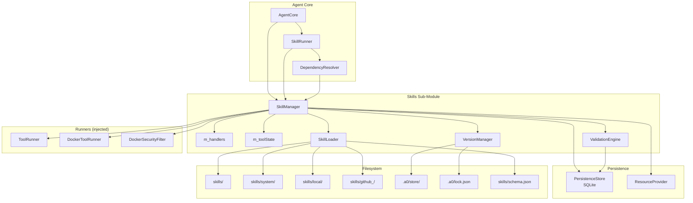
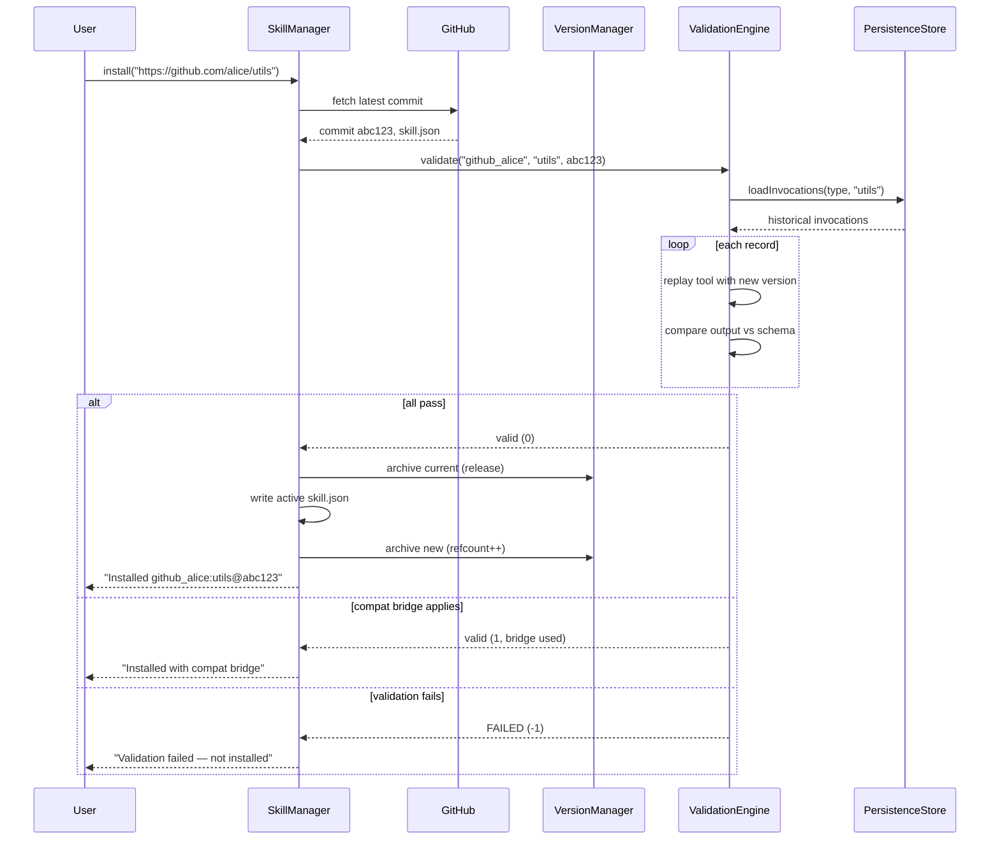
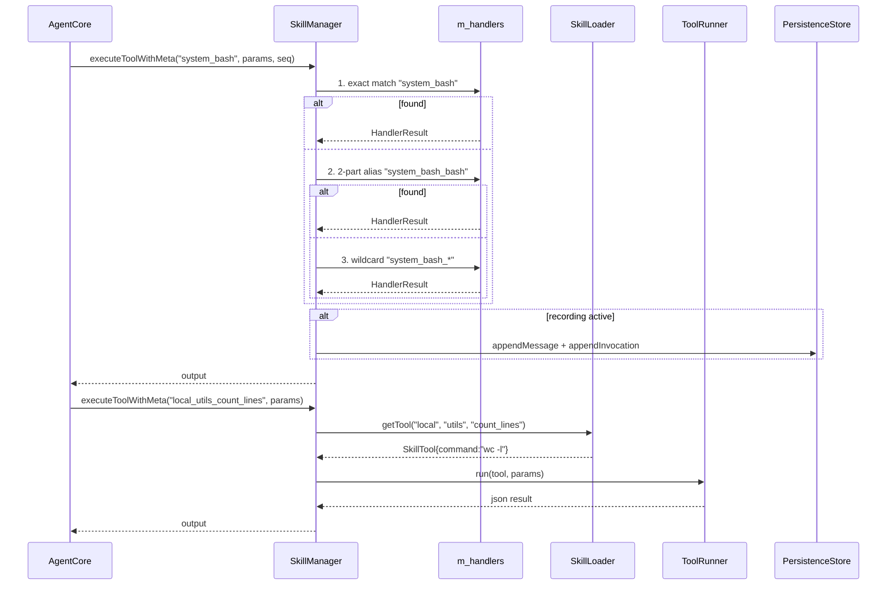
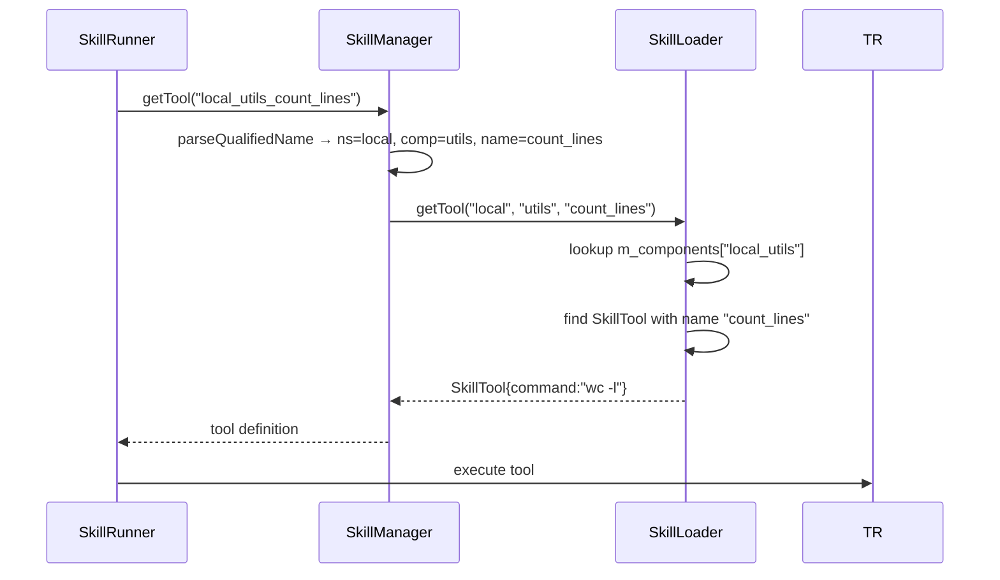

# Technical Specification: Skills Sub-Module

## §1 Overview

The Skills sub-module manages the lifecycle of agent skills — bundles of tools and prompts distributed as `skill.json` packages organized in a three-tier namespace (system/local/github_<user>). It provides directory scanning, manifest parsing with JSON Schema validation, qualified name resolution, versioned archival with reference counting, and historical-log-based upgrade validation.

**Source files:** `src/skills/skills.h`, `src/skills/skill_manager.cpp`, `src/skills/skill_loader.h/.cpp`, `src/skills/version_manager.h/.cpp`, `src/skills/validation_engine.h/.cpp`, `src/skills/CMakeLists.txt`

**Dependencies:**
- `src/shared/agent_interfaces.h` — Tool, Prompt, ValidatorBinding, TrustLevel, ToolRunner, DockerToolRunner
- `src/shared/handler_results.h` — HandlerResult
- `src/executor/tool_state.h` — ToolState
- `src/persistence/persistence_store.h` — PersistenceStore (SQLite)
- nlohmann/json — JSON parsing and serialization
- valijson — JSON Schema validation (Draft-07)

**Lifecycle stages:**
1. Construct → allocate sub-components (SkillLoader, VersionManager, ValidationEngine)
2. `loadAll()` — scan directories, parse manifests, validate schemas, build index
3. `registerHandler()` — wire C++ system tool handlers
4. Serve — resolve tools/prompts, execute tools (handler or subprocess dispatch)
5. Create — add new tools/prompts to local namespace
6. Validate — replay historical logs on upgrade to check backward compatibility
7. Archive — version snapshots in `.a0/store/` with reference counting and GC

## §2 Component Specifications

All classes in `namespace a0::skills`, declared in `src/skills/`.

### §2.1 Core Data Structures

```cpp
#include <string>
#include <vector>
#include <unordered_map>
#include <optional>
#include <functional>
#include <ctime>
#include "nlohmann/json.hpp"
#include "shared/agent_interfaces.h"
#include "shared/handler_results.h"
#include "executor/tool_state.h"

class ToolState;

namespace a0 { class DockerSecurityFilter; class ResourceProvider; }
namespace a0::persistence { class PersistenceStore; }

class ToolRunner;
class DockerToolRunner;

namespace a0::skills {

// ---------------------------------------------------------------------------
// HandlerContext — contextual info passed to every system tool handler
// ---------------------------------------------------------------------------

struct HandlerContext {
    std::string subcommand;      // wildcard suffix or tool name
    ToolState* toolState = nullptr;  // per-session shared state (nullable)
};

// ---------------------------------------------------------------------------
// Tool handler — C++ function that implements a system tool
// ---------------------------------------------------------------------------

using ToolHandler = std::function<::a0::HandlerResult(
    const nlohmann::json& params,
    const HandlerContext& ctx)>;

// ---------------------------------------------------------------------------
// SkillNamespace
// ---------------------------------------------------------------------------

enum class SkillNamespace {
    SYSTEM,   // skills/system/ — shipped, read-only
    LOCAL,    // skills/local/  — agent-created, writable
    GITHUB    // skills/github_<user>/ — installed, read-only
};

// ---------------------------------------------------------------------------
// Structs
// ---------------------------------------------------------------------------

struct ToolSchema {
    nlohmann::json input;    // JSON Schema for params
    nlohmann::json output;   // JSON Schema for return value
};

struct SkillTool {
    std::string name;
    std::string description;
    std::string command;
    std::string inputMode = "stdin";
    ToolSchema schema;
    std::string dockerImage;
    TrustLevel trustLevel = TrustLevel::MEDIUM;
    std::vector<std::string> aptDependencies;
    bool systemTool = false;
    bool default_ = false;
    int timeoutSecs = 30;
    nlohmann::json parameters;    // JSON Schema for LLM function calling
    std::string subCommand;       // override CLI subcommand
    bool streaming = false;       // tool supports streaming output
};

struct CompatBridge {
    std::string toolName;
    std::string since;
    std::string bridgeCommand;
    std::string description;
};

struct SkillManifest {
    std::string name;
    std::string version;
    std::string description;
    SkillNamespace ns;
    std::string sourceUrl;
    std::string commitHash;
    std::vector<SkillTool> tools;
    std::vector<Prompt> prompts;
    std::vector<CompatBridge> compat;
    std::unordered_map<std::string, std::string> dependencies;
    std::vector<std::string> subModules;
};

struct StoredVersion {
    std::string commitHash;
    std::string version;
    int refcount = 0;
    time_t installedAt = 0;
};

struct InvocationRecord {
    std::string toolName;
    nlohmann::json params;
    nlohmann::json output;
    int64_t timestamp = 0;
};

// ---------------------------------------------------------------------------
// Qualified name helpers
// ---------------------------------------------------------------------------

/// Parse "system_task_manager_add_task" → ns="system", component="task_manager", name="add_task"
/// Parse "system_bash" → ns="system", component="bash", name="bash"
bool parseQualifiedName(const std::string& qualified,
                        std::string& ns,
                        std::string& component,
                        std::string& name);

/// Build "system_task_manager_add_task" from parts.
std::string buildQualifiedName(const std::string& ns,
                                const std::string& component,
                                const std::string& name);

} // namespace a0::skills
```

### §2.2 SkillLoader

```cpp
namespace a0::skills {

class SkillLoader {
public:
    /// \param root  Path to the skills/ root directory.
    explicit SkillLoader(const std::string& root);

    /// Scan all namespace directories and load manifests.
    /// Loads system/, then local/, then github_<user>/.
    /// Sub-modules declared in manifest.subModules are loaded recursively.
    /// \retval 0  All manifests loaded.
    /// \retval -1 Root directory does not exist.
    int loadAll();

    /// Validate a JSON object against the skill.json schema (Draft-07).
    /// When m_schemaLoaded is false, all input passes through.
    /// \param json     The parsed JSON object to validate.
    /// \param errors   Output: human-readable validation errors.
    /// \retval 0   Valid.
    /// \retval -1  Invalid (errors populated).
    int validateAgainstSchema(const nlohmann::json& json, std::string& errors) const;

    /// Lookup a tool by namespace, component, and tool name.
    /// \param ns         Namespace string.
    /// \param component  Component name.
    /// \param toolName   Tool name within the component.
    /// \param[out] tool  Populated on success.
    /// \retval 0  Found.
    /// \retval -1 Component not found.
    /// \retval -2 Tool not found.
    int getTool(const std::string& ns, const std::string& component,
                const std::string& toolName, SkillTool& tool) const;

    /// Lookup a prompt by namespace, component, and prompt name.
    /// \param ns           Namespace string.
    /// \param component    Component name.
    /// \param promptName   Prompt name within the component.
    /// \param[out] prompt  Populated on success.
    /// \retval 0  Found.
    /// \retval -1 Component not found.
    /// \retval -2 Prompt not found.
    int getPrompt(const std::string& ns, const std::string& component,
                  const std::string& promptName, Prompt& prompt) const;

    /// List components in a namespace.
    /// \param ns  Namespace filter.
    /// \returns   Component names.
    std::vector<std::string> listComponents(SkillNamespace ns) const;

    /// Write a manifest back to disk (local namespace only).
    /// \param component  Component directory name.
    /// \param manifest   Manifest to serialize to skill.json.
    /// \retval 0  Written successfully.
    /// \retval -1 Namespace is read-only or file write failed.
    int writeManifest(const std::string& component, const SkillManifest& manifest);

    /// Add a tool to the local namespace. Creates the component if absent.
    int addTool(const std::string& component, const SkillTool& tool);

    /// Add a prompt to the local namespace. Creates the component if absent.
    int addPrompt(const std::string& component, const Prompt& prompt);

    /// Update an existing tool in-place in the local namespace.
    /// \retval 0  Updated.
    /// \retval -1 Component or tool not found.
    int updateTool(const std::string& component, const std::string& name,
                   const SkillTool& tool);

    /// Remove a component from disk and the in-memory index.
    /// \retval 0  Removed.
    /// \retval -1 Component not found or read-only.
    int removeComponent(const std::string& component);

    /// Get a manifest by namespace and component name.
    /// \retval 0  Found.
    /// \retval -1 Component not found.
    int getManifest(SkillNamespace ns, const std::string& component,
                    SkillManifest& manifest) const;

private:
    std::string m_root;
    std::unordered_map<std::string, SkillManifest> m_components;    // key: "<ns>_<component>"
    std::unordered_map<std::string, SkillNamespace> m_nsMap;        // dir path → ns enum
    valijson::Schema m_schema;                                       // compiled Draft-07 schema
    mutable valijson::Validator m_validator;                         // reusable validator
    bool m_schemaLoaded = false;                                     // true when loaded

    int xLoadNamespace(const std::string& dirPath, SkillNamespace ns);
    int xParseManifestFile(const std::string& path, SkillManifest& manifest) const;
    int xLoadSchema(const std::string& schemaPath);
    std::string xDirForNamespace(SkillNamespace ns) const;
    SkillNamespace xNsForDir(const std::string& dir) const;
    std::string xIndexKey(SkillNamespace ns, const std::string& component) const;
    bool xIsReadOnly(SkillNamespace ns) const;
};

} // namespace a0::skills
```

### §2.3 VersionManager

```cpp
namespace a0::skills {

class VersionManager {
public:
    VersionManager(const std::string& storeRoot,
                   const std::string& skillsRoot);

    /// Archive the current active version to the store.
    /// If already archived, increments refcount.
    /// \returns 0 on success, -1 on copy failure.
    int archive(SkillNamespace ns,
                const std::string& component,
                const std::string& commit,
                const std::string& version);

    /// Restore a previously archived version to the active path.
    /// \returns 0 on success, -1 if commit not found.
    int restore(SkillNamespace ns,
                const std::string& component,
                const std::string& commit);

    /// Release a reference. If commit is empty, releases the currently
    /// active version for the component. Decrements refcount (floor 0).
    /// \returns 0 on success, -1 if commit not found.
    int release(SkillNamespace ns,
                const std::string& component,
                const std::string& commit = "");

    /// Garbage collection: remove all entries with refcount <= 0.
    /// When dryRun=true, only reports count without removing.
    /// \returns Number of entries removed (or eligible).
    int gc(bool dryRun = false);

private:
    std::string m_storeRoot;
    std::string m_skillsRoot;
    std::string m_lockPath;
    std::unordered_map<std::string, StoredVersion> m_versions;   // key: "<ns>:<component>:<commit>"

    int xLoadLock();
    int xSaveLock();
    std::string xStorePath(SkillNamespace ns, const std::string& commit,
                            const std::string& component) const;
    std::string xVersionKey(SkillNamespace ns, const std::string& component,
                             const std::string& commit) const;
    std::string xActivePath(SkillNamespace ns, const std::string& component) const;
    int xCopyDir(const std::string& src, const std::string& dst);
};

} // namespace a0::skills
```

### §2.4 ValidationEngine

```cpp
namespace a0::persistence { class PersistenceStore; }

namespace a0::skills {

class ValidationEngine {
public:
    /// \param store  Persistence store (SQLite) for invocation history.
    explicit ValidationEngine(::a0::persistence::PersistenceStore* store);

    /// Validate a candidate version against historical logs.
    /// \param ns         Namespace of the component.
    /// \param component  Component name.
    /// \param manifest   Candidate manifest to validate.
    /// \param commit     Candidate commit hash (for logging).
    /// \param[out] report  Human-readable validation report.
    /// \retval 0  All invocations match directly.
    /// \retval 1  All pass after applying compatibility bridges.
    /// \retval -1 One or more invocations diverge (details in report).
    int validate(SkillNamespace ns,
                 const std::string& component,
                 const SkillManifest& manifest,
                 const std::string& commit,
                 std::string& report);

private:
    ::a0::persistence::PersistenceStore* m_store;

    int xReplay(const InvocationRecord& record, const SkillManifest& manifest,
                const std::string& toolName, nlohmann::json& actualOutput);
    int xCompare(const nlohmann::json& expected, const nlohmann::json& actual,
                 const ToolSchema& schema);
    int xApplyBridge(const CompatBridge& bridge, const nlohmann::json& input,
                     nlohmann::json& output);
    std::vector<InvocationRecord> xLoadLogs(const std::string& ns,
                                             const std::string& component) const;
};

} // namespace a0::skills
```

### §2.5 SkillManager

```cpp
namespace a0::skills {

class SkillManager {
public:
    /// \param skillsRoot   Path to skills/ directory.
    /// \param storeRoot    Path to .a0/store/ directory.
    /// \param persistence  PersistenceStore for invocation history (SQLite).
    SkillManager(const std::string& skillsRoot,
                 const std::string& storeRoot,
                 ::a0::persistence::PersistenceStore* persistence = nullptr);
    virtual ~SkillManager();

    /// Load all namespaces. Must be called before any lookup.
    /// \retval 0  All manifests loaded.
    /// \retval -1 Skills root does not exist.
    int loadAll();

    /// Resolve a qualified name to a tool.
    /// Format: `<ns>_<component>_<tool>`
    /// \retval 0  Found.
    /// \retval -1 Component not found.
    /// \retval -2 Tool not found.
    int getTool(const std::string& qualifiedName, SkillTool& tool) const;

    /// Resolve a qualified name to a prompt.
    /// \retval 0  Found.
    /// \retval -1 Component or prompt not found.
    int getPrompt(const std::string& qualifiedName, Prompt& prompt) const;

    /// Get a manifest by namespace and component.
    /// \retval 0  Found.
    /// \retval -1 Component not found.
    int getManifest(SkillNamespace ns, const std::string& component,
                    SkillManifest& manifest) const;

    /// Resolve a prompt chain into a single concatenated prompt.
    /// out.prompt = chain[0].prompt + "\n\n" + chain[1].prompt + "\n\n" + target.prompt
    int getPromptResolved(const std::string& qualifiedName, Prompt& out) const;

    /// Resolve a short name within a component.
    int resolveName(const std::string& componentNs,
                    const std::string& componentName,
                    const std::string& shortName,
                    std::string& qualifiedOut) const;

    /// Build dispatch table: short name → qualified name.
    std::unordered_map<std::string, std::string> buildDispatchTable() const;

    /// List all loaded components, optionally filtered.
    std::vector<std::string> listSkills(std::optional<SkillNamespace> ns) const;

    /// Add a tool/prompt to the local namespace.
    int addTool(const std::string& component, const SkillTool& tool);
    int addPrompt(const std::string& component, const Prompt& prompt);
    int updateTool(const std::string& component, const std::string& name,
                   const SkillTool& tool);

    /// Install from GitHub.
    int install(const std::string& sourceUrl, bool force = false);
    int install(const std::string& sourceUrl, const std::string& commit,
                bool force = false);

    /// Remove a component and release its version.
    int remove(const std::string& qualifiedName);
    int gc(bool dryRun = false);

    /// Validate against historical logs.
    int validate(const std::string& qualifiedName,
                 const std::string& commit,
                 std::string& report);

    // --- Handler registry ---

    void registerHandler(const std::string& qualifiedName, ToolHandler handler);

    /// Execute by qualified name. Returns output string only.
    nlohmann::json executeTool(const std::string& qualifiedName,
                                const nlohmann::json& params);

    /// Execute with streaming output.
    a0::StreamHandle executeToolStreaming(const std::string& qualifiedName,
        const nlohmann::json& params, a0::StreamCallback onChunk,
        int* seq = nullptr, const std::string& toolCallId = "",
        int64_t subSessionId = 0);

    /// Enable auto-recording of tool results.
    void setRecordingSession(int64_t sessionDbId);

    /// Execute with full HandlerResult (recommendedTools support).
    /// Records to persistence when m_sessionDbId > 0 and seq != nullptr.
    ::a0::HandlerResult executeToolWithMeta(const std::string& qualifiedName,
        const nlohmann::json& params,
        int* seq = nullptr, const std::string& toolCallId = "",
        int64_t subSessionId = 0);

    /// Build LLM-facing tool schemas.
    std::vector<::ToolSchema> schemas(bool defaultOnly = true) const;

    /// Check all systemTool entries have registered handlers.
    std::vector<std::string> missingHandlers() const;

    /// Inject runners.
    void setToolRunner(::ToolRunner* runner);
    void setDockerRunner(::DockerToolRunner* runner);
    void setDockerSecurityFilter(::a0::DockerSecurityFilter* filter);

    /// Resource provider for recording context.
    void setResourceProvider(ResourceProvider* provider) { m_resourceProvider = provider; }
    ResourceProvider* resourceProvider() const { return m_resourceProvider; }

    ToolState& toolState() { return m_toolState; }

private:
    std::string m_skillsRoot;
    std::string m_storeRoot;
    SkillLoader* m_loader;
    VersionManager* m_versionMgr;
    ValidationEngine* m_validator;
    std::unordered_map<std::string, ToolHandler> m_handlers;
    ::ToolRunner* m_toolRunner = nullptr;
    ::DockerToolRunner* m_dockerRunner = nullptr;
    ::a0::DockerSecurityFilter* m_dockerSecurityFilter = nullptr;
    ::a0::persistence::PersistenceStore* m_persistence = nullptr;
    ::a0::ResourceProvider* m_resourceProvider = nullptr;
    int64_t m_sessionDbId = 0;
    ToolState m_toolState;

    SkillManager(const SkillManager&) = delete;
    SkillManager& operator=(const SkillManager&) = delete;

    int xEnsureNs(const std::string& ns, SkillNamespace& outNs) const;
    int xInstallFromGit(const std::string& url, const std::string& commit,
                         bool force, SkillNamespace ns, SkillManifest& manifest);
};

} // namespace a0::skills
```

## §3 Architecture Diagram



## §4 Data Flow

### §4.1 Install with Validation



### §4.2 Tool Execution and Dispatch



### §4.3 Lookup and Resolution



## §5 Testing Requirements

### §5.1 SkillLoader

| Method | Test Case | Expected |
|--------|-----------|----------|
| `loadAll` | Valid tree with all three namespaces | 0, all components indexed |
| `loadAll` | Missing skills root | -1 |
| `loadAll` | Malformed skill.json | Skipped with warning |
| `loadAll` | Sub-modules declared | Loaded under composite key |
| `validateAgainstSchema` | Valid JSON | 0 |
| `validateAgainstSchema` | Missing required fields | -1 with errors |
| `validateAgainstSchema` | Schema file missing | 0 (pass-through) |
| `getTool` / `getPrompt` | Existing / nonexistent | 0 or -1/-2 |
| `listComponents` | Filtered by ns | Matching components |
| `writeManifest` | Local namespace | File written |
| `writeManifest` | System namespace | -1 |
| `addTool` / `addPrompt` | New / existing component | Created or appended |
| `updateTool` | Existing / nonexistent | 0 or -1 |
| `removeComponent` | Local vs system | 0 or -1 |
| `getManifest` | Existing / nonexistent | 0 or -1 |

### §5.2 VersionManager

| Method | Test Case | Expected |
|--------|-----------|----------|
| `archive` | New version | Stored, refcount=1 |
| `archive` | Already stored | Refcount incremented |
| `restore` | Existing stored version | Files copied to active dir |
| `restore` | Missing version | -1 |
| `release` | Existing version | Refcount decremented |
| `release` | Refcount reaches 0 | Eligible for GC |
| `gc` | dryRun=true | Reports, does not remove |
| `gc` | dryRun=false | Removes unreferenced |

### §5.3 ValidationEngine

| Method | Test Case | Expected |
|--------|-----------|----------|
| `validate` | All invocations match | 0 |
| `validate` | Differs, compat bridge exists | 1 |
| `validate` | Differs, no bridge | -1 |
| `validate` | No historical logs | 0 |
| `validate` | Tool with no schema | 0 |
| `validate` | 1000+ historical logs | Completes within timeout |

### §5.4 SkillManager

| Method | Test Case | Expected |
|--------|-----------|----------|
| `loadAll` | Valid tree | 0 |
| `loadAll` | Missing root | -1 |
| `getTool` | Existing / nonexistent | 0 or -1/-2 |
| `getPromptResolved` | Prompt with chain | Concatenated output |
| `resolveName` | Short name | Qualified name |
| `buildDispatchTable` | Collisions | Disambiguated |
| `listSkills` | All / filtered | Components |
| `addTool` / `addPrompt` | New / existing | 0 |
| `updateTool` | Existing / nonexistent | 0 or -1 |
| `install` | Valid repo | 0 |
| `install` | Validation fails, no force | -1 |
| `install` | Validation fails, force | 0 |
| `remove` | Existing local | 0 |
| `remove` | System | -1 |
| `gc` | Orphans | Removed |
| `registerHandler` | New handler | Stored in m_handlers |
| `executeTool` | Exact match | Handler output |
| `executeTool` | 2-part alias | Resolves to ns_comp_comp |
| `executeTool` | Wildcard | ctx.subcommand set |
| `executeTool` | System tool no handler | Error string |
| `executeTool` | Command tool with runner | Subprocess output |
| `executeTool` | Command tool no runner | Error |
| `executeToolStreaming` | System handler | Sync fallback |
| `executeToolStreaming` | Command tool | Delegates to runner |
| `executeToolWithMeta` | Recording active | Persistence written |
| `schemas` | defaultOnly=true/false | Filtered tools |
| `missingHandlers` | All registered | Empty |
| `missingHandlers` | Unregistered systemTool | Vector with name |

## §6 (skipped)

## §7 CLI Entry Point

All skills sub-module commands are exposed under `a0 skill` and map directly to `SkillManager` methods:

```
a0 skill list [--ns system|local|github]
    → SkillManager::listSkills()

a0 skill install <url> [--commit <hash>] [--force]
    → SkillManager::install()

a0 skill remove <qualified-name>
    → SkillManager::remove()

a0 skill gc [--dry-run]
    → SkillManager::gc()

a0 skill validate <qualified-name> <commit>
    → SkillManager::validate()
```

**Wiring in `main.cpp`:**

1. `SkillManager` is constructed at startup with paths `./skills`, `./.a0/store`, and a `PersistenceStore*`
2. `ToolRunner`/`DockerToolRunner`/`DockerSecurityFilter` pointers are injected via `setToolRunner()`, `setDockerRunner()`, `setDockerSecurityFilter()`
3. `ResourceProvider*` is set via `setResourceProvider()` for execution recording context
4. All C++ system tool handlers are registered via `xRegisterSystemHandlers()` which calls `SkillManager::registerHandler()` for each (core FS tools, git/docker wildcards, meta tools)
5. `SkillManager::loadAll()` is called during `AgentCore::init()` to load skill.json manifests from disk
6. `SkillManager::missingHandlers()` validates every `systemTool=true` entry has a registered C++ handler; any missing triggers a fatal error listing all unregistered tools
7. `AgentCore` receives a `SkillManager*` for all tool dispatch
8. `SkillRunner` resolves tool/prompt lookups through `SkillManager`
9. `DependencyResolver` uses `SkillManager` for dependency checking
10. CLI parser routes `a0 skill ...` commands to `SkillManager` methods
