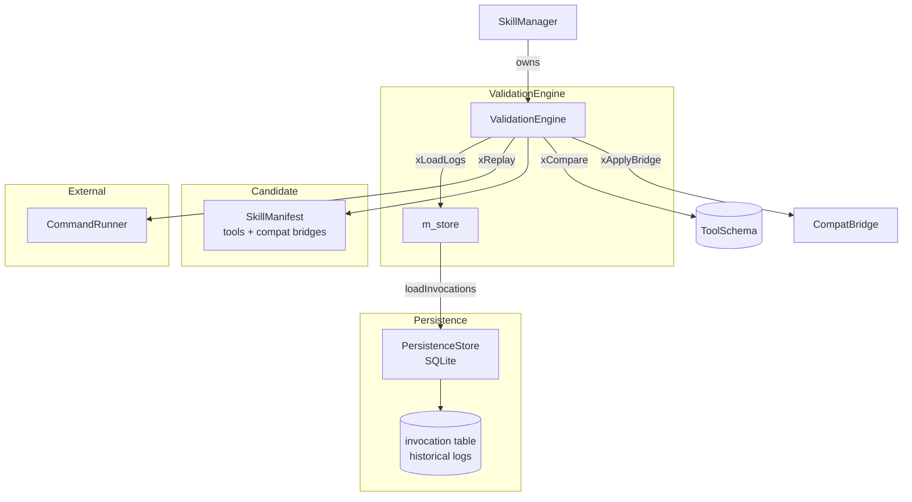
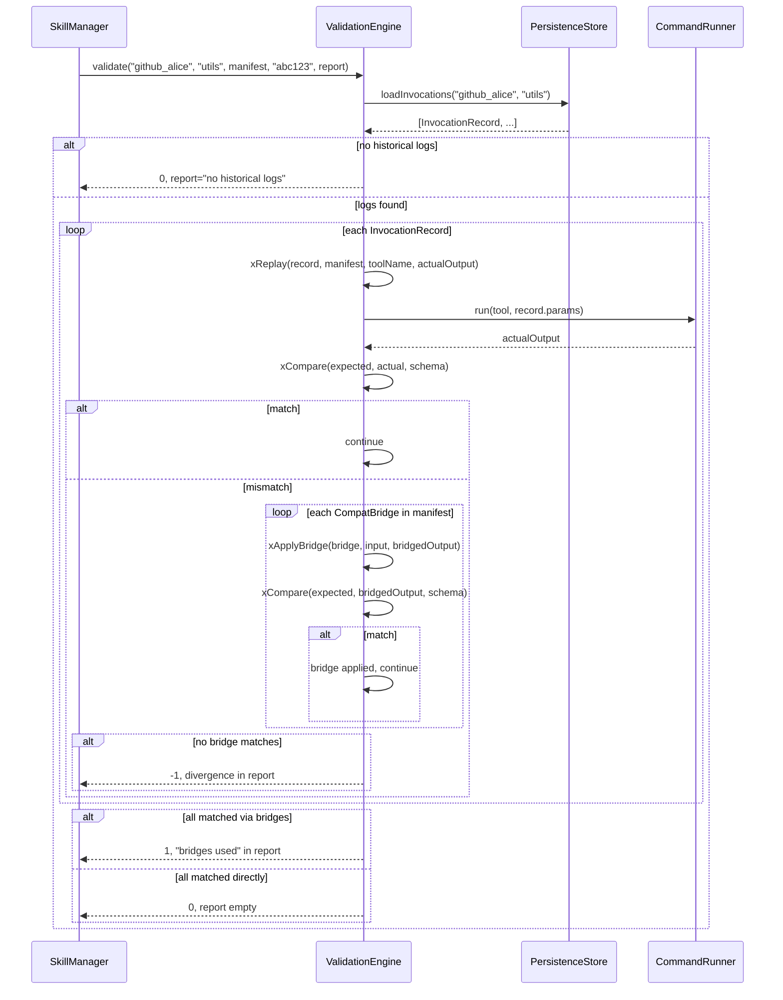

# ValidationEngine Spec

## §1 Overview

Replays historical tool invocations against a candidate version of a skill component. Uses `CommandRunner` to re-execute tools and compares outputs against stored results. Reports divergences for upgrade validation. Supports compatibility bridges: when a direct output comparison fails, each `CompatBridge` (from the candidate manifest) is tried to transform the historical output before re-comparing.

**Source files:** `src/skills/validation_engine.h`, `src/skills/validation_engine.cpp`

**Dependencies:** `PersistenceStore` (SQLite) for historical invocation log queries

**Lifecycle:** Construct (receives PersistenceStore*) → `validate(ns, component, manifest, commit, report)` → returns 0 (match), 1 (bridge matched), or -1 (divergence)

## §2 Component Specifications

```cpp
namespace a0::persistence { class PersistenceStore; }

namespace a0::skills {

/// Replays historical tool invocations against a candidate version.
/// Uses CommandRunner for all subprocess execution.
/// Invocation records are read from the persistence store (SQLite).
class ValidationEngine {
public:
    /// \param store  Persistence store (SQLite) for invocation history.
    explicit ValidationEngine(::a0::persistence::PersistenceStore* store);

    /// Validate a candidate version against historical logs.
    /// Loads invocation records from m_store->loadInvocations().
    /// For each record: xReplay → xCompare. On mismatch, tries each
    /// CompatBridge from the manifest via xApplyBridge.
    /// \param ns         Namespace of the component.
    /// \param component  Component name.
    /// \param manifest   Candidate manifest to validate.
    /// \param commit     Candidate commit hash (for logging).
    /// \param[out] report  Human-readable validation report with
    ///                     pass/fail details and bridges used.
    /// \retval 0  All invocations match directly (no bridges needed).
    /// \retval 1  All pass after applying compatibility bridges.
    /// \retval -1 One or more invocations diverge (details in report).
    int validate(SkillNamespace ns,
                 const std::string& component,
                 const SkillManifest& manifest,
                 const std::string& commit,
                 std::string& report);

private:
    ::a0::persistence::PersistenceStore* m_store;

    /// Re-execute a historical invocation via CommandRunner.
    /// \param record       The historical invocation record.
    /// \param manifest     Candidate manifest (for tool lookup).
    /// \param toolName     Name of the tool to replay.
    /// \param[out] actualOutput  Output from re-execution.
    /// \retval 0  Replay succeeded.
    int xReplay(const InvocationRecord& record,
                const SkillManifest& manifest,
                const std::string& toolName,
                nlohmann::json& actualOutput);

    /// Compare expected vs actual output against a tool schema.
    /// \param expected  Historical (stored) output.
    /// \param actual    Output from xReplay.
    /// \param schema    ToolSchema for comparison rules.
    /// \retval 0  Outputs match.
    /// \retval -1 Outputs diverge.
    int xCompare(const nlohmann::json& expected,
                 const nlohmann::json& actual,
                 const ToolSchema& schema);

    /// Run a compatibility bridge command to transform output format.
    /// \param bridge  CompatBridge definition (bridgeCommand).
    /// \param input   Historical input to transform.
    /// \param[out] output  Bridge-transformed output.
    /// \retval 0  Bridge succeeded.
    int xApplyBridge(const CompatBridge& bridge,
                     const nlohmann::json& input,
                     nlohmann::json& output);

    /// Load invocation logs from persistence store.
    /// Queries m_store->loadInvocations(type, component).
    /// \param ns         Namespace string.
    /// \param component  Component name.
    /// \returns          Vector of InvocationRecord structs.
    std::vector<InvocationRecord> xLoadLogs(const std::string& ns,
                                             const std::string& component) const;
};

} // namespace a0::skills
```

## §3 Architecture Diagram



## §4 Data Flow



## §5 Testing Requirements

| Method | Test Case | Expected |
|--------|-----------|----------|
| `validate` | All invocations match historical output | 0, report empty |
| `validate` | One invocation diverges, compat bridge exists | 1, bridgesUsed > 0 |
| `validate` | One invocation diverges, no bridge | -1, details in report |
| `validate` | Unknown component (no logs) | 0, report="no historical logs" |
| `validate` | Tool with no schema defined | 0 (skip comparison) |
| `validate` | Tool with schema-defined output | Compared against schema |
| `validate` | 1000+ historical logs | Completes within timeout |
| `xReplay` | Command tool record | Re-executes via CommandRunner |
| `xCompare` | Identical outputs | 0 |
| `xCompare` | Different outputs | -1 |
| `xApplyBridge` | Bridge transforms successfully | 0, bridged output |
| `xApplyBridge` | Bridge command fails | -1 |
| `xLoadLogs` | Component with history | Records returned |
| `xLoadLogs` | Component without history | Empty vector |

## §6 (skipped)

## §7 CLI Entry Point

ValidationEngine is an internal component not directly exposed via CLI. It is invoked through `SkillManager`:

```
a0 skill validate <qualified-name> <commit>
    → SkillManager::validate() → ValidationEngine::validate()

a0 skill install <url> [--force]
    → SkillManager::install() → ValidationEngine::validate()  (unless --force)
```

The validate return values propagate to the CLI:
- Return 0 → "Validation passed"
- Return 1 → "Validation passed with compat bridges"
- Return -1 → "Validation failed — report:\n<report>"
