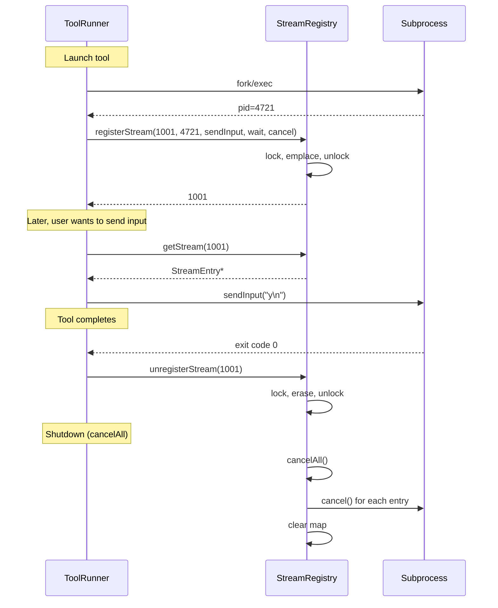

# StreamRegistry Spec

## 1. Overview

A thread-safe registry that tracks all active streaming subprocesses (tool invocations, terminal sessions). Each stream is identified by a caller-assigned `int64_t` stream ID and stores callbacks for sending input, waiting for completion, and cancelling the stream. Used by `AgentCore`, `ToolRunner`, and `SkillRunner` to manage concurrent subprocesses and perform orderly cancellation on shutdown.

**Source files:** `src/stream_registry.h/.cpp`

**Dependencies:** `mutex`, `unordered_map`, `functional`, `command_runner.h`

## 2. Component Specifications

```cpp
namespace a0 {

class StreamRegistry {
public:
    /// Register a stream. Returns the streamId that was assigned.
    int64_t registerStream(
        int64_t streamId,
        int pid,
        std::function<void(const std::string&)> sendInput,
        std::function<int()> wait,
        std::function<void()> cancel);

    /// Remove a stream from tracking (after it ends or errors).
    void unregisterStream(int64_t streamId);

    /// Get a stream handle for sending input.
    /// Returns nullptr if streamId is not tracked.
    struct StreamEntry {
        int64_t streamId;
        int pid;
        std::function<void(const std::string&)> sendInput;
        std::function<int()> wait;
        std::function<void()> cancel;
    };

    StreamEntry* getStream(int64_t streamId);

    /// List all active stream IDs.
    std::vector<int64_t> listActiveStreams() const;

    /// Cancel all active streams (e.g., on agent shutdown).
    void cancelAll();

private:
    mutable std::mutex m_mutex;
    std::unordered_map<int64_t, StreamEntry> m_streams;
};

} // namespace a0
```

### Thread-safety

All public methods acquire `m_mutex` via `std::lock_guard`. The mutex is declared `mutable` so `listActiveStreams()` can be `const`.

## 3. Architecture Diagram

```mermaid
graph TB
    subgraph Registry
        SR[StreamRegistry]
        MAP[unordered_map int64_t → StreamEntry]
        MTX[mutex]
    end

    subgraph entries
        E1[StreamEntry 1<br/>pid, sendInput, wait, cancel]
        E2[StreamEntry 2<br/>pid, sendInput, wait, cancel]
        E3[StreamEntry N...]
    end

    subgraph Users
        AC[AgentCore]
        TR[ToolRunner]
        SK[SkillRunner]
    end

    AC -->|registerStream| SR
    TR -->|registerStream| SR
    SK -->|registerStream| SR
    SR --> MTX
    MTX --> MAP
    MAP --> E1
    MAP --> E2
    MAP --> E3

    AC -->|cancelAll| SR
    SR -->|invoke cancel()| E1
    SR -->|invoke cancel()| E2
    SR -->|clear| MAP
```

## 4. Data Flow



## 5. Testing Requirements

| Test | Verification |
|------|-------------|
| Register a stream | Entry exists, `getStream` returns non-null |
| Unregister a stream | Entry removed, `getStream` returns null |
| `getStream` unknown ID | Returns `nullptr` |
| `listActiveStreams` | Returns all registered IDs |
| `cancelAll` invokes all cancels | Each `cancel()` called once, map cleared |
| Thread safety | Concurrent register/unregister does not corrupt map |
| Register duplicate ID | Overwrites previous entry |
