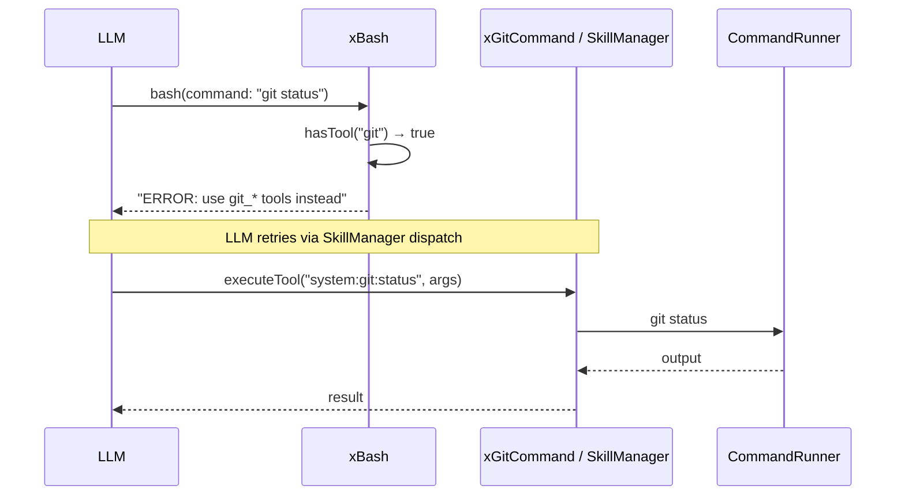

# System Handlers Spec

## 1. Overview

Free-standing C++ functions that implement all built-in system tools. Previously static methods on `SystemToolRegistry`, now stand-alone functions in the `a0` namespace. Each accepts `const json& params` and returns `HandlerResult`. Handlers are registered onto `SkillManager` at startup via `SkillManager::registerHandler()`.

**Source files:** `src/system_handlers.h`, `src/system_handlers.cpp`

**Registration:** All handlers are registered in `main.cpp` via `xRegisterSystemHandlers()`, which calls `SkillManager::registerHandler(qn, lambda)` for each handler.

**Wildcard dispatch:** Git and Docker handlers use wildcard keys (`system:git:*`, `system:docker:*`). `SkillManager::executeToolWithMeta()` sets `params["_subcommand"]` to the tool name after the last colon.

## 2. Component Specifications

```cpp
namespace a0 {

// Core filesystem + execution handlers
HandlerResult xBash(const json& params);
HandlerResult xRead(const json& params);
HandlerResult xGlob(const json& params);
HandlerResult xGrep(const json& params);
HandlerResult xEdit(const json& params);
HandlerResult xWrite(const json& params);

// Git / Docker handlers
HandlerResult xGitCommand(const std::string& subcommand, const json& params);
HandlerResult xDockerCommand(const std::string& subcommand, const json& params,
                             DockerSecurityFilter* filter = nullptr);
HandlerResult xDockerComposeCommand(const std::string& subcommand, const json& params);
bool isDockerCommand(const std::string& command);

// Meta handlers (require SkillManager + InferenceProvider)
HandlerResult xShowSkills(const json& params, skills::SkillManager* skillMgr);
HandlerResult xShowSkillTools(const json& params, skills::SkillManager* skillMgr);
HandlerResult xToolsForPrompt(const json& params,
                              skills::SkillManager* skillMgr,
                              InferenceProvider* provider);

} // namespace a0
```

## 3. Registration Pattern

Registration in `main.cpp` follows these conventions:

| Pattern | Key | Example |
|---------|-----|---------|
| Core tool (3-part) | `ns:comp:tool` | `system:fs:read` |
| Component-alias tool | `ns:comp` | `system:bash` (resolved via 2-part alias in executeToolWithMeta) |
| Git/docker wildcard | `ns:comp:*` | `system:git:*` (subcommand extracted from `_subcommand` param) |
| Meta tool | `ns:comp:tool` | `system:meta:tools_for_prompt` (captures SkillManager + InferenceProvider) |

## 4. Handler Details

### Core Handlers

| Handler | Input key | Description |
|---------|-----------|-------------|
| `xBash` | `command`, `description`, `[timeout]`, `[workdir]` | Executes shell command. Rejects git and docker commands with error. |
| `xRead` | `file_path`, `[offset]`, `[limit]` | Reads file with line numbers or lists directory entries. Detects binary files. |
| `xGlob` | `pattern`, `[path]` | Recursive file pattern matching. Excludes node_modules, .git, etc. |
| `xGrep` | `pattern`, `[path]`, `[include]` | Regex content search. Excludes binary and large files. |
| `xEdit` | `file_path`, `old_string`, `new_string`, `[replace_all]` | Exact string replacement. Errors on not-found or multiple matches (unless replaceAll). |
| `xWrite` | `file_path`, `content` | Creates parent directories, writes file. |

### Git/Docker Handlers

| Handler | Dispatch | Description |
|---------|----------|-------------|
| `xGitCommand` | `system:git:*` via `_subcommand` | Builds `git <subcommand> --flag=value` from params, runs via CommandRunner. |
| `xDockerCommand` | `system:docker:*` via `_subcommand` | Same pattern, but checks DockerSecurityFilter for destructive commands. |
| `xDockerComposeCommand` | `system:docker_compose:*` via `_subcommand` | Same pattern for `docker compose <subcommand>`. |

### Meta Handlers

| Handler | Dependencies | Description |
|---------|-------------|-------------|
| `xShowSkills` | `SkillManager*` | Navigates skill tree by path, lists prompts. |
| `xShowSkillTools` | `SkillManager*` | Lists tools from manifests by component. |
| `xToolsForPrompt` | `SkillManager*`, `InferenceProvider*` | Builds inventory of all tools/skills, sends to LLM for analysis, validates returned JSON schemas against actual schemas, populates recommendedTools. |

## 5. Bash Git/Docker Rejection



## 6. Testing Requirements

| Handler | Test | Input | Expected |
|---------|------|-------|----------|
| `xBash` | Missing command | `{}` | `"ERROR: missing required..."` |
| `xBash` | Echo command | `{"command":"echo hi"}` | `"hi\n"` |
| `xBash` | Git rejection | `{"command":"git status"}` | `"ERROR: git commands must use..."` |
| `xRead` | Missing file_path | `{}` | `"ERROR: missing required..."` |
| `xRead` | File not found | `{"filePath":"/no/such"}` | `"ERROR: file not found"` |
| `xEdit` | Single replace | Valid file + old/new | `"Edit applied successfully"` |
| `xWrite` | New file | Valid path + content | `"Wrote file successfully"` |
| `xGlob` | Glob pattern | Pattern + path | Matching files listed |
| `xGrep` | Pattern match | Pattern + path | Matching lines |
| `xGitCommand` | Status | Subcommand=status | Git status output |
| `xDockerCommand` | Destructive blocked | Subcommand=kill + protected container | `"ERROR: container ... is system-managed"` |
| `xToolsForPrompt` | Valid analysis | Prompt + SkillManager + provider | `HandlerResult` with output + recommendedTools |
