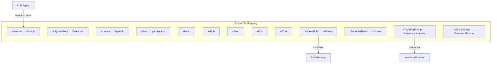
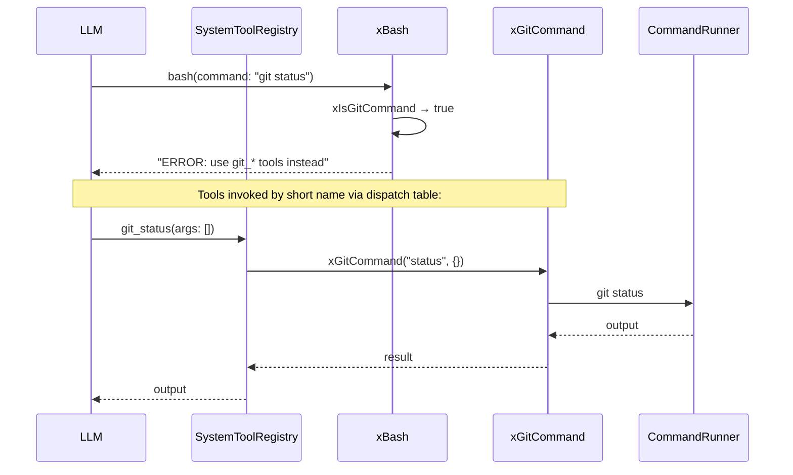

# SystemTools Spec

## 1. Overview

Registry of built-in system tools available to the LLM agent in every session. Maps tool names to handler functions.

**Source files:** `src/system_tools.h/.cpp`

**Default schema (9 tools, always present in main loop):**
- `bash` — Executes commands (REJECTS git commands with error)
- `read` — Read files/directories
- `glob` — File pattern matching
- `grep` — Content search
- `edit` — String replacements in files
- `write` — Write files
- `show_skills` — Browse the skill tree by path
- `show_skill_tools` — Browse the tool tree by path
- `tools_for_prompt` — Analyze user intent and recommend skills/tools

**Additional registered handlers (not in default schema):**
- 120+ `git_*` tools (git_commit, git_push, etc.) — dispatched via xGitCommand
- Only available inside skill template expansion ({{tool:git_...}}) or after discovery

## 2. Component Specifications

```cpp
namespace a0 {

struct GitParamDef {
    std::string name;
    std::string type;       // "string", "boolean", "number"
    std::string description;
    std::string defaultVal;
};

struct GitCommandDef {
    std::string subcommand;
    std::string description;
    std::string category;   // "porcelain", "ancillary", "interrogators", "plumbing"
    std::vector<GitParamDef> params;
};

class SystemToolRegistry {
public:
    SystemToolRegistry();

    SystemToolResult execute(const std::string& toolName, const json& params);
    static bool isSystemTool(const std::string& name);
    std::vector<std::string> listTools() const;
    std::vector<ToolSchema> schemas() const;
    ToolSchema getSchema(const std::string& name) const;

    void setInferenceProvider(InferenceProvider* provider);
    void setSkillManager(skills::SkillManager* mgr);

private:
    // Core handlers
    static SystemToolResult xBash(const json& params);
    static SystemToolResult xRead(const json& params);
    static SystemToolResult xGlob(const json& params);
    static SystemToolResult xGrep(const json& params);
    static SystemToolResult xEdit(const json& params);
    static SystemToolResult xWrite(const json& params);

    // Discovery handlers
    SystemToolResult xShowSkills(const json& params);
    SystemToolResult xShowSkillTools(const json& params);
    SystemToolResult xToolsForPrompt(const json& params);

    // Git dispatch
    static SystemToolResult xGitCommand(const std::string& subcommand, const json& params);
    static bool xIsGitCommand(const std::string& command);
    static const std::vector<GitCommandDef>& xGetGitCommands();
    json xBuildToolTree();

    InferenceProvider* m_inferenceProvider = nullptr;
    skills::SkillManager* m_skillManager = nullptr;
    std::unordered_map<std::string, Handler> m_handlers;
    std::vector<std::string> m_gitToolNames;
};

} // namespace a0
```

## 3. Architecture



## 4. Git Command Organization

All 120+ git commands from `git help --all` are registered as `git_*` tools:

| Category | Count | Examples |
|----------|-------|---------|
| Porcelain | 34 | commit, push, pull, rebase, branch, checkout, merge, status, log, diff, add, stash, tag, fetch, clone, init, reset, restore, switch, cherry-pick, clean, rm, mv, worktree, submodule, gc, show, describe, archive, bundle, format-patch, am, notes, shortlog, range-diff, sparse-checkout, bisect, maintenance |
| Ancillary | 10 | config, remote, reflog, mergetool, filter-branch, prune, repack, replace, fast-export, pack-refs |
| Interrogators | 17 | blame, annotate, grep, whatchanged, show-branch, help, version, fsck, difftool, verify-commit, verify-tag, bugreport, count-objects, diagnose, merge-tree, rerere, instaweb |
| Plumbing | 59 | cat-file, hash-object, ls-tree, rev-list, rev-parse, cherry, apply, commit-tree, read-tree, write-tree, update-index, update-ref, symbolic-ref, pack-objects, unpack-objects, daemon, fetch-pack, send-pack, http-backend, check-attr, check-ignore, check-mailmap, check-ref-format, credential, credential-cache, credential-store, hook, interpret-trailers, for-each-ref, for-each-repo, ls-files, ls-remote, merge-base, merge-file, merge-index, merge-one-file, mktag, mktree, multi-pack-index, name-rev, pack-redundant, patch-id, prune-packed, stripspace, verify-pack, show-ref, show-index, unpack-file, var, get-tar-commit-id, commit-graph, index-pack, column, diff-files, diff-index, diff-tree, mailinfo, mailsplit, fmt-merge-msg, update-server-info |

Porcelain commands have structured params. All others use `args: string[]` catch-all.

## 5. Data Flow (Git Restriction)



## 6. Testing Requirements

| Test | Verification |
|------|-------------|
| bash git rejection | `bash(command: "git status")` returns error with git_* recommendation |
| isSystemTool("git_commit") | Returns true |
| schemas() has 10 tools | Returns exactly 10 entries, no git_* tools |
| git tool dispatch | Returns git command output for valid path |
| show_skills("/") | Returns root skill tree |
| show_skill_tools("/git") | Returns git tool categories |
| xGitCommand basic | Executes git with subcommand + args |
