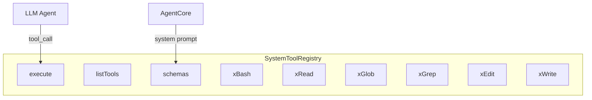

# SystemTools Spec

## 1. Overview

Registry of built-in system tools available to the LLM agent in every session. Maps tool names to handler functions that execute the underlying operation (bash, read, glob, grep, edit, write). Used for function calling — the LLM invokes these tools by name with JSON parameters.

**Source files:** `src/system_tools.h/.cpp`

**Dependencies:** nlohmann/json, POSIX

## 2. Component Specifications

```cpp
namespace a0 {

struct SystemToolResult {
    std::string output;
};

class SystemToolRegistry {
public:
    SystemToolRegistry();

    /// Execute a tool by name.
    SystemToolResult execute(const std::string& toolName, const json& params);

    /// Check if a tool name is a built-in system tool.
    static bool isSystemTool(const std::string& name);

    /// List all registered tool names.
    std::vector<std::string> listTools() const;

    /// Build ToolSchema array for LLM function calling.
    std::vector<ToolSchema> schemas() const;

private:
    using Handler = std::function<SystemToolResult(const json&)>;

    static SystemToolResult xBash(const json& params);
    static SystemToolResult xRead(const json& params);
    static SystemToolResult xGlob(const json& params);
    static SystemToolResult xGrep(const json& params);
    static SystemToolResult xEdit(const json& params);
    static SystemToolResult xWrite(const json& params);

    std::unordered_map<std::string, Handler> m_handlers;
};

} // namespace a0
```

## 3. Architecture



## 4. Testing Requirements

| Test | Verification |
|------|-------------|
| bash echo | Returns "hello\n" |
| read existing file | Returns file contents |
| glob pattern match | Returns matching paths |
| grep content search | Returns matching lines |
| isSystemTool("bash") | Returns true |
| execute unknown tool | Returns error result |
