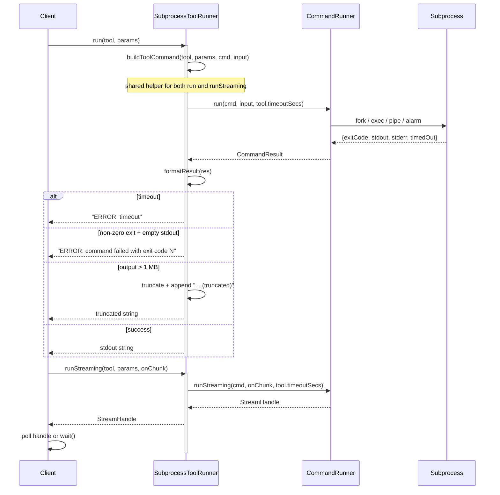

# SubprocessToolRunner Spec

## 1. Overview

SubprocessToolRunner implements ToolRunner by building command strings from the Tool definition and delegating execution to `CommandRunner`. It supports two input modes: `"args"` (flatten params to `--key=value` CLI flags) and `"stdin"` (pipe JSON or raw input on stdin). All subprocess management (fork, exec, pipe, alarm) is handled by CommandRunner.

**Dependencies:** `CommandRunner` (stateless utility, `a0::CommandRunner`)
**Lifecycle:** Stateless – a single instance handles all calls.

## 2. Component Specifications

```cpp
class SubprocessToolRunner : public ToolRunner {
public:
    /// \param tool    Tool specification (command, inputMode, schema).
    /// \param params  Parameters to pass to the subprocess.
    /// \returns       Stdout contents (string), or an error string prefixed with "ERROR: ".
    json run(const Tool& tool, const json& params) override;

    a0::StreamHandle runStreaming(const Tool& tool,
                                   const json& params,
                                   a0::StreamCallback onChunk) override;
};
```

**Internal helpers (file-static):**
```cpp
/// Build the shell command and extract stdin payload from tool params.
static void buildToolCommand(const Tool& tool, const json& params,
                             std::string& outCmd, std::string& outStdin);

/// Format a CommandResult into a JSON string (or "ERROR: ...").
static std::string formatResult(const CommandResult& res);
```

## 3. Architecture Diagram

```mermaid
graph TB
    subgraph Interfaces
        TR[ToolRunner]
    end
    subgraph ToolRunner
        STR[SubprocessToolRunner]
    end
    subgraph Utility
        CR[CommandRunner]
    end
    subgraph OS
        SH[/bin/sh -c]
    end
    STR --|> TR
    STR --> CR
    CR --> SH
```

## 4. Data Flow



## 5. Error Handling

| Scenario | Behaviour |
|----------|-----------|
| Subprocess non-zero exit + empty stdout | Returns `"ERROR: command failed with exit code <N>"` |
| Subprocess non-zero exit + non-empty stdout | Returns stdout content (partial success) |
| Timeout (30 s) | `CommandResult.timedOut` → returns `"ERROR: timeout"` |
| stdout exceeds 1 MB | Truncated with `"... (truncated)"` suffix |

## 6. Edge Cases

| Case | Expected Result |
|------|----------------|
| Empty params | `tool.inputMode == "args"` → command runs with no arguments; stdin mode → empty stdin |
| Params with special characters (apostrophe, backslash) | Single-quote escaping via `CommandRunner::shellEscape` |
| Params with Boolean/numeric values | Serialized to `"true"`/`"false"` or numeric string for `--key=value` |
| Command produces no output | Empty string returned |
| `params` is a JSON string | args mode: appended as positional argument; stdin mode: used directly as input |

## 7. Testing Requirements

| Method | Test Case | Input | Expected Output |
|--------|-----------|-------|----------------|
| `run` | args mode | Tool{command:`"echo"`, inputMode:`"args"`}, params `{"msg":"hello"}` | `"--msg=hello"` (or similar) |
| `run` | stdin mode | Tool{command:`"cat"`, inputMode:`"stdin"`}, params `"hello"` | `"hello"` |
| `run` | Timeout | Tool{command:`"sleep 60"`} | `"ERROR: timeout"` |
| `run` | Non-zero exit | Tool{command:`"false"`} | `"ERROR: command failed with exit code 1"` |
| `run` | Output truncation | Tool producing 2 MB output | Output truncated to 1 MB + `"... (truncated)"` |
| `run` | Failed command | Tool{command:`"nonexistent_cmd_xyz"`} | `"ERROR: command failed with exit code 127"` |
| `run` | Shell escape | Params with single quote `it's` | `'it'\''s'` in the command string |
| `run` | Non-object params (string) | Tool{inputMode:`"args"`}, params `"test"` | `sh -c "echo 'test'"` |
| `runStreaming` | Basic streaming | Tool{command:`"echo hello"`} | onChunk called with "hello\n", handle.isDone() true |
| `runStreaming` | Stdin via sendInput | Tool{command:`"cat"`} | onChunk receives input echoed back |
| `runStreaming` | Timeout | Tool{command:`"sleep 60"`} | handle.wait() returns, handle.isDone() true |
