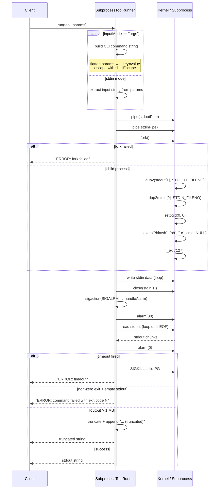

# SubprocessToolRunner Spec

## 1. Overview

SubprocessToolRunner implements ToolRunner by executing an external command via `fork()`/`exec()`. It supports two input modes: `"args"` (flatten params to `--key=value` CLI flags) and `"stdin"` (pipe JSON or raw input on stdin). A 30-second `alarm()`-based timeout kills the process group with `SIGKILL`. Output is capped at 1 MB.

**Dependencies:** POSIX process APIs (`fork`, `exec`, `pipe`, `dup2`, `waitpid`, `sigaction`), `/bin/sh`.
**Lifecycle:** Stateless – a single instance handles all calls.

## 2. Component Specifications

```cpp
class SubprocessToolRunner : public ToolRunner {
public:
    /// \param tool    Tool specification (command, inputMode, dockerImage – dockerImage unused here).
    /// \param params  Parameters to pass to the subprocess.
    /// \returns       Stdout contents (string), or an error string prefixed with "ERROR: ".
    json run(const Tool& tool, const json& params) override;
};
```

**Internal helpers (file-static):**

```cpp
/// Signal handler for SIGALRM. Sets a global flag and kills the child process group.
extern "C" void handleAlarm(int);

/// Single-quote shell escape. Embedded single quotes become "'\\''".
/// \param s  Raw string to escape.
/// \returns  Shell-safe single-quoted string.
static std::string shellEscape(const std::string& s);

/// Fork/exec wrapper with stdin piping, alarm timeout, and 1 MB output cap.
/// \param cmd       Shell command string passed to `sh -c`.
/// \param stdinData Data to write to child's stdin (empty = no pipe).
/// \returns         Captured stdout or "ERROR: ..." on failure/timeout.
static std::string exec(const std::string& cmd, const std::string& stdinData);
```

## 3. Architecture Diagram

```mermaid
graph TB
    subgraph Interfaces
        TR[ToolRunner]
    end
    subgraph Implementation
        STR[SubprocessToolRunner]
    end
    subgraph OS
        PROC[Subprocess<br/>/bin/sh -c ...]
    end
    STR --|> TR
    STR -- fork/exec --> PROC
    PROC -- stdout pipe --> STR
    STR -- stdin pipe --> PROC
    ALRM[alarm 30s] -.-> STR
    STR -- SIGKILL --> PROC
```

## 4. Data Flow



## 5. Error Handling

| Scenario | Behaviour |
|----------|-----------|
| `pipe()` failure | Returns `"ERROR: pipe failed"` |
| `fork()` failure | Returns `"ERROR: fork failed"` |
| `exec()` failure (command not found) | Child `_exit(127)`; parent sees exit code 127 + empty stdout → `"ERROR: command failed with exit code 127"` |
| Non-zero exit + empty stdout | Returns `"ERROR: command failed with exit code <N>"` |
| Non-zero exit + non-empty stdout | Returns stdout content (partial success) |
| Timeout (30 s) | `SIGKILL` sent to process group; returns `"ERROR: timeout"` |
| stdout exceeds 1 MB | Truncated with `"... (truncated)"` suffix |

## 6. Edge Cases

| Case | Expected Result |
|------|----------------|
| Empty params | `tool.inputMode == "args"` → command runs with no arguments; stdin mode → empty stdin |
| Params with special characters (apostrophe, backslash) | Single-quote escaping via `shellEscape` |
| Params with Boolean/numeric values | Serialized to `"true"`/`"false"` or numeric string for `--key=value` |
| Large stdin (>64 KB) | Written in loop (handles partial `write()` return) |
| Command produces no output | Empty string returned |
| `params` is a JSON string | args mode: appended as positional argument; stdin mode: used directly as input |
| Signal during read loop (EINTR) | `read()` may return -1; current implementation does not retry on EINTR |
| Stdin pipe not consumed by child | `write()` blocks; alarm fires after 30s, child killed |

## 7. Testing Requirements

| Method | Test Case | Input | Expected Output |
|--------|-----------|-------|----------------|
| `run` | args mode | Tool{command:`"echo"`, inputMode:`"args"`}, params `{"msg":"hello"}` | `"--msg=hello"` (or similar) |
| `run` | stdin mode | Tool{command:`"cat"`, inputMode:`"stdin"`}, params `"hello"` | `"hello"` |
| `run` | Timeout | Tool{command:`"sleep 60"`} | `"ERROR: timeout"` |
| `run` | Non-zero exit | Tool{command:`"false"`} | `"ERROR: command failed with exit code 1"` |
| `run` | Output truncation | Tool producing 2 MB output | Output truncated to 1 MB + `"... (truncated)"` |
| `run` | Failed command | Tool{command:`"nonexistent_cmd_xyz"`} | `"ERROR: command failed with exit code 127"` |
| `run` | Shell escape | Params with single quote `it's` | `'it'\''s'` in the command string |
| `run` | Non-object params (string) | Tool{inputMode:`"args"`}, params `"test"` | `sh -c "echo 'test'"` |
| `shellEscape` | No special chars | `"hello"` | `"'hello'"` |
| `shellEscape` | With single quote | `"it's"` | `"'it'\\''s'"` |
| `shellEscape` | Empty string | `""` | `"''"` |
