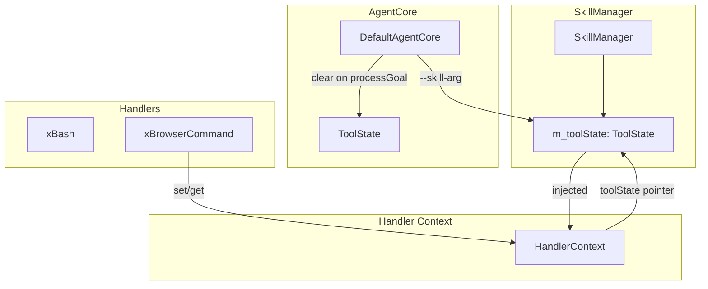

# ToolState Spec

## 1. Overview

Per-session key-value state bag for tools that need to share state across invocations (e.g., a browser page handle, database connection cursor). Thread-safe via internal mutex. Used by `SkillManager` and injected into system tool handlers via `HandlerContext`.

**Source files:** `src/tool_state.h/.cpp`

**Dependencies:** nlohmann/json, C++ standard library

## 2. Component Specifications

```cpp
#include <mutex>
#include <string>
#include <unordered_map>
#include "nlohmann/json.hpp"

using json = nlohmann::json;

/// Per-session key-value state bag. Thread-safe.
class ToolState {
public:
    /// Store a value. Overwrites any existing value for the key.
    void set(const std::string& key, const json& value);

    /// Retrieve a value. Returns null if key does not exist.
    json get(const std::string& key) const;

    /// Check if a key exists.
    bool has(const std::string& key) const;

    /// Remove a key. No-op if key does not exist.
    void remove(const std::string& key);

    /// Clear all state. Called at the start of each processGoal().
    void clear();

private:
    mutable std::mutex m_mutex;
    std::unordered_map<std::string, json> m_state;
};
```

## 3. Key Convention

| Key pattern | Set by | Example |
|-------------|--------|---------|
| `args:<skill>-<arg>` | AgentCore init (from `--skill-arg` CLI) | `args:playwright-headless=true` |
| `<handler>:<state>` | System tool handlers | `browser:pageHandle` |

Keys prefixed with `args:` are set once at startup from `--skill-arg` CLI flags. All other keys are managed at runtime by tool handlers.

## 4. Architecture



## 5. Thread Safety

All public methods acquire `m_mutex` (via `std::lock_guard`). The `get` and `has` methods are const and use a mutable mutex. The state bag is not designed for high-contention scenarios — contention is expected to be negligible in practice.

## 6. Testing Requirements

| Method | Test Case | Expected |
|--------|-----------|----------|
| `set` | New key | Value stored, `has` returns true |
| `set` | Overwrite existing | New value replaces old |
| `get` | Existing key | Returns stored value |
| `get` | Missing key | Returns json() (null) |
| `has` | Existing key | true |
| `has` | Missing key | false |
| `remove` | Existing key | Key removed, `has` returns false |
| `remove` | Missing key | No-op |
| `clear` | Multiple keys | All keys removed |
| Thread safety | Concurrent set/get | No data races (validated under TSAN) |
