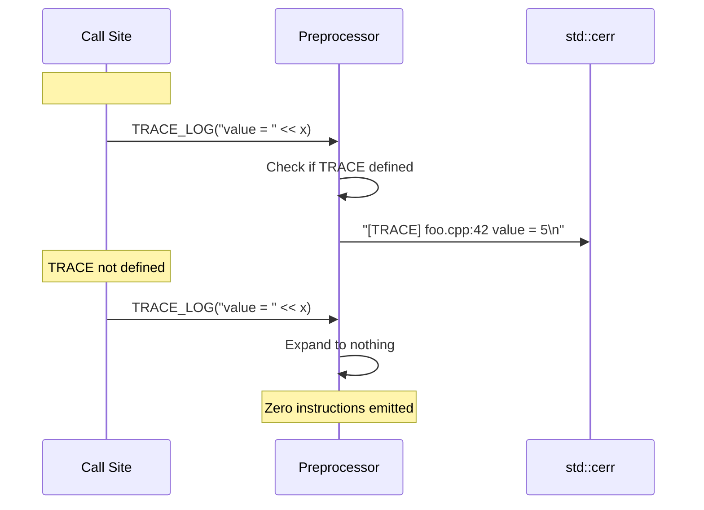

# Trace Spec

## 1. Overview
Compile-time diagnostic logging macro. When `TRACE` is defined, `TRACE_LOG(msg)` writes `[TRACE] file:line msg` to `std::cerr`. When `TRACE` is undefined, the macro expands to nothing — zero runtime overhead.

## 2. Component Specifications

```cpp
#pragma once
#include <iostream>

#ifdef TRACE
/**
 * @param msg Expression to stream via operator<<
 * Logs: [TRACE] <__FILE__>:<__LINE__> <msg>
 * No-op when TRACE is not defined at compile time
 */
#define TRACE_LOG(msg) \
    std::cerr << "[TRACE] " << __FILE__ << ":" << __LINE__ << " " << msg << std::endl
#else
#define TRACE_LOG(msg)
#endif
```

## 3. Architecture Diagram

```mermaid
graph TB
    subgraph Translation_Unit
        TU[Source File]
        MACRO[TRACE_LOG(msg) invocation]
    end

    subgraph Preprocessor
        DEF{TRACE defined?}
        EXPAND[Expand to cerr << ...]
        REMOVE[Expand to nothing]
    end

    subgraph Output
        STDOUT[std::cout]
        STDERR[std::cerr]
    end

    TU --> MACRO
    MACRO --> DEF
    DEF -->|Yes| EXPAND
    DEF -->|No| REMOVE
    EXPAND --> STDERR
```

## 4. Data Flow



## 5. Error Handling

| Error Condition | Signal | Notes |
|---|---|---|
| `msg` expression throws | Exception propagates | Macro does not catch |
| `std::cerr` unavailable | No output | Silently fails (stream badbit) |

## 6. Edge Cases

| Edge Case | Behavior |
|---|---|
| `TRACE` not defined | Zero codegen, zero overhead |
| `msg` contains commas | Parenthesized by macro, OK |
| `msg` is a stream manipulator | Passed through to `operator<<` |
| `msg` has side effects | Executed only when `TRACE` is defined |
| Multiple translation units | Each unit independently controlled by its own `#define TRACE` |

## 7. Integration

### CMake ENABLE_TRACE

```cmake
option(ENABLE_TRACE "Enable trace logging" OFF)
if(ENABLE_TRACE)
    target_compile_definitions(a0_lib PRIVATE TRACE)
    target_compile_definitions(b1_lib PRIVATE TRACE)
    target_compile_definitions(c2_lib PRIVATE TRACE)
endif()
```

Set `-DENABLE_TRACE=ON` at configure time to enable `TRACE_LOG` across all three daemons. Each daemon additionally supports `--log-file <path>` to redirect stderr (including TRACE output) to a persistent file.

### Log File Propagation

When daemons are launched with `--log-file`, child daemons derive their own path from the parent's:

| Parent | Child | Path derivation |
|--------|-------|----------------|
| `c2 --log-file /tmp/c2.log` | a0 terminal | `/tmp/c2-a0.log` |
| a0 with `--log-file /tmp/a0.log` | b1 | `/tmp/a0-b1.log` |

## 8. Testing Requirements

| Scenario | Test |
|---|---|
| `TRACE` defined, simple string | Verify output to stderr contains `[TRACE]`, file, line, and message |
| `TRACE` defined, multiple args | Verify streaming works with `operator<<` |
| `TRACE` undefined | Verify no output and no codegen (compile-time check) |
| Side effects in msg | Verify side effects absent when `TRACE` not defined |
| Large msg | Verify no truncation |
