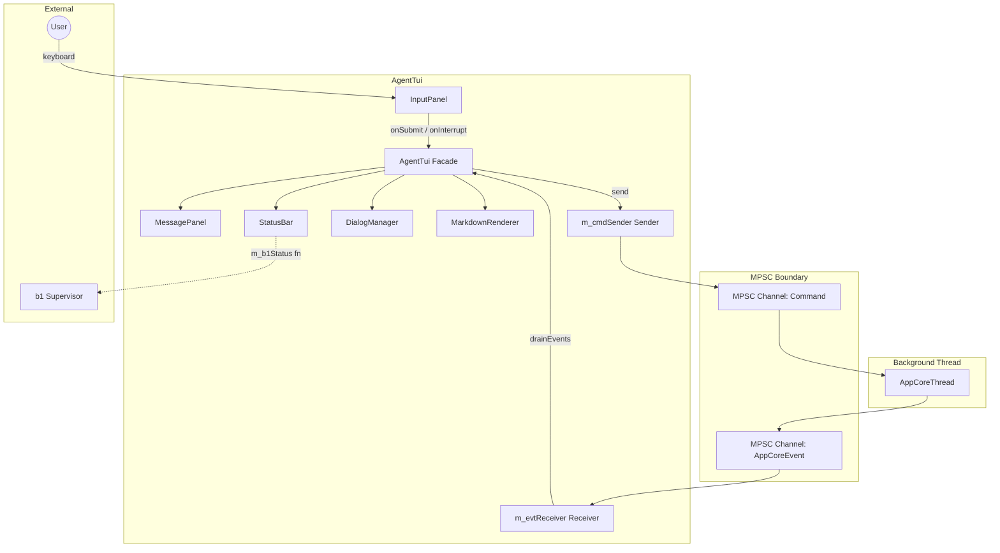
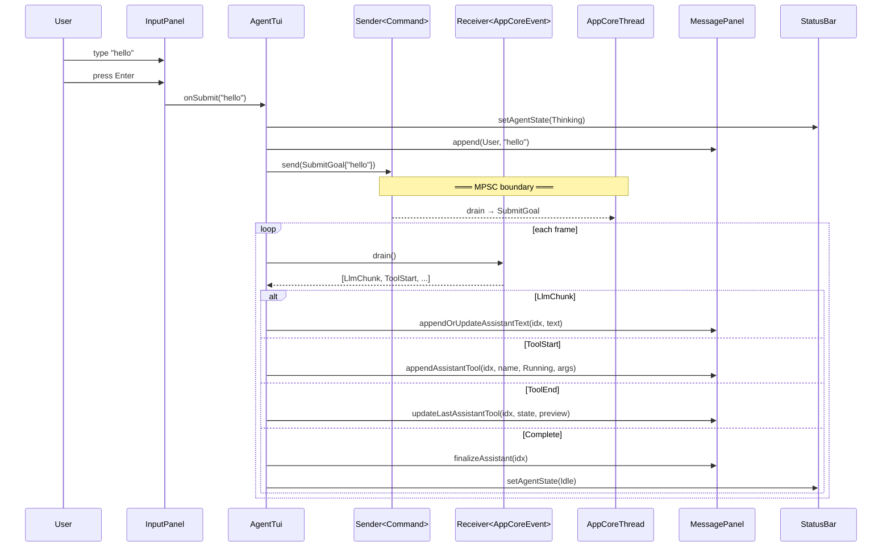

# AgentTui Spec

## §1. Overview

**Role:** Main TUI orchestrator. Owns the FTXUI screen, event loop, and all sub-panels. Communicates with the background `AppCoreThread` exclusively via MPSC channels. Sends `Command` variants (SubmitGoal, Cancel, Shutdown, SetSession, ListSessions, ResumeSession, LoadResource) and receives `AppCoreEvent` variants (LlmStart, LlmChunk, LlmComplete, ToolStart, ToolChunk, ToolEnd, Complete, Error, SessionReady, SessionList, SessionHistory, LoadResourceResult).

**Source files:** `src/tui/agent_tui.h`, `src/tui/agent_tui.cpp`

**Dependencies:** `ftxui/component/component.hpp`, `ftxui/component/screen_interactive.hpp`, `ftxui/component/loop.hpp`, `src/shared/mpsc.h`, `src/shared/trace.h`

**Lifecycle:**
1. Constructed with MPSC sender/receiver pair, optional b1 status function, and test mode flag
2. `setScreen()` / `run()` — FTXUI event loop drains MPSC events each frame via `drainEvents()` then `loop.RunOnce()` (processed before render, not after)
3. On `xOnLlmComplete`: calls `appendOrUpdateAssistantText` only when `m_streamingText` is non-empty, preventing phantom children from tool_calls-only responses
4. On `xOnToolStart`: calls `finalizeAssistant` before `appendAssistantTool` to mark the current turn's streaming text as complete before the tool separator
5. `shutdown()` — exits FTXUI screen
6. Destruction cleans up sub-panels and MPSC handles

## §2. Component Specifications

```cpp
namespace a0::tui {

class AgentTui {
public:
    AgentTui(mpsc::Sender<mpsc::Command> cmdSender,
             mpsc::Receiver<mpsc::AppCoreEvent> evtReceiver,
             std::function<bool()> b1Status = nullptr,
             bool testMode = false);

    virtual ~AgentTui();

    int run();
    void shutdown();

    ftxui::Component component() const { return m_mainComponent; }

    void setScreen(ftxui::ScreenInteractive* screen);
    void clearScreen();
    ftxui::ScreenInteractive* screenPtr() const { return m_screen; }

    void submitInput(const std::string& input);
    void drainEvents();

    mpsc::Sender<mpsc::Command>& cmdSender() { return m_cmdSender; }

private:
    // --- MPSC channels ---
    mpsc::Sender<mpsc::Command> m_cmdSender;
    mpsc::Receiver<mpsc::AppCoreEvent> m_evtReceiver;
    std::function<bool()> m_b1Status;

    // --- Sub-panels ---
    std::unique_ptr<MessagePanel> m_messagePanel;
    std::unique_ptr<InputPanel> m_inputPanel;
    std::unique_ptr<StatusBar> m_statusBar;
    std::unique_ptr<DialogManager> m_dialogMgr;
    std::unique_ptr<MarkdownRenderer> m_markdown;

    // --- Session state ---
    std::string m_sessionUuid;
    int64_t m_sessionDbId = 0;
    AgentState m_agentState = AgentState::Idle;

    // --- FTXUI ---
    ftxui::ScreenInteractive* m_screen = nullptr;
    ftxui::Component m_mainComponent;

    // --- Mouse ---
    bool m_mouseDown = false;
    bool m_mouseMoved = false;

    // --- Bracketed paste ---
    bool m_pasteActive = false;
    std::string m_pasteBuffer;
    int m_pasteCounter = 0;
    std::unordered_map<int, std::string> m_pastedContents;

    // --- Test mode ---
    bool m_testMode = false;

    // --- Streaming state ---
    std::string m_streamingText;
    int m_assistantEntryIndex = -1;
    int64_t m_currentStreamId = 0;
    int m_currentRoundSeq = 0;
    bool m_hasActiveStream = false;

    // --- Resource cache ---
    struct ResourceCacheEntry {
        std::string data;
        int64_t timestamp;
        size_t size;
    };
    std::unordered_map<int64_t, ResourceCacheEntry> m_resourceCache;
    int64_t m_resourceCacheMaxBytes = 64 * 1024 * 1024;
    int64_t m_resourceCacheBytes = 0;

    struct PendingResourceReq {
        std::function<void(std::string)> callback;
    };
    std::unordered_map<int64_t, std::vector<PendingResourceReq>> m_pendingResourceReqs;

    // --- Private methods ---
    std::string xExpandPastePlaceholders(const std::string& input);
    void xProcessPasteBuffer();

    void xBuildLayout();
    ftxui::Component xBuildMainContainer();

    void xHandleCoreEvent(const ::a0::mpsc::AppCoreEvent& ev);

    int xHandleSubmit(const std::string& input);
    int xHandleInterrupt();
    int xHandleCommand(const std::string& cmd);

    void xOnLlmStart(int64_t streamId, int roundSeq);
    void xOnLlmChunk(int64_t streamId, int seq, const std::string& text, bool isFinal);
    void xOnLlmComplete(int64_t streamId, const std::string& finishReason);
    void xOnToolStart(int64_t invocationId, const std::string& toolCallId,
                      const std::string& toolName, const std::string& arguments);
    void xOnToolChunk(int64_t invocationId, int seq, const std::string& text,
                      const std::string& streamType);
    void xOnToolEnd(int64_t invocationId, int exitCode, int64_t totalBytes,
                    const std::string& outputPreview);
    void xOnComplete(int64_t sessionId, const std::string& summary);
    void xOnError(const std::string& source, int64_t contextId, const std::string& message);
    void xOnSessionReady(int64_t dbId, const std::string& uuid);
    void xOnSessionList(const std::vector<mpsc::SessionList::Entry>& sessions);
    void xOnSessionHistory(int64_t dbId, const std::string& uuid,
                           const std::vector<mpsc::SessionMessage>& messages);
    void xOnLoadResourceResult(int64_t id, const std::string& data);

    void xEvictResourceCache();
    void xRequestResource(int64_t id, int64_t offset, int64_t limit,
                          std::function<void(std::string)> onData);

    int xCmdSessions();
    int xCmdHelp();
    int xCmdClear();
    int xCmdQuit();
};

} // namespace a0::tui
```

## §3. Architecture Diagram



## §4. Data Flow



## §5. Testing Requirements

| Method | Test Case | Verification |
|--------|-----------|-------------|
| `AgentTui(cmdSender, evtRcvr, b1, test)` | Construct with valid channels | No crash, component() returns non-null |
| `run()` | Test mode with FixedSize screen | Returns 0, no exception |
| `shutdown()` | Call during run | screen->Exit() called |
| `submitInput("hello")` | SubmitGoal sent | cmdSender queue contains SubmitGoal{"hello"} |
| `drainEvents()` | LlmChunk in channel | Text appended via appendOrUpdateAssistantText |
| `drainEvents()` | ToolStart in channel | appendAssistantTool called |
| `drainEvents()` | ToolEnd in channel | updateLastAssistantTool called |
| `drainEvents()` | Complete in channel | finalizeAssistant + setAgentState(Idle) |
| `drainEvents()` | Error in channel | Error entry appended, state = Error |
| `drainEvents()` | SessionReady in channel | setSessionId called on status bar |
| `drainEvents()` | SessionList in channel | showList dialog displayed |
| `drainEvents()` | SessionHistory in channel | clear + loadHistory called |
| `xHandleCommand("/quit")` | Quit command | Shutdown sent via MPSC |
| `xHandleInterrupt()` | Ctrl+C during stream | Cancel sent, state = Idle |

## §6. (skip)

## §7. CLI Entry Point

Wired in `src/main.cpp` as the `a0 tui` subcommand. Creates MPSC channels, starts `AppCoreThread` on background thread, constructs `AgentTui` with the sender/receiver pair, sends initial `SetSession` (and optionally `ResumeSession`), then calls `tui.run()`.
