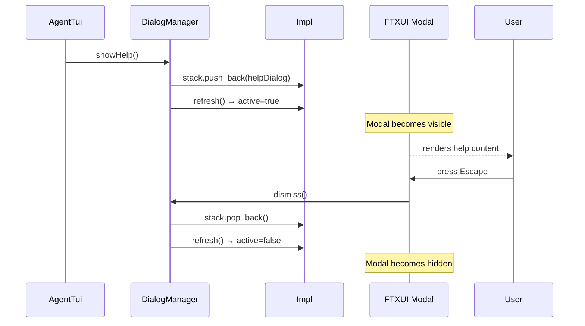

# DialogManager Spec

## §1. Overview

**Role:** Stack-based modal dialog system using FTXUI's `Modal` component. Supports arbitrary dialog content, a help dialog, a confirm dialog, and a selectable list dialog. Dialogs are stacked; `dismiss()` pops the topmost, `dismissAll()` clears the stack.

**Source files:** `src/tui/dialog_manager.h`, `src/tui/dialog_manager.cpp`

**Dependencies:** `ftxui/component/component.hpp`, `ftxui/dom/elements.hpp`

**Lifecycle:**
1. Constructed — creates empty dialog renderer and main container
2. `setMainComponent()` — wraps the real application content with `ftxui::Modal`
3. `show()` — pushes dialog onto stack, sets `active = true`
4. `dismiss()` / `dismissAll()` — pops dialog(s), sets `active` based on stack emptiness
5. Destruction — unique_ptr cleans up Impl

## §2. Component Specifications

```cpp
namespace a0::tui {

class DialogManager {
public:
    DialogManager();
    virtual ~DialogManager();

    ftxui::Component component() const;

    void setMainComponent(ftxui::Component main);

    int show(ftxui::Component dialog, const std::string& title,
             std::function<void()> onDismiss = nullptr);

    void dismiss();
    void dismissAll();

    bool isActive() const;

    int showHelp();
    int showConfirm(const std::string& title,
                    const std::string& message,
                    std::function<void(bool)> onConfirm);

    int showList(const std::string& title,
                 const std::vector<std::pair<std::string, std::string>>& items,
                 std::function<void(const std::string&)> onSelect);

private:
    struct DialogEntry {
        ftxui::Component component;
        std::string title;
        std::function<void()> onDismiss;
    };

    class Impl {
    public:
        std::vector<DialogEntry> stack;
        ftxui::Component mainChild;
        ftxui::Component dialogRenderer;
        ftxui::Component mainContainer;
        bool active = false;

        void refresh() { active = !stack.empty(); }
    };

    std::unique_ptr<Impl> m_impl;
};

} // namespace a0::tui
```

## §3. Architecture Diagram

```mermaid
graph TB
    subgraph "DialogManager"
        DM[DialogManager]
        IMPL[Impl]
        STACK[Dialog stack vector]
        DR[ftxui::Renderer: renders top of stack]
        MC[mainContainer = mainChild | Modal(dialogRenderer, active)]
    end

    subgraph "Dialogs"
        HELP[showHelp]
        CONFIRM[showConfirm]
        LIST[showList]
        CUSTOM[show(component, title, onDismiss)]
    end

    DM --> IMPL
    IMPL --> STACK
    IMPL --> DR
    IMPL --> MC
    DM --> HELP
    DM --> CONFIRM
    DM --> LIST
    DM --> CUSTOM
    CUSTOM -->|push| STACK
    HELP -->|push| STACK
    CONFIRM -->|push| STACK
    LIST -->|push| STACK
```

## §4. Data Flow



## §5. Testing Requirements

| Method | Test Case | Verification |
|--------|-----------|-------------|
| `component()` | After construction | Returns non-null Component |
| `setMainComponent(main)` | Wrap main content | mainContainer renders main when no dialog active |
| `show(dialog, "T", cb)` | Push dialog | isActive() == true, dialog content visible |
| `dismiss()` | Pop top dialog | isActive() == false (single dialog) |
| `dismissAll()` | Pop all dialogs | stack empty, active=false |
| `isActive()` | Stack empty vs populated | Returns false / true |
| `showHelp()` | Trigger help | Help dialog rendered with keybindings |
| `showConfirm(...)` | Confirm dialog | Dialog shown, onDismiss fires |
| `showList(...)` | List dialog | Items rendered, onSelect called |

## §6. (skip)

## §7. CLI Entry Point

Not directly exposed as a CLI entry. Created and owned exclusively by `AgentTui` which calls `setMainComponent()` during `xBuildLayout()` and dispatches `showHelp()`, `showConfirm()`, `showList()` in response to MPSC events and in-TUI commands.
