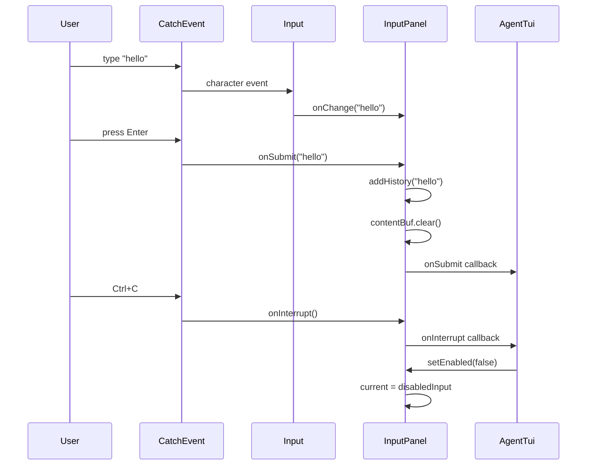

# InputPanel Spec

## §1. Overview

**Role:** Fixed bottom input bar with prompt history. Supports multiline input, Enter-to-submit, Up/Down history navigation, Ctrl-C interrupt, paste insertion, enabled/disabled state (shows "Waiting..." placeholder when disabled), and focus management.

**Source files:** `src/tui/input_panel.h`, `src/tui/input_panel.cpp`

**Dependencies:** `ftxui/component/component.hpp`, `ftxui/component/component_options.hpp`, `ftxui/component/event.hpp`, `ftxui/dom/elements.hpp`

**Lifecycle:**
1. Constructed — creates `ftxui::Input` with multiline option, wraps in `CatchEvent` for Enter/Ctrl-C handling
2. Callbacks wired by `AgentTui::xBuildLayout()` via `setOnSubmit`, `setOnInterrupt`, `setOnChange`
3. `setEnabled(false)` swaps to a "Waiting..." renderer that ignores all input
4. Destruction cleans up Impl

## §2. Component Specifications

```cpp
namespace a0::tui {

class InputPanel {
public:
    InputPanel();
    virtual ~InputPanel();

    ftxui::Component component() const;

    void setOnSubmit(std::function<void(const std::string&)> cb);
    void setOnInterrupt(std::function<void()> cb);
    void setOnChange(std::function<void(const std::string&)> cb);
    void insertText(const std::string& text);
    bool isEnabled() const { return m_enabled; }
    void setEnabled(bool enabled);
    void setPlaceholder(const std::string& text);
    void clear();
    void focus();

    int addHistory(const std::string& prompt);
    int loadHistory(const std::string& path);
    int saveHistory(const std::string& path);

private:
    class Impl {
    public:
        ftxui::Component realInput;       // rawInput | CatchEvent
        ftxui::Component disabledInput;    // Renderer placeholder
        ftxui::Component current;          // points to realInput or disabledInput

        std::function<void(const std::string&)> onSubmit;
        std::function<void()> onInterrupt;
        std::function<void(const std::string&)> onChange;
        std::vector<std::string> history;
        size_t historyPos = 0;
        std::string placeholder;
        std::string contentBuf;
    };

    std::unique_ptr<Impl> m_impl;
    bool m_enabled = true;

    static constexpr size_t MAX_HISTORY = 50;
};

} // namespace a0::tui
```

## §3. Architecture Diagram

```mermaid
graph TB
    subgraph "InputPanel"
        IP[InputPanel]
        IMPL[Impl]
        RI[realInput: Input + CatchEvent]
        DI[disabledInput: Renderer]
        CUR[current → RI or DI]
    end

    subgraph "Callbacks"
        OS[onSubmit(string)]
        OI[onInterrupt]
        OC[onChange(string)]
    end

    subgraph "State"
        HIST[history vector]
        BUF[contentBuf]
        EN[m_enabled bool]
    end

    IP --> IMPL
    IMPL --> RI
    IMPL --> DI
    IMPL --> CUR
    IMPL --> OS
    IMPL --> OI
    IMPL --> OC
    IMPL --> HIST
    IMPL --> BUF
    IP --> EN
```

## §4. Data Flow



## §5. Testing Requirements

| Method | Test Case | Verification |
|--------|-----------|-------------|
| `component()` | After construction | Non-null Component returned |
| `setOnSubmit(cb)` | Submit callback | Callback invoked with input text on Enter |
| `setOnInterrupt(cb)` | Interrupt callback | Callback invoked on Ctrl+C |
| `setOnChange(cb)` | Change callback | Callback invoked on each character |
| `insertText("pasted")` | Paste insertion | contentBuf contains "pasted", cursor at end |
| `isEnabled()` | Default / after setEnabled(false) | true / false |
| `setEnabled(false)` | Disable input | current = disabledInput (shows "Waiting...") |
| `setEnabled(true)` | Re-enable input | current = realInput |
| `clear()` | Clear content | contentBuf empty |
| `focus()` | Take focus | realInput->TakeFocus() called |
| `addHistory("prompt")` | Add to history | history contains "prompt", historyPos updated |
| `loadHistory(path)` | Load from file | Returns -1 (not yet implemented) |
| `saveHistory(path)` | Save to file | Returns -1 (not yet implemented) |

## §6. (skip)

## §7. CLI Entry Point

Not directly exposed. Created and owned by `AgentTui`, wired during `xBuildLayout()` which calls `setOnSubmit`, `setOnInterrupt`, and `setOnChange` with lambdas that route to `xHandleSubmit`, `xHandleInterrupt`, and paste-detection logic respectively.
