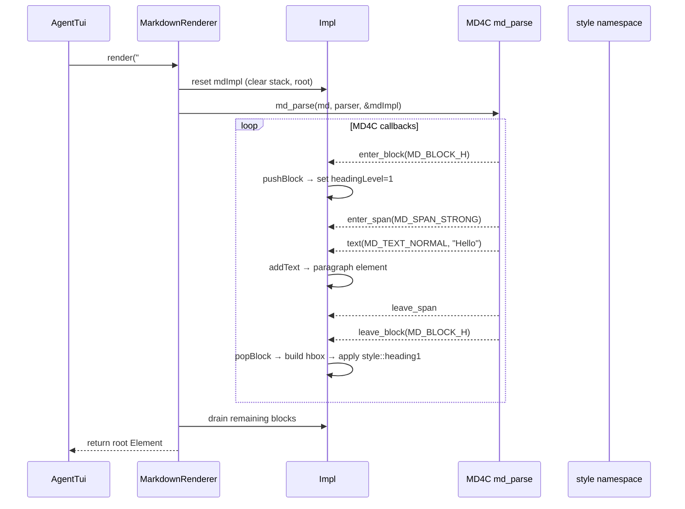

# MarkdownRenderer Spec

## §1. Overview

**Role:** Converts Markdown text into an FTXUI `Element` tree using the MD4C parser (`md4c.h`). Supports block-level elements (headings, paragraphs, code blocks, lists, horizontal rules) and span-level elements (emphasis, strong, links, strikethrough, inline code, underline). Streaming mode enables permissive URL auto-links for partial/incomplete markdown.

**Source files:** `src/tui/markdown_renderer.h`, `src/tui/markdown_renderer.cpp`

**Dependencies:** `md4c.h`, `ftxui/dom/elements.hpp`, `src/tui/styles.h`

**Lifecycle:**
1. Constructed — creates empty Impl with `MarkdownRendererImpl` stack
2. `render(md)` — resets parser state, runs MD4C parse, returns root Element
3. `renderInline(md)` — delegates to `render(md, false)`
4. Destruction — cleans up Impl

## §2. Component Specifications

```cpp
namespace a0::tui {

class MarkdownRenderer {
public:
    MarkdownRenderer();
    virtual ~MarkdownRenderer();

    ftxui::Element render(const std::string& md, bool streaming = false);
    ftxui::Element renderInline(const std::string& md);

private:
    struct MDBlock {
        MD_BLOCKTYPE type;
        int headingLevel = 0;
        ftxui::Element elem;
        std::vector<ftxui::Element> children;
    };

    struct MarkdownRendererImpl {
        std::stack<MDBlock> blockStack;
        ftxui::Element root;
        bool streaming = false;

        void pushBlock(MD_BLOCKTYPE type);
        void popBlock();
        void addText(MD_TEXTTYPE type, const std::string& text);
        void applySpanStyle(MD_SPANTYPE type, ftxui::Element& elem);
    };

    class Impl {
    public:
        MarkdownRendererImpl mdImpl;
    };

    std::unique_ptr<Impl> m_impl;
};

} // namespace a0::tui
```

## §3. Architecture Diagram

```mermaid
graph TB
    subgraph "MarkdownRenderer"
        MR[MarkdownRenderer]
        IMPL[Impl → mdImpl]
        STACK[blockStack<MDBlock>]
        ROOT[root Element]
    end

    subgraph "MD4C Parser"
        PARSER[MD_PARSER callbacks]
        ENTER[xEnterBlock]
        LEAVE[xLeaveBlock]
        TEXT[xText]
    end

    subgraph "Styles"
        CB[style::codeBlock]
        IC[style::inlineCode]
        H1[style::heading1]
        H2[style::heading2]
        DIM[style::dimmed]
        LINK[style::link]
    end

    MR -->|render(md)| IMPL
    IMPL -->|reset| STACK
    MR --> PARSER
    PARSER --> ENTER
    PARSER --> LEAVE
    PARSER --> TEXT
    ENTER -->|pushBlock| STACK
    LEAVE -->|popBlock → build element| STACK
    TEXT -->|addText| STACK
    STACK -->|apply styles| CB
    STACK -->|apply styles| IC
    STACK -->|apply styles| H1
    STACK -->|apply styles| H2
    STACK -->|apply styles| DIM
    STACK -->|apply styles| LINK
    STACK -->|final| ROOT
```

## §4. Data Flow



## §5. Testing Requirements

| Method | Test Case | Verification |
|--------|-----------|-------------|
| `render("# heading")` | Heading level 1 | Bold + bright white element |
| `render("## heading")` | Heading level 2+ | Bold element |
| `render("\`code\`")` | Inline code | Inverted decorator applied |
| "```\ncode\n```" | Code block | Dim + border decorators |
| `render("**bold**")` | Bold text | Bold decorator applied |
| `render("*em*")` | Italic text | Italic decorator applied |
| `render("[link](url)")` | Link | Underlined + blue decorator |
| `render("~~del~~")` | Strikethrough | Dim decorator applied |
| `render("")` | Empty string | Returns emptyElement |
| `renderInline("text")` | Inline only | Same as render with streaming=false |
| `render("incomplete", true)` | Streaming partial markdown | Permissive URL auto-links, no crash |

## §6. (skip)

## §7. CLI Entry Point

Not directly exposed. Created and owned by `AgentTui` but not called directly by it — `MessagePanel` may use `MarkdownRenderer` to render assistant message content into `ftxui::Element` for the display.
