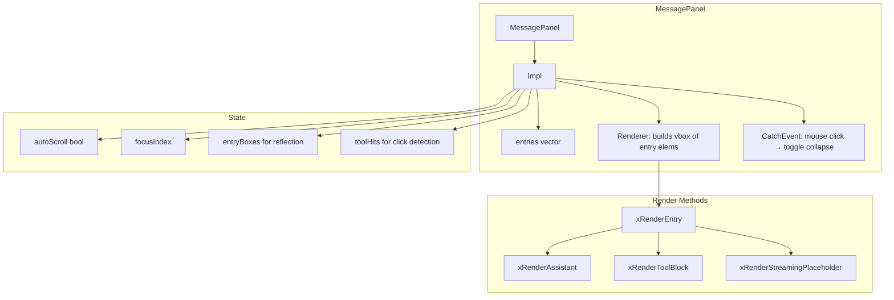
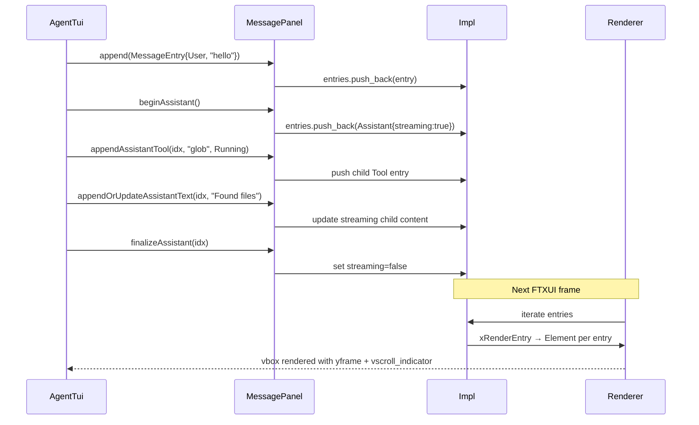

# MessagePanel Spec

## §1. Overview

**Role:** Scrollable message display panel showing the conversation history. Builds and maintains an FTXUI component tree of `MessageEntry` elements. Supports manual scroll (Up/Down/PageUp/PageDown/Home/End), auto-scroll to bottom during streaming, tool block collapsing by mouse click, and history loading from MPSC `SessionHistory` events.

**Source files:** `src/tui/message_panel.h`, `src/tui/message_panel.cpp`

**Dependencies:** `ftxui/component/component.hpp`, `ftxui/component/event.hpp`, `ftxui/dom/elements.hpp`, `src/tui/styles.h`, `src/shared/mpsc.h`

**Lifecycle:**
1. Constructed — creates `CatchEvent`-wrapped `Renderer` that iterates over entries
2. Entries added via `append()`, `beginAssistant()`, `appendAssistantTool()`, etc.
3. Renderer draws each entry (user, assistant with tool children, tool blocks, streaming placeholders)
4. `clear()` resets all state
5. Destruction cleans up Impl

## §2. Component Specifications

```cpp
namespace a0::tui {

struct MessageEntry {
    MessageRole role;
    std::string content;
    std::string toolName;
    std::string toolArgs;
    ToolState toolState = ToolState::Completed;
    std::string toolOutput;
    std::string outputPreview;
    int64_t resourceId = 0;
    int64_t resourceTotalBytes = 0;
    bool resourceExpanded = false;
    bool resourceLoading = false;
    int64_t timestamp = 0;
    bool collapsed = true;
    bool streaming = false;
    int64_t sessionId = 0;
    std::vector<MessageEntry> children;
};

struct ToolHit {
    int entryIdx;
    int childIdx;
    ftxui::Box box;
};

class MessagePanel {
public:
    MessagePanel();
    virtual ~MessagePanel();

    ftxui::Component component() const;

    int append(const MessageEntry& entry);
    void clear();

    int beginAssistant();
    int appendOrUpdateAssistantText(int asstIdx, const std::string& text);
    int endCurrentAssistantText(int asstIdx);
    int appendAssistantTool(int asstIdx, const std::string& name,
                            ToolState state, const std::string& args = "");
    int updateLastAssistantTool(int asstIdx, ToolState state,
                                const std::string& output);
    int updateLastAssistantToolOutput(int asstIdx, const std::string& text);
    int finalizeAssistant(int asstIdx);

    void scrollToBottom();
    int loadHistory(const std::vector<::a0::mpsc::SessionMessage>& messages);

    size_t count() const;
    void scrollUp(int n = 1);
    void scrollDown(int n = 1);
    void scrollToTop();
    int scrollTop() const;
    bool isAtBottom() const;

private:
    class Impl {
    public:
        std::vector<MessageEntry> entries;
        ftxui::Component renderer;
        int focusIndex = 0;
        bool autoScroll = true;
        std::vector<ftxui::Box> entryBoxes;
        std::vector<ToolHit> toolHits;
    };

    std::unique_ptr<Impl> m_impl;

    ftxui::Element xRenderEntry(int entryIdx);
    ftxui::Element xRenderAssistant(int entryIdx);
    ftxui::Element xRenderToolBlock(const MessageEntry& entry) const;
    ftxui::Element xRenderStreamingPlaceholder(const MessageEntry& entry) const;
};

} // namespace a0::tui
```

## §3. Architecture Diagram



## §4. Data Flow



## §5. Testing Requirements

| Method | Test Case | Verification |
|--------|-----------|-------------|
| `component()` | After construction | Non-null Component |
| `append(User entry)` | Append user message | entries.size() == 1, rendered with cyan |
| `clear()` | Clear all | entries empty, autoScroll=true, focusIndex=0 |
| `beginAssistant()` | Start assistant entry | Entry with streaming=true appended, returns index |
| `appendOrUpdateAssistantText(i, t)` | Update text | Entry content or child updated, streaming stays true |
| `endCurrentAssistantText(i)` | End streaming | Child streaming flag set to false |
| `appendAssistantTool(i, "ls", Running)` | Add tool child | Tool child added to assistant entry |
| `updateLastAssistantTool(i, Completed, "out")` | Update tool | Last Running tool set to Completed, output set |
| `updateLastAssistantToolOutput(i, "more")` | Append output | toolOutput appended with text |
| `finalizeAssistant(i)` | Finalize | streaming flag false on entry and all children |
| `scrollToBottom()` | Enable auto-scroll | autoScroll = true |
| `scrollUp(3)` | Scroll up | focusIndex decreased, autoScroll = false |
| `scrollDown(3)` | Scroll down | focusIndex increased, autoScroll set if at bottom |
| `scrollToTop()` | Scroll to top | focusIndex = 0, autoScroll = false |
| `scrollTop()` | Current scroll | returns focusIndex |
| `isAtBottom()` | At bottom | true when autoScroll or focusIndex at last entry |
| `count()` | Number of entries | Returns entries.size() |
| `loadHistory(messages)` | Load from MPSC | Entries populated from SessionMessage vector |

## §6. (skip)

## §7. CLI Entry Point

Not directly exposed. Created and owned by `AgentTui`, called extensively during event handling (`xOnLlmChunk`, `xOnToolStart`, `xOnComplete`, `xOnError`, `xOnSessionHistory`, etc.). Mouse events from `AgentTui::xBuildLayout()` are forwarded via `CatchEvent` to handle tool block collapsing.
