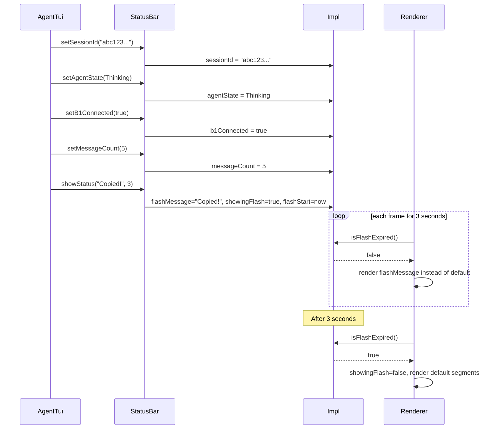

# StatusBar Spec

## §1. Overview

**Role:** Fixed top bar displaying session UUID (truncated to 8 chars), agent state (Idle/Thinking/Executing/Error) with color coding, b1 supervisor connection status, and message count. Supports flash messages that temporarily replace the default display for a configurable timeout (e.g., "Copied!", "Interrupted").

**Source files:** `src/tui/status_bar.h`, `src/tui/status_bar.cpp`

**Dependencies:** `ftxui/component/component.hpp`, `ftxui/dom/elements.hpp`, `src/tui/styles.h`

**Lifecycle:**
1. Constructed — creates `ftxui::Renderer` that builds an `hbox` of status segments
2. State set via `setSessionId()`, `setAgentState()`, `setB1Connected()`, `setMessageCount()`
3. `showStatus()` triggers a timed flash message overlay
4. Flash expires automatically after `timeoutSecs` (checked each render frame)
5. Destruction cleans up Impl

## §2. Component Specifications

```cpp
namespace a0::tui {

class StatusBar {
public:
    StatusBar();
    virtual ~StatusBar();

    ftxui::Component component() const;

    void setSessionId(const std::string& uuid);
    void setAgentState(AgentState state);
    void setB1Connected(bool connected);
    void setMessageCount(size_t count);
    void showStatus(const std::string& msg, int timeoutSecs = 3);

private:
    class Impl {
    public:
        std::string sessionId;
        AgentState agentState = AgentState::Idle;
        bool b1Connected = false;
        size_t messageCount = 0;

        std::string flashMessage;
        int flashTimeoutSecs = 3;
        bool showingFlash = false;
        std::chrono::steady_clock::time_point flashStart;

        bool isFlashExpired() const;
        std::string xAgentLabel(AgentState s) const;
        ftxui::Color xAgentColor(AgentState s) const;

        ftxui::Component renderer;
    };

    std::unique_ptr<Impl> m_impl;
};

} // namespace a0::tui
```

## §3. Architecture Diagram

```mermaid
graph TB
    subgraph "StatusBar"
        SB[StatusBar]
        IMPL[Impl]
        REN[ftxui::Renderer → hbox]
    end

    subgraph "Display Segments"
        SID[sessionId: 8-char trunc]
        SEP[separator]
        ST[agentState label + color]
        SEP2[separator]
        B1[b1: OK / b1: -- color]
        SEP3[separator]
        CNT[messageCount + " msgs"]
    end

    subgraph "Flash Override"
        FLASH[showingFlash → flashMessage]
        START[flashStart timestamp]
        EXP[isFlashExpired check]
    end

    SB --> IMPL
    IMPL --> REN
    IMPL --> SID
    IMPL --> ST
    IMPL --> B1
    IMPL --> CNT
    IMPL --> FLASH
    IMPL --> START
    EXP -->|expired| FLASH
    EXP -->|not expired| REN
    FLASH -->|override| REN
    REN --> SID
    REN --> ST
    REN --> B1
    REN --> CNT
```

## §4. Data Flow



## §5. Testing Requirements

| Method | Test Case | Verification |
|--------|-----------|-------------|
| `component()` | After construction | Non-null Component |
| `setSessionId("abc123def456")` | Set UUID | Shows "abc123def" (first 8 chars) |
| `setAgentState(Idle)` | Idle state | Label "Idle", default color |
| `setAgentState(Thinking)` | Thinking state | Label "Thinking", yellow color |
| `setAgentState(Executing)` | Executing state | Label "Executing", blue color |
| `setAgentState(Error)` | Error state | Label "Error", red color |
| `setB1Connected(true)` | b1 connected | Shows "b1: OK" in green |
| `setB1Connected(false)` | b1 disconnected | Shows "b1: --" in red |
| `setMessageCount(42)` | Message count | Shows "42 msgs" |
| `showStatus("Hello", 1)` | Flash message | Shows "Hello" instead of default, then reverts after 1s |
| `showStatus("", 0)` | Empty flash | isFlashExpired() returns true immediately |

## §6. (skip)

## §7. CLI Entry Point

Not directly exposed. Created and owned by `AgentTui`, updated in response to every MPSC event handler (`xOnLlmStart`, `xOnToolStart`, `xOnComplete`, `xOnError`, `xOnSessionReady`, etc.) and from `xHandleSubmit`, `xHandleInterrupt`, and mouse copy handlers in `xBuildLayout()`.
