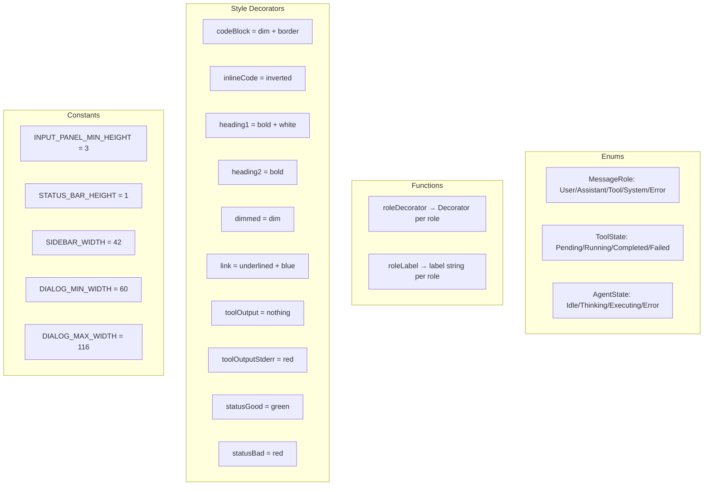
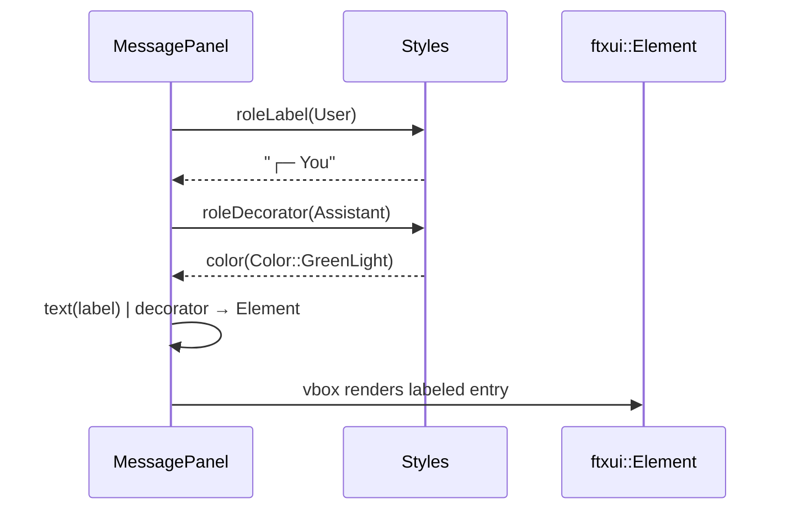

# Styles Spec

## §1. Overview

**Role:** Defines shared enums (`MessageRole`, `ToolState`, `AgentState`), role-based decorators and labels, FTXUI element decorator constants for markdown rendering, and layout dimension constants used across TUI components.

**Source files:** `src/tui/styles.h`, `src/tui/styles.cpp`

**Dependencies:** `ftxui/component/component.hpp`, `ftxui/dom/elements.hpp`

**Lifecycle:** Header-only enums and free functions with static-initialized decorator constants. No construction/destruction lifecycle.

## §2. Component Specifications

```cpp
namespace a0::tui {

enum class MessageRole {
    User,
    Assistant,
    Tool,
    System,
    Error
};

enum class ToolState {
    Pending,
    Running,
    Completed,
    Failed
};

enum class AgentState {
    Idle,
    Thinking,
    Executing,
    Error
};

ftxui::Decorator roleDecorator(MessageRole role);

std::string roleLabel(MessageRole role, const std::string& toolName = "");

namespace style {
    extern const ftxui::ElementDecorator codeBlock;
    extern const ftxui::ElementDecorator inlineCode;
    extern const ftxui::ElementDecorator heading1;
    extern const ftxui::ElementDecorator heading2;
    extern const ftxui::ElementDecorator dimmed;
    extern const ftxui::ElementDecorator link;
    extern const ftxui::ElementDecorator toolOutput;
    extern const ftxui::ElementDecorator toolOutputStderr;
    extern const ftxui::ElementDecorator statusGood;
    extern const ftxui::ElementDecorator statusBad;
}

constexpr int INPUT_PANEL_MIN_HEIGHT = 3;
constexpr int STATUS_BAR_HEIGHT = 1;
constexpr int SIDEBAR_WIDTH = 42;
constexpr int DIALOG_MIN_WIDTH = 60;
constexpr int DIALOG_MAX_WIDTH = 116;

} // namespace a0::tui
```

### roleDecorator behavior

| MessageRole | Decorator |
|-------------|-----------|
| User | `bold \| color(Color::Cyan)` |
| Assistant | `color(Color::GreenLight)` |
| Tool | `color(Color::BlueLight)` |
| System | `dim \| color(Color::Yellow)` |
| Error | `bold \| color(Color::RedLight)` |

### roleLabel behavior

| MessageRole | toolName empty | toolName set |
|-------------|---------------|--------------|
| User | `"┌─ You"` | — |
| Assistant | `"┌─ Assistant"` | — |
| Tool | `"┌─ Tool"` | `"┌─ Tool: " + toolName` |
| System | `"┌─ System"` | — |
| Error | `"┌─ Error"` | — |

### style namespace decorators

| Decorator | Composition |
|-----------|-------------|
| `codeBlock` | `dim \| border` |
| `inlineCode` | `inverted` |
| `heading1` | `bold \| color(Color::White)` |
| `heading2` | `bold` |
| `dimmed` | `dim` |
| `link` | `underlined \| color(Color::Blue)` |
| `toolOutput` | `nothing` |
| `toolOutputStderr` | `color(Color::Red)` |
| `statusGood` | `color(Color::Green)` |
| `statusBad` | `color(Color::Red)` |

## §3. Architecture Diagram



## §4. Data Flow

Not applicable — styles enum and constant definitions are used inline by consumers at compile time. `roleDecorator()` and `roleLabel()` are called each render frame by `MessagePanel::xRenderEntry()` and `StatusBar::Impl::xAgentLabel()`/`xAgentColor()`.



## §5. Testing Requirements

| Function/Constant | Test Case | Verification |
|-------------------|-----------|-------------|
| `roleDecorator(User)` | User role | Returns `bold \| color(Color::Cyan)` |
| `roleDecorator(Assistant)` | Assistant role | Returns `color(Color::GreenLight)` |
| `roleDecorator(Tool)` | Tool role | Returns `color(Color::BlueLight)` |
| `roleDecorator(System)` | System role | Returns `dim \| color(Color::Yellow)` |
| `roleDecorator(Error)` | Error role | Returns `bold \| color(Color::RedLight)` |
| `roleLabel(User)` | User label | Returns "┌─ You" |
| `roleLabel(Assistant)` | Assistant label | Returns "┌─ Assistant" |
| `roleLabel(Tool)` | Tool no name | Returns "┌─ Tool" |
| `roleLabel(Tool, "glob")` | Tool with name | Returns "┌─ Tool: glob" |
| `roleLabel(System)` | System label | Returns "┌─ System" |
| `roleLabel(Error)` | Error label | Returns "┌─ Error" |
| `style::codeBlock` | Decorator applied | Element dimmed + bordered |
| `style::inlineCode` | Decorator applied | Element inverted |
| `style::heading1` | Decorator applied | Element bold + white |
| `style::heading2` | Decorator applied | Element bold |
| `INPUT_PANEL_MIN_HEIGHT` | Value | Equals 3 |
| `STATUS_BAR_HEIGHT` | Value | Equals 1 |
| `SIDEBAR_WIDTH` | Value | Equals 42 |
| `DIALOG_MIN_WIDTH` | Value | Equals 60 |
| `DIALOG_MAX_WIDTH` | Value | Equals 116 |

## §6. (skip)

## §7. CLI Entry Point

Not applicable — styles is a shared header/source pair consumed by all other TUI components. No direct CLI wiring.
