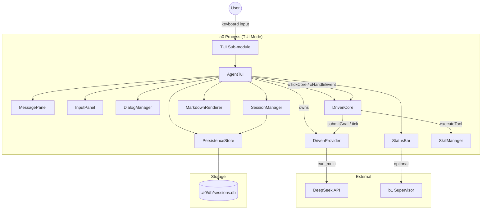
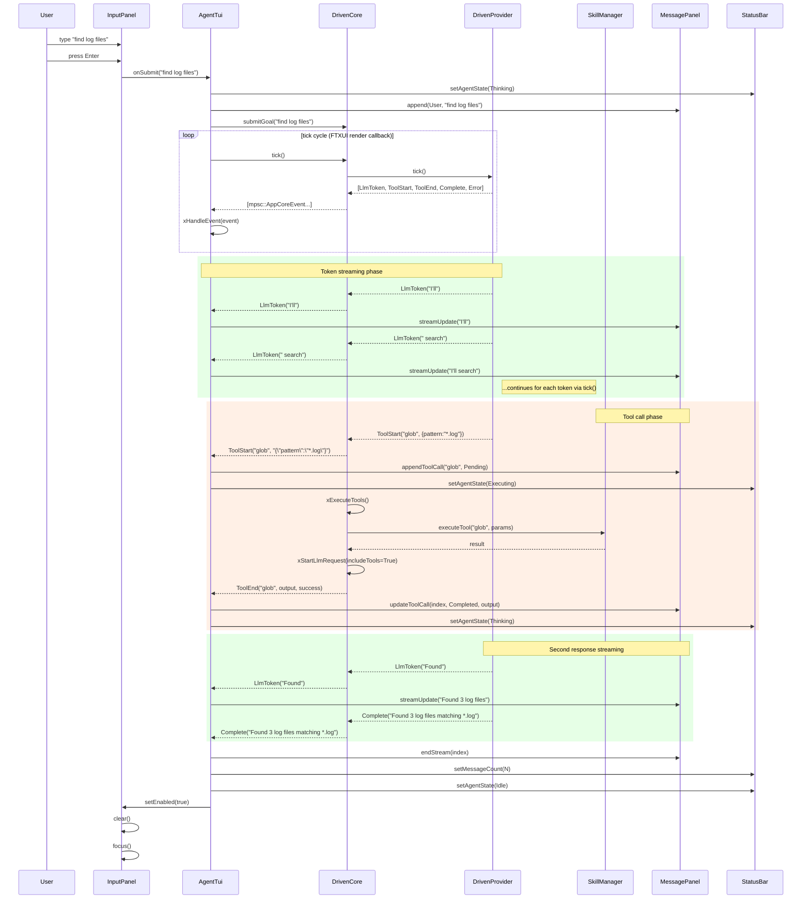
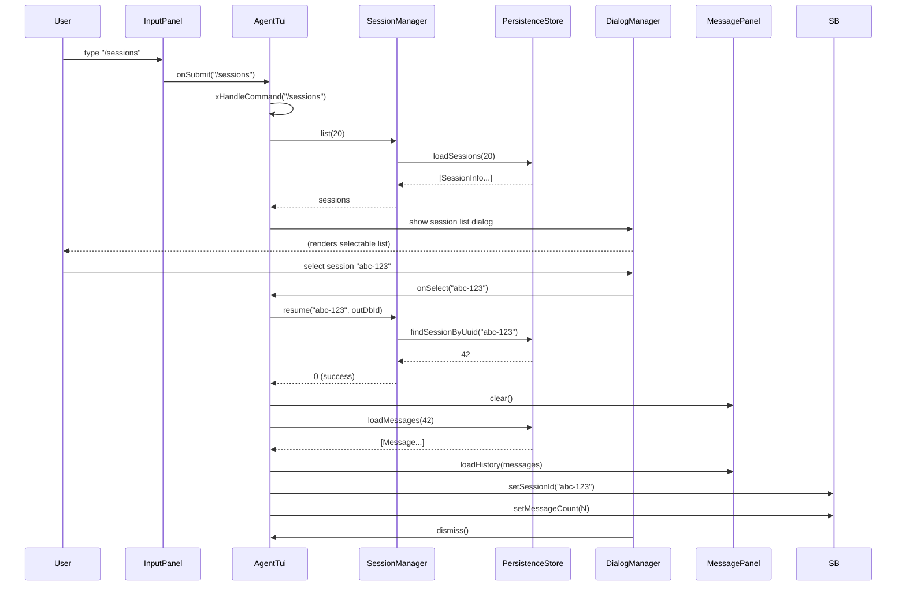
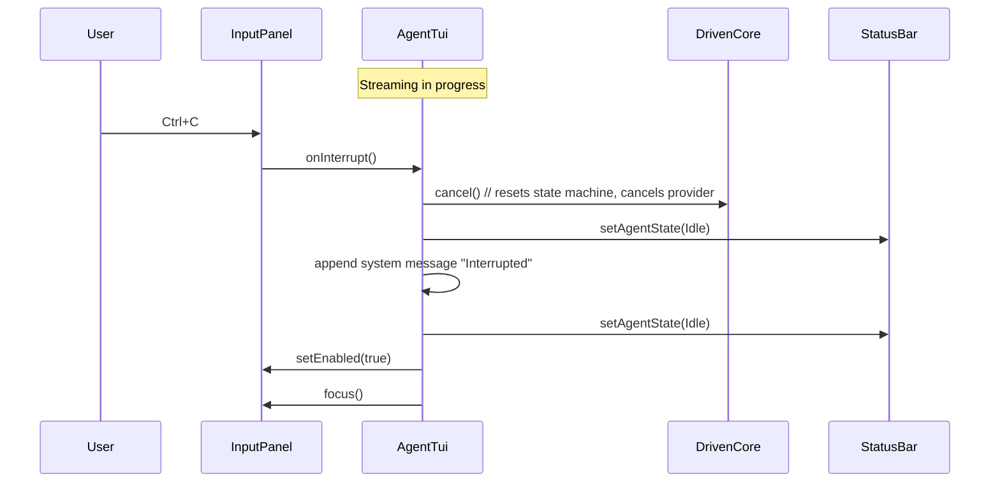

# Technical Specification: Terminal UI (TUI) Sub-Module

## For a0 Agent — Version 2.0

---

## 1. Overview

This document specifies a **TUI (Terminal User Interface) sub-module** for the existing a0 C++17 agent. The sub-module provides an interactive full-screen terminal interface replacing the basic stdin/stdout REPL, modelled after opencode.ai's terminal UI.

**Purpose**: The TUI sub-module enables rich interactive agent sessions directly in the terminal. Users see a split-panel layout with a scrollable message history on top and a persistent input area at the bottom. Agent responses stream token-by-token, tool executions are visible as collapsible status cards, and message roles are color-coded (user, assistant, system, tool). It is linked in-process into the `a0` binary and activated via the `a0 tui` subcommand. The TUI is the sole controller when active — no remote operator competes for input focus.

**Key behaviors:**

- **Split-panel layout** — scrollable message panel (top, flex-grow) + fixed input bar (bottom)
- **Streaming responses** — LLM tokens arrive via MPSC channel events, processed by `xTickCore()` and posted to FTXUI's `Screen::Post(Task{})` for thread-safe re-render
- **Color-coded messages** — user (cyan), assistant (green), system (yellow), tool (blue), error (red)
- **Tool execution visibility** — collapsible blocks showing tool name, status spinner, stdout/stderr output, and diffs
- **Markdown rendering** — assistant messages rendered through MD4C into FTXUI elements (headings, bold/italic, code blocks, lists)
- **Input history** — Up/Down arrow navigation through previous prompts
- **Session management** — `/sessions` command lists and resumes past sessions from SQLite; new sessions created automatically on first input
- **Ctrl+C interrupt** — cancels in-flight LLM request or tool execution
- **Modal dialogs** — framework for permission prompts, confirmations, help overlay (future: permission prompts via SkillManager integration)
- **Status bar** — session UUID, agent state (idle/thinking/executing/error), b1 connection status, message count
- **Copy-on-select** — mouse drag selects text, copies to clipboard via OSC 52 / xclip / wl-clipboard
- **Bracketed paste** — paste detection and multi-line input handling

**Dependencies on other sub-modules:**

- `DrivenCore` / `DrivenProvider` — tick()-based async agent core (replaces `AgentCore::processGoalStreaming`)
- `PersistenceStore` (SQLite) — for session list / resume via `loadMessages()`
- `SkillManager` — for tool schema generation and tool execution
- **FTXUI v6.1.9** — terminal UI framework (via FetchContent)
- **MD4C v0.5.2** — Markdown parser (via FetchContent or vendored)
- `b1` supervisor — optional; when b1 is running, status bar shows connection state

---

## 2. Component Specifications (C++ Interfaces)

All new classes are defined in the `a0::tui` namespace, declared in `src/tui/`.

### 2.1 Core Data Structures

```cpp
#pragma once

#include <string>
#include <vector>
#include <functional>
#include <cstdint>
#include "nlohmann/json.hpp"

namespace a0::tui {

/// Message role for display styling.
enum class MessageRole {
    User,       // cyan
    Assistant,  // green
    Tool,       // blue
    System,     // yellow
    Error       // red
};

/// Lifecycle state of a tool call visible in the TUI.
enum class ToolState {
    Pending,
    Running,
    Completed,
    Failed
};

/// Agent processing state for the status bar.
enum class AgentState {
    Idle,
    Thinking,
    Executing,
    Error
};

/// A single message entry in the scrollback.
struct MessageEntry {
    MessageRole role;
    std::string content;            // plain text or markdown source
    std::string toolName;           // non-empty for Tool messages
    ToolState toolState             = ToolState::Completed;
    std::string toolOutput;         // captured stdout/stderr
    int64_t timestamp               = 0;
    bool collapsed                  = false;
    int64_t sessionId               = 0;
};

/// Summary info for session list display.
struct SessionInfo {
    std::string uuid;
    int64_t dbId;
    std::string startedAt;
    int messageCount;
};

} // namespace a0::tui
```

### 2.2 AgentTui (Facade)

```cpp
namespace a0::tui {

/// Main TUI orchestrator. Owns the FTXUI screen, loop, and all panels.
/// Constructed with references to agent components, then run() enters the event loop.
/// Owns DrivenCore internally, holds a non-owning LlmProvider* (injected).
class AgentTui {
public:
    /// \param provider    Injected LlmProvider (non-owning, must outlive AgentTui).
    /// \param skillMgr    SkillManager for tool schemas and execution.
    /// \param persistence PersistenceStore for session list/resume.
    /// \param agentId     Agent DB id for session creation.
    /// \param b1Status    Function to query b1 connection status (optional).
    /// \param sessionDbId Pre-existing session DB id (0 = create on first input).
    /// \param sessionUuid Pre-existing session UUID (empty = generate on first input).
    AgentTui(::a0::LlmProvider* provider,
             ::a0::skills::SkillManager* skillMgr,
             ::a0::persistence::PersistenceStore* persistence,
             int64_t agentId = 0,
             std::function<bool()> b1Status = nullptr,
             int64_t sessionDbId = 0,
             const std::string& sessionUuid = "");

    virtual ~AgentTui();

    /// Enter the FTXUI event loop. Blocks until user quits (Ctrl+Q / :q).
    /// \param testMode  If true, use FixedSize screen for testing.
    /// \retval 0  Normal exit.
    /// \retval -1 FTXUI error.
    int run(bool testMode = false);

    /// Request graceful shutdown.
    void shutdown();

    /// The FTXUI main component (for test harness integration).
    ftxui::Component component() const { return m_mainComponent; }

    /// Set the FTXUI screen (for test harness).
    void setScreen(ftxui::ScreenInteractive* screen);
    void clearScreen();
    ftxui::ScreenInteractive* screenPtr() const { return m_screen; }

    /// Resume an existing session by UUID.
    int resumeSession(const std::string& uuid);

    /// Get current session UUID.
    std::string currentSessionId() const;

    /// Submit input programmatically (for test harness).
    void submitInput(const std::string& input);

    /// Set mock URL for testing (forwards to DrivenProvider).
    void setMockUrl(const std::string& url) { if (m_provider) m_provider->setMockUrl(url); }

private:
    ::a0::persistence::PersistenceStore* m_persistence;
    int64_t m_agentId = 0;
    std::function<bool()> m_b1Status;
    ::a0::LlmProvider* m_provider;  // non-owning
    std::unique_ptr<::a0::DrivenCore> m_drivenCore;

    std::unique_ptr<MessagePanel> m_messagePanel;
    std::unique_ptr<InputPanel> m_inputPanel;
    std::unique_ptr<StatusBar> m_statusBar;
    std::unique_ptr<DialogManager> m_dialogMgr;
    std::unique_ptr<SessionManager> m_sessionMgr;
    std::unique_ptr<MarkdownRenderer> m_markdown;

    std::string m_sessionUuid;
    int64_t m_sessionDbId = 0;
    AgentState m_agentState = AgentState::Idle;

    // FTXUI components (lifetime managed by the library)
    ftxui::ScreenInteractive* m_screen = nullptr;
    ftxui::Component m_mainComponent;

    // Mouse drag tracking for copy-on-select
    bool m_mouseDown = false;
    bool m_mouseMoved = false;

    // Bracketed paste handling
    bool m_pasteActive = false;
    std::string m_pasteBuffer;
    int m_pasteCounter = 0;
    std::unordered_map<int, std::string> m_pastedContents;

    // Accumulated streaming text for the current assistant message
    std::string m_streamingText;
    int m_streamingEntryIndex = -1;

    std::string xExpandPastePlaceholders(const std::string& input);
    void xProcessPasteBuffer();
    void xTickCore();

    void xBuildLayout();
    ftxui::Component xBuildMainContainer();

    int xHandleSubmit(const std::string& input);
    int xHandleInterrupt();
    int xHandleCommand(const std::string& cmd);

    void xHandleEvent(const ::a0::mpsc::AppCoreEvent& ev);
    void xOnToken(const std::string& token);
    void xOnToolStart(const std::string& name, const std::string& arguments);
    void xOnToolEnd(const std::string& name, const std::string& output, bool success);
    void xOnComplete(const std::string& fullOutput);
    void xOnError(const std::string& error);

    int xCmdSessions();
    int xCmdHelp();
    int xCmdClear();
    int xCmdQuit();
    int xCmdExport();
};

} // namespace a0::tui
```

### 2.3 MessagePanel

```cpp
namespace a0::tui {

/// Scrollable message display panel.
/// Builds and maintains an FTXUI component tree of message elements.
/// All mutations must be posted to the FTXUI event loop via Screen::Post().
class MessagePanel {
public:
    MessagePanel();
    virtual ~MessagePanel();

    /// The FTXUI component (vertical container of message elements).
    ftxui::Component component() const;

    /// Append a complete message to the scrollback.
    int append(const MessageEntry& entry);

    /// Begin a streaming message — creates a placeholder that xStreamUpdate fills.
    /// \param role Typically Assistant.
    /// \retval index of the new entry for update calls.
    int beginStreaming(MessageRole role);

    /// Update the current streaming message with new tokens.
    /// \param index Returned by beginStreaming.
    int streamUpdate(int index, const std::string& text);

    /// Finalize a streaming message.
    int endStream(int index);

    /// Add a tool call display block.
    int appendToolCall(const std::string& name,
                       ToolState state,
                       const std::string& output = "");

    /// Update a tool call's state/output.
    int updateToolCall(int index, ToolState state, const std::string& output);

    /// Clear all messages.
    void clear();

    /// Scroll to bottom (called after new content).
    void scrollToBottom();

    /// Load historical messages for session resume.
    int loadHistory(const std::vector<::a0::persistence::Message>& messages);

    /// Number of visible messages.
    size_t count() const;

private:
    class Impl;
    std::unique_ptr<Impl> m_impl;
};

} // namespace a0::tui
```

### 2.4 InputPanel

```cpp
namespace a0::tui {

/// Fixed bottom input bar with prompt history.
class InputPanel {
public:
    InputPanel();
    virtual ~InputPanel();

    /// The FTXUI component (Input + optional submit hint).
    ftxui::Component component() const;

    /// Set callback when user submits input.
    void setOnSubmit(std::function<void(const std::string&)> cb);

    /// Set callback for interrupt (Ctrl+C during streaming).
    void setOnInterrupt(std::function<void()> cb);

    /// Enable/disable input (disabled during streaming).
    void setEnabled(bool enabled);

    /// Set placeholder text.
    void setPlaceholder(const std::string& text);

    /// Clear current input buffer.
    void clear();

    /// Focus the input element.
    void focus();

    /// Add a prompt to history.
    int addHistory(const std::string& prompt);

    /// Load history from JSONL file (future).
    int loadHistory(const std::string& path);

private:
    class Impl;
    std::unique_ptr<Impl> m_impl;
};

} // namespace a0::tui
```

### 2.5 StatusBar

```cpp
namespace a0::tui {

/// Fixed top bar showing session and agent state information.
class StatusBar {
public:
    StatusBar();
    virtual ~StatusBar();

    /// The FTXUI component.
    ftxui::Component component() const;

    /// Set the session UUID to display.
    void setSessionId(const std::string& uuid);

    /// Update agent state (idle/thinking/executing/error).
    void setAgentState(AgentState state);

    /// Set b1 connection status.
    void setB1Connected(bool connected);

    /// Set message count.
    void setMessageCount(size_t count);

    /// Show a transient status message (e.g., "Saved session").
    void showStatus(const std::string& msg, int timeoutSecs = 3);

private:
    class Impl;
    std::unique_ptr<Impl> m_impl;
};

} // namespace a0::tui
```

### 2.6 DialogManager

```cpp
namespace a0::tui {

/// Stack-based modal dialog system using FTXUI::Modal.
class DialogManager {
public:
    DialogManager();
    virtual ~DialogManager();

    /// The FTXUI component (main container with Modal overlay).
    ftxui::Component component() const;

    /// Show a dialog. Pushes onto the stack.
    /// \param dialog  FTXUI component to render as modal.
    /// \param onDismiss Callback when dialog is dismissed.
    int show(ftxui::Component dialog, std::function<void()> onDismiss = nullptr);

    /// Dismiss the topmost dialog.
    void dismiss();

    /// Dismiss all dialogs.
    void dismissAll();

    /// Whether any dialog is currently shown.
    bool isActive() const;

    /// Show the help overlay.
    int showHelp();

    /// Show a confirmation dialog.
    /// \param title, message   Display text.
    /// \param onConfirm        Called with true/false.
    int showConfirm(const std::string& title,
                    const std::string& message,
                    std::function<void(bool)> onConfirm);

private:
    class Impl;
    std::unique_ptr<Impl> m_impl;
};

} // namespace a0::tui
```

### 2.7 SessionManager

```cpp
namespace a0::tui {

/// Manages session lifecycle — create, list, resume via SQLite.
class SessionManager {
public:
    /// \param persistence PersistenceStore for session queries.
    SessionManager(::a0::persistence::PersistenceStore* persistence);
    virtual ~SessionManager();

    /// Create a new session. Returns DB id.
    int64_t create(const std::string& uuid);

    /// List all recent sessions.
    std::vector<SessionInfo> list(int limit = 20) const;

    /// Resume a session by UUID.
    /// \retval 0  Found.
    /// \retval -1 Not found.
    int resume(const std::string& uuid, int64_t& outDbId);

    /// Get current session UUID.
    std::string currentUuid() const;

    /// End the current session (sets ended_at).
    void endCurrent();

private:
    ::a0::persistence::PersistenceStore* m_persistence;
    std::string m_currentUuid;
    int64_t m_currentDbId = 0;
};

} // namespace a0::tui
```

### 2.8 MarkdownRenderer

```cpp
namespace a0::tui {

/// Converts Markdown text into an FTXUI Element tree.
/// Wraps MD4C parser; produces styled ftxui::Elements.
class MarkdownRenderer {
public:
    MarkdownRenderer();
    virtual ~MarkdownRenderer();

    /// Parse markdown and return an FTXUI element suitable for rendering.
    /// \param md         Markdown source text.
    /// \param streaming  If true, handles incomplete markdown gracefully.
    ftxui::Element render(const std::string& md, bool streaming = false);

    /// Render inline-only (for short snippets in tool blocks, etc.).
    ftxui::Element renderInline(const std::string& md);

private:
    class Impl;
    std::unique_ptr<Impl> m_impl;
};

} // namespace a0::tui
```

### 2.9 Clipboard

```cpp
namespace a0::tui {

/// Copy text to the system clipboard.
/// Uses OSC 52 escape sequence (works in Kitty, iTerm2, WezTerm, tmux).
/// Falls back to `xclip` on X11 or `wl-clipboard` on Wayland.
/// No-op when text is empty.
void copyToClipboard(const std::string& text);

} // namespace a0::tui
```

**Fallback logic:**

1. Base64-encode the text
2. Write OSC 52 sequence: `ESC ] 52 ; c ; <base64> BEL`
3. If `WAYLAND_DISPLAY` is set → pipe to `wl-copy`
4. Else if `xclip` exists → pipe to `xclip -selection clipboard -i`

Custom inline base64 encoding (no external library).

---

## 3. System Architecture (C4 Diagram)



**Caption**: The TUI sub-module owns `DrivenProvider` + `DrivenCore` internally (no AgentCore dependency). User keyboard events flow `InputPanel → AgentTui → DrivenCore::submitGoal()`. The FTXUI Renderer wrapper calls `xTickCore()` each frame to drive the `DrivenCore` state machine via `tick()`. LLM tokens and tool events arrive via MPSC channel and are processed by `xHandleEvent()`, then posted via FTXUI's TaskQueue to MessagePanel for rendering. Session list/resume goes through PersistenceStore (SQLite).

---

## 4. Data Flow Diagrams

### 4.1 Full Interaction Cycle (User Input → Response)



### 4.2 Session List and Resume



### 4.3 Interrupt Handling



---

## 5. Configuration & CLI Extensions

### 5.1 New `tui` Subcommand

```
a0 tui [--resume <uuid>] [--no-permissions]
```

| Flag | Default | Description |
|------|---------|-------------|
| `--resume <uuid>` | — | Resume an existing session on startup |
| `--no-permissions` | `false` | Auto-approve tool execution (current default behavior) |

### 5.2 In-TUI Commands

| Command | Description |
|---------|-------------|
| `/sessions` | List recent sessions, select to resume |
| `/help` | Show keybinding reference |
| `/clear` | Clear message panel (display only) |
| `/quit` or `Ctrl+Q` | Exit TUI |
| `/export` | Export current session as JSONL |
| `:q` | Same as `/quit` |

### 5.3 Keybindings

| Key | Action |
|-----|--------|
| `Enter` | Submit input |
| `Shift+Enter` | Newline in input |
| `Up/Down` | Navigate input history |
| `Ctrl+C` | Interrupt streaming / cancel |
| `Ctrl+Q` | Quit TUI |
| `Ctrl+L` | Redraw screen |
| `Tab` | (Future) Autocomplete |
| `Escape` | Close dialog / cancel |

### 5.4 Environment Variables

| Variable | Used by | Description |
|----------|---------|-------------|
| `A0_TUI_NO_PERMISSIONS` | AgentTui | Skip permission prompts (like `--no-permissions`) |

---

## 6. Testing Requirements

### 6.1 Unit Tests

| Class | Test Case | Verification |
|-------|-----------|-------------|
| `MessagePanel` | `append` User message | Renders cyan-colored text |
| `MessagePanel` | `append` Assistant message | Renders green-colored text |
| `MessagePanel` | `beginStreaming` + `streamUpdate` | Placeholder created, updated text rendered |
| `MessagePanel` | `endStream` | Streaming indicator removed, final text rendered |
| `MessagePanel` | `appendToolCall` with Pending -> Completed | Spinner stops, output displayed |
| `MessagePanel` | `loadHistory` with 10 messages | All 10 rendered in order |
| `MessagePanel` | `clear` | Count = 0 |
| `InputPanel` | `onSubmit` callback fires | Callback invoked with input text |
| `InputPanel` | `addHistory` + Up arrow | Previous input restored |
| `InputPanel` | `setEnabled(false)` | Input not accepting text |
| `StatusBar` | `setAgentState` all states | Correct label displayed for each |
| `StatusBar` | `setB1Connected` | Shows connected/disconnected indicator |
| `DialogManager` | `show` + `dismiss` | Dialog appears then disappears |
| `DialogManager` | `showConfirm` true path | onConfirm(true) called |
| `SessionManager` | `create` new session | Returns positive dbId |
| `SessionManager` | `list` with 5 sessions | Returns 5 items |
| `SessionManager` | `resume` existing UUID | 0, outDbId populated |
| `SessionManager` | `resume` missing UUID | -1 |
| `MarkdownRenderer` | `render` with heading | Bold large text element |
| `MarkdownRenderer` | `render` with code block | Dim background element |
| `MarkdownRenderer` | `render` with bold/italic | Correct decorators applied |
| `MarkdownRenderer` | `renderInline` | No block-level elements |
| `MarkdownRenderer` | `render` with incomplete markdown | Graceful handling (no crash) |
| `Clipboard` | Empty text | No output, no process spawned |
| `Clipboard` | Text copied via OSC 52 | OSC 52 sequence written to stdout |
| `Clipboard` | Base64 output correctness | Decoded string matches input |
| `Clipboard` | Wayland fallback | `wl-copy` invoked when `WAYLAND_DISPLAY` set |
| `Clipboard` | X11 fallback | `xclip` invoked when no Wayland |

### 6.2 Integration Tests

| ID | Scenario | Steps | Expected |
|----|----------|-------|----------|
| INT‑TUI‑01 | TUI launches | Run `a0 tui` | FTXUI screen renders, status bar shows "Idle" |
| INT‑TUI‑02 | Submit a goal | Type "hello", press Enter | User message appears, agent responds |
| INT‑TUI‑03 | Streaming display | Send goal that triggers long response | Tokens appear incrementally in message panel |
| INT‑TUI‑04 | Tool execution visible | Send goal that triggers tool call | Tool block appears with name, status, output |
| INT‑TUI‑05 | Interrupt during streaming | Ctrl+C while agent is responding | Streaming stops, "Interrupted" message shown, input re-enabled |
| INT‑TUI‑06 | `/sessions` command | Type `/sessions` | Dialog shows session list |
| INT‑TUI‑07 | Resume session | Select a session from `/sessions` | Historical messages load, new input continues that session |
| INT‑TUI‑08 | Input history | Submit 3 prompts, press Up 3 times | All 3 prompts accessible in reverse order |
| INT‑TUI‑09 | `/help` command | Type `/help` | Help dialog with keybindings |
| INT‑TUI‑10 | `/quit` | Type `/quit` | TUI exits cleanly, terminal restored |
| INT‑TUI‑11 | Resume via flag | `a0 tui --resume <uuid>` | Previous session loaded, messages displayed |
| INT‑TUI‑12 | b1 status indicator | Start b1, launch TUI | Status bar shows "b1: ✓" |

---

## 7. Integration with Existing Main Specification

### 7.1 `main.cpp` Changes

1. **CLI11 subcommand**: Add `App tuiCmd = app.add_subcommand("tui", "Interactive terminal UI");` with `--resume`, `--no-permissions`, and `--test-mode` flags.

2. **Injected LlmProvider**: `AgentTui` receives an `LlmProvider*` (non-owning), a `SkillManager*`, a `PersistenceStore*`, and optional session IDs. It constructs `DrivenCore` internally. No `AgentCore` or streaming callbacks needed:

```cpp
void cmdTui(...) {
    AgentStack stack(a0Dir, skillsDir, apiKey, mockUrl, ...);
    stack.skillMgr.loadAll();
    int agentId = xRegisterAgent(stack.persistence);
    int64_t sessionDbId = stack.persistence.createSession(sid, ...);

    AgentTui tui(&stack.llmProvider,
                 &stack.skillMgr, &stack.persistence,
                 agentId,
                 [&b1Fd]() { return b1Fd >= 0; },
                 sessionDbId, sid);
    if (!tuiResumeUuid.empty())
        tui.resumeSession(tuiResumeUuid);
    return tui.run(tuiTestMode);
}
```

3. **Both cmdRun and cmdTui use the same DrivenCore**: The `cmdRun` path uses `DrivenCore::runSync()` for synchronous headless execution. The `cmdTui` path uses `DrivenCore::tick()` from the FTXUI render loop. Both paths share the same `LlmProvider` → `DrivenCore` architecture, with `DeepSeekProvider` as the default provider implementation.

### 7.2 `DrivenProvider` (Replaces DeepSeekProvider Streaming)

A new `DrivenProvider` class handles async LLM requests via `curl_multi`:
- `startRequest()` / `startRequestStreaming()` — non-blocking, kicks off libcurl multi handle
- `tick()` — drives `curl_multi_perform()`, returns decoded `mpsc::AppCoreEvent` tokens
- `cancel()` — removes the curl easy handle, resets state
- `timeoutMs()` — returns curl-derived poll timeout for event loop integration
- Internally uses `ResponseDecoder` for SSE / JSON response parsing
- Builds alongside existing `DeepSeekProvider` — does not replace it yet

### 7.3 `DrivenCore` (Replaces SkillRunner Streaming + ProcessGoalStreaming)

A new `DrivenCore` state machine replaces both `processGoalStreaming()` and the forked tool-calling loop:
- States: `Idle → AwaitingLlm → ExecutingTools → Idle`
- `submitGoal(goal)` — builds initial messages, starts `DrivenProvider::startRequestStreaming()`
- `tick()` — drives provider, forwards events, executes tools when LLM returns tool calls
- `cancel()` — resets to idle, cancels provider
- Handles the full tool-calling loop internally (up to 25 turns)
- Does not use `SkillRunner::executeStreaming()` — drives tools directly via `SkillManager`

### 7.4 Build System

`src/tui/CMakeLists.txt`:
```cmake
include(FetchContent)
FetchContent_Declare(ftxui
  GIT_REPOSITORY https://github.com/ArthurSonzogni/ftxui
  GIT_TAG v6.1.9
)
FetchContent_Declare(md4c
  GIT_REPOSITORY https://github.com/mity/md4c
  GIT_TAG release-0.5.2
)
FetchContent_MakeAvailable(ftxui md4c)

add_library(tui_lib STATIC
    agent_tui.cpp
    message_panel.cpp
    input_panel.cpp
    status_bar.cpp
    dialog_manager.cpp
    session_manager.cpp
    markdown_renderer.cpp
    styles.cpp
)
target_include_directories(tui_lib PUBLIC ${CMAKE_CURRENT_SOURCE_DIR})
target_link_libraries(tui_lib PUBLIC
    ftxui::ftxui
    md4c::md4c
    a0_lib
    persistence_lib
    nlohmann_json::nlohmann_json
)
```

Root `CMakeLists.txt` adds `add_subdirectory(src/tui)` and links `tui_lib` to the `a0` executable.

### 7.5 Project File Layout

```
src/tui/
├── CMakeLists.txt              # FTXUI + MD4C deps, tui_lib build
├── technical-specification.md  # this document
├── styles.h                    # Color/decorator constants
├── styles.cpp
├── agent_tui.h                 # Facade (owns DrivenProvider + DrivenCore)
├── agent_tui.cpp
├── message_panel.h             # Scrollable message display
├── message_panel.cpp
├── input_panel.h               # Input bar with history
├── input_panel.cpp
├── status_bar.h                # Session/agent status bar
├── status_bar.cpp
├── dialog_manager.h            # Modal dialog system
├── dialog_manager.cpp
├── session_manager.h           # Session lifecycle
├── session_manager.cpp
├── markdown_renderer.h         # MD4C -> FTXUI element
├── markdown_renderer.cpp
├── clipboard.h                 # OSC 52 / xclip / wl-clipboard
├── clipboard.cpp
```

---

## 8. Implementation Outline

### Phase 1: Dependency Integration

- Add FTXUI v6.1.9 and MD4C v0.5.2 via `FetchContent` in root `CMakeLists.txt`
- Create `src/tui/CMakeLists.txt` with `tui_lib` static library
- Add `add_subdirectory(src/tui)` to root CMake
- Verify: `cmake -B build && cmake --build build` produces `tui_lib` (empty sources initially)

### Phase 2: Core TUI Scaffold

- Implement `styles.h/.cpp` -- color constants, role-to-decorator map
- Implement `MessagePanel` -- component tree builder, append/stream/clear
- Implement `InputPanel` -- FTXUI Input wrapper, history, submit callback
- Implement `StatusBar` -- info bar with agent state, session ID
- Implement `AgentTui` shell -- wires panels, `run()` enters loop, `xHandleSubmit` prints mock echo
- Add `tui` subcommand to `main.cpp` with `--resume` flag
- Integration test: `a0 tui` shows split-panel, typing echos in scrollback

### Phase 3: DrivenCore Integration

- Implement `ResponseDecoder` -- SSE/JSON response parser producing `mpsc::AppCoreEvent` variants
- Implement `DrivenProvider` -- `curl_multi`-based async LLM provider with `startRequest/tick/cancel`
- Implement `DrivenCore` -- state machine with `submitGoal/tick/cancel`, full tool-calling loop
- Wire `xHandleSubmit` to call `DrivenCore::submitGoal()` instead of mock echo
- Wire FTXUI renderer callback to call `xTickCore()` → `DrivenCore::tick()` → `xHandleEvent()`
- Wire `xOnToken` → `MessagePanel::streamUpdate()` via `Screen::Post(Task{})`
- Wire `xOnComplete` → `MessagePanel::endStream()`
- Wire `xOnError` → append error message, reset state
- Integration test: streaming response appears token-by-token in TUI

### Phase 4: Tool Execution Visibility

- `DrivenCore::xExecuteTools()` calls `SkillManager::executeTool()` for each tool call
- Tool events arrive as `ToolStart` / `ToolEnd` via `xHandleEvent()`
- Map `ToolStart` → `MessagePanel::appendToolCall(name, Pending, "")`
- Map `ToolEnd` → `MessagePanel::updateToolCall(index, Completed, output)`
- Add tool output formatting (stdout rendering, error highlighting, diff display)
- Wire `xHandleInterrupt` → `DrivenCore::cancel()` (resets state machine)
- Integration test: tool call visible as collapsible block with status/output

### Phase 5: Markdown Rendering

- Implement `MarkdownRenderer` wrapping MD4C -- parse tree to FTXUI element tree
- Support: headings (h1-h4 bold/bright), emphasis (bold/italic), inline code, fenced code blocks (dim background), bullet/numbered lists, horizontal rules, links
- Wire into `MessagePanel` -- assistant messages rendered through MD4C before display
- Add `streaming=true` mode -- graceful handling of incomplete markdown
- Integration test: markdown-formatted response renders correctly

### Phase 6: Session Management

- Implement `SessionManager` wrapping `PersistenceStore` -- create/list/resume
- Implement `/sessions` command -- `DialogManager.show(session list)` -> onSelect -> resume
- Implement `/clear`, `/help`, `/quit` commands
- Implement `--resume <uuid>` CLI flag
- Integrate session persistence: each user-to-assistant turn appends to SQLite
- Integration test: `/sessions` shows past sessions, resume loads history

### Phase 7: Input History and Polish

- Implement input history file persistence (JSONL like opencode)
- Add `/export` command for JSONL session export
- Add transient status messages in StatusBar (`showStatus()`, auto-dismiss)
- Add Ctrl+L (redraw), auto-scroll behavior
- Add input placeholder cycling
- Handle terminal resize events via FTXUI's built-in resize handling

### Phase 8: Tests

- Unit tests for all classes (see Section 6.1)
- Integration tests with mock DeepSeek API (reuse existing mock server)
- E2E test: `echo "hello" | a0 tui` with piped input (non-interactive fallback)

---

## 9. Future Extensions

- **Permission prompts**: Modal dialog on tool execution showing tool name, args, diff. Approve/reject per tool. Requires SkillManager integration with permission callback.
- **Autocomplete**: `@file`, `/command` autocomplete in InputPanel (like opencode's autocomplete component)
- **Session sidebar**: Overlay sidebar showing session list, switch without `/sessions` command
- **Remote handoff**: When b1/c2 signals a remote operator, TUI enters "monitoring" mode -- displays actions but doesn't accept local input
- **Model switching**: `/model` command to switch DeepSeek model variants
- **Theme support**: Configurable color schemes via FTXUI styles
- **Split-view terminal**: Embed xterm.js-like PTY viewer in a TUI panel (challenging in terminal -- future investigation)
