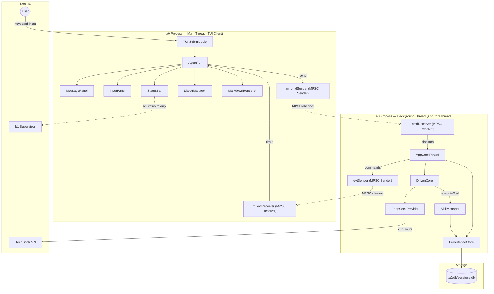
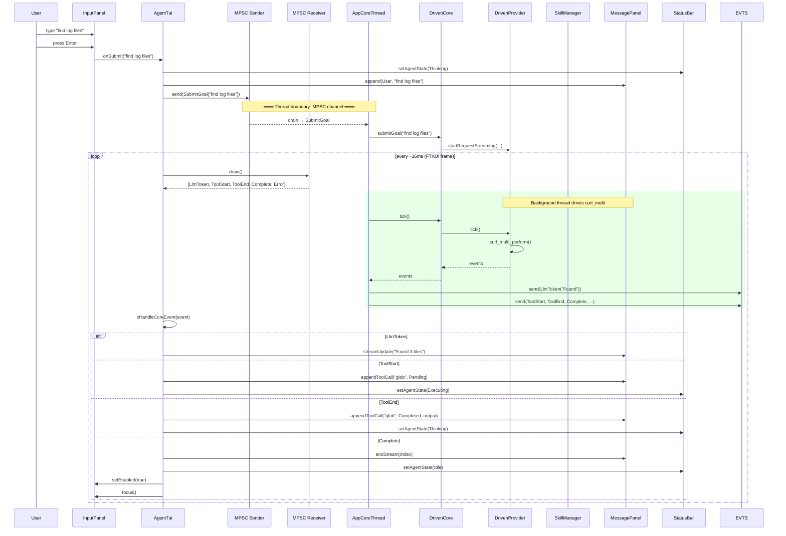
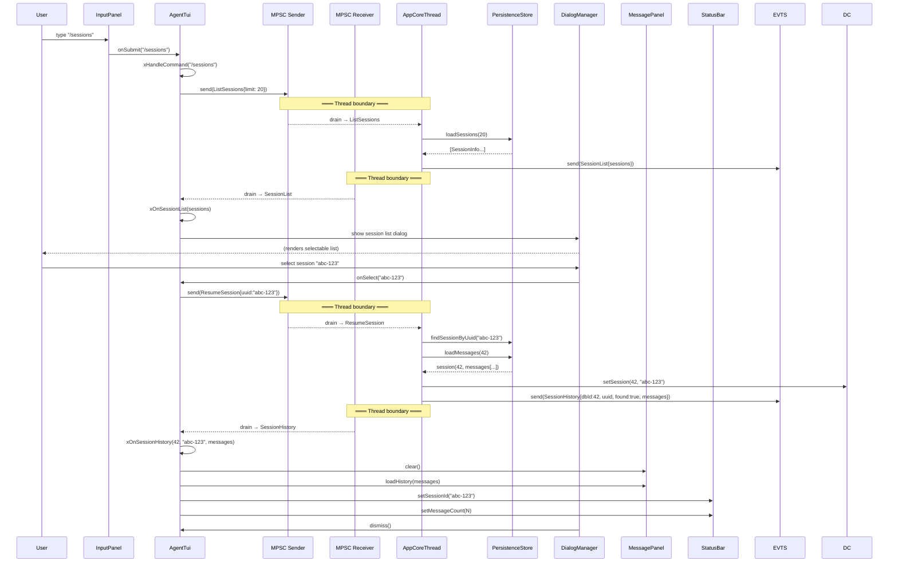
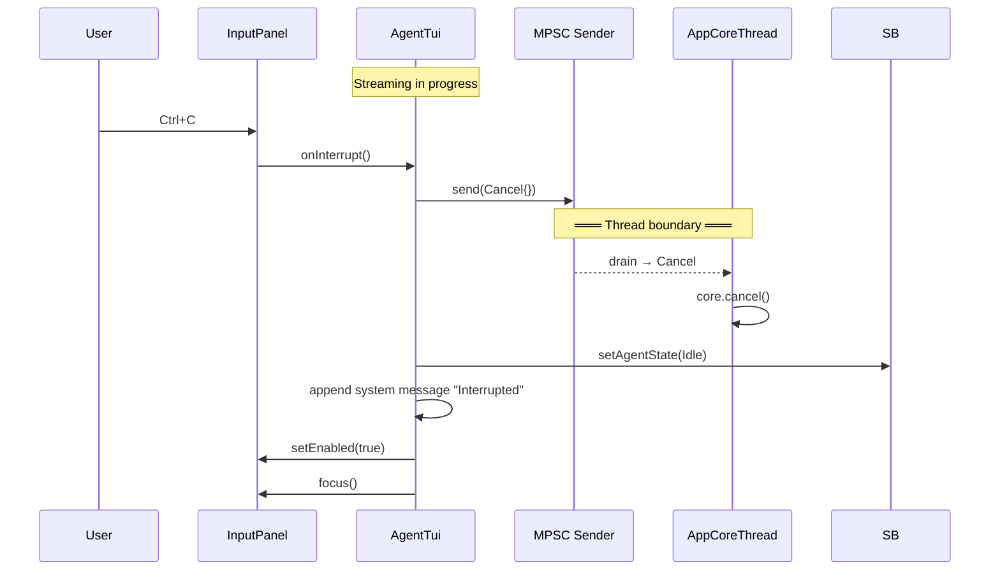
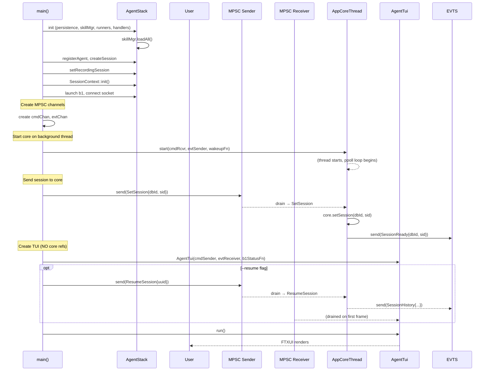
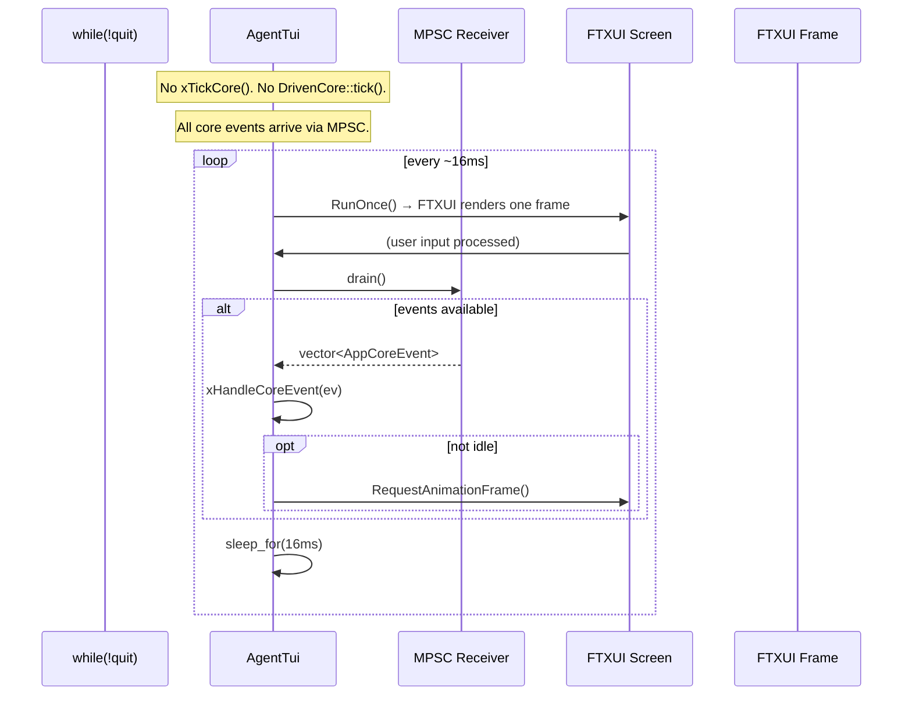

# Technical Specification: Terminal UI (TUI) Sub-Module

## For a0 Agent — Version 3.0

---

## 1. Overview

### 1.1 Purpose

This document specifies a **TUI (Terminal User Interface) sub-module** for the existing a0 C++17 agent. The sub-module provides an interactive full-screen terminal interface replacing the basic stdin/stdout REPL, modelled after opencode.ai's terminal UI.

**Purpose**: The TUI sub-module enables rich interactive agent sessions directly in the terminal. Users see a split-panel layout with a scrollable message history on top and a persistent input area at the bottom. Agent responses stream token-by-token, tool executions are visible as collapsible status cards, and message roles are color-coded (user, assistant, system, tool). It is linked in-process into the `a0` binary and activated via the `a0 tui` subcommand. The TUI is the sole controller when active — no remote operator competes for input focus.

The TUI is a **thin rendering client** only. It does NOT own, hold pointers to, or directly interact with any core agent component:
- NO `DrivenCore` or `DrivenProvider` reference
- NO `LlmProvider` pointer
- NO `SkillManager` pointer or call
- NO `PersistenceStore` reference
- NO `SessionManager` class
- NO tool execution, no LLM interaction, no session management

All core agent functionality lives in `AppCoreThread` on a background thread. The TUI communicates with it exclusively through MPSC channels (defined in `src/mpsc.h`).

**THIS BOUNDARY IS ENFORCED BY ARCHITECTURE. NO EXCEPTIONS.**

Any proposed change that introduces a direct reference from the TUI to any core component (`DrivenCore`, `DrivenProvider`, `LlmProvider`, `SkillManager`, `PersistenceStore`, `AgentCore`, `CommandRunner`, `DependencyGraph`, `ToolState`, `StreamRegistry`, `SessionContext`) must be rejected. The TUI is a **read-only display and input-forwarding layer** that:
- Sends `Command` variants through an MPSC `Sender<Command>`
- Receives `AppCoreEvent` variants from an MPSC `Receiver<AppCoreEvent>`
- Renders FTXUI elements
- Forwards user keystrokes and mouse events

### 1.2 Key Behaviors

- **Split-panel layout** — scrollable message panel (top, flex-grow) + fixed input bar (bottom)
- **Streaming responses** — LLM tokens arrive via MPSC `AppCoreEvent` channel, drained each frame by `drainEvents()`, posted to FTXUI's `Screen::Post(Task{})` for thread-safe re-render
- **Color-coded messages** — user (cyan), assistant (green), system (yellow), tool (blue), error (red)
- **Tool execution visibility** — collapsible blocks showing tool name, status spinner, stdout/stderr output, and diffs
- **Markdown rendering** — assistant messages rendered through MD4C into FTXUI elements (headings, bold/italic, code blocks, lists)
- **Input history** — Up/Down arrow navigation through previous prompts
- **Session management** — `/sessions` command sends `ListSessions` via MPSC; core responds with `SessionList` event
- **Ctrl+C interrupt** — sends `Cancel` command via MPSC
- **Status bar** — session UUID, agent state (idle/thinking/executing/error), b1 connection status, message count — all derived from MPSC events only
- **Copy-on-select** — mouse drag selects text, copies to clipboard via OSC 52 / xclip / wl-clipboard
- **Bracketed paste** — paste detection and multi-line input handling

### 1.3 Dependencies

- **FTXUI v6.1.9** — terminal UI framework (via FetchContent)
- **MD4C v0.5.2** — Markdown parser (via FetchContent or vendored)
- **`src/mpsc.h`** — MPSC channel types (`Command`, `AppCoreEvent`)
- **`src/app_core_thread.h/.cpp`** — background thread that owns the core (referenced for event types, NOT owned by TUI)
- `b1` supervisor — optional; when b1 is running, status bar shows connection state (via injected `b1Status` function only)

**Non-dependencies (explicitly prohibited):**
- `src/driven_core.h` — NOT included by TUI
- `src/driven_provider.h` — NOT included by TUI
- `src/llm_provider.h` — NOT included by TUI
- `src/command_runner.h` — NOT included by TUI
- `src/skills/skills.h` — NOT included by TUI
- `src/persistence/persistence_store.h` — NOT included by TUI

---

## 2. Component Specifications (C++ Interfaces)

### 2.1 Boundary Enforcement Rules

These rules are checked by code review and MUST be verified on every change to TUI files:

1. **`src/tui/` files may NOT include** any header from `src/` outside of `src/tui/`, except:
   - `src/mpsc.h` — for `Command` and `AppCoreEvent` types
   - `src/hex_session_id.h` — for UUID generation (read-only utility)
   - `src/trace.h` — for logging
   - FTXUI and MD4C headers
   - Standard library headers
2. **`src/tui/` files may NOT hold** raw pointers, references, or smart pointers to:
   - `DrivenCore`, `DrivenProvider`, `LlmProvider`, `DeepSeekProvider`
   - `SkillManager`, `SkillLoader`, `VersionManager`, `ValidationEngine`
   - `PersistenceStore`, `SqliteStore`, `ReplayEngine`
   - `CommandRunner`, `DependencyGraph`, `ToolState`
   - `ContainerManager`, `ComposeManager`, `DockerToolRunner`
3. **`src/tui/` files may NOT call** any method on any of the prohibited class types.
4. **`src/tui/` files may NOT create** `std::thread` objects for any purpose.
5. **`src/tui/` may NOT contain** `SessionManager` class or any equivalent.

Violation of these rules is a **design error** and must be corrected immediately, even if the code compiles and appears to work.

### 2.2 Core Data Structures

```cpp
#pragma once

#include <string>
#include <vector>
#include <cstdint>

namespace a0::tui {

/// Message role for display styling.
enum class MessageRole {
    User,       // cyan
    Assistant,  // green
    Tool,       // blue
    System,     // yellow
    Error       // red
};

/// Lifecycle state of a tool call visible in the TUI.
enum class ToolState {
    Pending,
    Running,
    Completed,
    Failed
};

/// Agent processing state for the status bar.
enum class AgentState {
    Idle,
    Thinking,
    Executing,
    Error
};

/// A single message entry in the scrollback.
struct MessageEntry {
    MessageRole role;
    std::string content;            // plain text or markdown source
    std::string toolName;           // non-empty for Tool messages
    ToolState toolState             = ToolState::Completed;
    std::string toolOutput;         // captured stdout/stderr
    int64_t timestamp               = 0;
    bool collapsed                  = false;
    int64_t sessionId               = 0;
};

/// Summary info for session list display (received via MPSC SessionList event).
struct SessionInfo {
    std::string uuid;
    int64_t dbId;
    std::string startedAt;
    int messageCount;
};

} // namespace a0::tui
```

### 2.3 MPSC Command/Event Types (referenced, defined in `src/mpsc.h`)

```cpp
namespace a0::mpsc {

// --- Commands: TUI → AppCoreThread ---

struct SubmitGoal { std::string goal; };
struct Cancel {};
struct Shutdown {};
struct SetSession { int64_t sessionDbId; std::string sessionUuid; };
struct ListSessions { int limit; };
struct ResumeSession { std::string uuid; };

using Command = std::variant<SubmitGoal, Cancel, Shutdown, SetSession,
                             ListSessions, ResumeSession>;

// --- Events: AppCoreThread → TUI ---

struct LlmToken { std::string text; };
struct ToolStart { std::string toolName; std::string arguments; };
struct ToolEnd { std::string toolName; int exitCode = 0; std::string output; };
struct Complete { std::string text; };
struct Error { std::string message; };
struct SessionReady { int64_t dbId; std::string uuid; };
struct SessionList { std::vector<SessionInfo> sessions; };
struct SessionHistory { int64_t dbId; std::string uuid; bool found;
                        std::vector<Message> messages; };

using AppCoreEvent = std::variant<LlmToken, ToolStart, ToolEnd, Complete, Error,
                                  SessionReady, SessionList, SessionHistory>;

} // namespace a0::mpsc
```

Note: `Message` in `SessionHistory` is the `a0::persistence::Message` struct, which carries role, content, tool_call_id/name/result. The TUI receives it read-only and converts to `MessageEntry` for render.

### 2.4 AgentTui (Facade)

```cpp
namespace a0::tui {

/// Main TUI orchestrator. Owns the FTXUI screen, loop, and all panels.
/// Communicates with the core agent via MPSC channels.
/// Does NOT own or reference any core component.
class AgentTui {
public:
    /// \param cmdSender  MPSC sender — TUI sends Command variants through this.
    /// \param evtReceiver MPSC receiver — TUI drains AppCoreEvent variants from this.
    /// \param b1Status   Function to query b1 connection status (optional).
    /// \param testMode   If true, use FixedSize screen for testing.
    AgentTui(mpsc::Sender<mpsc::Command> cmdSender,
             mpsc::Receiver<mpsc::AppCoreEvent> evtReceiver,
             std::function<bool()> b1Status = nullptr,
             bool testMode = false);

    virtual ~AgentTui();

    /// Enter the FTXUI event loop. Drains MPSC events each frame.
    /// Blocks until user quits (Ctrl+Q / :q).
    /// \retval 0  Normal exit.
    /// \retval -1 FTXUI error.
    int run();

    /// Request graceful shutdown. Sends Shutdown via MPSC.
    void shutdown();

    /// The FTXUI main component (for test harness integration).
    ftxui::Component component() const { return m_mainComponent; }

    /// Set the FTXUI screen (for test harness).
    void setScreen(ftxui::ScreenInteractive* screen);
    void clearScreen();
    ftxui::ScreenInteractive* screenPtr() const { return m_screen; }

    /// Submit input programmatically (for test harness).
    /// Sends SubmitGoal via MPSC.
    void submitInput(const std::string& input);

    /// The MPSC sender (for main.cpp to send SetSession/ResumeSession before run()).
    mpsc::Sender<mpsc::Command>& cmdSender() { return m_cmdSender; }

private:
    mpsc::Sender<mpsc::Command> m_cmdSender;
    mpsc::Receiver<mpsc::AppCoreEvent> m_evtReceiver;
    std::function<bool()> m_b1Status;

    std::unique_ptr<MessagePanel> m_messagePanel;
    std::unique_ptr<InputPanel> m_inputPanel;
    std::unique_ptr<StatusBar> m_statusBar;
    std::unique_ptr<DialogManager> m_dialogMgr;
    std::unique_ptr<MarkdownRenderer> m_markdown;

    // Session state (derived from MPSC events only, never written to persistence)
    std::string m_sessionUuid;
    int64_t m_sessionDbId = 0;
    AgentState m_agentState = AgentState::Idle;

    // FTXUI components (lifetime managed by the library)
    ftxui::ScreenInteractive* m_screen = nullptr;
    ftxui::Component m_mainComponent;

    // Mouse drag tracking for copy-on-select
    bool m_mouseDown = false;
    bool m_mouseMoved = false;

    // Bracketed paste handling
    bool m_pasteActive = false;
    std::string m_pasteBuffer;
    int m_pasteCounter = 0;
    std::unordered_map<int, std::string> m_pastedContents;

    // Accumulated streaming text for the current assistant message
    std::string m_streamingText;
    int m_streamingEntryIndex = -1;

    std::string xExpandPastePlaceholders(const std::string& input);
    void xProcessPasteBuffer();

    void xBuildLayout();
    ftxui::Component xBuildMainContainer();

    /// Drain all available MPSC events from the core thread.
    /// Called each frame from run().
    void drainEvents();

    /// Dispatch a single AppCoreEvent to the appropriate handler.
    void xHandleCoreEvent(const ::a0::mpsc::AppCoreEvent& ev);

    /// FTXUI event handlers for user input.
    int xHandleSubmit(const std::string& input);
    int xHandleInterrupt();
    int xHandleCommand(const std::string& cmd);

    /// MPSC event handlers (receive-only, never call core).
    void xOnToken(const std::string& token);
    void xOnToolStart(const std::string& name, const std::string& arguments);
    void xOnToolEnd(const std::string& name, const std::string& output, bool success);
    void xOnComplete(const std::string& fullOutput);
    void xOnError(const std::string& error);
    void xOnSessionReady(int64_t dbId, const std::string& uuid);
    void xOnSessionList(const std::vector<SessionInfo>& sessions);
    void xOnSessionHistory(int64_t dbId, const std::string& uuid,
                           const std::vector<::a0::persistence::Message>& messages);

    /// In-TUI command handlers.
    int xCmdHelp();
    int xCmdClear();
    int xCmdQuit();
};

} // namespace a0::tui
```

### 2.5 MessagePanel

Unchanged from v2.0. Scrollable message display panel. Builds and maintains an FTXUI component tree of message elements. All mutations must be posted to the FTXUI event loop via `Screen::Post()`.

```cpp
namespace a0::tui {

class MessagePanel {
public:
    MessagePanel();
    virtual ~MessagePanel();

    ftxui::Component component() const;

    int append(const MessageEntry& entry);
    int beginStreaming(MessageRole role);
    int streamUpdate(int index, const std::string& text);
    int endStream(int index);
    int appendToolCall(const std::string& name, ToolState state,
                       const std::string& output = "");
    int updateToolCall(int index, ToolState state, const std::string& output);
    void clear();
    void scrollToBottom();
    int loadHistory(const std::vector<::a0::persistence::Message>& messages);
    size_t count() const;

private:
    class Impl;
    std::unique_ptr<Impl> m_impl;
};

} // namespace a0::tui
```

### 2.6 InputPanel

Unchanged from v2.0. Fixed bottom input bar with prompt history.

```cpp
namespace a0::tui {

class InputPanel {
public:
    InputPanel();
    virtual ~InputPanel();

    ftxui::Component component() const;
    void setOnSubmit(std::function<void(const std::string&)> cb);
    void setOnInterrupt(std::function<void()> cb);
    void setEnabled(bool enabled);
    void setPlaceholder(const std::string& text);
    void clear();
    void focus();
    int addHistory(const std::string& prompt);
    int loadHistory(const std::string& path);

private:
    class Impl;
    std::unique_ptr<Impl> m_impl;
};

} // namespace a0::tui
```

### 2.7 StatusBar

Unchanged from v2.0. Fixed top bar showing session and agent state information.

```cpp
namespace a0::tui {

class StatusBar {
public:
    StatusBar();
    virtual ~StatusBar();

    ftxui::Component component() const;
    void setSessionId(const std::string& uuid);
    void setAgentState(AgentState state);
    void setB1Connected(bool connected);
    void setMessageCount(size_t count);
    void showStatus(const std::string& msg, int timeoutSecs = 3);

private:
    class Impl;
    std::unique_ptr<Impl> m_impl;
};

} // namespace a0::tui
```

### 2.8 DialogManager

Unchanged from v2.0. Stack-based modal dialog system using FTXUI::Modal.

```cpp
namespace a0::tui {

class DialogManager {
public:
    DialogManager();
    virtual ~DialogManager();

    ftxui::Component component() const;
    int show(ftxui::Component dialog, std::function<void()> onDismiss = nullptr);
    void dismiss();
    void dismissAll();
    bool isActive() const;
    int showHelp();
    int showConfirm(const std::string& title, const std::string& message,
                    std::function<void(bool)> onConfirm);

private:
    class Impl;
    std::unique_ptr<Impl> m_impl;
};

} // namespace a0::tui
```

### 2.9 MarkdownRenderer

Unchanged from v2.0. Converts Markdown text into an FTXUI Element tree via MD4C.

```cpp
namespace a0::tui {

class MarkdownRenderer {
public:
    MarkdownRenderer();
    virtual ~MarkdownRenderer();

    ftxui::Element render(const std::string& md, bool streaming = false);
    ftxui::Element renderInline(const std::string& md);

private:
    class Impl;
    std::unique_ptr<Impl> m_impl;
};

} // namespace a0::tui
```

### 2.10 Clipboard

Unchanged from v2.0. Copy text to the system clipboard via OSC 52 + xclip/wl-copy.

```cpp
namespace a0::tui {

void copyToClipboard(const std::string& text);

} // namespace a0::tui
```

**Fallback logic:**

1. Base64-encode the text
2. Write OSC 52 sequence: `ESC ] 52 ; c ; <base64> BEL`
3. If `WAYLAND_DISPLAY` is set → pipe to `wl-copy`
4. Else if `xclip` exists → pipe to `xclip -selection clipboard -i`

---

## 3. System Architecture

### 3.1 Thread Model

```
┌──────────────────────────────────────────────────────────────┐
│                    a0 Process (TUI Mode)                      │
│                                                              │
│  ┌─────────────────────────┐    ┌──────────────────────────┐ │
│  │  MAIN THREAD             │    │  BACKGROUND THREAD        │ │
│  │  (FTXUI Render Client)   │    │  (AppCoreThread)         │ │
│  │                          │    │                          │ │
│  │  AgentTui                │    │  DeepSeekProvider         │ │
│  │  ├─ MessagePanel         │    │  DrivenCore               │ │
│  │  ├─ InputPanel           │    │  │                        │ │
│  │  ├─ StatusBar            │    │  └─ SkillManager*         │ │
│  │  ├─ DialogManager        │    │  └─ PersistenceStore*     │ │
│  │  └─ MarkdownRenderer     │    │  └─ CommandRunner          │ │
│  │                          │    │  └─ DependencyGraph        │ │
│  │  NO core references      │    │                          │ │
│  │  NO SkillManager         │    │  * owned by AgentStack,   │ │
│  │  NO PersistenceStore     │    │    used read-only by core │ │
│  │  NO DrivenCore           │    │                          │ │
│  └──────────┬───────────────┘    └────────────┬─────────────┘ │
│             │                                 │               │
│             │  MPSC Channel (eventfd + mutex) │               │
│             │                                 │               │
│             │  Command variants →             │               │
│             │    SubmitGoal, Cancel,           │               │
│             │    SetSession, ListSessions,     │               │
│             │    ResumeSession                 │               │
│             │                                 │               │
│             │  ← AppCoreEvent variants        │               │
│             │    LlmToken, ToolStart,         │               │
│             │    ToolEnd, Complete, Error,     │               │
│             │    SessionReady, SessionList,    │               │
│             │    SessionHistory                │               │
│             │                                 │               │
└─────────────┼─────────────────────────────────┼───────────────┘
              │                                 │
              ▼                                 ▼
       User keyboard                    DeepSeek API
       b1 Supervisor                   SQLite DB (.a0/db/)
                                       Subprocess tools
```

### 3.2 C4 Diagram



**Caption**: The TUI and the agent core run on separate threads with zero shared state. All communication passes through MPSC channels: the TUI sends `Command` variants (SubmitGoal, Cancel, SetSession, ListSessions, ResumeSession), the core sends `AppCoreEvent` variants (LlmToken, ToolStart/End, Complete, Error, SessionReady/List/History). The TUI never directly references SkillManager, PersistenceStore, DrivenCore, or any other core component. Session list/resume goes through MPSC — the TUI sends ListSessions/ResumeSession commands, the core queries SQLite and sends back SessionList/SessionHistory events.

---

## 4. Data Flow Diagrams

### 4.1 Full Interaction Cycle (User Input → MPSC → Event Display)



### 4.2 Session List and Resume (via MPSC)



### 4.3 Interrupt Handling (via MPSC)



### 4.4 Startup Sequence (main.cpp → Thread Creation)



### 4.5 AgentTui::run() — Event Loop



---

## 5. Configuration & CLI Extensions

### 5.1 New `tui` Subcommand

```
a0 tui [--resume <uuid>] [--no-permissions]
```

| Flag | Default | Description |
|------|---------|-------------|
| `--resume <uuid>` | — | Resume an existing session on startup |
| `--no-permissions` | `false` | Auto-approve tool execution |

### 5.2 In-TUI Commands

| Command | Description |
|---------|-------------|
| `/sessions` | Send ListSessions via MPSC → display response dialog |
| `/help` | Show keybinding reference |
| `/clear` | Clear message panel (display only) |
| `/quit` or `Ctrl+Q` | Send Shutdown via MPSC, exit TUI |
| `:q` | Same as `/quit` |

### 5.3 Keybindings

| Key | Action |
|-----|--------|
| `Enter` | Submit input |
| `Shift+Enter` | Newline in input |
| `Up/Down` | Navigate input history |
| `Ctrl+C` | Send Cancel via MPSC |
| `Ctrl+Q` | Send Shutdown via MPSC, quit TUI |
| `Ctrl+L` | Redraw screen |
| `Tab` | (reserved) |
| `Escape` | Close dialog / cancel |

### 5.4 Environment Variables

| Variable | Used by | Description |
|----------|---------|-------------|
| `A0_TUI_NO_PERMISSIONS` | AgentTui | Skip permission prompts (like `--no-permissions`) |

---

## 6. Testing Requirements

### 6.1 Unit Tests

| Class | Test Case | Verification |
|-------|-----------|-------------|
| `AgentTui` | Construct with MPCS channels | No crash, component() returns non-null |
| `AgentTui` | `submitInput` sends SubmitGoal | `cmdSender` queue contains SubmitGoal |
| `AgentTui` | `drainEvents` with LlmToken | Token text appended to message panel |
| `AgentTui` | `drainEvents` with ToolStart | Tool block created in message panel |
| `AgentTui` | `drainEvents` with ToolEnd | Tool block updated with output |
| `AgentTui` | `drainEvents` with Complete | Streaming ended, state idle |
| `AgentTui` | `drainEvents` with Error | Error message appended |
| `AgentTui` | `drainEvents` with SessionReady | Session ID set in status bar |
| `AgentTui` | `drainEvents` with SessionList | Dialog shows session list |
| `AgentTui` | `drainEvents` with SessionHistory | History loaded into message panel |
| `AgentTui` | `/quit` sends Shutdown | cmdSender receives Shutdown |
| `AgentTui` | Ctrl+C sends Cancel | cmdSender receives Cancel |
| `AgentTui` | `/sessions` sends ListSessions | cmdSender receives ListSessions |
| `MessagePanel` | `append` User message | Renders cyan-colored text |
| `MessagePanel` | `append` Assistant message | Renders green-colored text |
| `MessagePanel` | `beginStreaming` + `streamUpdate` | Placeholder created, updated text rendered |
| `MessagePanel` | `endStream` | Streaming indicator removed, final text rendered |
| `MessagePanel` | `appendToolCall` Pending → Completed | Spinner stops, output displayed |
| `MessagePanel` | `loadHistory` with 10 messages | All 10 rendered in order |
| `MessagePanel` | `clear` | Count = 0 |
| `InputPanel` | `onSubmit` callback fires | Callback invoked with input text |
| `InputPanel` | `addHistory` + Up arrow | Previous input restored |
| `InputPanel` | `setEnabled(false)` | Input not accepting text |
| `StatusBar` | `setAgentState` all states | Correct label displayed for each |
| `StatusBar` | `setB1Connected` | Shows connected/disconnected indicator |
| `DialogManager` | `show` + `dismiss` | Dialog appears then disappears |
| `DialogManager` | `showConfirm` true path | onConfirm(true) called |
| `MarkdownRenderer` | `render` with heading | Bold large text element |
| `MarkdownRenderer` | `render` with code block | Dim background element |
| `MarkdownRenderer` | `render` with bold/italic | Correct decorators applied |
| `MarkdownRenderer` | `renderInline` | No block-level elements |
| `MarkdownRenderer` | `render` with incomplete markdown | Graceful handling (no crash) |
| `Clipboard` | Empty text | No output, no process spawned |
| `Clipboard` | Text copied via OSC 52 | OSC 52 sequence written to stdout |
| `Clipboard` | Base64 output correctness | Decoded string matches input |
| `Clipboard` | Wayland fallback | `wl-copy` invoked when `WAYLAND_DISPLAY` set |
| `Clipboard` | X11 fallback | `xclip` invoked when no Wayland |
| **MPSC** | `SendGoal` through channel | Eventfd readable, drain returns command |
| **MPSC** | `SessionList` through channel | Eventfd readable, drain returns event |
| **MPSC** | Multiple senders | No data race, all messages received |

### 6.2 Integration Tests

| ID | Scenario | Steps | Expected |
|----|----------|-------|----------|
| INT‑TUI‑01 | TUI launches | Run `a0 tui` | FTXUI screen renders, status bar shows "Idle" |
| INT‑TUI‑02 | Submit a goal | Type "hello", press Enter | User message appears, agent responds via MPSC |
| INT‑TUI‑03 | Streaming display | Send goal that triggers long response | Tokens appear incrementally in message panel |
| INT‑TUI‑04 | Tool execution visible | Send goal that triggers tool call | Tool block appears with name, status, output |
| INT‑TUI‑05 | Interrupt during streaming | Ctrl+C while agent is responding | Cancel sent via MPSC, streaming stops, "Interrupted" shown |
| INT‑TUI‑06 | `/sessions` command | Type `/sessions` | ListSessions sent via MPSC, dialog shows session list |
| INT‑TUI‑07 | Resume session | Select a session from `/sessions` | ResumeSession sent via MPSC, history loaded |
| INT‑TUI‑08 | Input history | Submit 3 prompts, press Up 3 times | All 3 prompts accessible in reverse order |
| INT‑TUI‑09 | `/help` command | Type `/help` | Help dialog with keybindings |
| INT‑TUI‑10 | `/quit` | Type `/quit` | TUI exits cleanly, terminal restored |
| INT‑TUI‑11 | Resume via flag | `a0 tui --resume <uuid>` | ResumeSession sent via MPSC before FTXUI loop |
| INT‑TUI‑12 | b1 status indicator | Start b1, launch TUI | Status bar shows "b1: ✓" |
| INT‑TUI‑13 | AppCoreThread start | TUI launches, core thread starts | SessionReady event received, status bar shows session UUID |
| INT‑TUI‑14 | Session list/display | Two sessions exist, list them | SessionList event received, both sessions shown in dialog |

### 6.3 Thread Sanitizer (TSAN) Tests

| Test | What to check |
|------|---------------|
| MPSC SubmitGoal + event drain | No data races on shared deque |
| MPSC multiple AppCoreEvent types | All variant types correctly transmitted |
| AgentTui drainEvents during render | No race between event processing and FTXUI state |

---

## 7. Integration with Existing Main Specification

### 7.1 `main.cpp` — TUI Path

The `cmdTui` function is restructured. The key change: `AgentTui` no longer receives any core component references. Instead, `AppCoreThread` is created and started on a background thread, and MPSC channels bridge the two.

```cpp
void cmdTui(...) {
    // --- Phase 1: Bootstrap (single-threaded) ---
    AgentStack stack(a0Dir, skillsDir, apiKey, mockUrl, ...);
    stack.skillMgr.loadAll();
    int agentId = xRegisterAgent(stack.persistence);
    std::string sid = ...;
    int64_t sessionDbId = stack.persistence.createSession(sid, 0, 0, agentId);
    stack.skillMgr.setRecordingSession(sessionDbId);

    // SessionContext init (4 git tool calls, worktree)
    SessionContext sessionCtx(initialCwd, a0Dir, sid, sessionDbId, &stack.persistence);
    sessionCtx.init(&stack.skillMgr);

    // Launch b1, connect
    int b1Fd = xLaunchB1(a0Dir, sid, initialCwd);
    std::function<bool()> b1Status = [&b1Fd]() { return b1Fd >= 0; };

    // --- Phase 2: Create threads ---
    auto [cmdSender, cmdRcvr] = mpsc::Channel<mpsc::Command>::create();
    auto [evtSender, evtRcvr] = mpsc::Channel<mpsc::AppCoreEvent>::create();

    AppCoreThread coreThread(apiKey, model, &stack.skillMgr, &stack.persistence);
    if (!mockUrl.empty()) coreThread.setMockUrl(mockUrl);
    coreThread.start(std::move(cmdRcvr), std::move(evtSender),
                     /* wakeupFn */ [screen = ...]() { ... } );

    cmdSender.send(mpsc::SetSession{sessionDbId, sid});

    // --- Phase 3: Create TUI (zero core references) ---
    AgentTui tui(std::move(cmdSender), std::move(evtReceiver), b1Status);

    // Resume if requested (sends ResumeSession via MPSC)
    if (!tuiResumeUuid.empty())
        tui.cmdSender().send(mpsc::ResumeSession{tuiResumeUuid});

    int rc = tui.run(tuiTestMode);

    // --- Phase 4: Cleanup ---
    tui.cmdSender().send(mpsc::Shutdown{});
    coreThread.stop();
    return rc;
}
```

### 7.2 `main.cpp` — Run Path (Headless)

The `cmdRun` path is also updated to use `AppCoreThread` for consistency. Instead of `DrivenCore::runSync()` on the main thread, it creates `AppCoreThread`, sends `SetSession` + `SubmitGoal`, waits for `Complete`/`Error` event, prints result, and shuts down:

```cpp
static int cmdRun(...) {
    // ... bootstrap (same as TUI path) ...
    AgentStack stack(...);
    stack.skillMgr.loadAll();
    // ... session creation, SessionContext::init() ...

    auto [cmdSender, cmdRcvr] = mpsc::Channel<mpsc::Command>::create();
    auto [evtSender, evtRcvr] = mpsc::Channel<mpsc::AppCoreEvent>::create();

    AppCoreThread coreThread(apiKey, model, &stack.skillMgr, &stack.persistence);
    coreThread.start(std::move(cmdRcvr), std::move(evtSender));
    cmdSender.send(mpsc::SetSession{sessionDbId, sid});
    cmdSender.send(mpsc::SubmitGoal{runPrompt});

    // Poll for completion
    std::string result;
    while (true) {
        auto events = evtRcvr.drain();
        for (auto& ev : events) {
            if (auto* c = std::get_if<mpsc::Complete>(&ev)) result = c->text;
            else if (auto* e = std::get_if<mpsc::Error>(&ev)) result = "ERROR: " + e->message;
        }
        if (!result.empty()) break;
        std::this_thread::sleep_for(std::chrono::milliseconds(10));
    }

    cmdSender.send(mpsc::Shutdown{});
    coreThread.stop();
    // ... print result ...
}
```

### 7.3 AppCoreThread (Background Core)

`AppCoreThread` (defined in `src/app_core_thread.h/.cpp`) is the sole owner of the agent core on a background thread:

- Constructed with `apiKey`, `model`, `SkillManager*`, `PersistenceStore*`
- Creates `DeepSeekProvider` + `DrivenCore` as stack locals in `xRun()`
- Main loop: `ppoll()` on wakeup eventfd + command MPSC fd
- Drains commands: `SetSession` → `core.setSession()`, `SubmitGoal` → `core.submitGoal()`, etc.
- Ticks `DrivenCore::tick()` each iteration, sends events via `evtSender`
- Blocks SIGCHLD, drains via `waitpid(WNOHANG)` for tool subprocess reaping
- Responds to `ListSessions` by querying `PersistenceStore::loadSessions()` directly
- Responds to `ResumeSession` by querying `findSessionByUuid()`, `loadMessages()`, sets core session, sends `SessionHistory` event

The `AppCoreThread` API:

```cpp
class AppCoreThread {
public:
    AppCoreThread(const std::string& apiKey, const std::string& model,
                  a0::skills::SkillManager* skillMgr,
                  a0::persistence::PersistenceStore* persistence);
    ~AppCoreThread();

    void start(mpsc::Receiver<mpsc::Command> cmdRcvr,
               mpsc::Sender<mpsc::AppCoreEvent> evtSender,
               std::function<void()> wakeupFn = nullptr);
    void stop();
    bool running() const;

    void setMockUrl(const std::string& url);
};
```

### 7.4 Build System

`src/tui/CMakeLists.txt`:

```cmake
include(FetchContent)
FetchContent_Declare(ftxui
  GIT_REPOSITORY https://github.com/ArthurSonzogni/ftxui
  GIT_TAG v6.1.9
)
FetchContent_Declare(md4c
  GIT_REPOSITORY https://github.com/mity/md4c
  GIT_TAG release-0.5.2
)
FetchContent_MakeAvailable(ftxui md4c)

add_library(tui_lib STATIC
    agent_tui.cpp
    message_panel.cpp
    input_panel.cpp
    status_bar.cpp
    dialog_manager.cpp
    markdown_renderer.cpp
    styles.cpp
)
target_include_directories(tui_lib PUBLIC ${CMAKE_CURRENT_SOURCE_DIR})
target_link_libraries(tui_lib PUBLIC
    ftxui::ftxui
    md4c::md4c
    nlohmann_json::nlohmann_json
)
```

Note: `tui_lib` does NOT link `a0_lib` or `persistence_lib` — it has no dependency on any core library. The MPSC header (`src/mpsc.h`) is header-only and included directly.

Root `CMakeLists.txt` adds `add_subdirectory(src/tui)` and links `tui_lib` and `app_core_thread.cpp` to the `a0` executable.

### 7.5 Project File Layout

```
src/tui/
├── CMakeLists.txt              # FTXUI + MD4C deps, tui_lib build (NO core deps)
├── technical-specification.md  # this document
├── styles.h                    # Color/decorator constants
├── styles.cpp
├── agent_tui.h                 # Facade (MPSC sender + receiver only)
├── agent_tui.cpp
├── message_panel.h             # Scrollable message display
├── message_panel.cpp
├── input_panel.h               # Input bar with history
├── input_panel.cpp
├── status_bar.h                # Session/agent status bar
├── status_bar.cpp
├── dialog_manager.h            # Modal dialog system
├── dialog_manager.cpp
├── markdown_renderer.h         # MD4C -> FTXUI element
├── markdown_renderer.cpp
├── clipboard.h                 # OSC 52 / xclip / wl-clipboard
├── clipboard.cpp
```

### 7.6 `specs/concurrency-model.md` Impact

The concurrency model spec is updated:
- **C1** (FTXUI Event Loop): Renamed from "Active" to "TUI Render Client" — no core access, only MPSC drain
- **C2** (AppCoreThread): Changed from "Designed, not wired" to **"Active"** — core agent on background thread
- **C4** (Skill Executor Thread): Removed — `skill_runner.cpp` no longer compiled
- New event types added to the MPSC protocol section

---

## Appendix A: Boundary Enforcement Checklist

Every pull request touching `src/tui/` MUST pass this checklist:

| Check | Rule |
|-------|------|
| `agent_tui.h` includes | No `#include` of any `src/` header outside `src/tui/`, `src/mpsc.h`, `src/hex_session_id.h`, `src/trace.h` |
| `agent_tui.cpp` includes | Same rule |
| All `src/tui/*` includes | Same rule |
| `agent_tui.h` members | No pointer or reference to DrivenCore, LlmProvider, SkillManager, PersistenceStore, SessionManager |
| `agent_tui.cpp` members | No direct call to any core API |
| `agent_tui.cpp` session ops | No direct persistence calls. `/sessions` → MPSC only. |
| All MPSC event handling | Read-only. Events are received and rendered, never modified and sent back. |
| `session_manager.h/.cpp` | Do not exist. |
| `src/tui/CMakeLists.txt` | Does NOT link `a0_lib` or `persistence_lib`. |


