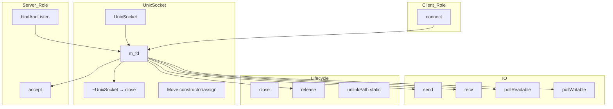
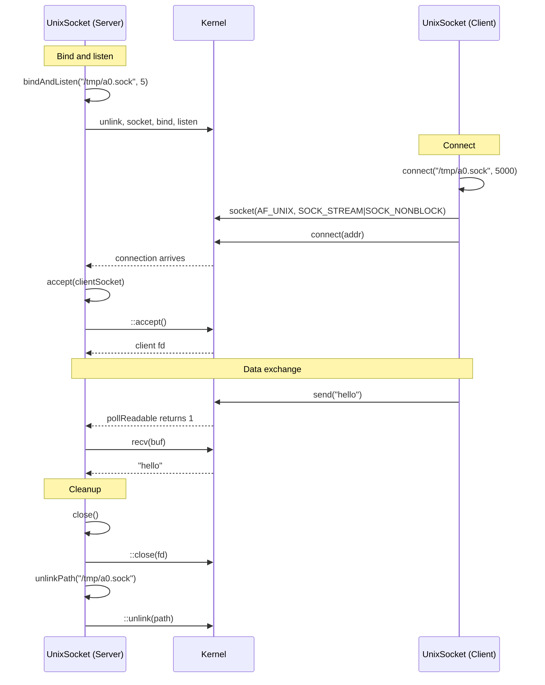

# UnixSocket Spec

## 1. Overview

RAII wrapper around a POSIX `AF_UNIX` (`SOCK_STREAM`) socket file descriptor. Supports both client and server roles: `connect()` for outbound connections and `bindAndListen()`/`accept()` for inbound. Uses `SOCK_NONBLOCK` internally for non-blocking I/O and `poll()` for connect timeouts. Move-only semantics ensure proper ownership transfer; the destructor automatically closes the fd.

**Source files:** `src/unix_socket.h/.cpp`

**Dependencies:** POSIX `sys/socket.h`, `sys/un.h`, `poll.h`, `unistd.h`

## 2. Component Specifications

```cpp
namespace a0::ipc {

class UnixSocket {
public:
    UnixSocket();
    explicit UnixSocket(int fd);
    UnixSocket(UnixSocket&& other) noexcept;
    UnixSocket& operator=(UnixSocket&& other) noexcept;
    UnixSocket(const UnixSocket&) = delete;
    UnixSocket& operator=(const UnixSocket&) = delete;
    ~UnixSocket();

    /// Bind to socketPath and start listening.
    /// Unlinks existing path first.
    int bindAndListen(const std::string& socketPath, int backlog = 5);

    /// Accept a new client connection.
    int accept(UnixSocket& client);

    /// Connect to a remote socket with optional timeout (ms).
    int connect(const std::string& socketPath, int timeoutMs = 5000);

    /// Send all bytes from data. Retries on EINTR.
    int send(const std::string& data);

    /// Receive up to buf.size() bytes. Sets received.
    int recv(std::vector<char>& buf, size_t& received);

    /// Poll for readability (-1 = infinite, 0 = no wait).
    int pollReadable(int timeoutMs = -1) const;

    /// Poll for writability (-1 = infinite, 0 = no wait).
    int pollWritable(int timeoutMs = -1) const;

    /// Close the socket fd.
    void close();

    /// Unlink a socket path from the filesystem.
    static void unlinkPath(const std::string& socketPath);

    int fd() const;
    bool isOpen() const;

    /// Release ownership of the fd. Caller must close it.
    int release();

private:
    int m_fd = -1;
    int xSetNonBlocking();
    int xCreateSocket();
};

} // namespace a0::ipc
```

### Return value convention

- `0` on success
- `-1` on error (errno preserved)
- `pollReadable`/`pollWritable`: `1` = ready, `0` = timeout, `-1` = error

## 3. Architecture Diagram



## 4. Data Flow



## 5. Testing Requirements

| Test | Verification |
|------|-------------|
| Create default socket | fd == -1, isOpen() == false |
| bindAndListen | fd >= 0, isOpen() == true |
| connect to listening socket | Returns 0, fd open |
| connect timeout | Returns -1 when no listener |
| accept client | Returns 0, client fd open |
| send/recv round-trip | Data received matches data sent |
| pollReadable with data | Returns 1 |
| pollReadable timeout | Returns 0 |
| Move semantics | Source fd becomes -1, dest takes over |
| release | Returns fd, internal fd becomes -1 |
| close | fd becomes -1, isOpen() false |
| Double close | No crash, harmless |
| unlinkPath | Removes socket file |
