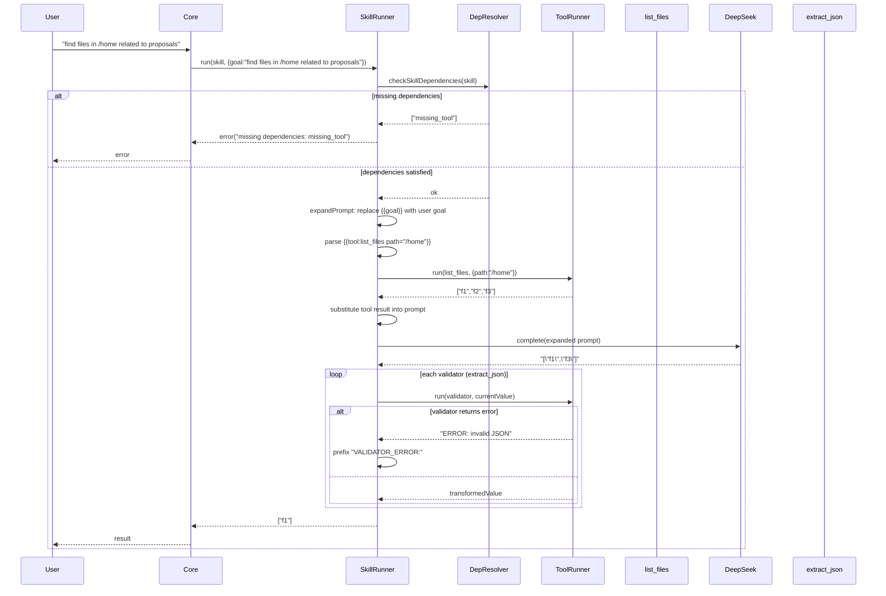

# Technical Paper: Minimal Component‑Based Agent (C++ Implementation)

## Version 2.0 – Revised Specification with Architectural Guardrails

---

## 1. Overview

This document provides the complete technical specification and development plan for a **minimal self‑evolving agent** written in **C++17**. The agent connects to the DeepSeek API, maintains a file‑based repository of **tools** (atomic bash commands) and **skills** (LLM prompts with eager tool calls, parameter substitution, optional validators), and runs inside a VM isolation environment (or directly on a host). All logs are stored locally.

**Core features**:

- Tools and skills share JSON Schema I/O (strings, arrays, objects).
- Skills support **eager tool calls** (`{{tool:name ...}}`) that execute before the LLM request.
- Skills support **parameter substitution** (`{{key}}`) where `key` is a field from the invocation parameters (e.g., `{{goal}}`).
- **Validators** (optional chain of tools) process the LLM response; validators are simple tool names (future extension for transformation bindings).
- **Dependencies** declared per skill (tools and other skills required) – **must be checked before execution**.
- **Timeout enforcement** for all tool executions (30 seconds default).
- Performance monitoring (optional, for future C++ optimization).
- Session replay via local JSON Lines logs.

This specification includes **architectural and procedural guardrails** that would have prevented common implementation omissions, such as missing dependency checks, ignored parameter substitution, absent subprocess timeouts, and incomplete `args` mode handling.

---

## 2. Component Specifications (C++ Interfaces)

The following interfaces are defined in `agent_interfaces.h`. They use modern C++17/20 features (`std::variant`, `std::optional`, smart pointers). No inheritance except abstract base classes.

**Key types**:

```cpp
using StructuredValue = std::variant<nullptr_t, bool, double, std::string,
                                     std::vector<StructuredValue>,
                                     std::unordered_map<std::string, StructuredValue>>;
using JSONSchema = std::unordered_map<std::string, StructuredValue>;
```

### 2.1 Core Data Structures

```cpp
struct Tool {
    std::string name;
    std::string description;
    std::string command;
    // "stdin": params JSON is serialized and piped to the command's stdin.
    // "args":  params is a JSON object; each top-level key-value pair is passed as a command-line argument
    //          in the form --key=value (if value is string/number) or just value (if key is "_").
    //          For a non-object params, the whole value is passed as a single argument.
    //          Arguments are shell-escaped.
    std::string inputMode = "stdin";
};

struct ValidatorBinding {
    std::string toolName;
    std::optional<std::string> transform; // future: JSONPath binding
};

struct Skill {
    std::string name;
    std::string description;
    std::string prompt;                   // may contain {{tool:...}} and {{key}} placeholders
    std::vector<std::string> dependencies;    // tool and skill names required
    std::vector<ValidatorBinding> validators; // post-LLM processing chain
};
```

### 2.2 Abstract Interfaces

```cpp
class ComponentRegistry {
public:
    virtual ~ComponentRegistry() = default;
    virtual bool loadFromDirectory(const std::string& path) = 0;
    virtual std::optional<Tool> getTool(const std::string& name) const = 0;
    virtual std::optional<Skill> getSkill(const std::string& name) const = 0;
    virtual std::vector<std::string> listTools() const = 0;
    virtual std::vector<std::string> listSkills() const = 0;
    virtual bool addTool(const Tool& tool) = 0;
    virtual bool addSkill(const Skill& skill) = 0;
};

class ToolRunner {
public:
    virtual ~ToolRunner() = default;
    // Runs a tool with the given parameters. Must enforce a 30-second timeout.
    // Returns the stdout output as a string (or JSON for structured outputs).
    // On timeout, returns a string starting with "ERROR: timeout".
    // On command failure, returns a string starting with "ERROR:".
    virtual json run(const Tool& tool, const json& params) = 0;
};

class InferenceProvider {
public:
    virtual ~InferenceProvider() = default;
    virtual std::string complete(const std::string& systemPrompt,
                                  const std::string& userPrompt) = 0;
    virtual void setMockUrl(const std::string& url) = 0;
};

struct ContextFrame {
    std::string role;
    std::string content;
};

class ContextManager {
public:
    virtual ~ContextManager() = default;
    virtual void push(const ContextFrame& frame) = 0;
    virtual ContextFrame pop() = 0;
    virtual ContextFrame peek() const = 0;
    virtual size_t size() const = 0;
    virtual void clear() = 0;
    virtual std::vector<ContextFrame> snapshot() const = 0;
};

struct LogEntry {
    std::string sessionId;
    int64_t timestamp;
    std::string eventType;
    std::string data;
};

class InvocationLogger {
public:
    virtual ~InvocationLogger() = default;
    virtual void log(const LogEntry& entry) = 0;
    virtual bool replay(const std::string& sessionId,
                        std::function<void(const LogEntry&)> callback) = 0;
    virtual std::vector<std::string> listSessions() const = 0;
};

class DependencyResolver {
public:
    virtual ~DependencyResolver() = default;
    virtual bool checkToolDependencies(const Tool& tool) const = 0;
    virtual bool checkSkillDependencies(const Skill& skill) const = 0;
    virtual std::vector<std::string> missingDependencies(const Skill& skill) const = 0;
};

class SkillRunner {
public:
    virtual ~SkillRunner() = default;
    // Expands skill.prompt by:
    //   1. Replacing {{key}} placeholders with values from params (where key matches a top-level field).
    //   2. Replacing {{tool:name key="value" ...}} placeholders with the result of executing the named tool.
    virtual std::string expandPrompt(const Skill& skill, const json& params) = 0;
    // Runs the validator chain. If any validator returns a string starting with "ERROR:",
    // the final result is prefixed with "VALIDATOR_ERROR:".
    virtual json runValidators(const Skill& skill, const json& input) = 0;
    // Executes the skill: expandPrompt -> InferenceProvider.complete() -> runValidators.
    // Before calling complete, it must verify that all dependencies are present (using DependencyResolver).
    virtual json execute(const Skill& skill, const json& params) = 0;
};

class SchemaInferenceEngine {
public:
    virtual ~SchemaInferenceEngine() = default;
    virtual Tool inferTool(const std::string& naturalLanguageDescription) = 0;
    virtual Skill inferSkill(const std::string& naturalLanguageDescription) = 0;
};

class AgentCore {
public:
    virtual ~AgentCore() = default;
    virtual bool init(const std::string& componentsDir) = 0;
    // Processes a user goal. Matches skills by exact name (case-sensitive) against the goal string.
    // If no exact match, uses SchemaInferenceEngine to infer a new skill.
    // Before executing a skill (whether found or inferred), checks dependencies via DependencyResolver.
    virtual json processGoal(const std::string& goal) = 0;
    virtual bool resumeSession(const std::string& sessionId) = 0;
    virtual std::string currentSessionId() const = 0;
    virtual void run() = 0;
};
```

---

## 3. System Architecture

The architecture includes a mandatory dependency check flow.

```mermaid
graph TB
    User((User))
    DeepSeek[("DeepSeek API")]

    subgraph "Agent Process"
        Core[AgentCore]
        Context[ContextManager]
        Reg[ComponentRegistry]
        ToolRunner[ToolRunner]
        SkillRunner[SkillRunner]
        InfEngine[SchemaInferenceEngine]
        Logger[InvocationLogger]
        DepResolver[DependencyResolver]
    end

    subgraph "File System"
        ComponentsDir[(components/)]
        LogsDir[(logs/)]
    end

    User --> Core
    Core --> Reg
    Core --> DepResolver
    Core --> ToolRunner
    Core --> SkillRunner
    SkillRunner --> DepResolver   // dependency check before LLM call
    SkillRunner --> DeepSeek
    SkillRunner --> ToolRunner
    Core --> InfEngine
    InfEngine --> DeepSeek
    InfEngine --> Reg
    Core --> Logger
    Logger --> LogsDir
    Reg --> ComponentsDir
```

**Caption**: The `DependencyResolver` is consulted before every skill execution (both pre‑existing and inferred). The `ToolRunner` enforces a 30‑second timeout. The `SkillRunner` implements parameter substitution (`{{key}}`) before eager tool calls.

---

## 4. Detailed Data Flow (Skill with Eager Tool Call, Parameter Substitution, Validators, and Dependency Check)

The following sequence diagram incorporates the mandatory dependency check and shows the correct order of operations.



**Notes**:

- Parameter substitution (`{{goal}}`) occurs **before** eager tool calls.
- Dependency check is mandatory before any LLM request or tool execution.
- Validator errors are transformed to include `VALIDATOR_ERROR:` prefix.
- The `ToolRunner` enforces a 30‑second timeout; a timeout returns `"ERROR: timeout"`.

---

## 5. Testing Requirements

### 5.1 Unit Tests (Google Test)

| Class                | Test Case                                                   | Verification                                       |
| -------------------- | ----------------------------------------------------------- | -------------------------------------------------- |
| `ToolRunner`         | `run` with `split_lines` tool                               | Input "a\nb\nc" → output `["a","b","c"]`           |
| `ToolRunner`         | `run` with `bash` tool                                      | Input "echo hello" → output "hello\n"              |
| `ToolRunner`         | `run` with `args` mode and object params                    | Command receives `--file=test.txt` style arguments |
| `ToolRunner`         | `run` with a command that sleeps 31 seconds                 | Returns `"ERROR: timeout"` (enforces 30s limit)    |
| `SkillRunner`        | `expandPrompt` with `{{goal}}` placeholder                  | Substitutes value from `params["goal"]`            |
| `SkillRunner`        | `expandPrompt` with eager tool call                         | Eager execution, substitution                      |
| `SkillRunner`        | `runValidators` with failing validator                      | Result starts with `"VALIDATOR_ERROR: ERROR: ..."` |
| `SkillRunner`        | `execute` when dependencies missing                         | Returns error message, does not call LLM           |
| `ComponentRegistry`  | `loadFromDirectory` with malformed JSON                     | Skips file, logs warning, continues                |
| `DependencyResolver` | `checkSkillDependencies` on skill with missing tool         | Returns false, missing list includes the tool      |
| `InvocationLogger`   | `log` then `replay`                                         | Log two entries, replay → callback receives both   |
| `AgentCore`          | `processGoal` with exact skill name match                   | Uses the skill, does not infer a new one           |
| `AgentCore`          | `processGoal` with non‑existent goal and inference disabled | Falls back to inference (or returns error)         |

### 5.2 End‑to‑End Tests (against mock DeepSeek)

#### Positive Tests

| ID     | Scenario        | Steps                                                                                                                    | Expected                                                   |
| ------ | --------------- | ------------------------------------------------------------------------------------------------------------------------ | ---------------------------------------------------------- |
| E2E‑01 | First run       | Start agent with empty components dir                                                                                    | Built‑in tools and meta‑skills created under `components/` |
| E2E‑02 | Infer new tool  | Send goal: "create a tool that counts lines in a file"                                                                   | New tool `count_lines` appears; can be invoked             |
| E2E‑03 | Use tool        | Invoke `count_lines` with `{path:"/etc/passwd"}`                                                                         | Returns number of lines                                    |
| E2E‑04 | Infer new skill | Send goal: "create a skill that lists files in a directory and filters those containing 'log' using list_files and grep" | New skill appears; dependencies correct                    |
| E2E‑05 | Use skill       | Invoke skill with `{directory:"/var/log"}`                                                                               | Returns array of existing files with "log" in name         |

#### Negative E2E Tests (Critical for Guardrails)

| ID     | Scenario                      | Steps                                                                               | Expected                                                       |
| ------ | ----------------------------- | ----------------------------------------------------------------------------------- | -------------------------------------------------------------- |
| E2E‑N1 | Skill with missing dependency | Create skill that depends on `nonexistent_tool`, then invoke it                     | Error message: `missing dependencies: nonexistent_tool`        |
| E2E‑N2 | Tool that hangs               | Invoke tool that runs `sleep 100`                                                   | Returns `"ERROR: timeout"` within 32 seconds                   |
| E2E‑N3 | Skill using `{{goal}}`        | Create skill with prompt `"Process: {{goal}}"`, invoke with goal "test"             | LLM receives `"Process: test"`                                 |
| E2E‑N4 | Tool with `args` mode         | Create tool with `inputMode: "args"`, command `wc -l`, params `{"input":"a\nb\nc"}` | Command receives arguments correctly (exact behaviour defined) |

**End‑to‑end test runner**: A bash script or Python harness that:

1. Starts mock DeepSeek server (fixtures for inference responses).
2. Launches agent process with `--mock-api`.
3. Sends commands via `stdin`.
4. Waits for outputs.
5. Checks exit codes and log files.
6. Verifies error messages for negative tests.

---

## 6. CLI Entry Point

```bash
agent --components-dir <path> [--env-file <path>] [--resume <session-id>] [--api-key <key>] [--mock-api <url>]
```

- `--components-dir` : Root directory for components (default `./components`).
- `--env-file` : Path to `.env` file to load (default `./.env`). Each line is `KEY=VALUE`; `#` comments and blank lines are skipped. **The implementation must overwrite existing environment variables** (i.e., use `setenv(key, val, 1)`).
- `--resume` : Session ID to replay from `./logs/`.
- `--api-key` : DeepSeek API key; if not provided, read from environment (see precedence below).
- `--mock-api` : Override the API URL (for testing, e.g., `http://localhost:8080`).

**API key precedence (highest to lowest)**:

1. `--api-key` command line argument.
2. `DEEPSEEK_API_KEY` environment variable (from parent process).
3. `DEEPSEEK_API_KEY` set in `--env-file` (default `.env`).
4. `DEEPSEEK_API_KEY` set in `~/.deepseek.env`.

**Environment**:

- `DEEPSEEK_API_KEY` – required unless `--mock-api` is used (mock server does not need key).

**Example**:

```bash
export DEEPSEEK_API_KEY="sk-..."
agent --components-dir ./my_components
```

---

## 7. Development Instructions (Revised)

### 7.1 Build Setup

**Requirements**:

- C++17 compiler (GCC 9+, Clang 12+, or MSVC 2019+)
- CMake 3.15+
- libcurl (for HTTP requests to DeepSeek API)
- jsoncpp or nlohmann/json (JSON parsing)
- (Optional) gcov/lcov for coverage, Google Test for unit tests

**CMakeLists.txt** (as in original, plus `ENABLE_TRACE` and `ENABLE_COVERAGE` options).

### 7.2 Implementation Plan (Test‑Driven, 90% Coverage)

Follow these steps **in order**:

#### Step 1: Write individual specification files for each source module

- For each `.cpp` file, create a `.spec.md` describing input/output contracts, error handling, and edge cases.

#### Step 1b (New): Interface assertion tests

- Before writing any implementation, create compile‑time or runtime assertions that verify each interface’s contract is internally consistent.
  - For `ToolRunner`: write a test that expects `run` to handle `inputMode == "args"` and enforce a timeout (even with a stub).
  - For `SkillRunner`: write a test that passes a `params` object with a `{{goal}}` placeholder and asserts that the expanded prompt contains the substituted value.
  - These tests initially fail against stubs, forcing the implementer to provide the required behaviour.

#### Step 2: Write stub implementations with no logic

- Implement all functions with empty bodies or `return {};` (or throw `std::logic_error("stub")`).
- Ensure the code compiles and links.

#### Step 3: Implement tests against the stub

- Use Google Test.
- Write unit tests that **expect failure** (assertions that the stub does not yet satisfy the spec).
- Also write “stub tests” that verify the stub returns default values without crashing.
- All tests should pass against the stub **only** for trivial cases; most functional tests fail.

#### Step 4: Implement code incrementally

- For each function, write the minimal implementation to pass its tests.
- Commit after each passing test.
- Use **TDD red‑green‑refactor** cycle.

#### Step 5: Ensure tests pass – when unsure, consult spec file

- The spec file is **authoritative**; fix either the test or the implementation accordingly.

#### Step 6: Use code coverage tool – enforce 90% coverage

- Configure CMake with `--coverage` (GCC/Clang).
- Run `lcov --capture --directory . --output-file coverage.info`
- Generate HTML report: `genhtml coverage.info --output-directory coverage_html`
- **Requirement**: line coverage ≥90%, function coverage ≥90%, branch coverage ≥90%.
- Any uncovered lines must be justified (e.g., defensive `assert` or unreachable error handling).

#### Step 7: Exhaustive trace logging with `#ifdef TRACE`

- Define `TRACE` macro in build.
- Log every function entry, exit, important variable values, tool execution, LLM request/response, validator chain steps.
- Log to `stderr` or a separate file (`trace.log`).

#### Step 8: Set up end‑to‑end testing with mock DeepSeek API

- Create a mock HTTP server (e.g., using `cpp-httplib` or a simple Python script) that returns fixture data.
- Fixtures stored in `test/fixtures/deepseek/`.

#### Step 8a (New): Negative E2E tests

- In addition to happy‑path tests, write end‑to‑end tests that deliberately trigger error conditions:
  - Missing dependency.
  - Timeout.
  - Parameter substitution.
  - `args` mode.
- Each negative test must verify that the agent returns an appropriate error message and does not crash.

#### Step 9: Run E2E tests after every change (CI hook)

- They must pass before merging.

---

## 8. File Layout

```
project/
├── CMakeLists.txt
├── src/
│   ├── main.cpp
│   ├── agent_core.cpp/.h
│   ├── component_registry.cpp/.h
│   ├── tool_runner.cpp/.h
│   ├── skill_runner.cpp/.h
│   ├── deepseek_provider.cpp/.h
│   ├── context_manager.cpp/.h
│   ├── invocation_logger.cpp/.h
│   ├── schema_inference_engine.cpp/.h
│   ├── dependency_resolver.cpp/.h
│   └── trace.h
├── test/
│   ├── unit/
│   │   ├── test_tool_runner.cpp
│   │   ├── test_skill_runner.cpp
│   │   └── ...
│   ├── e2e/
│   │   ├── mock_deepseek_server.py
│   │   ├── fixtures/
│   │   └── run_e2e_tests.sh
├── specs/                         # one .spec.md per source file
├── logs/                          # created at runtime
├── components/                    # created at runtime
└── coverage_html/                 # generated after coverage run
```

---

## 9. Development Workflow Summary

1. Write spec files for each module.
2. **Write interface assertion tests** (new) that codify the contract.
3. Write stub implementations.
4. Write unit tests (both stub‑passing and failing functional tests).
5. Implement code iteratively until all tests pass.
6. Run coverage tool; ensure ≥90% coverage.
7. Run **positive and negative** E2E tests with mock DeepSeek API; fix any failures.
8. Enable `-DTRACE` for debug builds; keep trace logs for diagnosis.
9. Commit and CI verifies all tests + coverage.

---

## 10. Future Extensions

- Streaming LLM responses and validator chains.
- C++ compilation of performance‑critical validators.
- Input/output transformation mappers in validator objects (e.g., JSONPath).
- Sandboxing for `bash` tool (command allowlist).
- Native `mustache` templating library for prompt expansion.

---
