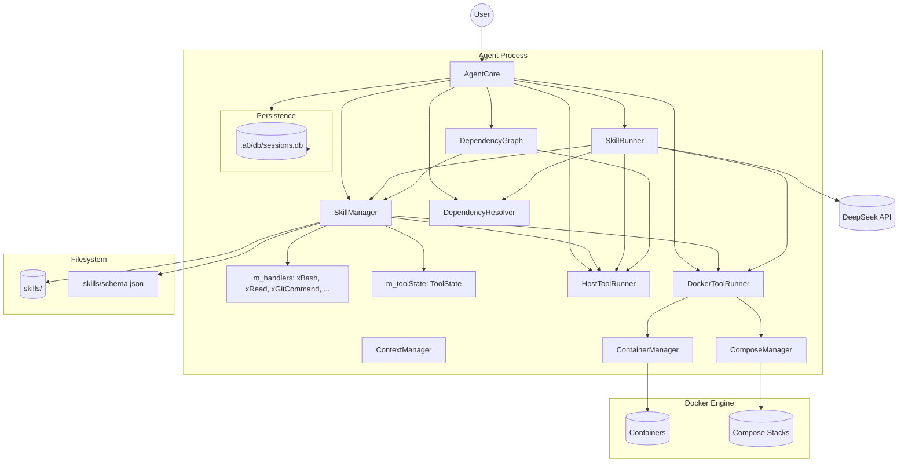
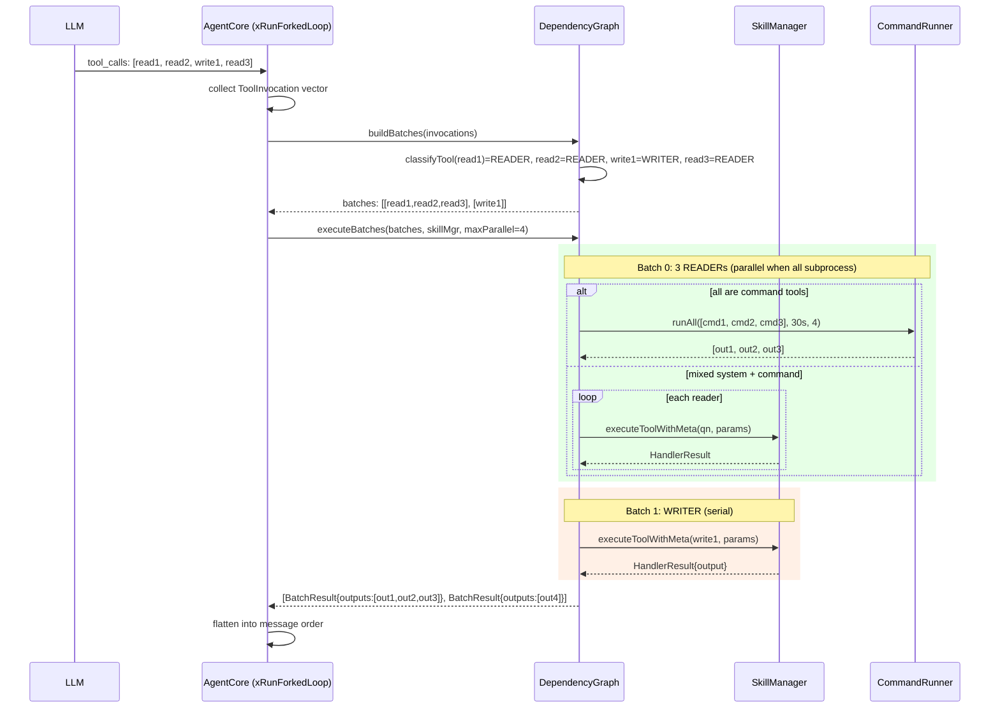
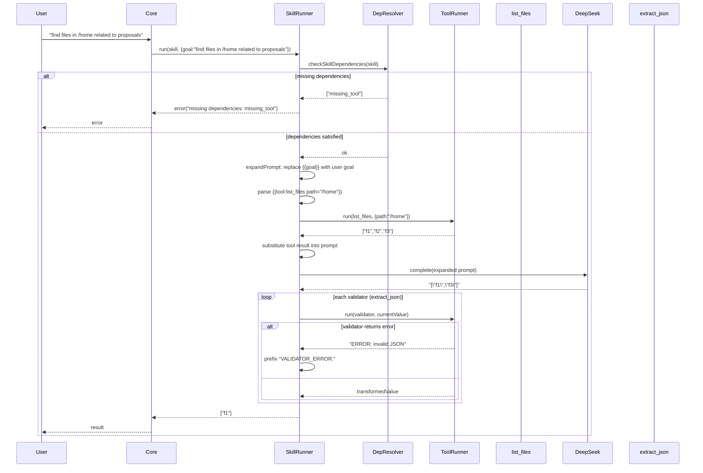
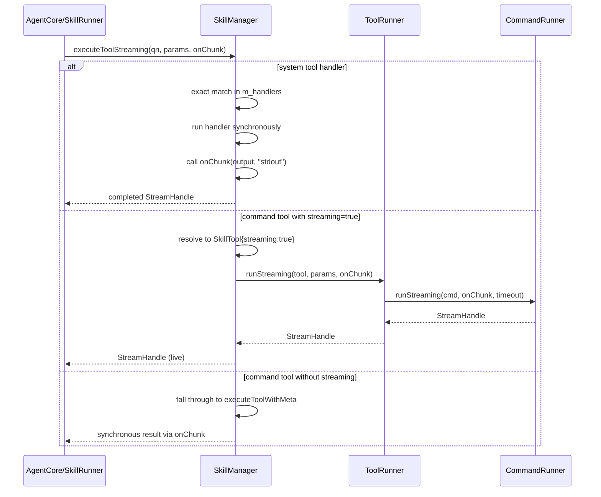
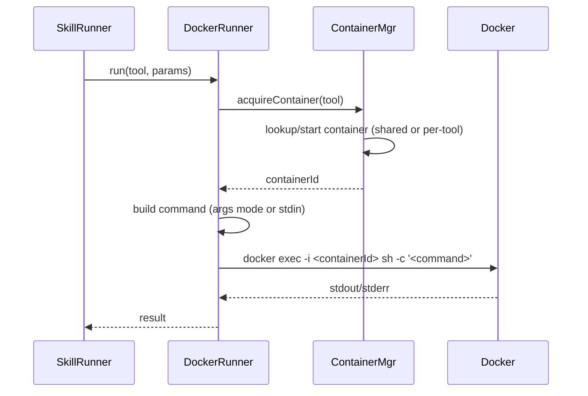

# Technical Paper: Minimal Component‑Based Agent (C++ Implementation)

## Version 2.1 – Docker Integration and Containerized Execution

---

## 1. Overview

This document provides the complete technical specification and development plan for a **minimal self‑evolving agent** written in **C++17**. The agent connects to the DeepSeek API, maintains a file‑based repository of **tools** (atomic bash commands) and **skills** (LLM prompts with eager tool calls, parameter substitution, optional validators), and runs inside a VM isolation environment (or directly on a host). All logs are stored locally.

**Core features**:

- Tools and skills share JSON Schema I/O (strings, arrays, objects).
- Skills support **eager tool calls** (`{{tool:name ...}}`) that execute before the LLM request.
- Skills support **parameter substitution** (`{{key}}`) where `key` is a field from the invocation parameters (e.g., `{{goal}}`).
- **Validators** (optional chain of tools) process the LLM response; validators are simple tool names (future extension for transformation bindings).
- **Dependencies** declared per skill (tools and other skills required) – **must be checked before execution**.
- **Timeout enforcement** for all tool executions (30 seconds default).
- **Docker execution mode**: Tools can run inside isolated containers (default Ubuntu 22.04) with configurable trust levels (HIGH/MEDIUM/LOW), shared container pools, custom images, and `apt` dependencies. Skills can bring up multi‑service environments using `docker-compose.yml`.
- Performance monitoring (optional, for future C++ optimization).
- Session replay via local JSON Lines logs.

This specification includes **architectural and procedural guardrails** that would have prevented common implementation omissions, such as missing dependency checks, ignored parameter substitution, absent subprocess timeouts, and incomplete `args` mode handling. The Docker sub‑module is a **required** extension for containerized execution.

---

## 2. Component Specifications (C++ Interfaces)

The following interfaces are defined in `agent_interfaces.h`. They use modern C++17/20 features (`std::variant`, `std::optional`, smart pointers). No inheritance except abstract base classes.

**Key types**:

```cpp
using StructuredValue = std::variant<nullptr_t, bool, double, std::string,
                                     std::vector<StructuredValue>,
                                     std::unordered_map<std::string, StructuredValue>>;
using JSONSchema = std::unordered_map<std::string, StructuredValue>;
```

### 2.1 Core Data Structures

```cpp
enum class TrustLevel {
    HIGH,      // shared container across all high-trust tools
    MEDIUM,    // shared container across all medium-trust tools
    LOW        // one container per (image, tool name) combination
};

struct Tool {
    std::string name;
    std::string description;
    std::string command;
    // "stdin": params JSON is serialized and piped to the command's stdin.
    // "args":  params is a JSON object; each top-level key-value pair is passed as a command-line argument
    //          in the form --key=value (if value is string/number) or just value (if key is "_").
    //          For a non-object params, the whole value is passed as a single argument.
    //          Arguments are shell-escaped.
    std::string inputMode = "stdin";

    // Docker execution (optional – if dockerImage empty, run on host)
    std::string dockerImage;                     // e.g., "ubuntu:22.04"
    TrustLevel trustLevel = TrustLevel::MEDIUM;
    bool useContainerPool = true;                // false = ephemeral docker run --rm
    std::vector<std::string> aptDependencies;    // packages to install via apt
    int timeoutSecs = 30;                        // per-tool timeout override
};

struct ToolCall {
    std::string id;
    std::string name;
    json arguments;
};

struct ToolSchema {
    std::string name;
    std::string description;
    json inputSchema;
};

struct ValidatorBinding {
    std::string toolName;
    std::optional<std::string> transform; // future: JSONPath binding
};

struct Prompt {
    std::string name;
    std::string description;
    std::string prompt;                   // may contain {{tool:...}} and {{key}} placeholders
    std::vector<std::string> dependencies;    // tool and prompt names required
    std::vector<ValidatorBinding> validators; // post-LLM processing chain
    std::string ns;                            // namespace context for qualified-name resolution
    std::string component;                     // component context for qualified-name resolution

    // Docker compose support
    std::string composeFile;                     // path to docker-compose.yml (relative to skill dir)
    std::vector<std::string> aptDependencies;    // rolled up into container(s) used by prompt's tools
};
```

### 2.2 Abstract Interfaces

```cpp
class SkillRegistry {
public:
    virtual ~SkillRegistry() = default;
    virtual bool loadFromDirectory(const std::string& path) = 0;
    virtual std::optional<Tool> getTool(const std::string& name) const = 0;
    virtual std::optional<Skill> getSkill(const std::string& name) const = 0;
    virtual std::vector<std::string> listTools() const = 0;
    virtual std::vector<std::string> listSkills() const = 0;
    virtual bool addTool(const Tool& tool) = 0;
    virtual bool addSkill(const Skill& skill) = 0;
};

class ToolRunner {
public:
    virtual ~ToolRunner() = default;
    // Runs a tool with the given parameters. Must enforce timeout from tool.timeoutSecs.
    // Returns the stdout output as a string (or JSON for structured outputs).
    // On timeout, returns a string starting with "ERROR: timeout".
    // On command failure, returns a string starting with "ERROR:".
    virtual json run(const Tool& tool, const json& params) = 0;

    // Streaming variant: returns immediately with a StreamHandle.
    // onChunk is called from a background thread with (chunk, direction).
    // Default implementation delegates to CommandRunner::runStreaming.
    virtual a0::StreamHandle runStreaming(const Tool& tool,
                                           const json& params,
                                           a0::StreamCallback onChunk);
};

class InferenceProvider {
public:
    virtual ~InferenceProvider() = default;
    virtual std::string complete(const std::string& systemPrompt,
                                  const std::string& userPrompt) = 0;
    virtual void setMockUrl(const std::string& url) = 0;
};

struct ContextFrame {
    std::string role;
    std::string content;
};

class ContextManager {
public:
    virtual ~ContextManager() = default;
    virtual void push(const ContextFrame& frame) = 0;
    virtual ContextFrame pop() = 0;
    virtual ContextFrame peek() const = 0;
    virtual size_t size() const = 0;
    virtual void clear() = 0;
    virtual std::vector<ContextFrame> snapshot() const = 0;
};

class DependencyResolver {
public:
    virtual ~DependencyResolver() = default;
    virtual bool checkToolDependencies(const Tool& tool) const = 0;
    virtual bool checkPromptDependencies(const Prompt& prompt) const = 0;
    virtual std::vector<std::string> missingDependencies(const Prompt& prompt) const = 0;
};

class SkillRunner {
public:
    virtual ~SkillRunner() = default;
    // Expands prompt.prompt by:
    //   1. Replacing {{key}} placeholders with values from params (where key matches a top-level field).
    //   2. Replacing {{tool:name key="value" ...}} placeholders with the result of executing the named tool.
    //   3. Replacing {{tool_call:qualified_name}} placeholders with the short name.
    virtual std::string expandPrompt(const Prompt& prompt, const json& params) = 0;
    // Runs the validator chain. If any validator returns a string starting with "ERROR:",
    // the final result is prefixed with "VALIDATOR_ERROR:".
    virtual json runValidators(const Prompt& prompt, const json& input) = 0;
    // Executes the prompt: expandPrompt -> InferenceProvider.complete() -> runValidators.
    // Before calling complete, it must verify that all dependencies are present (using DependencyResolver).
    virtual json execute(const Prompt& prompt, const json& params) = 0;

    // Streaming variant: executes the prompt with streaming tool invocations.
    virtual a0::StreamHandle executeStreaming(const Prompt& prompt,
                                               const json& params,
                                               a0::StreamCallback onChunk) = 0;

    virtual void setGlobalVar(const std::string& key, const std::string& value) = 0;
    virtual void setGlobalVars(const std::unordered_map<std::string, std::string>& vars) = 0;
};


class AgentCore {
public:
    virtual ~AgentCore() = default;
    virtual bool init(const std::string& componentsDir) = 0;
    // Processes a user goal. Matches prompts by exact name (case-sensitive) against the goal string.
    // If no exact match, enters the forked tool-calling loop (xRunForkedLoop).
    virtual json processGoal(const std::string& goal) = 0;
    // Streaming variant: processes a goal with streaming tool invocations.
    virtual a0::StreamHandle processGoalStreaming(const std::string& goal,
                                                   a0::StreamCallback onChunk) = 0;
    virtual bool resumeSession(const std::string& sessionId) = 0;
    virtual std::string currentSessionId() const = 0;
    virtual void run() = 0;
};

// === Docker Integration Interfaces ===
// Full implementations reside in ./src/docker/

class ContainerManager {
public:
    virtual ~ContainerManager() = default;
    virtual std::string acquireContainer(const Tool& tool) = 0;
    virtual std::string execInContainer(const std::string& containerId,
                                        const std::string& command,
                                        const std::string& stdinData = "") = 0;
    virtual void pruneIdleContainers() = 0;
};

class ComposeManager {
public:
    virtual ~ComposeManager() = default;
    virtual std::string startEnvironment(const Prompt& prompt, const std::string& skillDirectory) = 0;
    virtual void stopEnvironment(const Prompt& prompt) = 0;
    virtual void markUsed(const Prompt& prompt) = 0;
    virtual void setCurrentPrompt(const Prompt& prompt) = 0;
    virtual std::string getCurrentNetwork() const = 0;
    virtual void clearCurrentPrompt() = 0;
};

class DockerToolRunner : public ToolRunner {
public:
    virtual ~DockerToolRunner() = default;
    // Constructor (in implementation) will take ContainerManager* and ComposeManager*.
};
```

---

## 3. System Architecture

The architecture includes both host and Docker execution paths, with mandatory dependency check and container pooling. The `SystemToolRegistry` has been eliminated — all tool dispatch (both C++ system handlers and command-based subprocess tools) goes through `SkillManager`'s handler registry. A `DependencyGraph` batch executor parallelizes reader-class tools, and a `ToolState` bag carries per-session state across invocations.



**Caption**: `SkillManager` owns both the manifest index (loaded from `skills/`) and the `m_handlers` registry of C++ system tool handlers. It dispatches to `HostToolRunner`/`DockerToolRunner` for command-based tools. `DependencyGraph` batches tool invocations from the forked loop, parallelizing pure readers. `ToolState` is injected into handlers via `HandlerContext` for cross-invocation state. `SkillLoader` validates all `skill.json` manifests against `skills/schema.json` (Draft-07) at load time.

---

## 4. Detailed Data Flow

The following sequence diagrams show the execution paths for skills and Docker‑based tools.

### 4.0 DependencyGraph Batched Tool Execution



### 4.1 Skill Execution with Dependency Check and Eager Tool Calls



### 4.1a Streaming Tool Execution



### 4.1b ToolState Lifecycle

```
processGoal() start → ToolState::clear()           ← reset all per-session state
     ↓
xRunForkedLoop turn 1 → handler set("browser:page", handle)
xRunForkedLoop turn 2 → handler get("browser:page") → reuse handle
     ↓
processGoal() end    → next processGoal() clears again
```

### 4.2 Docker Tool Execution (Containerized)



**Note**: When a skill declares a `composeFile`, the `SkillRunner` first calls `ComposeManager::startEnvironment` to bring up the compose stack; the tool container is then attached to the resulting network.

---

## 5. Testing Requirements

### 5.1 Unit Tests (Google Test)

| Class                | Test Case                                                   | Verification                                       |
| -------------------- | ----------------------------------------------------------- | -------------------------------------------------- |
| `ToolRunner`         | `run` with `split_lines` tool                               | Input "a\nb\nc" → output `["a","b","c"]`           |
| `ToolRunner`         | `run` with `bash` tool                                      | Input "echo hello" → output "hello\n"              |
| `ToolRunner`         | `run` with `args` mode and object params                    | Command receives `--file=test.txt` style arguments |
| `ToolRunner`         | `run` with a command that sleeps 31 seconds                 | Returns `"ERROR: timeout"` (enforces timeoutSecs)  |
| `ToolRunner`         | `runStreaming` basic echo                                   | onChunk called with output, handle.isDone() true   |
| `SkillRunner`        | `expandPrompt` with `{{goal}}` placeholder                  | Substitutes value from `params["goal"]`            |
| `SkillRunner`        | `expandPrompt` with eager tool call                         | Eager execution, substitution                      |
| `SkillRunner`        | `expandPrompt` with `{{tool_call:...}}`                     | Short name substitution                            |
| `SkillRunner`        | `runValidators` with failing validator                      | Result starts with `"VALIDATOR_ERROR: ERROR: ..."` |
| `SkillRunner`        | `execute` when dependencies missing                         | Returns error message, does not call LLM           |
| `SkillRegistry`      | `loadFromDirectory` with malformed JSON                     | Skips file, logs warning, continues                |
| `DependencyResolver` | `checkPromptDependencies` on prompt with missing tool       | Returns false, missing list includes the tool      |
| `AgentCore`          | `processGoal` with exact prompt name match                  | Uses the prompt, does not infer a new one          |
| `AgentCore`          | `processGoal` with non‑existent goal                        | Falls back to forked tool-calling loop             |
| `AgentCore`          | `processGoal` forked loop max turns exceeded                | Returns `"ERROR: max tool call turns exceeded"`    |
| `DependencyGraph`    | `classifyTool` READER prefix                                | Returns READER                                       |
| `DependencyGraph`    | `classifyTool` WRITER prefix                                | Returns WRITER                                       |
| `DependencyGraph`    | `classifyTool` unknown                                      | Returns READ_WRITE                                   |
| `DependencyGraph`    | `buildBatches` mixed readers/writers                        | Correct ordering: readers batch first, then writers  |
| `DependencyGraph`    | `executeBatches` reader command tools                       | `CommandRunner::runAll` called for parallel execution |
| `ToolState`          | `set`/`get`/`has`/`remove`/`clear`                          | All CRUD operations correct                          |
| `ToolState`          | Thread-safe concurrent access                               | No data races under TSAN                             |
| `SkillManager`       | `executeToolStreaming` system tool                          | Synchronous handler, single onChunk call             |
| `SkillManager`       | `executeToolStreaming` command tool                         | Delegates to `ToolRunner::runStreaming`              |
| `SkillManager`       | `toolState` accessor                                        | Returns reference to `m_toolState`                   |
| `SkillLoader`        | `validateAgainstSchema` valid manifest                      | Returns 0                                            |
| `SkillLoader`        | `validateAgainstSchema` invalid manifest                    | Returns -1, errors populated                         |
| `SkillLoader`        | Schema file missing                                         | Warning printed, validation passes through           |
| `ComposeManager`     | `startPersistent` new stack                                 | composeUp called, persistent set                     |
| `ComposeManager`     | `stopPersistent` active stack                               | composeDown called, entries removed                  |
| `ComposeManager`     | `isPersistent` persistent vs ephemeral                      | Correct boolean returned                             |

### 5.2 End‑to‑End Tests (against mock DeepSeek)

#### Positive Tests

| ID     | Scenario        | Steps                                                                                                                    | Expected                                                   |
| ------ | --------------- | ------------------------------------------------------------------------------------------------------------------------ | ---------------------------------------------------------- |
| E2E‑01 | First run       | Start agent with empty components dir                                                                                    | Built‑in tools and meta‑skills created under `components/` |
| E2E‑02 | Infer new tool  | Send goal: "create a tool that counts lines in a file"                                                                   | New tool `count_lines` appears; can be invoked             |
| E2E‑03 | Use tool        | Invoke `count_lines` with `{path:"/etc/passwd"}`                                                                         | Returns number of lines                                    |
| E2E‑04 | Infer new prompt/skill | Send goal: "create a skill that lists files in a directory and filters those containing 'log' using list_files and grep" | New prompt appears; dependencies correct |
| E2E‑05 | Use prompt       | Invoke prompt with `{directory:"/var/log"}`                                                                               | Returns array of existing files with "log" in name         |

#### Skill Schema Validation Tests

| ID     | Scenario                      | Steps                                                                               | Expected                                                       |
| ------ | ----------------------------- | ----------------------------------------------------------------------------------- | -------------------------------------------------------------- |
| E2E‑S1 | Valid skill.json              | Load skills with well-formed manifest                                               | Component loaded, tools+prompts available                      |
| E2E‑S2 | Invalid skill.json            | Load skills with manifest missing required `version` field                          | Warning printed, component skipped                             |
| E2E‑S3 | Schema file missing           | Delete `skills/schema.json`, restart agent                                          | Warning printed, validation disabled, all manifests load       |
| E2E‑S4 | Skill with `streaming` tool   | Define tool with `"streaming": true`, invoke via `executeToolStreaming`             | Streaming handle returned, chunks delivered via callback       |

#### Negative E2E Tests (Critical for Guardrails)

| ID     | Scenario                      | Steps                                                                               | Expected                                                       |
| ------ | ----------------------------- | ----------------------------------------------------------------------------------- | -------------------------------------------------------------- |
| E2E‑N1 | Skill with missing dependency | Create skill that depends on `nonexistent_tool`, then invoke it                     | Error message: `missing dependencies: nonexistent_tool`        |
| E2E‑N2 | Tool that hangs               | Invoke tool that runs `sleep 100`                                                   | Returns `"ERROR: timeout"` within 32 seconds                   |
| E2E‑N3 | Skill using `{{goal}}`        | Create skill with prompt `"Process: {{goal}}"`, invoke with goal "test"             | LLM receives `"Process: test"`                                 |
| E2E‑N4 | Tool with `args` mode         | Create tool with `inputMode: "args"`, command `wc -l`, params `{"input":"a\nb\nc"}` | Command receives arguments correctly (exact behaviour defined) |

### 5.3 Docker‑Specific Tests

#### Unit Tests (with mock Docker CLI)

| Class                 | Test Case                          | Verification                                         |
| --------------------- | ---------------------------------- | ---------------------------------------------------- |
| `ContainerManager`    | `acquireContainer` with HIGH trust | Same container ID for two different high‑trust tools |
| `ContainerManager`    | `acquireContainer` with LOW trust  | Different containers for different tool names        |
| `ContainerManager`    | `pruneIdleContainers`              | Container idle > timeout removed                     |
| `DependencyInstaller` | `installDependencies`              | Idempotent installation                              |
| `ComposeManager`      | `startEnvironment`                 | `docker-compose up -d` called only once per skill    |
| `DockerToolRunner`    | `run` with `args` mode             | Command arguments passed correctly inside container  |
| `DockerToolRunner`    | `run` with timeout                 | Timeout enforced (kills container command)           |
| `DockerToolRunner`    | `runStreaming` pooled              | StreamHandle returned, chunks via callback           |
| `DockerToolRunner`    | `runStreaming` ephemeral           | StreamHandle returned, `docker run --rm` used        |

#### End‑to‑End Tests (with real Docker daemon)

| ID     | Scenario                                     | Expected                             |
| ------ | -------------------------------------------- | ------------------------------------ |
| E2E‑D1 | Basic tool in default image (`ubuntu:22.04`) | Output matches command               |
| E2E‑D2 | `aptDependencies` installed correctly        | Tool can use installed package       |
| E2E‑D3 | Trust level HIGH – container sharing         | Two tools run in same container      |
| E2E‑D4 | Trust level LOW – isolation                  | Each tool gets its own container     |
| E2E‑D5 | Skill with `docker-compose.yml`              | Services start, tool can connect     |
| E2E‑D6 | Container pruning                            | Idle container removed after timeout |
| E2E‑D7 | Persistent compose lifecycle                 | `startPersistent` → tool calls → `stopPersistent` cleanly tears down |
| E2E‑D8 | Playwright browser skill                     | `playwright` skill runs E2E test via browser.sh + bridge.js |

---

## 6. CLI Entry Point

```bash
agent [--a0-dir <path>] [--env-file <path>] [--log-file <path>] [--resume <session-id>]
      [--api-key <key>] [--mock-api <url>]
      [--docker-host <url>] [--container-idle-timeout <seconds>]
      [--max-idle-containers <count>] [--default-docker-image <image>] [--no-docker]
      [--max-parallel <n>] [--external-repo <url>] [--skill-arg <key=val> ...]
      <subcommand>
```

**Subcommands**:

| Subcommand | Flags | Description |
|-----------|-------|-------------|
| *(none)* | — | Interactive REPL mode |
| `run` | `--skill <name> --params <json>` | Execute a skill and exit |
| `terminal` | `--terminal-id <id> --cwd <path>` | PTY terminal session (shell prompt) |
| `kill-all` | — | Stop daemon processes (b1, c2) |
| `session` | `export`, `list` | Session operations |

- `--a0-dir` : Root directory for non-committed agent artifacts (default `./.a0`). Created on startup if missing; on first creation, automatically appended to `.gitignore` when CWD is a git repository. All runtime state (b1 socket/pid, SQLite database, skills store, logs) is scoped under this directory.
- `--env-file` : Path to `.env` file to load (default `./.env`). Each line is `KEY=VALUE`; `#` comments and blank lines are skipped. **The implementation must overwrite existing environment variables** (i.e., use `setenv(key, val, 1)`).
- `--log-file <path>` : Redirect stderr to file. Child daemons derive their own path (e.g., `/tmp/a0.log` → b1 gets `/tmp/a0-b1.log`). All three daemons (a0, b1, c2) support this flag.

- `--api-key` : DeepSeek API key; if not provided, read from environment (see precedence below).
- `--mock-api` : Override the API URL (for testing, e.g., `http://localhost:8080`).

**Terminal subcommand flags**:

- `--terminal-id <id>` : Terminal identifier for c2 stream lookup. Matches the `terminalId` returned by `POST /api/terminal/open`.
- `--cwd <path>` : Working directory for the terminal shell. a0 `chdir()`s to this path before creating the PTY and forking the login shell.

**Execution flags**:

- `--max-parallel <n>` : Maximum concurrent tool executions for the DependencyGraph batching subsystem (default `4`). Controls how many subprocesses run simultaneously in a READER batch.
- `--external-repo <url>` : External a0 repository URL for self-development scripts and tool resources. The repo is cloned into `a0Dir/external/a0/` at startup (or fetched/checkout/reset if already present). Sets global var `A0_SRC_DIR`.
- `--skill-arg <key=val>` : Repeatable flag. Passes arguments to skill tool handlers via `ToolState` (keyed `"args:<skill>-<arg>"`). Bare keys (without `=`) are treated as `key=true`.

**Docker‑specific flags**:

- `--docker-host` : Docker daemon socket URL (default `unix:///var/run/docker.sock`).
- `--container-idle-timeout` : Seconds after which an idle container is pruned (default `300`).
- `--max-idle-containers` : Maximum number of idle containers allowed per pool (default `10`).
- `--default-docker-image` : Default image when tool does not specify `dockerImage` (default `ubuntu:22.04`).
- `--no-docker` : Disable Docker integration; fall back to host runner for all tools.

**Environment variables** (override defaults):

- `A0_DIR` — default `.a0/` root (overridden by `--a0-dir`)
- `A0_DOCKER_HOST`
- `A0_CONTAINER_IDLE_TIMEOUT`
- `A0_MAX_IDLE_CONTAINERS`
- `A0_DEFAULT_DOCKER_IMAGE`

**API key precedence (highest to lowest)**:

1. `--api-key` command line argument.
2. `DEEPSEEK_API_KEY` environment variable (from parent process).
3. `DEEPSEEK_API_KEY` set in `--env-file` (default `.env`).
4. `DEEPSEEK_API_KEY` set in `~/.deepseek.env`.

**Example**:

```bash
export DEEPSEEK_API_KEY="sk-..."
agent --components-dir ./my_components --container-idle-timeout 600 --max-idle-containers 5 \
      --max-parallel 8 --external-repo https://github.com/opensassi/a0 \
      --skill-arg playwright-headless=true
```

---

## 7. Development Instructions (Revised)

### 7.1 Build Setup

**Requirements**:

- C++17 compiler (GCC 9+, Clang 12+, or MSVC 2019+)
- CMake 3.15+
- libcurl (for HTTP requests to DeepSeek API)
- jsoncpp or nlohmann/json (JSON parsing)
- (Optional) gcov/lcov for coverage, Google Test for unit tests
- **Docker** (for containerized execution) – optional but required for Docker features

**CMakeLists.txt** (as in original, plus `ENABLE_TRACE` and `ENABLE_COVERAGE` options). The Docker sub‑module sources reside in `./src/docker/` and are compiled into the main library.

### 7.2 Startup Sequence

On launch, `main.cpp` follows this order:

1. **Parse flags (two-pass)** — extract `--env-file` first, then all flags including `--a0-dir`, `--max-parallel`, `--external-repo`, `--skill-arg` (repeatable).
2. **Parse `--skill-arg`** — split each `key=val` pair into a map (bare keys → `"true"`).
3. **Resolve API key** — `--api-key` → `DEEPSEEK_API_KEY` env → `.env` → `~/.deepseek.env`.
4. **Initialize `.a0/`** — `ensureA0Dir(a0Dir)` creates the directory if missing. On first creation, if the CWD is a git repository, appends `.a0/` to `.gitignore`.
5. **`--kill-all` cleanup** — reads `.a0/b1.pid` and the c2 PID file, sends SIGTERM/SIGKILL, unlinks sockets, exits.
6. **Component construction** — skill registry (SkillLoader with valijson schema validation), tool runners, Docker managers, etc.
7. **Handler registration** — `xRegisterSystemHandlers()` registers all C++ handlers with `HandlerContext` (carrying `ToolState*`).
8. **Wire settings** — `core.setMaxParallel(maxParallel)`, `core.setExternalRepo(externalRepo)`, `core.setSkillArgs(skillArgs)`.
9. **`core.init(skillsDir, a0Dir)`** — loads manifests (schema-validated), clones external repo if `--external-repo` set, injects skill args into ToolState, generates session ID.
10. **b1 auto-launch** — if not `--no-b1` and not in `--run` mode, start/connect to b1 supervisor using paths under `a0Dir`.
11. **`--run` mode** — execute a skill non-interactively and exit.
12. **Interactive REPL** — `core.run()` blocks until EOF.

### 7.3 Implementation Plan (Test‑Driven, 90% Coverage)

Follow these steps **in order**:

#### Step 1: Write individual specification files for each source module

- For each `.cpp` file, create a `.spec.md` describing input/output contracts, error handling, and edge cases.

#### Step 1b: Interface assertion tests

- Before writing any implementation, create compile‑time or runtime assertions that verify each interface’s contract is internally consistent.
  - For `ToolRunner`: write a test that expects `run` to handle `inputMode == "args"` and enforce a timeout (even with a stub).
  - For `SkillRunner`: write a test that passes a `params` object with a `{{goal}}` placeholder and asserts that the expanded prompt contains the substituted value.
  - For `SkillManager`: write a test that registers a handler via `registerHandler`, calls `executeTool` with the exact key, and asserts the handler output is returned. Also test wildcard resolution (`system:git:*` with `_subcommand`).
  - These tests initially fail against stubs, forcing the implementer to provide the required behaviour.

#### Step 2: Write stub implementations with no logic

- Implement all functions with empty bodies or `return {};` (or throw `std::logic_error("stub")`).
- Ensure the code compiles and links.

#### Step 3: Implement tests against the stub

- Use Google Test.
- Write unit tests that **expect failure** (assertions that the stub does not yet satisfy the spec).
- Also write “stub tests” that verify the stub returns default values without crashing.
- All tests should pass against the stub **only** for trivial cases; most functional tests fail.

#### Step 4: Implement code incrementally

- For each function, write the minimal implementation to pass its tests.
- Commit after each passing test.
- Use **TDD red‑green‑refactor** cycle.

#### Step 5: Ensure tests pass – when unsure, consult spec file

- The spec file is **authoritative**; fix either the test or the implementation accordingly.

#### Step 6: Use code coverage tool – enforce 90% coverage

- Configure CMake with `--coverage` (GCC/Clang).
- Run `lcov --capture --directory . --output-file coverage.info`
- Generate HTML report: `genhtml coverage.info --output-directory coverage_html`
- **Requirement**: line coverage ≥90%, function coverage ≥90%, branch coverage ≥90%.
- Any uncovered lines must be justified (e.g., defensive `assert` or unreachable error handling).

#### Step 7: Session persistence with SQLite

- Wire `PersistenceStore` (SqliteStore) through AgentCore at startup.
- Record every user message, LLM invocation, tool call, and result to the `message` table.
- Use sub-session tracking (subSessionId + seq) for the forked tool-calling loop.
- Enable `ValidationEngine` to read historical invocations from the `invocation` table for upgrade validation.
- Implement streaming persistence: `Stream` + `StreamChunk` tables for live tool output recording.

#### Step 8: Set up end‑to‑end testing with mock DeepSeek API

- Create a mock HTTP server (e.g., using `cpp-httplib` or a simple Python script) that returns fixture data.
- Fixtures stored in `test/fixtures/deepseek/`.

#### Step 8a: Negative E2E tests

- In addition to happy‑path tests, write end‑to‑end tests that deliberately trigger error conditions:
  - Missing dependency.
  - Timeout.
  - Parameter substitution.
  - `args` mode.
- Each negative test must verify that the agent returns an appropriate error message and does not crash.

#### Step 9: Run E2E tests after every change (CI hook)

- They must pass before merging.

#### Step 10: Implement Docker sub‑module

The Docker sub‑module is a **required** part of the agent for containerized tool execution. Its complete technical specification is located in `./src/docker/technical-specification.md` and the implementation source code resides in `./src/docker/`. The key implementation phases are:

10.1 Implement `ContainerManager` and `DependencyInstaller` using Docker CLI calls (via `popen` or libcurl over the Docker socket).
10.2 Implement `DockerToolRunner` and integrate into `AgentCore` (tool runner selection based on `dockerImage` presence).
10.3 Implement `ComposeManager` for skill‑level compose environments.
10.4 Add pruning logic and CLI flags as described in Section 6.
10.5 Write unit tests with a mock Docker executable (e.g., a bash script that simulates `docker` commands).
10.6 Run Docker‑specific E2E tests with a real Docker daemon (if available in CI).

All Docker‑related code must be placed in `./src/docker/`, with its own `CMakeLists.txt` included from the top‑level `CMakeLists.txt`.

#### Step 11: Implement Skills sub‑module

The Skills sub‑module is a **required** part of the agent for tool/skill lifecycle management, distribution, and version validation. Its complete technical specification is located in `./src/skills/technical-specification.md` and the implementation source code resides in `./src/skills/`. The key implementation phases are:

11.1 Implement `SkillLoader` — directory walking, `skill.json` parsing, three-tier namespace index.
11.2 Implement `SkillManager` facade — qualified name resolution, `addTool`/`addPrompt`, CLI dispatch.
11.3 Implement `VersionManager` — `.a0/store/` archival, `lock.json` refcounting, GC.
11.4 Implement `ValidationEngine` — historical log replay, output comparison, compat bridge execution.
11.5 Wire `SkillManager` into `AgentCore`.
11.6 Add `a0 skill` CLI subcommand routing in `main.cpp`.
11.7 Write unit tests with fixture skill trees and mock historical logs.
11.8 Write integration tests for install/remove/gc with a mock GitHub endpoint.

All built-in tool handlers are registered directly on `SkillManager` via `registerHandler()` in `main.cpp`'s `xRegisterSystemHandlers()`. Each handler is a free-standing function in `namespace a0` (`xBash`, `xRead`, `xGitCommand`, etc.) returning `HandlerResult`. `SkillManager::executeTool()` resolves through exact match → 2-part alias → wildcard → command tool subprocess, providing a single dispatch path for all tools.

All skills‑related code must be placed in `./src/skills/`, with its own `CMakeLists.txt` included from the top‑level `CMakeLists.txt`.

#### Step 12: Implement CommandRunner utility

The `CommandRunner` is a stateless utility class that wraps all subprocess creation in the agent. Every `fork()`, `exec()`, `pipe()`, `alarm()` call is isolated here — no other class manages processes directly.

12.1 Implement `CommandRunner::run()` — single command execution with stdin piping, alarm timeout, stdout/stderr capture, and process group management.
12.2 Implement `CommandRunner::runAll()` — parallel command execution via N-child fork + waitpid loop, configurable `maxParallel`.
12.3 Implement `CommandRunner::shellEscape()` — single-quote shell escaping for safe argument passing.
12.4 Refactor `SubprocessToolRunner` to delegate all subprocess calls to `CommandRunner::run()`, retaining only command-building logic (args mode, stdin mode).
12.5 Refactor `DockerCLIWrapper` to use `CommandRunner::run()` instead of its own `execSimple`/`execWithTimeout`/`shellEscape` internals.
12.6 Refactor `DockerToolRunnerImpl::execDockerRun` to delegate to `CommandRunner::run()`.
12.7 Refactor `ValidationEngine` to use `CommandRunner::run()` for replay and compat bridge execution.
12.8 Remove duplicate `shellEscape`, `handleAlarm`, signal handler, and fork/exec/pipe code from all other files.
12.9 Write unit tests for CommandRunner (echo, timeout, pipe, parallel, edge cases).

---

## 8. File Layout

```
project/
├── CMakeLists.txt
├── c2/
│   └── web/                             # c2 dashboard SPA (WebComponents)
│       ├── index.html
│       ├── css/main.css
│       ├── js/
│       │   ├── app.js                   # Bootstrap, router, selectById, sanitizeId
│       │   ├── store.js
│       │   ├── sse.js
│       │   ├── api.js
│       │   └── components/              # 16 WebComponents, each in own folder
│       │       ├── app-shell/index.js + component.json
│       │       ├── app-header/index.js + component.json
│       │       ├── dashboard-page/index.js + component.json
│       │       └── ... (13 more)
│       └── lib/xterm/                   # xterm.js terminal emulator
├── docker/
│   ├── Dockerfile.playwright            # Playwright browser automation image
│   └── docker-compose.playwright.yml    # Playwright compose stack
├── scripts/
│   ├── browser.sh                       # Browser CLI shim
│   └── playwright-bridge.js             # Node.js HTTP daemon for 23 Playwright actions
├── src/
│   ├── a0_dir.h/.cpp                    # .a0/ directory lifecycle (create, gitignore)
│   ├── command_runner.h/.cpp            # All subprocess management (fork/exec/pipe/alarm)
│   ├── dependency_graph.h/.cpp          # Reader/writer classification + batch execution
│   ├── tool_state.h/.cpp                # Thread-safe per-session key-value state bag
│   ├── handler_results.h                # HandlerResult struct for system tool dispatch
│   ├── system_handlers.h/.cpp           # Free-standing C++ handler functions (xBash, xRead, xGitCommand, etc.)
│   ├── main.cpp
│   ├── agent_core.cpp/.h
│   ├── tool_runner.cpp/.h               # HostToolRunner + DockerToolRunner
│   ├── skill_runner.cpp/.h
│   ├── deepseek_provider.cpp/.h
│   ├── context_manager.cpp/.h

│   ├── dependency_resolver.cpp/.h
│   ├── trace.h
│   ├── stream_registry.h/.cpp           # Streaming IPC support
│   ├── docker_security_filter.h/.cpp    # Docker command filtering
│   ├── docker/                          # Docker sub‑module (required)
│   │   ├── technical-specification.md
│   │   ├── container_manager.cpp/.h
│   │   ├── compose_manager.cpp/.h
│   │   ├── docker_tool_runner.cpp/.h
│   │   ├── dependency_installer.cpp/.h
│   │   └── CMakeLists.txt
│   └── skills/                          # Skills sub‑module (required)
│       ├── technical-specification.md   # Full skills integration spec
│       ├── skills.h                     # Data structures + SkillManager facade + ToolHandler typedef
│       ├── skill_manager.cpp
│       ├── skill_loader.h/.cpp          # Now with valijson schema validation
│       ├── version_manager.h/.cpp
│       ├── validation_engine.h/.cpp
│       └── CMakeLists.txt
├── test/
│   ├── unit/
│   │   ├── test_tool_runner.cpp
│   │   ├── test_skill_runner.cpp
│   │   ├── test_docker_*.cpp            # Docker unit tests
│   │   ├── test_skill_manager.cpp
│   │   ├── test_skill_loader.cpp
│   │   ├── test_version_manager.cpp
│   │   ├── test_validation_engine.cpp
│   │   ├── test_dependency_graph.cpp    # DependencyGraph batching + execution
│   │   ├── test_tool_state.cpp          # ToolState CRUD + thread safety
│   │   ├── test_pipeline_execution.cpp  # End-to-end pipeline tests
│   │   ├── test_external_a0.cpp         # External repo clone tests
│   │   ├── test_skill_args.cpp          # --skill-arg injection tests
│   │   ├── test_skill_pipeline.cpp      # Multi-step skill pipeline tests
│   │   └── test_skill_schema.cpp        # JSON Schema validation tests
│   ├── e2e/
│   │   ├── mock_deepseek_server.py
│   │   ├── fixtures/
│   │   │   ├── find_related_files_response.json
│   │   │   ├── infer_skill_response.json
│   │   │   ├── infer_tool_response.json
│   │   │   ├── tool_calls_response.json
│   │   │   └── tools_for_prompt_response.json
│   │   ├── run_e2e_tests.sh
│   │   ├── test_playwright_e2e.sh       # 14 Playwright browser E2E tests
│   │   ├── test_c2_dashboard_e2e.sh     # 29-assertion c2 dashboard E2E test (headed browser)
│   │   └── test_c2_agent_interact.sh    # 25-assertion agent interaction page E2E test
├── skills/                          # three-tier namespace
│   ├── schema.json                  # Draft-07 JSON Schema for skill.json validation
│   ├── README.md                    # Developer guide (661 lines)
│   ├── system/                      # shipped with agent (read-only)
│   ├── local/                       # agent-created (writable)
│   │   └── playwright/              # Playwright skill (22 tools, 1 prompt)
│   │       ├── skill.json
│   │       └── prompts/
│   │           └── e2e_test.md
│   └── github_<user>/               # installed from GitHub (read-only)
├── .a0/                             # agent internal state (auto-created, gitignored)
│   ├── b1.pid                       # b1 supervisor PID file
│   ├── b1.sock                      # b1 supervisor Unix socket
│   ├── db/
│   │   └── sessions.db              # SQLite session database
│   ├── store/                       # version archive keyed by commit hash

│   └── lock.json                    # version refcounts + metadata

└── coverage_html/                   # generated after coverage run
```

---

## 9. Development Workflow Summary

1. Write spec files for each module.
2. **Write interface assertion tests** that codify the contract.
3. Write stub implementations.
4. Write unit tests (both stub‑passing and failing functional tests).
5. Implement code iteratively until all tests pass.
6. Run coverage tool; ensure ≥90% coverage.
7. Run **positive and negative** E2E tests with mock DeepSeek API; fix any failures.
8. Implement Docker sub‑module (following `./src/docker/technical-specification.md`).
9. Run Docker‑specific tests (unit and E2E with real Docker).
10. Implement Skills sub‑module (following `./src/skills/technical-specification.md`).
11. Implement `CommandRunner` utility — centralize all fork/exec/pipe/alarm code.
12. Implement `DependencyGraph` — reader/writer classification, batch builder, batch executor.
13. Implement `ToolState` — per-session state bag for cross-invocation tool state.
14. Integrate valijson schema validation in `SkillLoader` — `skills/schema.json` at load time.
15. Implement `SkillManager::executeToolStreaming` for streaming tool output.
16. Wire persistent compose (`ComposeManager::startPersistent`/`stopPersistent`).
17. Add `--external-repo`, `--skill-arg`, `--max-parallel` CLI flags.
18. Enable `-DENABLE_TRACE=ON` for debug builds; keep trace logs for diagnosis.
19. Run E2E tests with `bash test/e2e/test_c2_dashboard_e2e.sh`; inspect logs in `/tmp/c2-e2e.log`.
20. Commit and CI verifies all tests + coverage.

---

## 10. Future Extensions

- Streaming LLM responses and validator chains.
- C++ compilation of performance‑critical validators.
- Input/output transformation mappers in validator objects (e.g., JSONPath).
- Sandboxing for `bash` tool (command allowlist).
- Native `mustache` templating for prompt expansion.
- **LXC backend** as alternative to Docker (for environments without Docker).
- Resource limits (CPU/memory) per tool in Docker.

---

## 11. E2E Testing

### 11.1 Test Framework

E2E tests use the **Playwright bridge** (`scripts/playwright-bridge.js`) running on port 3100, controlled via curl or the `selectById` bridge action. Tests open a headed Chromium window for visual debugging and navigate the c2 web dashboard.

**Test scripts**: 
- `test/e2e/test_c2_dashboard_e2e.sh` — 29-assertion dashboard E2E test (navigation, terminal, screenshots)
- `test/e2e/test_c2_agent_interact.sh` — 25-assertion agent interaction page E2E test (message viewer, agent info, input panel)

### 11.2 Running Tests

```bash
# Build with TRACE logging for verbose diagnostics
cmake -B build -DENABLE_TRACE=ON && cmake --build build -j$(nproc)

# Run E2E test (headed browser)
bash test/e2e/test_c2_dashboard_e2e.sh
bash test/e2e/test_c2_agent_interact.sh

# Keep daemons running after test for interactive inspection
bash test/e2e/test_c2_dashboard_e2e.sh --no-cleanup
bash test/e2e/test_c2_agent_interact.sh --no-cleanup
```

### 11.3 Log Files

When run with `--no-cleanup`, log files persist at:

| File | Source | Contents |
|------|--------|----------|
| `/tmp/c2-e2e.log` | c2 daemon | c2 startup, SSE broadcasts, terminal_open, b1 registrations |
| `/tmp/c2-e2e-a0.log` | a0 terminal | a0 terminal: b1 launch, PTY creation, stream chunks |
| `/tmp/c2-e2e-a0-b1.log` | b1 daemon | b1: agent register, stream relay, terminal_open |
| `/tmp/bridge_c2_e2e.log` | Playwright bridge | Bridge HTTP requests |

Each daemon supports `--log-file <path>`: the parent derives and propagates child log paths automatically:
```
c2 --log-file /tmp/c2-e2e.log
  └── a0 terminal --log-file /tmp/c2-e2e-a0.log
        └── b1 --log-file /tmp/c2-e2e-a0-b1.log
```

### 11.4 TRACE Logging

Built with `-DENABLE_TRACE=ON`, the `TRACE_LOG(msg)` macro writes `[TRACE] file:line msg` to stderr. Key trace points:

| Daemon | File | Trace point |
|--------|------|-------------|
| c2 | `c2_listener.cpp` | b1 register, disconnect, stream_data, stream_end, user_prompt |
| c2 | `dashboard_server.cpp` | terminal_open (b1 path + direct fork) |
| c2 | `sse_manager.cpp` | sse broadcast (all events) |
| b1 | `supervisor.cpp` | agent register, disconnect, stream relay, terminal_open |

### 11.5 Test Helpers

The test script provides helpers for shadow-DOM-safe element access:

```bash
# Navigate to element by its component.json ID (handles shadow DOM)
clickById nav-hosts         # Click "Hosts" nav link
typeById terminal-cwd "/tmp"  # Type into terminal cwd input
inspectById terminal-status   # Get terminal status element text

# Log inspection
assert_log /tmp/c2-e2e.log "terminal_open"   # Assert log contains pattern
show_log /tmp/c2-e2e.log 10                    # Show last 10 lines
```

Bridge action `selectById` with `perform: "click"|"type"|"focus"` recursively searches light DOM and all shadow roots to find elements by their component-manifest ID.

### 11.6 WebComponent Architecture

Each c2 web UI component lives in its own directory with a component manifest:

```
c2/web/js/components/
  app-shell/
    index.js          # Component implementation
    component.json    # IDs, routes, events, dependencies
  app-header/
    index.js
    component.json
  dashboard-page/
    index.js
    component.json
  interact-page/
    index.js          # Agent interaction page with conversation view + message input
    component.json
  ...17 components total
```

The `component.json` manifest lists every element ID, its type, action, and whether it's static or dynamically generated:

```json
{
  "name": "app-header",
  "ids": {
    "nav-dashboard": { "type": "link", "action": "navigate /" },
    "nav-hosts":     { "type": "link", "action": "navigate /hosts" }
  },
  "dynamicIds": {
    "host-card-{slug}": { "pattern": "host-card-{slug}", "type": "container" }
  },
  "events": { "emits": ["navigate"], "listens": [] }
}
```

Dynamic IDs are generated by `window.sanitizeId(raw)` which slugifies the raw value and truncates to 24 characters.

### 11.7 Test Assertions

The test runs 29 assertions covering:

| Category | Count | Examples |
|----------|-------|---------|
| Prerequisites | 6 | Binaries exist, ports free, playwright available |
| Launch | 4 | c2 starts, bridge starts, browser launches |
| Navigation | 6 | Click Dashboard/Hosts/Projects/Settings links |
| API | 2 | `/api/status`, `/api/stats` return valid JSON |
| Terminal | 4 | Navigate, status, console errors, screenshot |

The agent interaction E2E test (`test_c2_agent_interact.sh`) runs 25 assertions:

| Category | Count | Examples |
|----------|-------|---------|
| Prerequisites | 5 | Binaries exist, ports free, playwright available |
| Seed DB | 1 | SQLite database created with 5 messages |
| c2 startup | 2 | c2 starts, API ready |
| b1 registration | 2 | Mock b1 registers, c2 confirms agent |
| Bridge | 2 | Bridge starts, ready |
| Agent title | 1 | "Agent Monitor: ..." heading |
| Messages | 2 | All 5 messages load, conversation status shows count |
| Input area | 1 | Message textarea exists |
| Buttons | 2 | "Send (next turn)" and "Send & Interrupt" found |
| Agent details | 1 | Shows session UUID, PID, state, host, project |
| Agent API | 1 | Returns pid\|state\|hostname\|project |
| Screenshot | 1 | Screenshot saved |
| Browser close | 1 | Browser closes cleanly |
| Cleanup | 2 | Browser closes, processes cleaned |

### 11.8 Running the Full Test Suite

Run all three test layers before every commit to verify no regressions. Expected time: ~2 minutes (unit) + ~20 seconds (agent E2E) + ~60 seconds (c2 E2E).

```bash
# 1. Unit tests (34 suites, Google Test, C++)
ctest --test-dir build --output-on-failure

# 2. Agent E2E tests (6 tests, mock DeepSeek API, no browser)
bash test/e2e/run_e2e_tests.sh

# 3. c2 dashboard E2E tests (headed browser, Playwright)
bash test/e2e/test_c2_dashboard_e2e.sh
bash test/e2e/test_c2_agent_interact.sh
```

A convenience runner is available at `test/e2e/run_all_tests.sh` that executes all three layers sequentially.

---

## Appendix A: Docker Integration Sub‑Module Specification

The complete technical specification for the Docker sub‑module is provided in a separate document: `./src/docker/technical-specification.md`. It includes detailed class specifications, sequence diagrams, configuration options, and testing requirements. The sub‑module is **required** for containerized execution; when `--no-docker` is used, the agent reverts to host‑only execution, but the Docker code is still compiled.

**New in this commit:**
- `ComposeManager` adds `startPersistent()` / `stopPersistent()` / `isPersistent()` for compose environments that survive across multiple tool calls.
- `ComposeStackInfo` now stores `composeFile` path for use by persistent mode teardown.

**Location**: `./src/docker/technical-specification.md`  
**Source code**: `./src/docker/`

## Appendix B: Skills Sub‑Module Specification

The complete technical specification for the Skills sub‑module is provided in a separate document: `./src/skills/technical-specification.md`. It includes detailed class specifications, sequence diagrams, configuration options, and testing requirements. The sub‑module is **required** — it implements a three-tier namespace system with version validation via historical log replay and GitHub distribution support.

`SkillManager` serves as the unified tool dispatch layer, replacing `SystemToolRegistry`. A handler registry (`m_handlers`) holds C++ functions registered at startup by `xRegisterSystemHandlers()` in `main.cpp`. `executeTool()` and `schemas()` provide the single point of dispatch and schema generation for the LLM.

**New in this commit:**
- `SkillLoader` validates all `skill.json` manifests against `skills/schema.json` (Draft-07) via valijson at load time — invalid manifests are skipped with warnings.
- `SkillManager` owns a `ToolState` instance (`m_toolState`) injected into every handler via `HandlerContext` for per-session cross-invocation state.
- `SkillManager::executeToolStreaming()` enables streaming output for command tools with `streaming=true`.
- `HandlerContext` now carries both `subcommand` and `toolState*`.
- All handlers accept `HandlerContext` as a second parameter.
- `DependencyGraph` (in `src/dependency_graph.h/.cpp`) classifies tools as READER/WRITER/READ_WRITE and builds parallel-safe execution batches, used by `AgentCore::xRunForkedLoop()` for batched tool dispatch.

**Location**: `./src/skills/technical-specification.md`  
**Source code**: `./src/skills/`

---
