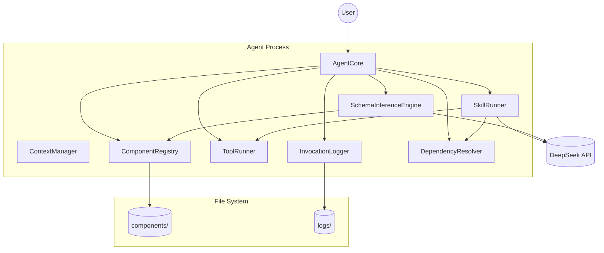
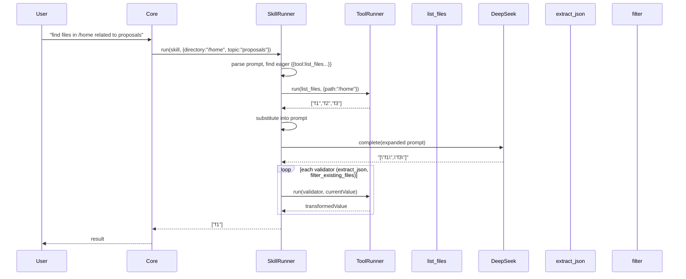

# Technical Paper: Minimal Component‑Based Agent (C++ Implementation)

## Version 1.0 – DeepSeek Backend, File‑Based Components, Eager Tool Calls

---

## 1. Overview

This document provides the complete technical specification and development plan for a **minimal self‑evolving agent** written in **C++**. The agent connects to the DeepSeek API, maintains a file‑based repository of **tools** (atomic bash commands) and **skills** (LLM prompts with eager tool calls and optional validators), and runs inside a VM isolation environment (or directly on a host). All logs are stored locally.

**Core features** (as specified previously):

- Tools and skills share JSON Schema I/O (strings, arrays, objects).
- Skills support **eager tool calls** (`{{tool:name ...}}`) that execute before the LLM request.
- **Validators** (optional chain of tools) process the LLM response; validators can be a simple tool name or an object for future transformation bindings.
- **Dependencies** declared per skill (tools and other skills required).
- Performance monitoring (optional, for future C++ optimization).
- Session replay via local JSON Lines logs.

This paper focuses on the **C++ implementation** including build instructions, library dependencies (libcurl for HTTP), a step‑by‑step implementation plan with test‑driven development, exhaustive trace logging, code coverage requirements (90%), and end‑to‑end testing against a mock DeepSeek API.

---

## 2. Component Specifications (C++ Interfaces)

The following interfaces are defined in `agent_interfaces.h` (already provided). They use modern C++17/20 features (`std::variant`, `std::optional`, smart pointers). No inheritance except abstract base classes.

**Key types**:

```cpp
using StructuredValue = std::variant<nullptr_t, bool, double, std::string,
                                     std::vector<StructuredValue>,
                                     std::unordered_map<std::string, StructuredValue>>;
using JSONSchema = std::unordered_map<std::string, StructuredValue>;
```

**Core abstract classes** (abridged – see previous response for full):

- `BaseComponent` (base for Tool and Skill)
- `Tool` : adds `command()`, `inputMode()`
- `Skill` : adds `prompt()`, `dependencies()`, `validators()`
- `ComponentRegistry` – loads from `./components/`
- `ToolRunner` – executes bash commands
- `InferenceProvider` – DeepSeek API
- `ContextManager` – stack of context fragments
- `InvocationLogger` – local JSON Lines log
- `SchemaInferenceEngine` – creates new tools/skills via LLM
- `DependencyResolver` – checks dependencies
- `SkillRunner` – orchestrates skill execution (eager tool calls, LLM call, validators)
- `AgentCore` – main loop

All interfaces are pure virtual; implementations are separate classes (e.g., `FileSystemComponentRegistry`, `SubprocessToolRunner`, `DeepSeekProvider`).

---

## 3. System Architecture



---

## 4. Data Flow (Skill with Eager Tool Call and Validators)



---

## 5. Development Instructions

### 5.1 Build Setup

**Requirements**:

- C++17 compiler (GCC 9+, Clang 12+, or MSVC 2019+)
- CMake 3.15+
- libcurl (for HTTP requests to DeepSeek API)
- jsoncpp or nlohmann/json (JSON parsing)
- mustache.cpp or custom simple mustache templating
- (Optional) gcov/lcov for coverage, Google Test for unit tests

**CMakeLists.txt (minimal)**:

```cmake
cmake_minimum_required(VERSION 3.15)
project(Agent)

set(CMAKE_CXX_STANDARD 17)
set(CMAKE_CXX_STANDARD_REQUIRED ON)

find_package(CURL REQUIRED)
find_package(nlohmann_json 3.11.0 REQUIRED)  # or jsoncpp
find_package(GTest REQUIRED)

add_executable(agent
    src/main.cpp
    src/agent_core.cpp
    src/component_registry.cpp
    src/tool_runner.cpp
    src/skill_runner.cpp
    src/deepseek_provider.cpp
    src/context_manager.cpp
    src/invocation_logger.cpp
    src/schema_inference_engine.cpp
    src/dependency_resolver.cpp
    # ... all implementation files
)

target_link_libraries(agent PRIVATE CURL::libcurl nlohmann_json::nlohmann_json GTest::gtest_main)
target_compile_definitions(agent PRIVATE -DTRACE)   # for trace logging
```

### 5.2 libcurl for HTTP

The `DeepSeekProvider` uses libcurl to POST requests to `https://api.deepseek.com/v1/chat/completions`. Example snippet:

```cpp
std::string DeepSeekProvider::complete(const std::string& prompt) {
    CURL* curl = curl_easy_init();
    std::string response;
    struct curl_slist* headers = nullptr;
    headers = curl_slist_append(headers, "Content-Type: application/json");
    headers = curl_slist_append(headers, ("Authorization: Bearer " + apiKey_).c_str());

    json payload = {
        {"model", model_},
        {"messages", {{{"role", "user"}, {"content", prompt}}}}
    };
    std::string body = payload.dump();

    curl_easy_setopt(curl, CURLOPT_URL, "https://api.deepseek.com/v1/chat/completions");
    curl_easy_setopt(curl, CURLOPT_HTTPHEADER, headers);
    curl_easy_setopt(curl, CURLOPT_POSTFIELDS, body.c_str());
    curl_easy_setopt(curl, CURLOPT_WRITEFUNCTION, WriteCallback);
    curl_easy_setopt(curl, CURLOPT_WRITEDATA, &response);
    curl_easy_perform(curl);
    curl_easy_cleanup(curl);
    curl_slist_free_all(headers);

    auto jsonResp = json::parse(response);
    return jsonResp["choices"][0]["message"]["content"];
}
```

### 5.3 Implementation Plan (Test‑Driven, 90% Coverage)

Follow these steps **in order**:

#### Step 1: Write individual specification files for each source module

- For each `.cpp` file (e.g., `tool_runner.cpp`), create a `tool_runner.spec.md` describing:
  - Input/output contracts
  - Error handling
  - Behavior for edge cases (empty input, invalid JSON, command failure)
- These spec files are **authoritative** for any dispute between code and tests.

#### Step 2: Write a stub of source with no logic

- Implement all functions with empty bodies or `return {};` (or throw `std::logic_error("stub")`).
- Ensure the code compiles and links.

#### Step 3: Implement tests against the stub

- Use Google Test.
- Write unit tests that **expect failure** (assertions that the stub does not yet satisfy the spec).
- Also write “stub tests” that verify the stub returns default values without crashing.
- All tests should pass against the stub **only** for trivial cases; most functional tests fail.

#### Step 4: Implement code incrementally

- For each function, write the minimal implementation to pass its tests.
- Commit after each passing test.
- Use **TDD red‑green‑refactor** cycle.

#### Step 5: Ensure tests pass – when unsure, consult spec file

- If a test fails and you believe the implementation is correct, check the spec file.
- The spec file is **authoritative**; fix either the test or the implementation accordingly.
- Never guess.

#### Step 6: Use code coverage tool – enforce 90% coverage

- Configure CMake with `--coverage` (GCC/Clang) or use Visual Studio’s coverage.
- Run: `lcov --capture --directory . --output-file coverage.info`
- Generate HTML report: `genhtml coverage.info --output-directory coverage_html`
- **Requirement**: line coverage ≥90%, function coverage ≥90%, branch coverage ≥90%.
- Any uncovered lines must be justified (e.g., defensive `assert` or unreachable error handling).

#### Step 7: Exhaustive trace logging with `#ifdef TRACE`

- Define `TRACE` macro in build (see CMakeLists.txt).
- Use a macro:
  ```cpp
  #ifdef TRACE
  #define TRACE_LOG(msg) std::cerr << "[TRACE] " << __FILE__ << ":" << __LINE__ << " " << msg << std::endl;
  #else
  #define TRACE_LOG(msg)
  #endif
  ```
- Log **every** function entry, exit, important variable values, tool execution, LLM request/response, validator chain steps.
- Log to `stderr` or a separate file (`trace.log`). This is essential for debugging the agent’s internal data flow.

#### Step 8: Set up end‑to‑end testing with mock DeepSeek API

- Create a **mock HTTP server** (e.g., using `cpp-httplib` or a simple Python script) that returns fixture data.
- Fixtures are stored in `test/fixtures/deepseek/`:
  - `schema_inference_tool.json` – response for `infer_tool`
  - `schema_inference_skill.json` – response for `infer_skill`
  - `find_related_files_response.json` – LLM response for file selection
- The agent can be configured to use `localhost:8080` instead of the real API via an environment variable `DEEPSEEK_MOCK_URL`.
- Write end‑to‑end tests (using `std::process` or `popen`) that:
  - Start the agent with a clean `components/` directory.
  - Send goals via stdin (or a named pipe).
  - Capture stdout/stderr.
  - Assert that the agent produces expected outputs and that log files contain correct entries.
- **Run these E2E tests after every change** (CI hook). They must pass before merging.

---

## 6. Testing Requirements

### 6.1 Unit Tests (Google Test)

| Class                | Test Case                     | Verification                                                                  |
| -------------------- | ----------------------------- | ----------------------------------------------------------------------------- | --------------------------- |
| `ToolRunner`         | `run` with `split_lines` tool | Input "a\nb\nc" → output `["a","b","c"]`                                      |
| `ToolRunner`         | `run` with `bash` tool        | Input "echo hello" → output "hello\n"                                         |
| `SkillRunner`        | `expandPrompt`                | Prompt with `{{tool:list_files path="/tmp"}}` → eager execution, substitution |
| `SkillRunner`        | `runValidators`               | Validators `["extract_json", "filter_existing_files"]` with mock              | Returns only existing files |
| `ComponentRegistry`  | `loadFromDirectory`           | Two valid components                                                          | Both loaded, names correct  |
| `DependencyResolver` | `check`                       | Missing dependency → throws                                                   |
| `InvocationLogger`   | `log` then `replay`           | Log two entries, replay → callback receives both                              |

### 6.2 End‑to‑End Tests (against mock DeepSeek)

| ID     | Scenario        | Steps                                                                                                                    | Expected                                                   |
| ------ | --------------- | ------------------------------------------------------------------------------------------------------------------------ | ---------------------------------------------------------- |
| E2E‑01 | First run       | Start agent with empty components dir                                                                                    | Built‑in tools and meta‑skills created under `components/` |
| E2E‑02 | Infer new tool  | Send goal: "create a tool that counts lines in a file"                                                                   | New tool `count_lines` appears; can be invoked             |
| E2E‑03 | Use tool        | Invoke `count_lines` with `{path:"/etc/passwd"}`                                                                         | Returns number of lines                                    |
| E2E‑04 | Infer new skill | Send goal: "create a skill that lists files in a directory and filters those containing 'log' using list_files and grep" | New skill appears; dependencies correct                    |
| E2E‑05 | Use skill       | Invoke skill with `{directory:"/var/log"}`                                                                               | Returns array of existing files with "log" in name         |
| E2E‑06 | Session replay  | Run a session, note ID, restart agent with `--resume`                                                                    | Agent replays logs; final state matches previous           |

**End‑to‑end test runner**: A bash script or Python harness that:

1. Starts mock DeepSeek server.
2. Launches agent process.
3. Sends commands via `stdin`.
4. Waits for outputs.
5. Checks exit codes and log files.
6. Tears down.

---

## 7. CLI Entry Point

```bash
agent --components-dir <path> [--env-file <path>] [--resume <session-id>] [--api-key <key>] [--mock-api <url>]
```

- `--components-dir` : Root directory for components (default `./components`).
- `--env-file` : Path to `.env` file to load (default `./.env`). Each line is `KEY=VALUE`; `#` comments and blank lines are skipped. Loaded before CLI args so `--api-key` overrides.
- `--resume` : Session ID to replay from `./logs/`.
- `--api-key` : DeepSeek API key; if not provided, read from `DEEPSEEK_API_KEY` env var (which can come from `--env-file`).
- `--mock-api` : Override the API URL (for testing, e.g., `http://localhost:8080`).

**Environment**:

- `DEEPSEEK_API_KEY` – required unless `--mock-api` is used (mock server does not need key).

**Example**:

```bash
export DEEPSEEK_API_KEY="sk-..."
agent --components-dir ./my_components
```

---

## 8. File Layout

```
project/
├── CMakeLists.txt
├── src/
│   ├── main.cpp
│   ├── agent_core.cpp / .h
│   ├── component_registry.cpp / .h
│   ├── tool_runner.cpp / .h
│   ├── skill_runner.cpp / .h
│   ├── deepseek_provider.cpp / .h
│   ├── context_manager.cpp / .h
│   ├── invocation_logger.cpp / .h
│   ├── schema_inference_engine.cpp / .h
│   ├── dependency_resolver.cpp / .h
│   └── ... (all implementation files)
├── test/
│   ├── unit/
│   │   ├── test_tool_runner.cpp
│   │   ├── test_skill_runner.cpp
│   │   └── ...
│   ├── e2e/
│   │   ├── mock_deepseek_server.py (or cpp-httplib)
│   │   ├── fixtures/
│   │   │   ├── infer_tool_response.json
│   │   │   ├── infer_skill_response.json
│   │   │   └── find_related_files_response.json
│   │   └── run_e2e_tests.sh
├── specs/
│   ├── tool_runner.spec.md
│   ├── skill_runner.spec.md
│   └── ... (one per source file)
├── logs/ (created at runtime)
├── components/ (created at runtime)
└── coverage_html/ (generated after coverage run)
```

---

## 9. Development Workflow Summary

1. Write spec files for each module.
2. Write stub implementations (no logic).
3. Write tests (both stub‑passing and failing functional tests).
4. Implement code iteratively until all tests pass.
5. Run coverage tool; ensure ≥90% coverage.
6. Run E2E tests with mock DeepSeek API; fix any failures.
7. Enable `-DTRACE` for debug builds; keep trace logs for diagnosis.
8. Commit and CI verifies all tests + coverage.

---

## 10. Future Extensions

- Streaming LLM responses and validator chains.
- C++ compilation of performance‑critical validators.
- Input/output transformation mappers in validator objects (e.g., JSONPath).
- Sandboxing for `bash` tool (command allowlist).
- Native `mustache` templating library for prompt expansion.

---
