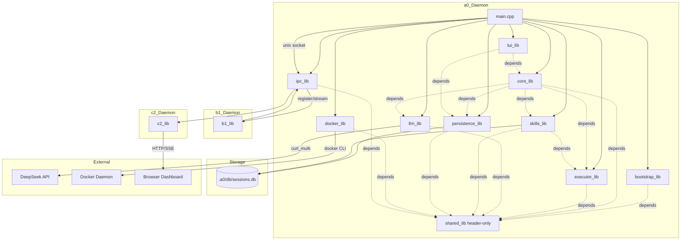
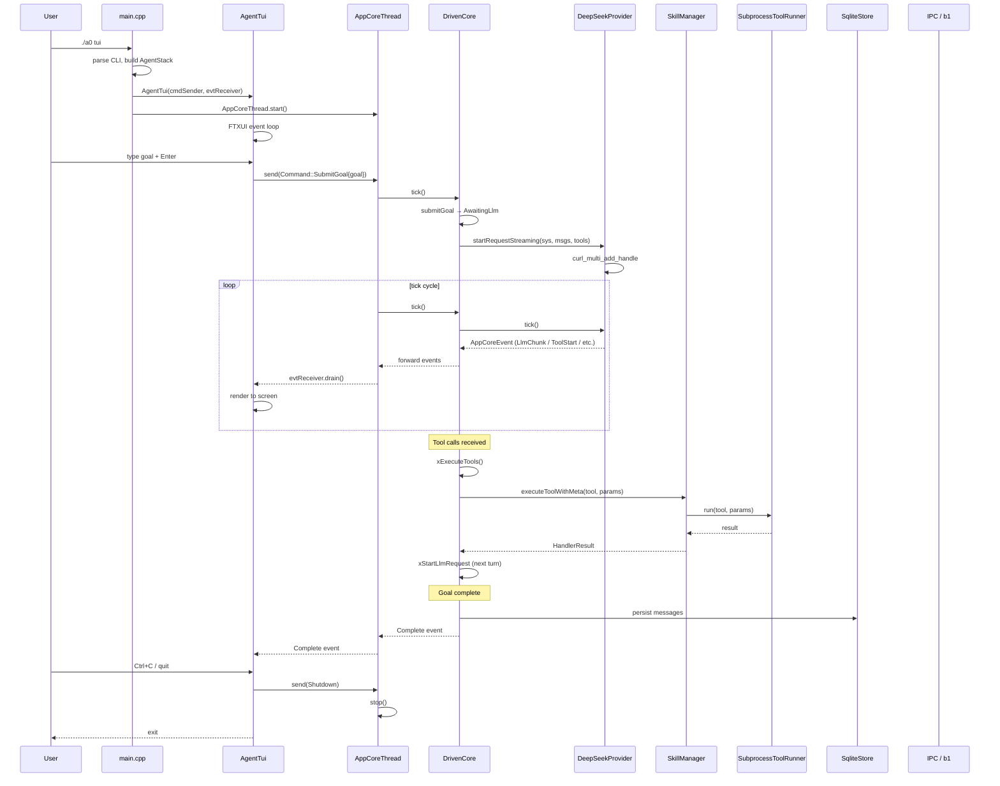

# Technical Specification: a0 Agent

## Version 3.0 — Sub-Module Architecture

---

## 1. Overview

This document provides the complete technical specification for the **a0 agent** — a minimal self-evolving agent written in **C++17**. The agent connects to the DeepSeek API, maintains a file-based repository of **tools** (atomic bash commands) and **skills** (LLM prompts with eager tool calls, parameter substitution, optional validators), and runs in a VM isolation environment (or directly on a host). A **persona system** selects the system prompt and filters available tools per session. All logs are stored locally via SQLite.

The codebase is organized into **12 sub-modules**, each providing a distinct library:

### Module Reference

| # | Sub-module | Directory | Facade / Key Types | Spec File |
|---|------------|-----------|-------------------|-----------|
| 1 | **shared** | `src/shared/` | agent_interfaces.h, mpsc.h, trace.h, hex_session_id.h, daemonize.h, handler_results.h, resource_provider.h (all header-only) | `src/shared/technical-specification.md` |
| 2 | **llm** | `src/llm/` | LlmProvider, DrivenProvider, DeepSeekProvider, ResponseDecoder | `src/llm/technical-specification.md` |
| 3 | **ipc** | `src/ipc/` | UnixSocket, BufferedSocket, Message, serialize/deserialize | `src/ipc/technical-specification.md` |
| 4 | **docker** | `src/docker/` | DockerContainerManager, DockerComposeManager, DependencyInstaller, DockerCLIWrapper, DockerToolRunnerImpl | `src/docker/technical-specification.md` |
| 5 | **persistence** | `src/persistence/` | SqliteStore, PersistenceStore, BuildIdentity, ReplayEngine, SqliteResourceProvider, NullResourceProvider | `src/persistence/technical-specification.md` |
| 6 | **skills** | `src/skills/` | SkillLoader, SkillManager, ValidationEngine, VersionManager | `src/skills/technical-specification.md` |
| 7 | **bootstrap** | `src/bootstrap/` | A0Dir, BasePrompt, PersonaLoader, SessionContext | `src/bootstrap/technical-specification.md` |
| 8 | **executor** | `src/executor/` | CommandRunner, ToolRunner (HostToolRunner), ToolState, DependencyGraph, StreamRegistry, SystemHandlers, DockerSecurityFilter | `src/executor/technical-specification.md` |
| 9 | **core** | `src/core/` | AppCoreThread, DrivenCore, AgentCore (deprecated) | `src/core/technical-specification.md` |
| 10 | **tui** | `src/tui/` | AgentTui, InputPanel, MessagePanel, MarkdownRenderer, StatusBar, DialogManager, Clipboard, Styles | `src/tui/technical-specification.md` |
| 11 | **b1** | `src/b1/` | A0Launcher, B1Main, Supervisor | `src/b1/technical-specification.md` |
| 12 | **c2** | `src/c2/` | C2Listener, C2Main, DashboardServer, SseManager, B1Registry, C2EventStore | `src/c2/technical-specification.md` |

**Top-level entry:** `src/main.cpp` — CLI dispatch via CLI11.

---

## 2. Component Specifications

Each sub-module exposes a set of classes and interfaces. Detailed class declarations live in each sub-module's own `technical-specification.md` and file-level `.spec.md` files. Below is a summary of each sub-module's exported types:

### 2.1 shared (header-only, CMake INTERFACE target)

Key headers: `agent_interfaces.h` (Tool, Prompt, Message, SkillRegistry, ToolRunner, SkillRunner, AgentCore, ContextManager, DependencyResolver, ContainerManager, ComposeManager, DockerToolRunner), `mpsc.h` (Command, AppCoreEvent, B1Control, Sender, Receiver, Channel), `trace.h` (TRACE_LOG), `hex_session_id.h` (generateHexSessionId), `daemonize.h` (xCloseAllFds, xDaemonizeChild), `handler_results.h` (HandlerResult), `resource_provider.h` (ResourceProvider, ResourceHandle, ResourceWriter).

### 2.2 llm

- `LlmProvider` — abstract async LLM interface (startRequest, startRequestStreaming, tick, cancel, active, timeoutMs, setMockUrl)
- `DrivenProvider : LlmProvider` — curl_multi base with protected hooks xBuildPayload/xAddAuth
- `DeepSeekProvider : DrivenProvider` — DeepSeek-specific xBuildPayload (OpenAI-compatible) + xAddAuth (Bearer)
- `ResponseDecoder` — SSE/JSON stateful decoder with ResourceProvider integration

### 2.3 ipc

- `UnixSocket` — RAII AF_UNIX SOCK_STREAM wrapper (bindAndListen, accept, connect, send, recv, pollReadable, pollWritable)
- `Message` — JSON-line framed protocol message with 13 type constants and streaming fields
- `BufferedSocket` — per-connection buffered reader (recv returns RECV_OK/RECV_AGAIN/RECV_ERR)

### 2.4 docker

- `DockerContainerManager : ContainerManager` — container pool per trust level (HIGH/MEDIUM/LOW), prune logic
- `DockerComposeManager : ComposeManager` — compose up/down, persistent/ephemeral stacks
- `DependencyInstaller` — apt inside containers
- `DockerCLIWrapper` — static docker CLI helpers (run, exec, pull, composeUp/Down, getNetworkName, getContainerId, startContainer)
- `DockerToolRunnerImpl : DockerToolRunner` — docker-based tool execution (pooled + ephemeral)

### 2.5 persistence

- `SqliteStore : PersistenceStore` — session/message/task CRUD in SQLite
- `BuildIdentity` — binary + git fingerprinting
- `ReplayEngine` — session replay with tool result comparison
- `SqliteResourceProvider` — ResourceProvider backed by SQLite BLOBs
- `NullResourceProvider` — no-op ResourceProvider for testing

### 2.6 skills

- `SkillLoader : SkillRegistry` — JSON/YAML manifest loading, diff-based reindexing, namespace prefix map
- `SkillManager` — orchestrator (loadAll, executeTool, executeToolWithMeta, registerHandler, tool lookup, version management, streaming, validation, dependency checking)
- `ValidationEngine` — skill result validation with replay, comparison, and CompatBridge
- `VersionManager` — skill version + upgrade management

### 2.7 bootstrap

- `ensureA0Dir` — create .a0 directory structure
- `buildBasePrompt` — persona-aware system prompt with {{BUILD_HASH}}, {{OS_INFO}}, {{CWD}} substitution
- `PersonaLoader` — three-tier persona manifest loading (system/local/github)
- `SessionContext` — per-session state (CWD, a0Dir, git info, container prefix)

### 2.8 executor

- `CommandRunner` — subprocess fork/exec/alarm, run/runStreaming/runAll
- `SubprocessToolRunner : ToolRunner` — stdin/args mode, timeout, streaming
- `ToolState` — per-session key-value state bag (thread-safe)
- `DependencyGraph` — reader/writer classification + batch execution
- `StreamRegistry` — stream handle management
- `SystemHandlers` — xBash, xRead, xEdit, xWrite, xGlob, xGrep, xGitCommand, xShowSkills, xShowSkillTools, xAddTask, xRemoveTask, xListTasks, xSetTaskPriority
- `DockerSecurityFilter` — Docker command security filtering + protected container list

### 2.9 core

- `AppCoreThread` — background thread wrapping DrivenCore + MPSC channels (Command → AppCoreEvent)
- `DrivenCore` — tick-driven state machine (Idle → AwaitingLlm → ExecutingTools → Idle)
- `DefaultAgentCore` (deprecated, no longer compiled)

### 2.10 tui

- `AgentTui` — MPSC orchestrator, streaming state, resource cache, FTXUI render loop
- `InputPanel` — multiline input bar with history
- `MessagePanel` — scrollable message display with collapsible tool blocks, auto-scroll
- `MarkdownRenderer` — MD4C → FTXUI Element (blocks/spans, streaming)
- `StatusBar` — session ID, agent state, b1 status, flash messages
- `DialogManager` — modal dialog stack (help/confirm/list)
- `Clipboard` — X11/Wayland paste support
- `Styles` — color/decoration/layout constants

### 2.11 b1

- `A0Launcher` — launch a0 child process
- `B1Main` — main entry point, CLI11 dispatch
- `Supervisor` — session lifecycle, IPC message routing (register/ack/heartbeat/update/shutdown/streams/terminal), crash detection, periodic snapshots

### 2.12 c2

- `C2Listener` — accepts a0 connections, routes IPC messages, manages peer sessions
- `C2Main` — HTTP/SSE server entry point
- `DashboardServer` — HTTP + WebSocket dashboard for session monitoring, terminal management, stream inspection
- `SseManager` — SSE event broadcasting to dashboard clients
- `B1Registry` — b1 instance tracking
- `C2EventStore` — event persistence for dashboard

---

## 3. System Architecture



---

## 4. Detailed Data Flow



---

## 5. Visualization

D3 animation not required for this specification.

---

## 6. Testing Requirements

### 6.1 Unit Tests (Google Test)

| Sub-module | Test File | Coverage |
|-----------|-----------|----------|
| **shared** | (tested via consumers) | Interface contracts |
| **llm** | test_deepseek_provider.cpp | DrivenProvider lifecycle, streaming, cancel, errors |
| **ipc** | test_unix_socket.cpp, test_ipc_protocol.cpp, test_buffered_socket.cpp | Socket lifecycle, message framing, buffered I/O |
| **docker** | test_container_manager.cpp, test_compose_manager.cpp, test_dependency_installer.cpp, test_docker_interfaces.cpp, test_docker_tool_runner.cpp | Container pool, compose, install, CLI wrapper |
| **persistence** | test_session_context.cpp, test_resource_provider.cpp, test_driven_core_persistence.cpp | Session CRUD, resource streaming, replay |
| **skills** | test_skill_loader.cpp, test_skill_manager.cpp, test_validation_engine.cpp, test_version_manager.cpp, test_skill_schema.cpp, test_skill_registry.cpp | Load, execute, validate, manage skills |
| **bootstrap** | test_a0_dir.cpp, test_personas.cpp, test_session_context.cpp | Directory setup, persona load, session context |
| **executor** | test_tool_runner.cpp, test_dependency_graph.cpp, test_tool_state.cpp, test_system_tools.cpp, test_pipeline_execution.cpp | Subprocess, dep graph, state, handlers |
| **core** | test_driven_core_persistence.cpp, test_agent_core.cpp, test_agent_tool_calls.cpp | State machine, tool dispatch, session |
| **tui** | test_tui_integration.cpp, test_tui_markdown.cpp, test_tui_panels.cpp, test_tui_styles.cpp | TUI rendering, markdown, panels, styles |
| **b1** | test_supervisor.cpp, test_a0_launcher.cpp | Session lifecycle, IPC routing |
| **c2** | test_c2_listener.cpp, test_dashboard_server.cpp, test_b1_registry.cpp | C2 listener, dashboard, b1 registry |

### 6.2 Integration / E2E Tests

| Scenario | Description |
|----------|-------------|
| Headless run | `a0 run --prompt "say hello"` → returns JSON result |
| TUI session | `a0 tui` with mock API → goal processes to completion |
| Session export | `a0 session export --session-id=<uuid>` → JSONL output |
| Docker tool execution | Tool with `dockerImage: "ubuntu:22.04"` echoes output |
| B1 IPC workflow | a0 registers with b1, sends heartbeat, receives ack |
| C2 dashboard | Dashboard serves session list via HTTP |
| Streaming tool output | Tool with streaming mode delivers chunks in real-time |
| Persona filtering | Persona with restricted tool set → only allowed tools exposed |
| Session persistence | Messages survive process restart via SQLite |
| Container pruning | Idle containers removed after timeout |

---

## 7. CLI Entry Point

```bash
a0 [global flags] [subcommand] [subcommand flags]
```

### Global Flags

| Flag | Default | Description |
|------|---------|-------------|
| `--a0-dir` | `./.a0` | Runtime state directory |
| `--api-key` | — | DeepSeek API key (also via DEEPSEEK_API_KEY env) |
| `--mock-api` | — | Mock API URL for testing |
| `--skills-dir` | `./skills` | Skills root directory |
| `--persona` | `software-engineer` | Persona name |
| `--log-file` | — | Redirect stderr to file |
| `--log-dir` | — | Log directory (auto-named) |
| `--no-docker` | false | Disable Docker integration |
| `--no-container-pool` | false | Disable container pooling |
| `--no-b1` | false | Skip b1 supervisor launch |
| `--container-idle-timeout` | 300 | Container idle timeout (s) |
| `--max-idle-containers` | 10 | Max idle containers |
| `--default-docker-image` | ubuntu:22.04 | Default Docker image |
| `--max-parallel` | 4 | Max concurrent tool executions |
| `--output-json` | false | Output results as JSON |
| `--env-file` | `.env` | .env file path |
| `--skill-arg` | — | Skill argument (repeatable: key=value) |
| `--external-repo` | opensassi/a0 | External a0 repo URL |

### Subcommands

| Subcommand | Description |
|------------|-------------|
| `run <prompt>` | Execute a goal headless, print JSON result |
| `tui` | Interactive terminal UI (default) |
| `session export --session-id=<uuid>` | Export session as JSONL |
| `session list` | List recent sessions |
| `terminal --terminal-id=<id>` | PTY terminal session via b1 |
| `kill-all` | Stop b1/c2 daemon processes |

### Build System

```cmake
cmake -B build -DENABLE_TRACE=OFF
cmake --build build
```

Twelve library targets: `shared_lib` (INTERFACE), `llm_lib`, `ipc_lib`, `docker_lib`, `persistence_lib`, `skills_lib`, `bootstrap_lib`, `executor_lib`, `core_lib`, `tui_lib`, `b1_lib`, `c2_lib`. Linked into three daemon executables: `a0`, `b1`, `c2`.
